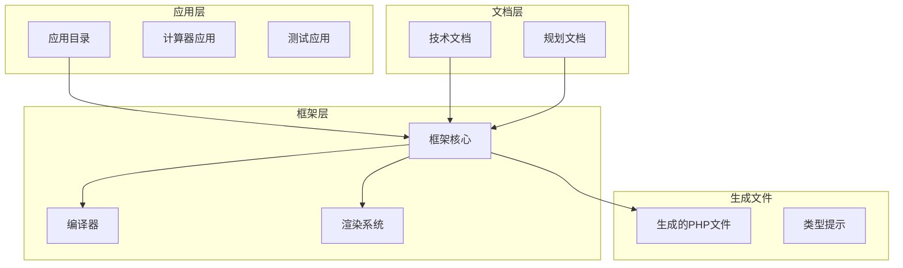
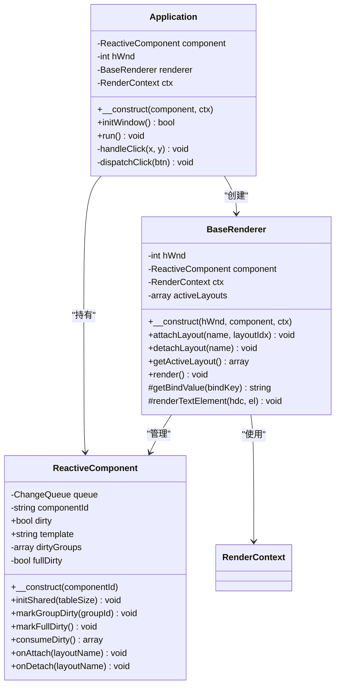
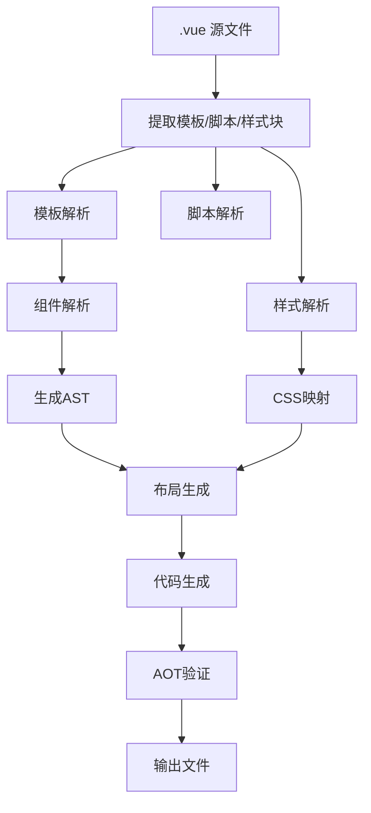
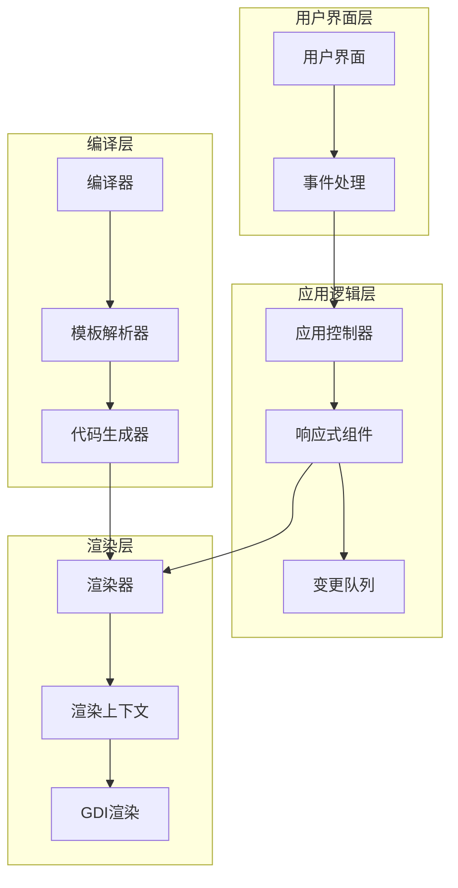
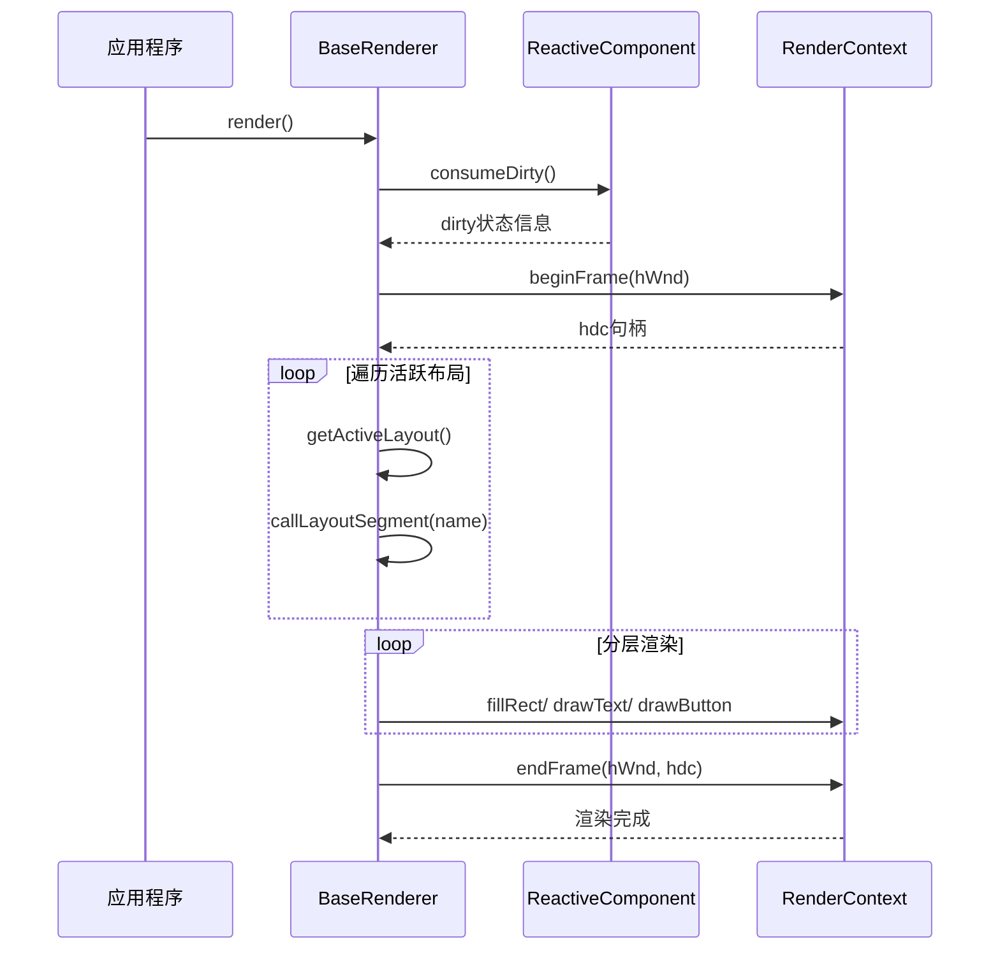
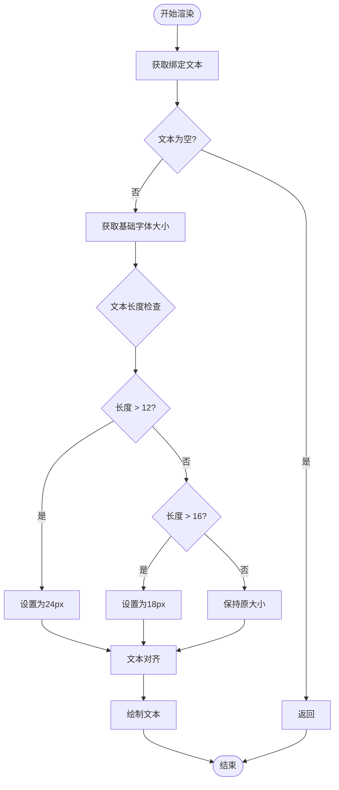
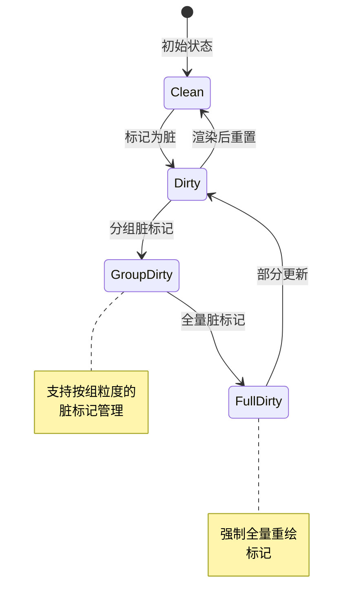
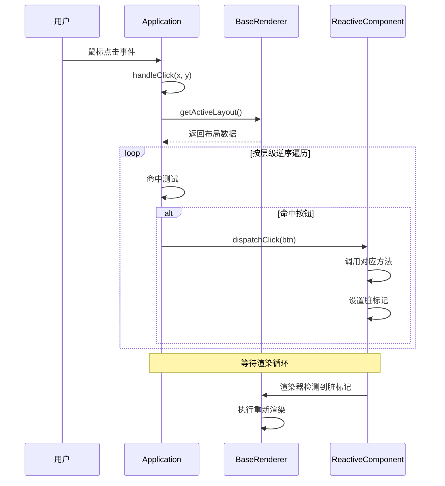
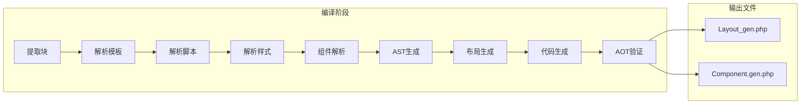
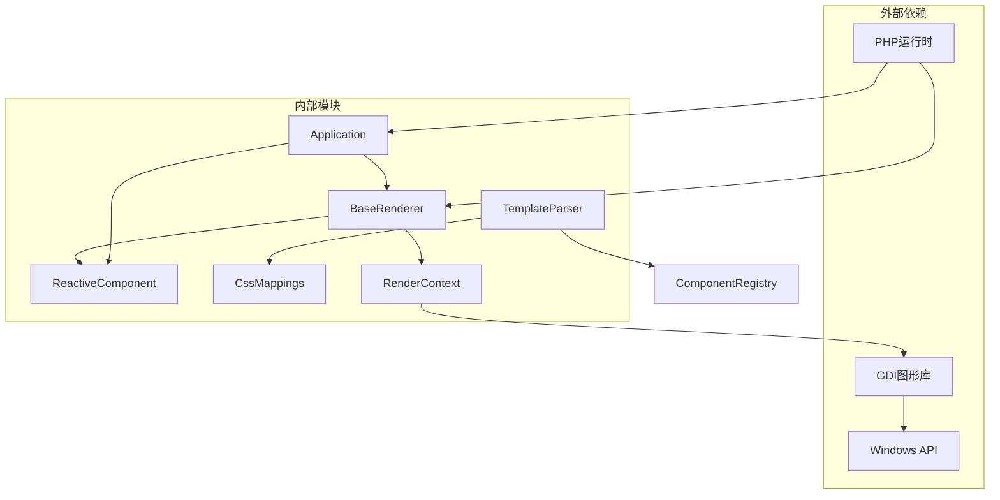

# 框架通用性改进规划

<cite>
**本文档引用的文件**
- [BaseRenderer.php](file://framework/BaseRenderer.php)
- [ReactiveComponent.php](file://framework/ReactiveComponent.php)
- [Application.php](file://apps/calculator/Application.php)
- [main.php](file://apps/calculator/main.php)
- [template-parser.php](file://framework/compiler/template-parser.php)
- [ast-nodes.php](file://framework/compiler/ast-nodes.php)
- [component-registry.php](file://framework/compiler/component-registry.php)
- [ChangeQueue.php](file://framework/ChangeQueue.php)
- [RenderContext.php](file://framework/rendering/RenderContext.php)
- [sfc-compiler.php](file://framework/sfc-compiler.php)
- [css-mappings.php](file://framework/compiler/css-mappings.php)
- [aot-validator.php](file://framework/compiler/aot-validator.php)
- [App.vue](file://apps/calculator/App.vue)
- [框架通用性改进规划.html](file://docs/框架通用性改进规划.html)
</cite>

## 目录
1. [引言](#引言)
2. [项目结构](#项目结构)
3. [核心组件](#核心组件)
4. [架构概览](#架构概览)
5. [详细组件分析](#详细组件分析)
6. [依赖关系分析](#依赖关系分析)
7. [性能考虑](#性能考虑)
8. [故障排除指南](#故障排除指南)
9. [结论](#结论)
10. [附录](#附录)

## 引言

VueCalc 是一个基于 SFC（单文件组件）的桌面应用程序框架，专门用于构建数据驱动的界面应用。该框架的核心目标是将 Vue.js 的开发体验引入到桌面应用开发中，同时保持高性能和跨平台兼容性。

当前框架在计算器应用中运行良好，但存在大量硬编码、隐式约定和重复逻辑，导致创建新应用时必须深入修改框架核心文件。本文档系统梳理了这些反模式，并提出了分阶段的改进方案，旨在让框架从"计算器专用"演变为"多应用可复用"的通用框架。

## 项目结构

该项目采用模块化的组织方式，主要分为以下几个核心部分：

**图表来源**
- [framework/BaseRenderer.php:1-186](file://framework/BaseRenderer.php#L1-L186)
- [framework/sfc-compiler.php:1-567](file://framework/sfc-compiler.php#L1-L567)

**章节来源**
- [framework/BaseRenderer.php:1-186](file://framework/BaseRenderer.php#L1-L186)
- [framework/sfc-compiler.php:1-567](file://framework/sfc-compiler.php#L1-L567)

## 核心组件

### 渲染器系统

框架的核心渲染器系统提供了数据驱动的渲染能力，支持分段布局管理和两阶段分层渲染机制。

**图表来源**
- [framework/BaseRenderer.php:14-186](file://framework/BaseRenderer.php#L14-L186)
- [framework/ReactiveComponent.php:11-75](file://framework/ReactiveComponent.php#L11-L75)
- [apps/calculator/Application.php:10-146](file://apps/calculator/Application.php#L10-L146)

### 编译器架构

框架的编译器系统负责将 Vue 单文件组件转换为可执行的 PHP 代码，支持模板解析、组件解析和代码生成。

**图表来源**
- [framework/sfc-compiler.php:20-567](file://framework/sfc-compiler.php#L20-L567)
- [framework/compiler/template-parser.php:61-869](file://framework/compiler/template-parser.php#L61-L869)

**章节来源**
- [framework/BaseRenderer.php:14-186](file://framework/BaseRenderer.php#L14-L186)
- [framework/ReactiveComponent.php:11-75](file://framework/ReactiveComponent.php#L11-L75)
- [apps/calculator/Application.php:10-146](file://apps/calculator/Application.php#L10-L146)

## 架构概览

框架的整体架构采用了分层设计，从底层的渲染系统到上层的应用逻辑，每一层都有明确的职责分工。

**图表来源**
- [framework/BaseRenderer.php:1-186](file://framework/BaseRenderer.php#L1-L186)
- [framework/ReactiveComponent.php:1-75](file://framework/ReactiveComponent.php#L1-L75)
- [framework/rendering/RenderContext.php:1-30](file://framework/rendering/RenderContext.php#L1-L30)

## 详细组件分析

### BaseRenderer 组件分析

BaseRenderer 是框架的核心渲染组件，负责将布局数据转换为可视化的界面元素。

#### 渲染流程

**图表来源**
- [framework/BaseRenderer.php:124-184](file://framework/BaseRenderer.php#L124-L184)
- [framework/ReactiveComponent.php:55-63](file://framework/ReactiveComponent.php#L55-L63)

#### 文本渲染算法

BaseRenderer 实现了智能的文本渲染算法，能够根据文本长度自动调整字体大小：

**图表来源**
- [framework/BaseRenderer.php:81-116](file://framework/BaseRenderer.php#L81-L116)

**章节来源**
- [framework/BaseRenderer.php:14-186](file://framework/BaseRenderer.php#L14-L186)

### ReactiveComponent 组件分析

ReactiveComponent 提供了响应式状态管理功能，支持脏标记驱动的渲染优化。

#### 脏标记系统

**图表来源**
- [framework/ReactiveComponent.php:19-63](file://framework/ReactiveComponent.php#L19-L63)

**章节来源**
- [framework/ReactiveComponent.php:11-75](file://framework/ReactiveComponent.php#L11-L75)

### Application 组件分析

Application 作为应用的入口控制器，负责管理窗口生命周期和事件循环。

#### 事件处理流程

**图表来源**
- [apps/calculator/Application.php:110-145](file://apps/calculator/Application.php#L110-L145)

**章节来源**
- [apps/calculator/Application.php:10-146](file://apps/calculator/Application.php#L10-L146)

### 编译器组件分析

编译器系统是框架的核心，负责将 Vue 单文件组件转换为可执行的 PHP 代码。

#### 编译流程

**图表来源**
- [framework/sfc-compiler.php:240-567](file://framework/sfc-compiler.php#L240-L567)

**章节来源**
- [framework/sfc-compiler.php:1-567](file://framework/sfc-compiler.php#L1-L567)

## 依赖关系分析

框架的依赖关系相对清晰，主要遵循单一职责原则和依赖倒置原则。

**图表来源**
- [framework/BaseRenderer.php:1-186](file://framework/BaseRenderer.php#L1-L186)
- [framework/ReactiveComponent.php:1-75](file://framework/ReactiveComponent.php#L1-L75)
- [framework/rendering/RenderContext.php:1-30](file://framework/rendering/RenderContext.php#L1-L30)

**章节来源**
- [framework/BaseRenderer.php:1-186](file://framework/BaseRenderer.php#L1-L186)
- [framework/ReactiveComponent.php:1-75](file://framework/ReactiveComponent.php#L1-L75)

## 性能考虑

框架在设计时充分考虑了性能优化，主要体现在以下几个方面：

### 渲染性能优化

1. **脏标记驱动渲染**：只在状态发生变化时进行重绘，避免不必要的渲染开销
2. **分层渲染机制**：通过图层管理确保元素按照正确的顺序渲染
3. **批量布局收集**：一次性收集所有活跃布局的数据，减少函数调用开销

### 内存管理

1. **环形缓冲区**：变更队列使用环形缓冲区实现，避免内存频繁分配
2. **对象池模式**：渲染上下文和布局数据采用复用机制
3. **延迟初始化**：组件和渲染器按需创建，减少启动时间

### 编译时优化

1. **静态代码生成**：编译时生成优化的 PHP 代码，避免运行时解析开销
2. **类型推导**：利用 AOT 编译器进行类型推导，提高运行时性能
3. **内联优化**：布局数据直接内联，避免函数调用开销

## 故障排除指南

### 常见问题及解决方案

#### 编译错误

**问题**：AOT 验证失败
**原因**：生成的代码不符合 AOT 编译器要求
**解决方案**：
1. 检查文件名是否包含多余的小数点
2. 避免使用嵌套的 const 数组
3. 不要使用变量函数调用

#### 运行时错误

**问题**：渲染异常或界面显示错误
**原因**：布局数据格式不正确
**解决方案**：
1. 验证元素数据的必需字段
2. 检查条件表达式的语法
3. 确认组件引用的正确性

#### 性能问题

**问题**：应用响应缓慢
**原因**：频繁的状态更新导致过度渲染
**解决方案**：
1. 使用分组脏标记减少重绘范围
2. 合理设置渲染频率
3. 优化复杂的条件表达式

**章节来源**
- [framework/compiler/aot-validator.php:18-207](file://framework/compiler/aot-validator.php#L18-L207)
- [framework/BaseRenderer.php:124-184](file://framework/BaseRenderer.php#L124-L184)

## 结论

VueCalc 框架通过模块化的设计和清晰的分层架构，成功地将 Vue.js 的开发理念引入到桌面应用开发中。当前版本已经具备了良好的基础，但仍有一些改进空间。

通过实施框架通用性改进规划中的建议，可以显著提升框架的可复用性和可维护性：

1. **参数化配置**：移除硬编码，提供灵活的配置选项
2. **接口简化**：简化 API 设计，降低使用复杂度
3. **架构重构**：建立抽象基类，支持更好的继承和扩展
4. **文档规范化**：建立完整的 API 文档和数据格式规范

这些改进将使框架从"计算器专用"发展为"多应用可复用"的通用解决方案，为后续的扩展和维护奠定坚实基础。

## 附录

### 改进计划实施进度

根据框架通用性改进规划，建议按以下优先级实施：

#### P1 立即实施（约200行改动）
- 窗口配置参数化
- 事件常量集中化  
- attachLayout 接口简化

#### P2 短期实施（中等复杂度）
- 文本排版外部化
- 按钮样式配置化
- 布局收集逻辑提取

#### P3 长期架构改进
- Application 基类化
- 布局数据格式规范

### 验收标准

成功的验收应该满足以下条件：
1. 新应用可以在不修改框架核心文件的情况下正常运行
2. 编译器生成的配置能够完全替代手动配置
3. 应用层只需要关注业务逻辑，无需处理框架细节
4. 扩展新功能时不需要修改现有框架代码