# 组件注册和解析系统

<cite>
**本文档引用的文件**
- [component-registry.php](file://framework/compiler/component-registry.php)
- [component-resolver.php](file://framework/compiler/component-resolver.php)
- [sfc-compiler.php](file://framework/sfc-compiler.php)
- [template-parser.php](file://framework/compiler/template-parser.php)
- [ast-nodes.php](file://framework/compiler/ast-nodes.php)
- [project.yml](file://apps/calculator/project.yml)
- [App.vue](file://apps/calculator/App.vue)
- [DisplayPanel.vue](file://apps/calculator/components/DisplayPanel.vue)
- [NumPad.vue](file://apps/calculator/components/NumPad.vue)
- [Application.php](file://apps/calculator/Application.php)
- [BaseRenderer.php](file://framework/BaseRenderer.php)
- [css-mappings.php](file://framework/compiler/css-mappings.php)
- [aot-validator.php](file://framework/compiler/aot-validator.php)
- [script-analyzer.php](file://framework/compiler/script-analyzer.php)
- [main.php](file://apps/calculator/main.php)
</cite>

## 目录
1. [简介](#简介)
2. [项目结构](#项目结构)
3. [核心组件](#核心组件)
4. [架构概览](#架构概览)
5. [详细组件分析](#详细组件分析)
6. [依赖关系分析](#依赖关系分析)
7. [性能考虑](#性能考虑)
8. [故障排除指南](#故障排除指南)
9. [结论](#结论)

## 简介

VueCalc组件注册和解析系统是一个完整的单文件组件(SFC)编译器，专门用于将Vue风格的单文件组件转换为可在桌面应用程序中运行的布局数据。该系统实现了组件注册、模板解析、组件引用解析和代码生成等核心功能。

系统的核心目标是：
- 将自定义HTML标签映射到对应的.vue源文件
- 解析模板AST并支持组件嵌套
- 在编译时内联子组件布局
- 生成可直接用于AOT编译的数据文件

## 项目结构

VueCalc项目采用模块化的架构设计，主要分为以下几个层次：

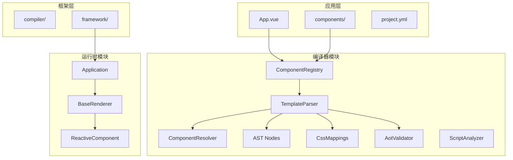

**图表来源**
- [sfc-compiler.php:1-485](file://framework/sfc-compiler.php#L1-L485)
- [component-registry.php:1-70](file://framework/compiler/component-registry.php#L1-L70)
- [template-parser.php:1-866](file://framework/compiler/template-parser.php#L1-L866)

**章节来源**
- [sfc-compiler.php:1-485](file://framework/sfc-compiler.php#L1-L485)
- [project.yml:1-31](file://apps/calculator/project.yml#L1-L31)

## 核心组件

### 组件注册器(ComponentRegistry)

ComponentRegistry是系统的核心组件，负责管理自定义HTML标签与.vue源文件之间的映射关系。

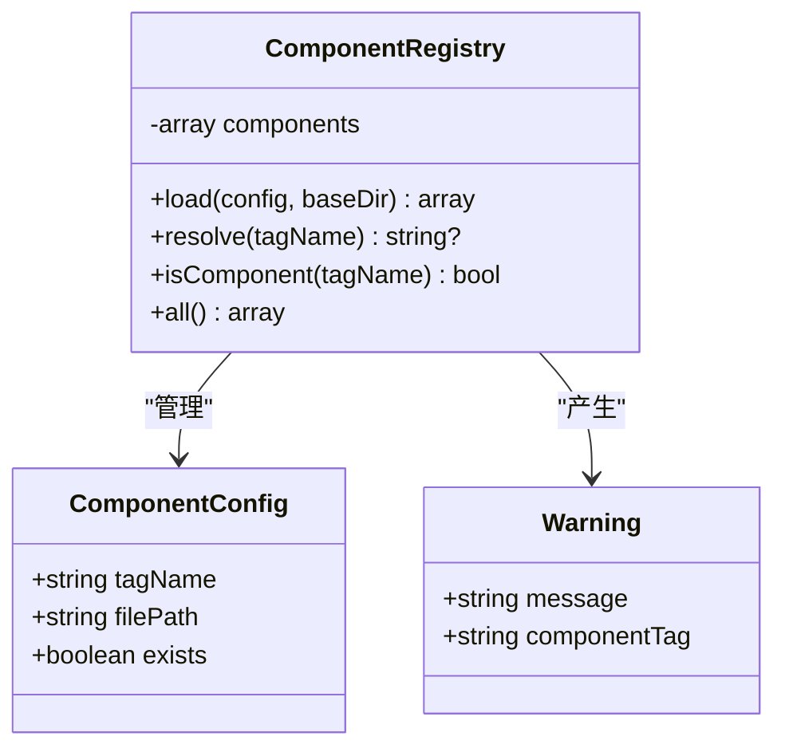

**图表来源**
- [component-registry.php:14-70](file://framework/compiler/component-registry.php#L14-L70)

组件注册器的主要特性：
- 支持从project.yml配置文件加载组件映射
- 提供绝对路径解析和文件存在性验证
- 返回详细的警告信息用于调试
- 支持动态查询和批量访问

**章节来源**
- [component-registry.php:1-70](file://framework/compiler/component-registry.php#L1-L70)

### 模板解析器(TemplateParser)

TemplateParser实现了递归下降解析算法，能够准确解析Vue风格的模板语法。

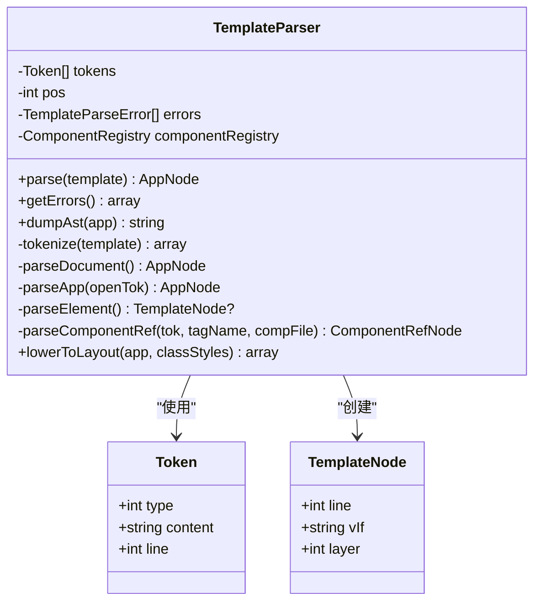

**图表来源**
- [template-parser.php:61-800](file://framework/compiler/template-parser.php#L61-L800)

**章节来源**
- [template-parser.php:1-866](file://framework/compiler/template-parser.php#L1-L866)

### 组件解析器(ComponentResolver)

ComponentResolver提供了解析组件引用的辅助函数，包括坐标偏移和属性绑定。

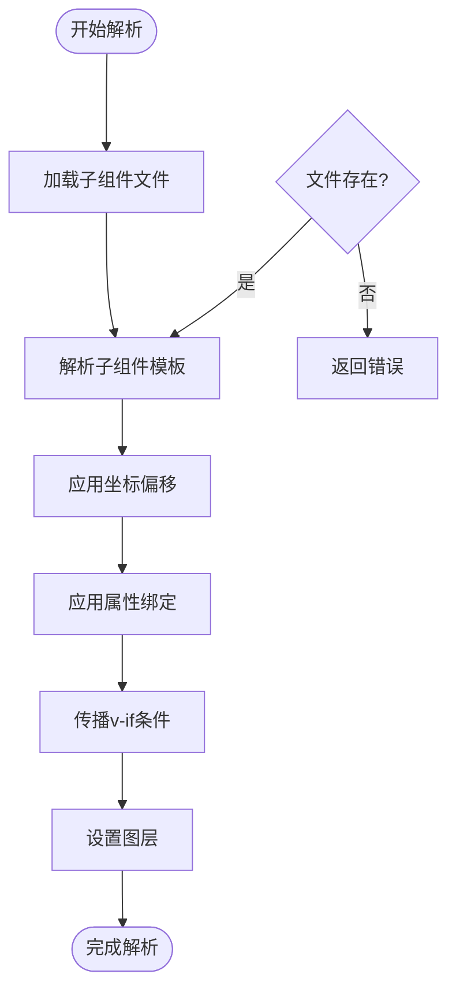

**图表来源**
- [component-resolver.php:13-61](file://framework/compiler/component-resolver.php#L13-L61)

**章节来源**
- [component-resolver.php:1-62](file://framework/compiler/component-resolver.php#L1-L62)

## 架构概览

VueCalc的组件注册和解析系统遵循经典的编译器架构模式：

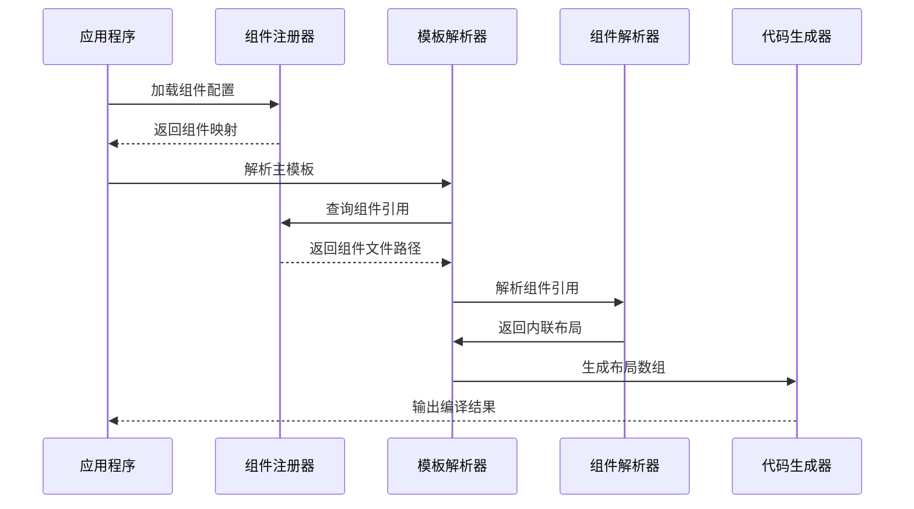

**图表来源**
- [sfc-compiler.php:33-88](file://framework/sfc-compiler.php#L33-L88)
- [template-parser.php:490-543](file://framework/compiler/template-parser.php#L490-L543)

系统的工作流程包括：
1. **组件注册**：从project.yml加载组件映射
2. **模板解析**：将Vue模板转换为AST
3. **组件解析**：内联子组件布局和样式
4. **布局生成**：转换为运行时所需的布局数组

**章节来源**
- [sfc-compiler.php:1-485](file://framework/sfc-compiler.php#L1-L485)

## 详细组件分析

### 组件注册系统

组件注册系统通过project.yml配置文件实现灵活的组件映射管理：

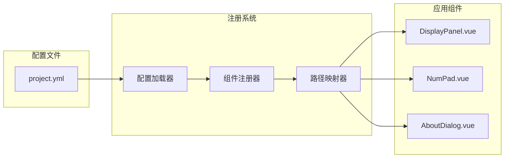

**图表来源**
- [project.yml:25-31](file://apps/calculator/project.yml#L25-L31)
- [component-registry.php:26-41](file://framework/compiler/component-registry.php#L26-L41)

组件注册的关键特性：
- **相对路径解析**：自动将相对路径转换为绝对路径
- **文件存在性检查**：验证组件文件是否实际存在
- **警告机制**：对缺失的组件文件提供详细警告信息
- **配置验证**：确保project.yml格式正确

**章节来源**
- [project.yml:1-31](file://apps/calculator/project.yml#L1-L31)
- [component-registry.php:1-70](file://framework/compiler/component-registry.php#L1-L70)

### 模板解析流程

模板解析器实现了完整的Vue模板语法支持，包括组件引用解析：

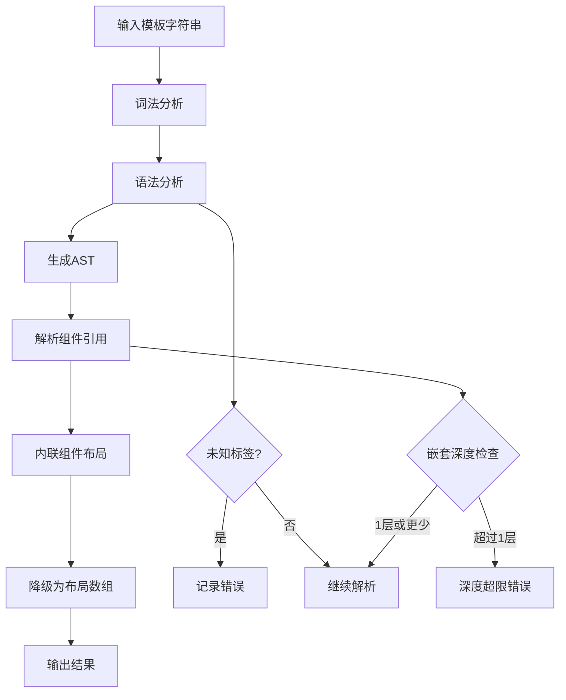

**图表来源**
- [template-parser.php:88-105](file://framework/compiler/template-parser.php#L88-L105)
- [template-parser.php:320-333](file://framework/compiler/template-parser.php#L320-L333)

**章节来源**
- [template-parser.php:1-866](file://framework/compiler/template-parser.php#L1-L866)

### 组件引用解析

组件引用解析是系统的核心功能，支持复杂的组件嵌套和属性传递：

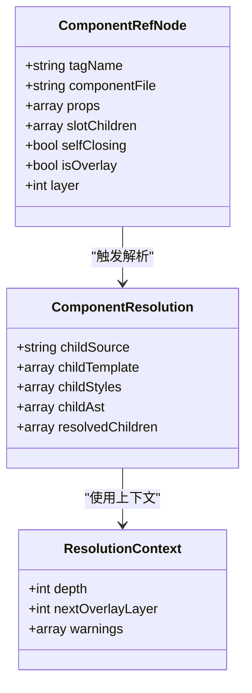

**图表来源**
- [ast-nodes.php:171-207](file://framework/compiler/ast-nodes.php#L171-L207)
- [sfc-compiler.php:93-179](file://framework/sfc-compiler.php#L93-L179)

**章节来源**
- [sfc-compiler.php:93-179](file://framework/sfc-compiler.php#L93-L179)
- [ast-nodes.php:1-208](file://framework/compiler/ast-nodes.php#L1-L208)

### 示例组件分析

#### DisplayPanel组件

DisplayPanel是最简单的子组件示例，展示了基本的布局结构：

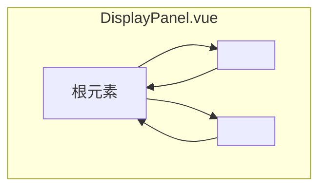

**图表来源**
- [DisplayPanel.vue:1-12](file://apps/calculator/components/DisplayPanel.vue#L1-L12)

#### NumPad组件

NumPad组件展示了复杂的网格布局和按钮组织：

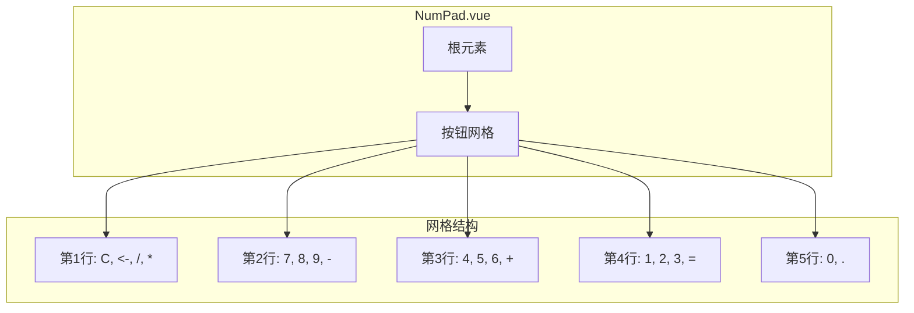

**图表来源**
- [NumPad.vue:1-37](file://apps/calculator/components/NumPad.vue#L1-L37)

**章节来源**
- [DisplayPanel.vue:1-12](file://apps/calculator/components/DisplayPanel.vue#L1-L12)
- [NumPad.vue:1-37](file://apps/calculator/components/NumPad.vue#L1-L37)

## 依赖关系分析

系统采用了清晰的依赖层次结构，确保模块间的松耦合：

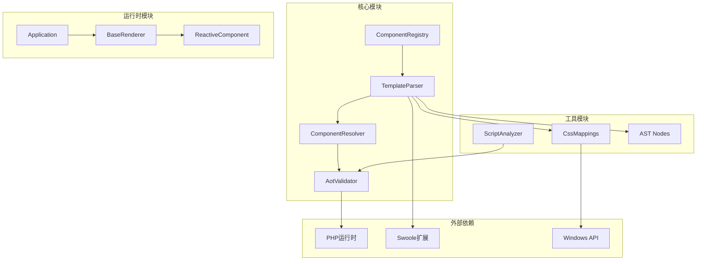

**图表来源**
- [sfc-compiler.php:20-28](file://framework/sfc-compiler.php#L20-L28)
- [template-parser.php:16-17](file://framework/compiler/template-parser.php#L16-L17)

**章节来源**
- [sfc-compiler.php:1-485](file://framework/sfc-compiler.php#L1-L485)
- [template-parser.php:1-866](file://framework/compiler/template-parser.php#L1-L866)

## 性能考虑

系统在设计时充分考虑了性能优化：

### 编译时优化
- **组件内联**：在编译时解析所有组件引用，避免运行时查找开销
- **布局预计算**：将网格按钮坐标在编译时计算完成
- **样式合并**：将CSS类映射到运行时可用的数值属性

### 运行时优化
- **脏标记驱动**：仅在状态变化时重新渲染
- **分层渲染**：支持多层叠加的高效渲染
- **条件渲染**：支持基于条件表达式的智能渲染

### 内存管理
- **共享内存**：使用ReactiveComponent的共享内存机制
- **对象池**：避免频繁的对象创建和销毁
- **增量更新**：最小化渲染更新范围

## 故障排除指南

### 常见问题及解决方案

#### 组件未找到错误
当组件注册器无法找到指定的.vue文件时，会返回详细的警告信息：

```php
// 错误示例
[WARN] ComponentRegistry: Component 'display-panel' source not found: /path/to/DisplayPanel.vue
```

**解决步骤**：
1. 检查project.yml中的路径配置
2. 验证文件是否存在且具有正确的权限
3. 确认路径使用正确的分隔符

#### 模板解析错误
模板解析器会报告具体的语法错误位置：

```php
// 错误示例
Line 15: Expected <app> as root element, got <div>
Line 23: Unknown element <unknown-element> — only app/rect/text/grid/btn are supported
```

**解决步骤**：
1. 检查根元素是否为<app>
2. 确认所有元素都是支持的类型
3. 验证标签闭合是否正确

#### 组件嵌套深度限制
系统仅支持1层组件嵌套，超过限制会产生错误：

```php
// 错误示例
Line 45: Component <child-comp> contains nested component <grandchild>. v5 only supports 1 level of nesting.
```

**解决步骤**：
1. 将深层嵌套的组件扁平化
2. 使用组合模式替代深层继承
3. 重新设计组件架构

**章节来源**
- [component-registry.php:34-38](file://framework/compiler/component-registry.php#L34-L38)
- [template-parser.php:328-331](file://framework/compiler/template-parser.php#L328-L331)
- [sfc-compiler.php:144-149](file://framework/sfc-compiler.php#L144-L149)

## 结论

VueCalc组件注册和解析系统展现了现代编译器设计的最佳实践：

### 技术优势
- **模块化设计**：清晰的职责分离和接口定义
- **类型安全**：完整的类型声明和错误处理
- **可扩展性**：易于添加新的组件类型和解析规则
- **性能优化**：编译时优化减少运行时开销

### 架构特点
- **编译时解析**：将复杂逻辑转移到编译阶段
- **运行时简洁**：保持运行时代码的简单性和高效性
- **配置驱动**：通过配置文件实现灵活的组件管理
- **错误友好**：提供详细的错误信息和调试支持

### 发展方向
系统为后续版本的组件化架构奠定了坚实基础，支持：
- 更复杂的组件嵌套和通信机制
- 更丰富的模板语法支持
- 更强大的代码生成能力
- 更完善的开发工具链

该系统成功地将Vue的组件化思想引入到桌面应用程序开发中，为跨平台应用开发提供了新的思路和解决方案。