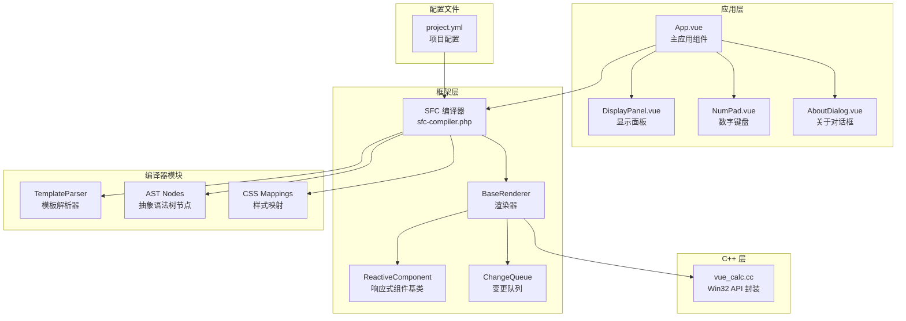
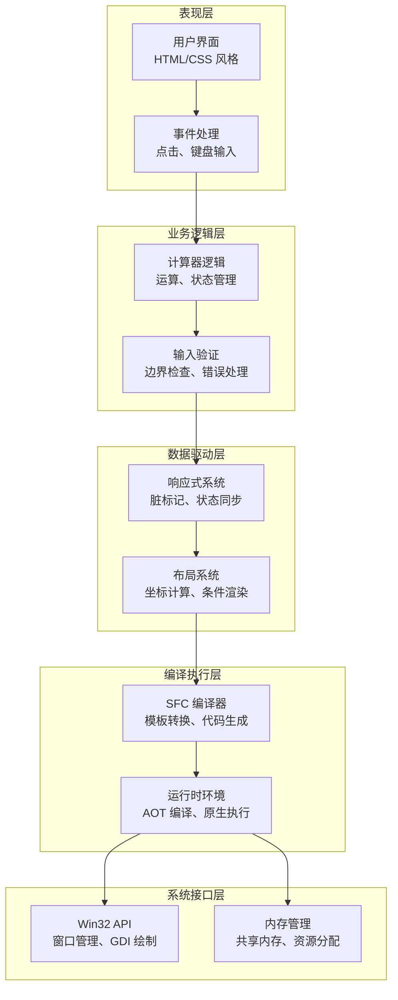
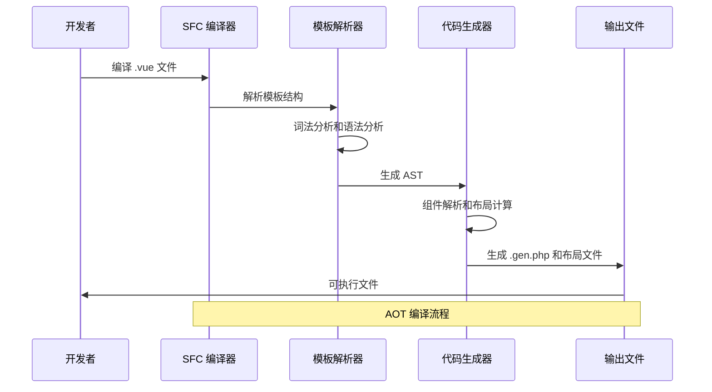
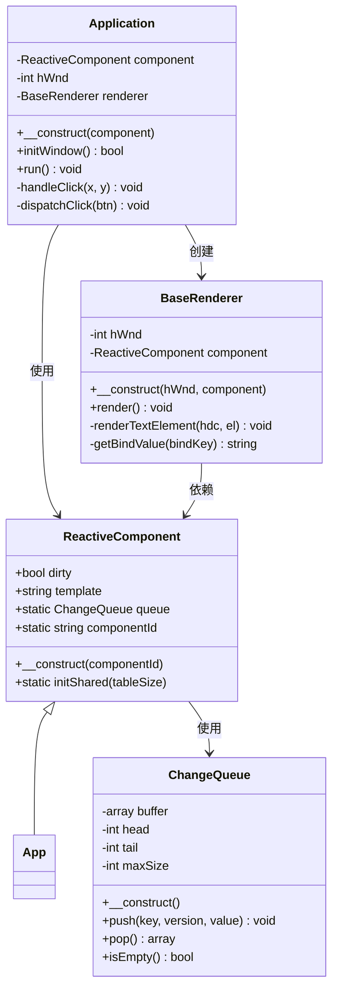
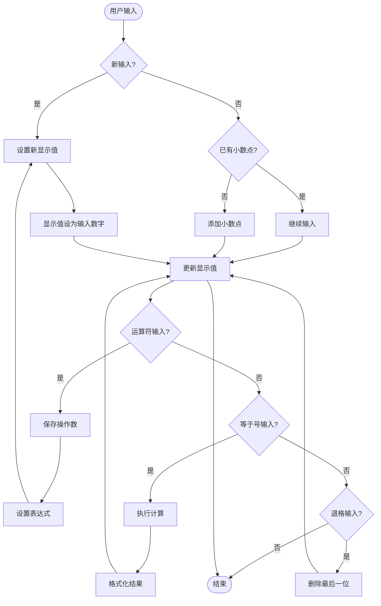
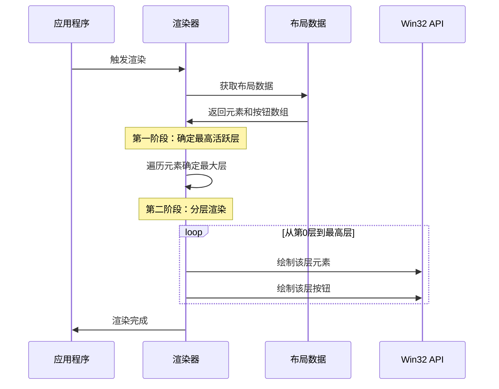
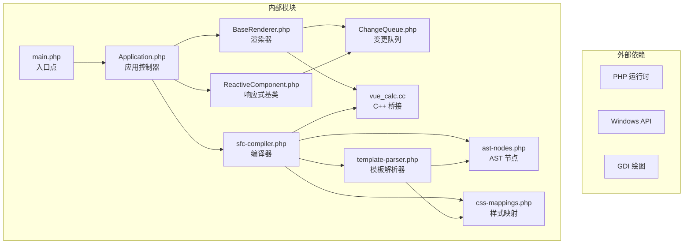

# 计算器应用程序架构

<cite>
**本文档引用的文件**
- [apps/calculator/App.vue](file://apps/calculator/App.vue)
- [apps/calculator/Application.php](file://apps/calculator/Application.php)
- [apps/calculator/main.php](file://apps/calculator/main.php)
- [apps/calculator/components/DisplayPanel.vue](file://apps/calculator/components/DisplayPanel.vue)
- [apps/calculator/components/NumPad.vue](file://apps/calculator/components/NumPad.vue)
- [apps/calculator/components/AboutDialog.vue](file://apps/calculator/components/AboutDialog.vue)
- [apps/calculator/project.yml](file://apps/calculator/project.yml)
- [framework/sfc-compiler.php](file://framework/sfc-compiler.php)
- [framework/BaseRenderer.php](file://framework/BaseRenderer.php)
- [framework/ReactiveComponent.php](file://framework/ReactiveComponent.php)
- [framework/ChangeQueue.php](file://framework/ChangeQueue.php)
- [framework/compiler/template-parser.php](file://framework/compiler/template-parser.php)
- [framework/compiler/ast-nodes.php](file://framework/compiler/ast-nodes.php)
- [framework/compiler/css-mappings.php](file://framework/compiler/css-mappings.php)
- [cpp/vue_calc.cc](file://cpp/vue_calc.cc)
</cite>

## 目录
1. [简介](#简介)
2. [项目结构](#项目结构)
3. [核心组件](#核心组件)
4. [架构概览](#架构概览)
5. [详细组件分析](#详细组件分析)
6. [依赖关系分析](#依赖关系分析)
7. [性能考虑](#性能考虑)
8. [故障排除指南](#故障排除指南)
9. [结论](#结论)

## 简介

VueCalc 是一个基于 SFC（单文件组件）编译器的计算器应用程序，采用 PHP 作为模板语言，通过 AOT（Ahead-of-Time）编译生成原生可执行文件。该应用程序实现了完整的响应式数据驱动架构，结合了现代前端开发理念与传统桌面应用程序的优势。

应用程序的核心特性包括：
- 基于 Vue.js 风格的单文件组件开发
- AOT 编译器将 .vue 组件转换为高性能的原生代码
- 响应式组件系统，支持自动脏标记驱动的渲染
- 分层布局系统，支持条件渲染和覆盖层
- 完整的计算器功能实现

## 项目结构

项目采用模块化的组织方式，主要分为以下几个层次：

**图表来源**
- [apps/calculator/App.vue:1-203](file://apps/calculator/App.vue#L1-L203)
- [framework/sfc-compiler.php:1-485](file://framework/sfc-compiler.php#L1-L485)
- [framework/BaseRenderer.php:1-136](file://framework/BaseRenderer.php#L1-L136)

**章节来源**
- [apps/calculator/project.yml:1-31](file://apps/calculator/project.yml#L1-L31)
- [apps/calculator/main.php:1-46](file://apps/calculator/main.php#L1-L46)

## 核心组件

### 应用程序入口点

应用程序的启动流程从 main.php 开始，该文件负责初始化整个系统并启动主事件循环。

### 主应用组件

App.vue 是整个应用程序的核心，实现了完整的计算器业务逻辑：
- 状态管理：包含显示值、表达式、操作数等状态属性
- 用户交互：处理数字输入、运算符、小数点、退格等功能
- 计算逻辑：实现加减乘除运算，包含错误处理
- 界面控制：管理对话框显示状态

### 子组件系统

应用程序采用组件化设计，包含三个主要子组件：

1. **显示面板组件**：负责显示当前计算结果和表达式
2. **数字键盘组件**：提供完整的计算器按键界面
3. **关于对话框组件**：显示应用程序信息和版本详情

**章节来源**
- [apps/calculator/App.vue:25-194](file://apps/calculator/App.vue#L25-L194)
- [apps/calculator/components/DisplayPanel.vue:1-12](file://apps/calculator/components/DisplayPanel.vue#L1-L12)
- [apps/calculator/components/NumPad.vue:1-37](file://apps/calculator/components/NumPad.vue#L1-L37)
- [apps/calculator/components/AboutDialog.vue:1-37](file://apps/calculator/components/AboutDialog.vue#L1-L37)

## 架构概览

VueCalc 采用了分层架构设计，每层都有明确的职责分工：

**图表来源**
- [framework/sfc-compiler.php:1-485](file://framework/sfc-compiler.php#L1-L485)
- [framework/BaseRenderer.php:1-136](file://framework/BaseRenderer.php#L1-L136)
- [framework/ReactiveComponent.php:1-35](file://framework/ReactiveComponent.php#L1-L35)

## 详细组件分析

### SFC 编译器架构

SFC 编译器是整个系统的核心，负责将 Vue 风格的单文件组件转换为高性能的原生代码：

**图表来源**
- [framework/sfc-compiler.php:214-311](file://framework/sfc-compiler.php#L214-L311)

#### 编译器核心流程

1. **块提取**：从 .vue 文件中提取 template、script、style 三个块
2. **样式解析**：将 CSS 类映射到 GDI 绘制属性
3. **模板解析**：使用递归下降算法解析模板结构
4. **组件解析**：解析组件引用并内联子组件布局
5. **布局生成**：计算编译时坐标和绑定键
6. **代码生成**：生成 .gen.php 文件和布局数组

**章节来源**
- [framework/sfc-compiler.php:214-485](file://framework/sfc-compiler.php#L214-L485)

### 响应式组件系统

响应式组件系统是 VueCalc 的核心架构模式，实现了数据驱动的更新机制：

**图表来源**
- [framework/ReactiveComponent.php:11-35](file://framework/ReactiveComponent.php#L11-L35)
- [apps/calculator/Application.php:10-139](file://apps/calculator/Application.php#L10-L139)
- [framework/BaseRenderer.php:9-136](file://framework/BaseRenderer.php#L9-L136)
- [framework/ChangeQueue.php:11-57](file://framework/ChangeQueue.php#L11-L57)

#### 组件生命周期

响应式组件遵循以下生命周期模式：

1. **初始化阶段**：设置组件标识和共享内存
2. **渲染阶段**：根据布局数组绘制界面元素
3. **事件处理阶段**：响应用户输入并更新状态
4. **更新阶段**：触发脏标记并重新渲染

**章节来源**
- [framework/ReactiveComponent.php:25-35](file://framework/ReactiveComponent.php#L25-L35)
- [apps/calculator/Application.php:43-98](file://apps/calculator/Application.php#L43-L98)

### 计算器业务逻辑

App.vue 实现了完整的计算器功能，包含以下核心方法：

**图表来源**
- [apps/calculator/App.vue:65-186](file://apps/calculator/App.vue#L65-L186)

#### 计算逻辑实现

计算器支持四种基本运算（+、-、*、/），具有以下特性：

1. **连续计算**：支持多个运算符连续输入
2. **错误处理**：除零运算返回错误状态
3. **精度控制**：整数结果显示为整数，小数结果限制精度
4. **边界检查**：防止数值溢出和异常情况

**章节来源**
- [apps/calculator/App.vue:106-147](file://apps/calculator/App.vue#L106-L147)

### 渲染系统架构

渲染系统采用分层渲染策略，支持条件渲染和覆盖层：

**图表来源**
- [framework/BaseRenderer.php:76-134](file://framework/BaseRenderer.php#L76-L134)

#### 文本渲染优化

渲染器实现了智能的文本渲染优化：

1. **动态字体大小**：根据文本长度自动调整字体大小
2. **右对齐支持**：支持容器内的右对齐文本
3. **条件渲染**：支持基于条件属性的元素显示控制

**章节来源**
- [framework/BaseRenderer.php:26-71](file://framework/BaseRenderer.php#L26-L71)

## 依赖关系分析

应用程序的依赖关系呈现清晰的分层结构：

**图表来源**
- [apps/calculator/main.php:21-46](file://apps/calculator/main.php#L21-L46)
- [framework/sfc-compiler.php:20-28](file://framework/sfc-compiler.php#L20-L28)

### 模块耦合度分析

应用程序采用了松耦合的设计原则：

1. **编译期耦合**：编译器与运行时通过生成的代码解耦
2. **运行时耦合**：组件间通过接口和约定进行通信
3. **平台耦合**：C++ 层提供最小化的系统接口封装

**章节来源**
- [apps/calculator/project.yml:12-24](file://apps/calculator/project.yml#L12-L24)

## 性能考虑

### 渲染性能优化

1. **脏标记驱动**：只有在状态发生变化时才触发重绘
2. **分层渲染**：按层渲染减少不必要的绘制操作
3. **双缓冲技术**：避免闪烁，提高渲染流畅度
4. **编译时计算**：坐标和布局在编译时确定，运行时只需查找

### 内存管理

1. **共享内存**：使用共享内存存储组件状态
2. **环形缓冲**：高效的变更通知队列实现
3. **对象池**：减少频繁的对象创建和销毁

### 计算性能

1. **短路求值**：运算符优先级和连续计算优化
2. **精度控制**：避免不必要的浮点运算
3. **错误快速返回**：除零等错误情况立即处理

## 故障排除指南

### 常见问题诊断

#### 编译错误

1. **模板解析错误**：检查 .vue 文件的语法正确性
2. **组件引用错误**：确认组件注册表中的路径正确
3. **样式映射错误**：验证 CSS 类名和属性的有效性

#### 运行时错误

1. **窗口创建失败**：检查系统资源和权限
2. **渲染异常**：验证布局数据的完整性
3. **事件处理错误**：检查按钮点击事件的绑定

#### 性能问题

1. **渲染卡顿**：检查是否有过多的重绘触发
2. **内存泄漏**：监控共享内存的使用情况
3. **CPU 占用高**：分析事件循环的执行效率

**章节来源**
- [apps/calculator/Application.php:63-68](file://apps/calculator/Application.php#L63-L68)
- [framework/BaseRenderer.php:86-91](file://framework/BaseRenderer.php#L86-L91)

### 调试技巧

1. **启用详细日志**：在编译和运行时输出详细的状态信息
2. **使用断点调试**：在关键方法处设置断点分析执行流程
3. **性能分析**：使用性能分析工具识别瓶颈
4. **内存监控**：定期检查内存使用情况和泄漏

## 结论

VueCalc 计算器应用程序展现了现代桌面应用程序开发的最佳实践。通过采用 SFC 编译器架构，应用程序实现了：

1. **开发效率**：使用熟悉的 Vue.js 风格语法进行开发
2. **运行性能**：通过 AOT 编译生成高性能的原生代码
3. **维护性**：模块化的架构设计便于维护和扩展
4. **跨平台潜力**：基于 Win32 API 的封装为未来移植提供基础

该架构的成功之处在于将现代前端开发理念与传统桌面应用程序的优势相结合，为开发者提供了一个既熟悉又高效的开发环境。通过响应式数据驱动的设计，应用程序能够自动管理状态同步和界面更新，大大减少了样板代码的编写。

未来的发展方向包括：
- 支持更多平台（Linux、macOS）
- 增强主题系统和自定义能力
- 扩展组件库和插件机制
- 集成更多的系统功能和服务