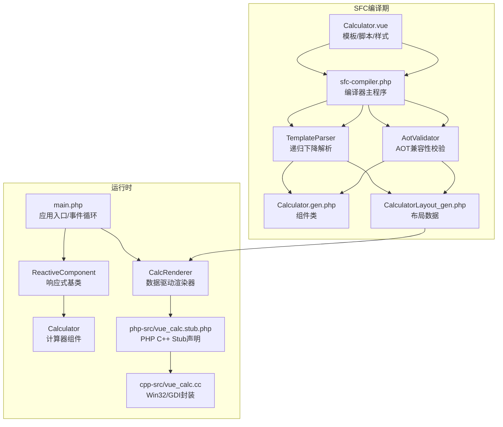
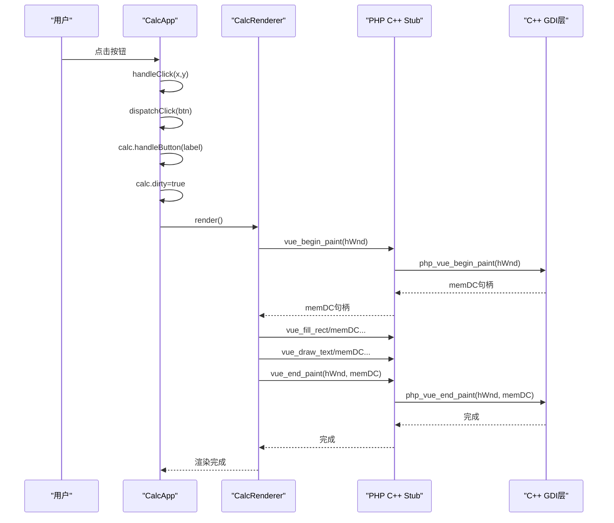
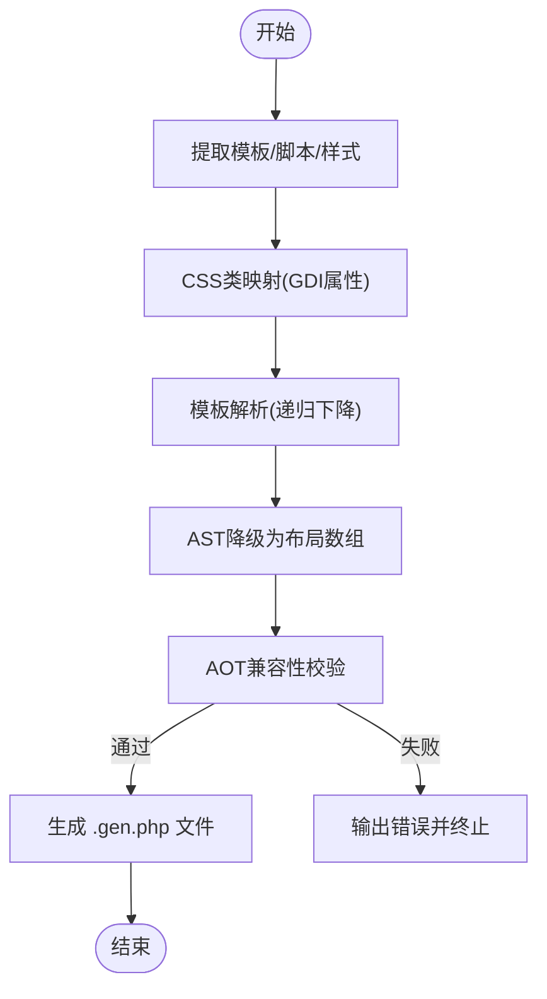
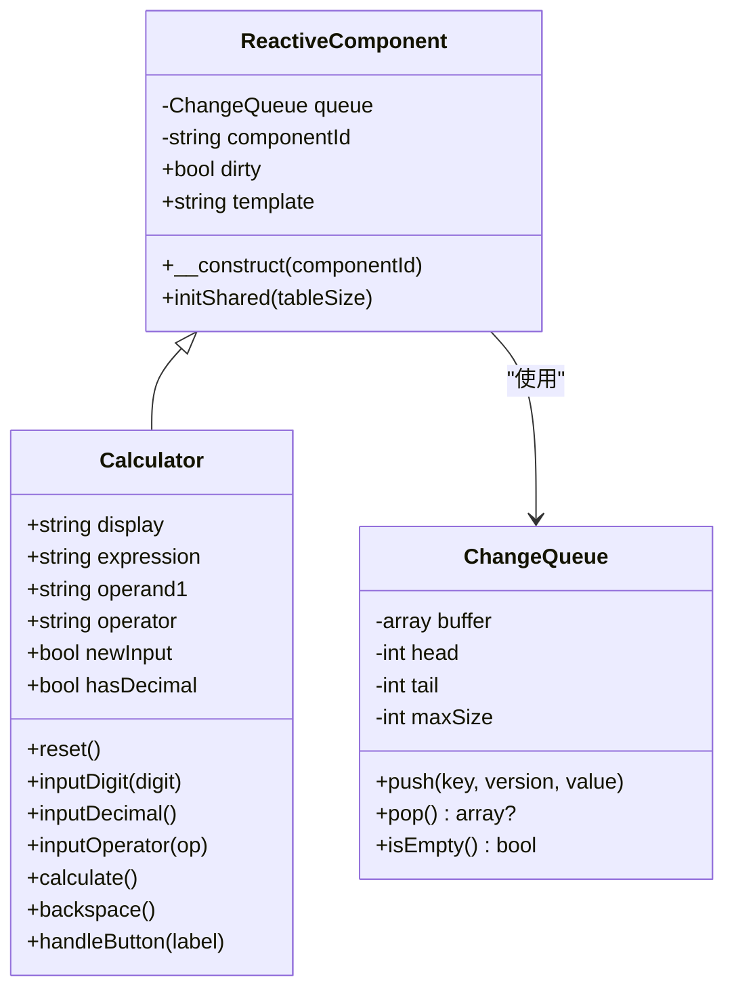
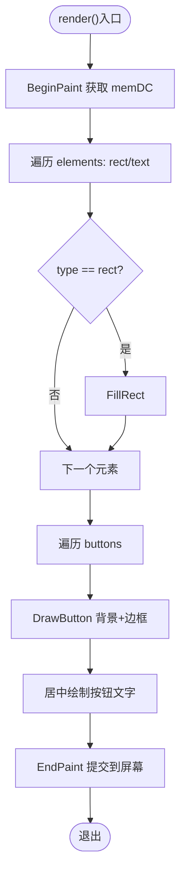
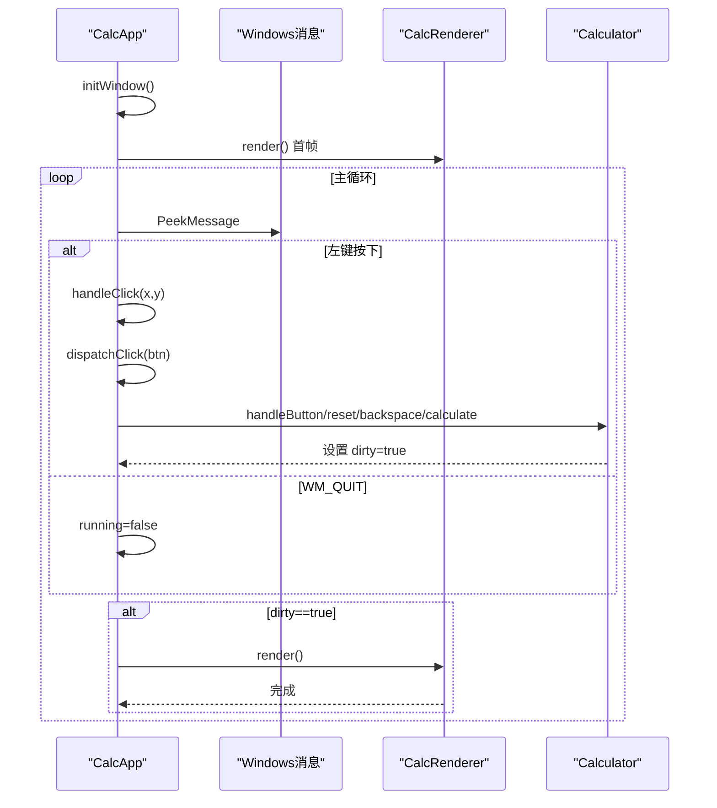
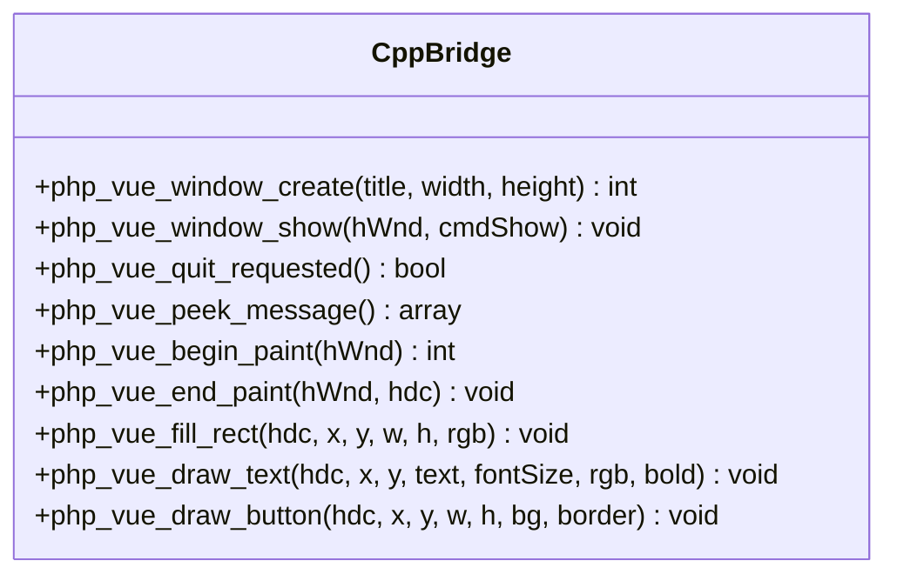
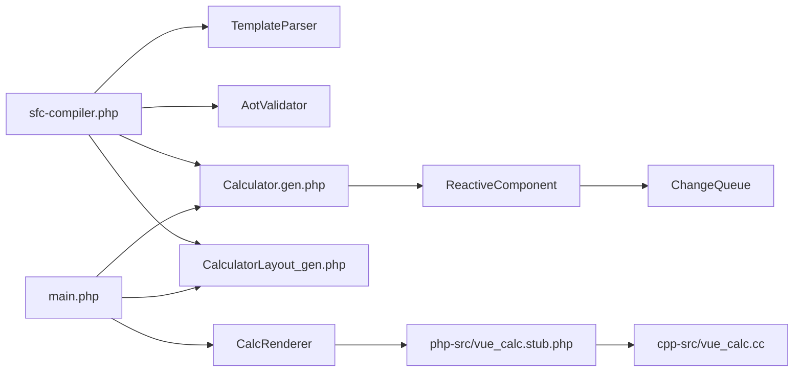

# 跨语言集成架构

<cite>
**本文引用的文件列表**
- [main.php](file://main.php)
- [cpp-src/vue_calc.cc](file://cpp-src/vue_calc.cc)
- [php-src/vue_calc.stub.php](file://php-src/vue_calc.stub.php)
- [src/Calculator.gen.php](file://src/Calculator.gen.php)
- [src/CalculatorLayout_gen.php](file://src/CalculatorLayout_gen.php)
- [src/ReactiveComponent.php](file://src/ReactiveComponent.php)
- [src/ChangeQueue.php](file://src/ChangeQueue.php)
- [tools/sfc-compiler.php](file://tools/sfc-compiler.php)
- [tools/compiler/template-parser.php](file://tools/compiler/template-parser.php)
- [tools/compiler/aot-validator.php](file://tools/compiler/aot-validator.php)
- [project.yml](file://project.yml)
</cite>

## 目录
1. [引言](#引言)
2. [项目结构](#项目结构)
3. [核心组件](#核心组件)
4. [架构总览](#架构总览)
5. [详细组件分析](#详细组件分析)
6. [依赖关系分析](#依赖关系分析)
7. [性能考量](#性能考量)
8. [故障排查指南](#故障排查指南)
9. [结论](#结论)
10. [附录](#附录)

## 引言
本文件面向VueCalc项目，系统性阐述其跨语言集成架构：如何通过Swoole AOT编译器将PHP代码转换为C++，并通过PHP-C++ Stub声明实现类型安全的跨语言调用；同时说明Win32 API封装与GDI绘制的集成方式，涵盖窗口管理、消息处理、绘制原语等底层操作。文档还讨论跨语言调用的性能考虑与限制，并给出优化数据传输效率的具体建议与最佳实践。

## 项目结构
VueCalc采用“前端模板/样式 + PHP逻辑 + C++渲染”的三层架构：
- SFC编译阶段：.vue单文件组件经SFC编译器生成两类产物：Calculator.gen.php（组件类）与CalculatorLayout_gen.php（布局数据）。
- 运行时阶段：PHP侧负责响应式状态管理与业务逻辑，C++侧提供Win32窗口与GDI绘制原语，二者通过Stub声明进行类型安全的跨语言调用。
- 构建阶段：SFC生成的PHP文件交由Swoole AOT编译器转换为C++，再由MSVC编译为原生exe。

图表来源
- [tools/sfc-compiler.php:1-210](file://tools/sfc-compiler.php#L1-L210)
- [tools/compiler/template-parser.php:1-200](file://tools/compiler/template-parser.php#L1-L200)
- [tools/compiler/aot-validator.php:1-169](file://tools/compiler/aot-validator.php#L1-L169)
- [main.php:1-291](file://main.php#L1-L291)
- [src/Calculator.gen.php:1-174](file://src/Calculator.gen.php#L1-L174)
- [src/CalculatorLayout_gen.php:1-296](file://src/CalculatorLayout_gen.php#L1-L296)
- [src/ReactiveComponent.php:1-35](file://src/ReactiveComponent.php#L1-L35)
- [src/ChangeQueue.php:1-57](file://src/ChangeQueue.php#L1-L57)
- [php-src/vue_calc.stub.php:1-24](file://php-src/vue_calc.stub.php#L1-L24)
- [cpp-src/vue_calc.cc:1-157](file://cpp-src/vue_calc.cc#L1-L157)

章节来源
- [project.yml:1-10](file://project.yml#L1-L10)
- [tools/sfc-compiler.php:1-210](file://tools/sfc-compiler.php#L1-L210)

## 核心组件
- 应用入口与事件循环：负责初始化响应式框架、创建窗口、进入消息循环与按需渲染。
- 响应式组件基类：提供脏标记与共享变更队列，满足AOT编译约束。
- 计算器组件：实现完整的计算器业务逻辑，通过脏标记触发重绘。
- 数据驱动渲染器：读取布局数据与组件状态，调用C++绘制原语完成渲染。
- C++ Win32/GDI封装：提供窗口创建/显示、消息轮询、双缓冲绘制与基础图形原语。
- PHP C++ Stub声明：定义跨语言函数签名，确保类型安全与AOT兼容。
- SFC编译器：解析模板/脚本/样式，生成组件类与布局数据，并进行AOT兼容性校验。

章节来源
- [main.php:1-291](file://main.php#L1-L291)
- [src/ReactiveComponent.php:1-35](file://src/ReactiveComponent.php#L1-L35)
- [src/Calculator.gen.php:1-174](file://src/Calculator.gen.php#L1-L174)
- [src/CalculatorLayout_gen.php:1-296](file://src/CalculatorLayout_gen.php#L1-L296)
- [src/ChangeQueue.php:1-57](file://src/ChangeQueue.php#L1-L57)
- [php-src/vue_calc.stub.php:1-24](file://php-src/vue_calc.stub.php#L1-L24)
- [cpp-src/vue_calc.cc:1-157](file://cpp-src/vue_calc.cc#L1-L157)

## 架构总览
VueCalc的跨语言集成遵循“PHP业务逻辑 + C++渲染引擎”的分层设计。SFC编译器将.vue转换为PHP源码，AOT编译器再将PHP转换为C++，最终生成原生exe。运行时，PHP侧负责状态变更与事件分发，C++侧负责窗口与绘制，二者通过Stub声明的函数桥接。

图表来源
- [main.php:171-227](file://main.php#L171-L227)
- [main.php:229-258](file://main.php#L229-L258)
- [src/Calculator.gen.php:149-168](file://src/Calculator.gen.php#L149-L168)
- [php-src/vue_calc.stub.php:12-24](file://php-src/vue_calc.stub.php#L12-L24)
- [cpp-src/vue_calc.cc:90-117](file://cpp-src/vue_calc.cc#L90-L117)

## 详细组件分析

### SFC编译器与AOT兼容性
- 编译流程：提取template/script/style → CSS映射 → 模板AST → 布局数组 → AOT校验 → 生成两类.gen.php文件。
- 关键约束：禁止变量属性访问、变量方法调用、顶层可执行语句、const嵌套数组等，确保AOT稳定转换。
- 输出产物：Calculator.gen.php（组件类）、CalculatorLayout_gen.php（布局数据与窗口尺寸常量）。

图表来源
- [tools/sfc-compiler.php:46-210](file://tools/sfc-compiler.php#L46-L210)
- [tools/compiler/template-parser.php:60-200](file://tools/compiler/template-parser.php#L60-L200)
- [tools/compiler/aot-validator.php:36-106](file://tools/compiler/aot-validator.php#L36-L106)

章节来源
- [tools/sfc-compiler.php:1-210](file://tools/sfc-compiler.php#L1-L210)
- [tools/compiler/template-parser.php:1-200](file://tools/compiler/template-parser.php#L1-L200)
- [tools/compiler/aot-validator.php:1-169](file://tools/compiler/aot-validator.php#L1-L169)

### 响应式组件与脏标记
- ReactiveComponent提供全局变更队列与脏标记，子类通过直接属性声明与手动设置$dirty实现AOT兼容的数据驱动更新。
- ChangeQueue采用环形缓冲，支持高并发下的变更收集与消费。

图表来源
- [src/ReactiveComponent.php:11-35](file://src/ReactiveComponent.php#L11-L35)
- [src/ChangeQueue.php:11-57](file://src/ChangeQueue.php#L11-L57)
- [src/Calculator.gen.php:9-174](file://src/Calculator.gen.php#L9-L174)

章节来源
- [src/ReactiveComponent.php:1-35](file://src/ReactiveComponent.php#L1-L35)
- [src/ChangeQueue.php:1-57](file://src/ChangeQueue.php#L1-L57)
- [src/Calculator.gen.php:1-174](file://src/Calculator.gen.php#L1-L174)

### 数据驱动渲染器
- CalcRenderer基于布局数据与组件状态进行绘制：先BeginPaint获取内存DC，再依次绘制背景矩形与文本，最后EndPaint将双缓冲提交到屏幕。
- 文本渲染支持对齐、动态字号与容器宽度计算，按钮绘制包含背景填充与边框。

图表来源
- [main.php:99-133](file://main.php#L99-L133)
- [src/CalculatorLayout_gen.php:10-296](file://src/CalculatorLayout_gen.php#L10-L296)

章节来源
- [main.php:26-133](file://main.php#L26-L133)
- [src/CalculatorLayout_gen.php:1-296](file://src/CalculatorLayout_gen.php#L1-L296)

### 应用入口与事件循环
- CalcApp负责窗口创建与显示、消息轮询、点击命中测试与事件分发。
- 事件分发采用显式路由（handler→method），避免AOT不支持的变量方法调用。

图表来源
- [main.php:151-227](file://main.php#L151-L227)
- [main.php:229-258](file://main.php#L229-L258)

章节来源
- [main.php:139-259](file://main.php#L139-L259)

### PHP C++ Stub声明与类型安全
- php-src/vue_calc.stub.php定义了所有跨语言函数签名，命名规范为“php_前缀”对应“vue_”调用。
- 通过Stub声明，AOT编译器可正确识别并生成对应的C++桥接代码，保证参数类型与返回值一致。

章节来源
- [php-src/vue_calc.stub.php:1-24](file://php-src/vue_calc.stub.php#L1-L24)

### C++ Win32/GDI封装
- 窗口管理：注册类、创建窗口、显示窗口、检查退出请求、消息轮询。
- 绘制原语：BeginPaint/EndPaint双缓冲、FillRect、DrawText、DrawButton。
- 字体与颜色：根据fontSize与bold参数动态创建字体，颜色以RGB整型传入。

图表来源
- [cpp-src/vue_calc.cc:36-157](file://cpp-src/vue_calc.cc#L36-L157)
- [php-src/vue_calc.stub.php:12-24](file://php-src/vue_calc.stub.php#L12-L24)

章节来源
- [cpp-src/vue_calc.cc:1-157](file://cpp-src/vue_calc.cc#L1-L157)
- [php-src/vue_calc.stub.php:1-24](file://php-src/vue_calc.stub.php#L1-L24)

## 依赖关系分析
- 编译期依赖：sfc-compiler.php依赖TemplateParser与AotValidator；生成的Calculator.gen.php继承ReactiveComponent；CalculatorLayout_gen.php提供布局数据。
- 运行时依赖：main.php依赖Calculator.gen.php与CalculatorLayout_gen.php；CalcRenderer依赖布局数据与C++ Stub；C++层依赖phpx.h与Windows SDK。

图表来源
- [tools/sfc-compiler.php:19-25](file://tools/sfc-compiler.php#L19-L25)
- [tools/compiler/template-parser.php:16-16](file://tools/compiler/template-parser.php#L16-L16)
- [tools/compiler/aot-validator.php:17-17](file://tools/compiler/aot-validator.php#L17-L17)
- [src/Calculator.gen.php:9-9](file://src/Calculator.gen.php#L9-L9)
- [src/CalculatorLayout_gen.php:10-10](file://src/CalculatorLayout_gen.php#L10-L10)
- [main.php:26-26](file://main.php#L26-L26)
- [php-src/vue_calc.stub.php:12-24](file://php-src/vue_calc.stub.php#L12-L24)
- [cpp-src/vue_calc.cc:9-13](file://cpp-src/vue_calc.cc#L9-L13)

章节来源
- [tools/sfc-compiler.php:1-210](file://tools/sfc-compiler.php#L1-L210)
- [src/Calculator.gen.php:1-174](file://src/Calculator.gen.php#L1-L174)
- [src/CalculatorLayout_gen.php:1-296](file://src/CalculatorLayout_gen.php#L1-L296)
- [main.php:1-291](file://main.php#L1-L291)
- [php-src/vue_calc.stub.php:1-24](file://php-src/vue_calc.stub.php#L1-L24)
- [cpp-src/vue_calc.cc:1-157](file://cpp-src/vue_calc.cc#L1-L157)

## 性能考量
- 跨语言调用开销：每次绘制涉及多次跨语言调用（BeginPaint/EndPaint/多条绘制原语）。建议：
  - 合并绘制命令：在PHP侧批量构造绘制指令，减少跨语言往返次数。
  - 使用双缓冲：C++层已实现双缓冲，确保一次提交，避免闪烁与额外拷贝。
  - 控制刷新频率：当前约60FPS（~16ms），可根据CPU/GPU负载动态调整。
- 数据传输效率：
  - 字符串传递：尽量复用布局数据，避免频繁构造大字符串；必要时在C++侧缓存常用资源（如字体）。
  - 整型参数：RGB颜色与坐标均为整型，开销极低，无需优化。
- AOT限制与规避：
  - 避免变量属性/方法调用：通过显式路由与静态方法调用替代反射。
  - 避免顶层可执行语句：确保所有代码位于类或函数内。
  - 避免const嵌套数组：使用函数返回数组替代全局常量。

[本节为通用性能指导，不直接分析具体文件]

## 故障排查指南
- AOT编译失败：
  - 检查文件名是否含多个点（影响C++符号生成）。
  - 检查是否存在const嵌套数组、变量属性/方法访问、顶层可执行语句。
  - 替换PHP8特性函数为AOT兼容写法（如str_contains→strpos）。
- 绘制异常：
  - 确认BeginPaint/EndPaint配对调用，避免悬挂资源。
  - 检查颜色值格式（BGR整型）与字体大小范围。
- 事件未响应：
  - 确认消息轮询循环正常，WM_QUIT路径可达。
  - 检查按钮命中测试区域与坐标系。

章节来源
- [tools/compiler/aot-validator.php:36-106](file://tools/compiler/aot-validator.php#L36-L106)
- [cpp-src/vue_calc.cc:90-117](file://cpp-src/vue_calc.cc#L90-L117)
- [main.php:171-227](file://main.php#L171-L227)

## 结论
VueCalc通过SFC编译器与AOT编译器实现了从模板到原生exe的完整链路，结合PHP的响应式状态与C++的Win32/GDI渲染，形成清晰的跨语言集成架构。通过Stub声明与严格的AOT兼容性校验，系统在保持开发灵活性的同时，获得了稳定的原生性能表现。未来可在绘制批量化与事件路由优化方面进一步提升性能与可维护性。

[本节为总结性内容，不直接分析具体文件]

## 附录
- 最佳实践清单
  - 使用显式路由替代变量方法调用。
  - 将布局数据以函数返回数组形式提供，避免const嵌套数组。
  - 在PHP侧合并绘制命令，减少跨语言调用次数。
  - 严格遵守AOT约束，确保生成代码可被稳定转换。
  - 在C++层复用GDI对象（字体/画刷/画笔），降低频繁创建销毁成本。

[本节为通用建议，不直接分析具体文件]