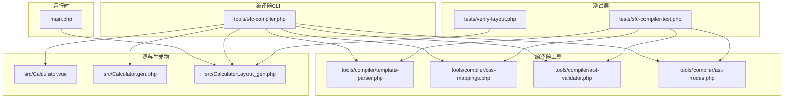
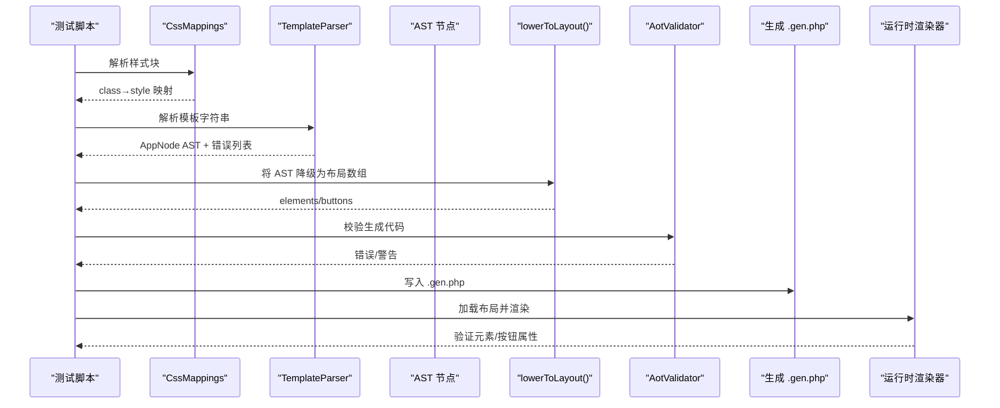
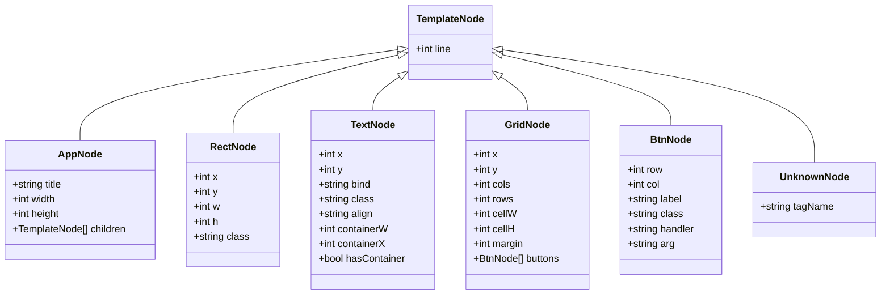
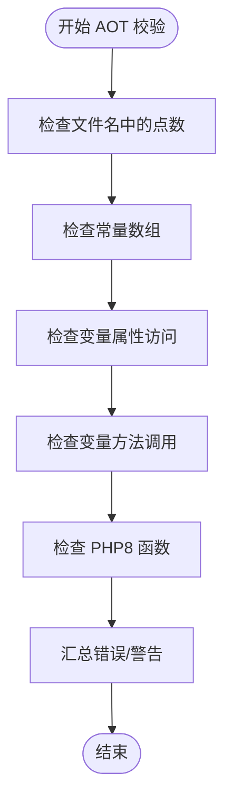
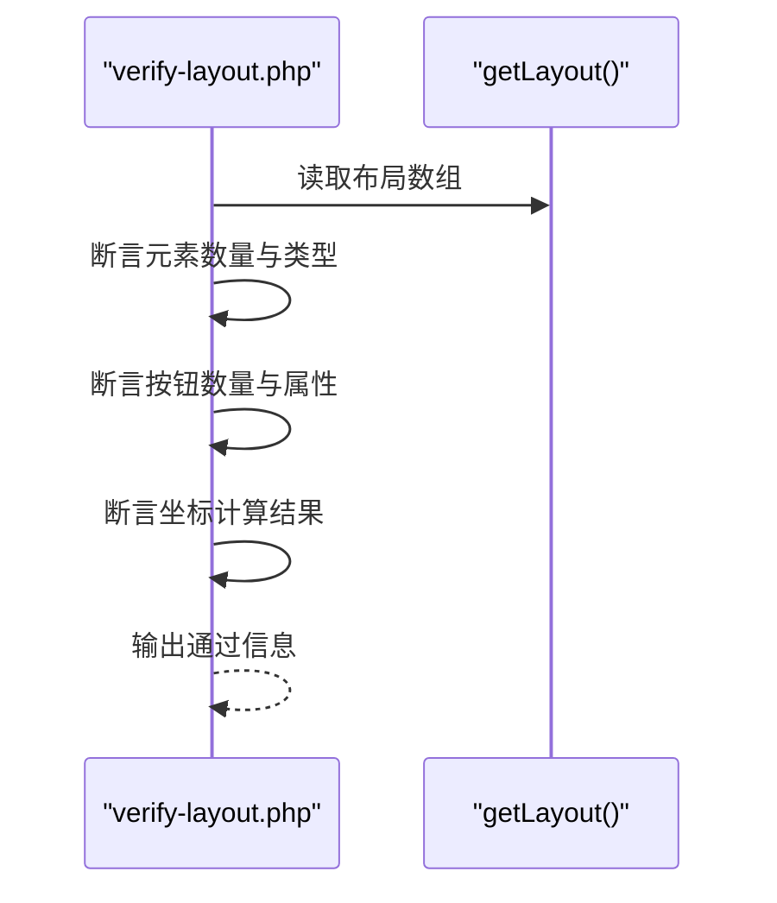
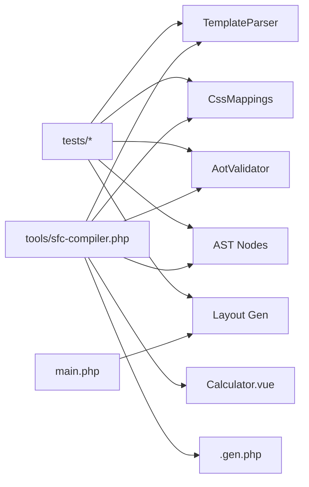

# 测试策略

<cite>
**本文引用的文件列表**
- [sfc-compiler-test.php](file://tests/sfc-compiler-test.php)
- [verify-layout.php](file://tests/verify-layout.php)
- [template-parser.php](file://tools/compiler/template-parser.php)
- [css-mappings.php](file://tools/compiler/css-mappings.php)
- [aot-validator.php](file://tools/compiler/aot-validator.php)
- [ast-nodes.php](file://tools/compiler/ast-nodes.php)
- [Calculator.vue](file://src/Calculator.vue)
- [Calculator.gen.php](file://src/Calculator.gen.php)
- [CalculatorLayout_gen.php](file://src/CalculatorLayout_gen.php)
- [sfc-compiler.php](file://tools/sfc-compiler.php)
- [main.php](file://main.php)
</cite>

## 目录
1. [引言](#引言)
2. [项目结构](#项目结构)
3. [核心组件](#核心组件)
4. [架构总览](#架构总览)
5. [详细组件分析](#详细组件分析)
6. [依赖关系分析](#依赖关系分析)
7. [性能考量](#性能考量)
8. [故障排查指南](#故障排查指南)
9. [结论](#结论)
10. [附录](#附录)

## 引言
本测试策略文档聚焦于 VueCalc 项目的测试体系，涵盖单元测试框架设计、编译器测试用例（模板解析、CSS 映射、AST 验证）、布局验证测试、集成测试方法与策略，并给出 TDD 最佳实践、持续集成与自动化测试配置建议以及测试覆盖率与质量度量标准。目标是帮助开发者编写高质量、可维护的测试代码，确保编译器与运行时行为稳定可靠。

## 项目结构
VueCalc 的测试与编译器相关代码主要分布在以下目录：
- tests：单元与布局验证测试脚本
- tools/compiler：编译器核心模块（模板解析、CSS 映射、AOT 校验、AST 节点）
- src：源 SFC 组件与生成的 .gen.php 文件
- tools：SFC 编译器 CLI 工具
- main.php：运行时渲染与交互入口

图表来源
- [sfc-compiler-test.php:1-365](file://tests/sfc-compiler-test.php#L1-L365)
- [verify-layout.php:1-72](file://tests/verify-layout.php#L1-L72)
- [template-parser.php:1-680](file://tools/compiler/template-parser.php#L1-L680)
- [css-mappings.php:1-210](file://tools/compiler/css-mappings.php#L1-L210)
- [aot-validator.php:1-169](file://tools/compiler/aot-validator.php#L1-L169)
- [ast-nodes.php:1-153](file://tools/compiler/ast-nodes.php#L1-L153)
- [Calculator.vue:1-215](file://src/Calculator.vue#L1-L215)
- [Calculator.gen.php:1-174](file://src/Calculator.gen.php#L1-L174)
- [CalculatorLayout_gen.php:1-296](file://src/CalculatorLayout_gen.php#L1-L296)
- [sfc-compiler.php:1-210](file://tools/sfc-compiler.php#L1-L210)
- [main.php:1-291](file://main.php#L1-L291)

章节来源
- [sfc-compiler-test.php:1-365](file://tests/sfc-compiler-test.php#L1-L365)
- [sfc-compiler.php:1-210](file://tools/sfc-compiler.php#L1-L210)

## 核心组件
- 测试框架与断言
  - 自定义测试运行器：统一的 test(name, fn) 包装，捕获异常与断言失败，统计通过/失败计数。
  - 断言机制：直接使用 assert(...) 或基于断言结果抛出异常，由测试运行器捕获并记录。
- 编译器核心模块
  - 模板解析器：递归下降解析器，生成 AST 并收集错误；支持行号追踪。
  - CSS 映射：将 CSS 属性映射为渲染参数，支持颜色、字号、粗细、对齐等。
  - AOT 校验器：在写入 .gen.php 前进行 AOT 兼容性检查，阻止不安全模式。
  - AST 节点：抽象节点与具体节点类型，携带行号便于定位错误。
- 运行时与布局
  - 布局数组：由编译器生成，包含窗口尺寸、元素与按钮信息。
  - 运行时渲染器：读取布局数组与组件状态，驱动绘制。

章节来源
- [sfc-compiler-test.php:23-37](file://tests/sfc-compiler-test.php#L23-L37)
- [template-parser.php:60-112](file://tools/compiler/template-parser.php#L60-L112)
- [css-mappings.php:15-210](file://tools/compiler/css-mappings.php#L15-L210)
- [aot-validator.php:17-169](file://tools/compiler/aot-validator.php#L17-L169)
- [ast-nodes.php:9-153](file://tools/compiler/ast-nodes.php#L9-L153)
- [CalculatorLayout_gen.php:1-296](file://src/CalculatorLayout_gen.php#L1-L296)
- [main.php:26-133](file://main.php#L26-L133)

## 架构总览
测试策略围绕“编译器流水线 + 运行时验证”的双轨路径展开：
- 编译器侧：逐阶段断言（CSS 解析、模板解析、AST 降级、AOT 校验、全链路集成）。
- 运行时侧：布局一致性验证，确保生成布局与预期一致。

图表来源
- [sfc-compiler-test.php:304-354](file://tests/sfc-compiler-test.php#L304-L354)
- [template-parser.php:464-541](file://tools/compiler/template-parser.php#L464-L541)
- [aot-validator.php:36-106](file://tools/compiler/aot-validator.php#L36-L106)
- [CalculatorLayout_gen.php:10-296](file://src/CalculatorLayout_gen.php#L10-L296)
- [main.php:99-133](file://main.php#L99-L133)

## 详细组件分析

### 单元测试框架设计与实现
- 设计要点
  - 测试组织：按功能分组（CSS 映射、模板解析、AST→布局、AOT 校验、全链路集成），每组以独立标题输出，便于定位问题。
  - 断言机制：统一使用 assert(...)，配合 try/catch 捕获 Throwable 与 AssertionError，记录失败原因。
  - 结果统计：全局计数 passed/failed，最终输出汇总并根据失败数退出非零码。
- 使用示例
  - 在测试中调用 test("名称", fn) 包裹断言逻辑，内部自动捕获异常并报告行号与消息。
  - 支持复杂断言组合（数量校验、键存在性、数值比较、JSON 可序列化等）。

章节来源
- [sfc-compiler-test.php:23-37](file://tests/sfc-compiler-test.php#L23-L37)
- [sfc-compiler-test.php:359-365](file://tests/sfc-compiler-test.php#L359-L365)

### 编译器测试用例详解

#### 模板解析测试
- 覆盖点
  - 正确解析完整 Calculator.vue 模板，断言根节点宽高、子节点数量与类型。
  - 行号追踪：验证未知标签、缺失 class 等错误的行号正确性。
  - 语法约束：拒绝不在 grid 中的 btn、未知标签生成 UnknownNode、@click 参数解析。
  - AST 导出：确保 dumpAst 输出合法 JSON，根节点类型正确。
- 关键断言
  - 宽高与子节点数量断言，确保布局规模符合预期。
  - UnknownNode 与错误集合断言，保证错误可诊断。
  - AST JSON 可序列化断言，便于调试与可视化。

图表来源
- [sfc-compiler-test.php:114-208](file://tests/sfc-compiler-test.php#L114-L208)
- [template-parser.php:79-112](file://tools/compiler/template-parser.php#L79-L112)

章节来源
- [sfc-compiler-test.php:114-208](file://tests/sfc-compiler-test.php#L114-L208)
- [template-parser.php:60-112](file://tools/compiler/template-parser.php#L60-L112)

#### CSS 映射测试
- 覆盖点
  - 颜色转换：支持 #RGB 与 #RRGGBB，无效颜色返回默认值。
  - 边框推导：基于背景色推导边框色，通道加权并上限钳制。
  - 样式块解析：提取 8 个 CSS 类，断言属性键与默认值。
  - 属性映射表：扩展 PROPERTY_MAP 以支持更多 CSS 属性。
- 关键断言
  - BGR 整型转换断言，覆盖短码与无效输入。
  - 边框色上限断言，确保不会越界。
  - 样式块解析数量与键存在性断言。

图表来源
- [sfc-compiler-test.php:46-107](file://tests/sfc-compiler-test.php#L46-L107)
- [css-mappings.php:164-194](file://tools/compiler/css-mappings.php#L164-L194)

章节来源
- [sfc-compiler-test.php:46-107](file://tests/sfc-compiler-test.php#L46-L107)
- [css-mappings.php:15-210](file://tools/compiler/css-mappings.php#L15-L210)

#### AST 验证测试
- 覆盖点
  - AST 节点结构：AppNode、RectNode、TextNode、GridNode、BtnNode、UnknownNode。
  - 行号字段：每个节点携带 line，用于错误定位。
  - AST→数组：dumpAst 输出结构化 JSON，便于人工核对与自动化断言。
- 关键断言
  - 节点类型与字段存在性断言。
  - dumpAst JSON 结构断言，根类型为 AppNode。

图表来源
- [ast-nodes.php:9-153](file://tools/compiler/ast-nodes.php#L9-L153)
- [template-parser.php:619-678](file://tools/compiler/template-parser.php#L619-L678)

章节来源
- [ast-nodes.php:9-153](file://tools/compiler/ast-nodes.php#L9-L153)
- [template-parser.php:619-678](file://tools/compiler/template-parser.php#L619-L678)

#### AOT 校验测试
- 覆盖点
  - 文件名约束：禁止多点命名（影响 C++ 符号生成）。
  - 常量数组限制：禁止嵌套常量数组（AOT 不稳定）。
  - 变量属性/方法访问：禁止 $obj->$var 与 $obj->$method()。
  - PHP8 函数：str_contains 等需替换为兼容写法。
  - 顶层可执行语句：生成文件必须在类或函数内。
- 关键断言
  - 多点文件名报错断言。
  - 常量数组检测断言。
  - 变量属性/方法访问报错断言。
  - PHP8 函数警告断言。

图表来源
- [sfc-compiler-test.php:245-298](file://tests/sfc-compiler-test.php#L245-L298)
- [aot-validator.php:36-106](file://tools/compiler/aot-validator.php#L36-L106)

章节来源
- [sfc-compiler-test.php:245-298](file://tests/sfc-compiler-test.php#L245-L298)
- [aot-validator.php:17-169](file://tools/compiler/aot-validator.php#L17-L169)

#### 布局验证测试
- 覆盖点
  - 窗口尺寸：WINDOW_WIDTH/WINDOW_HEIGHT 与元素数量断言。
  - 元素断言：首个矩形尺寸、表达式文本绑定与字体大小、显示文本对齐与粗细。
  - 按钮断言：总数、首尾按钮标签与处理器、等于号按钮处理器。
  - 坐标断言：基于 grid 参数计算按钮坐标，验证命中位置。
- 关键断言
  - 数量与键存在性断言。
  - 坐标计算断言，确保编译期布局正确。

图表来源
- [verify-layout.php:1-72](file://tests/verify-layout.php#L1-L72)
- [CalculatorLayout_gen.php:10-296](file://src/CalculatorLayout_gen.php#L10-L296)

章节来源
- [verify-layout.php:1-72](file://tests/verify-layout.php#L1-L72)
- [CalculatorLayout_gen.php:1-296](file://src/CalculatorLayout_gen.php#L1-L296)

#### 全链路集成测试
- 覆盖点
  - 从 .vue 提取三块（template/script/style），解析样式与模板，生成布局数组，模拟代码生成，最后 AOT 校验。
  - 断言：模板/脚本非空、样式类数量、AST 错误清零、布局元素与按钮数量、生成代码通过 AOT 校验。
- 关键断言
  - 全链路断言，确保编译器各阶段协同工作。

章节来源
- [sfc-compiler-test.php:304-354](file://tests/sfc-compiler-test.php#L304-L354)
- [sfc-compiler.php:40-210](file://tools/sfc-compiler.php#L40-L210)

### 运行时渲染与交互测试
- 覆盖点
  - 渲染器：读取布局元素与按钮，绘制矩形与文本，支持右对齐与动态字号。
  - 事件分发：基于命中测试调用组件方法（显式路由，避免 AOT 不支持的变量访问）。
  - 状态变更：组件状态 dirty 触发重绘，保持 60FPS 左右刷新。
- 关键断言
  - 绑定值获取断言（避免变量属性访问）。
  - 命中测试与方法分发断言。

章节来源
- [main.php:26-133](file://main.php#L26-L133)
- [main.php:139-259](file://main.php#L139-L259)

## 依赖关系分析
- 组件耦合
  - 测试脚本依赖编译器模块与生成物；编译器模块之间低耦合，职责清晰。
  - TemplateParser 依赖 AST 节点与 CssMappings；AotValidator 独立于编译流程，仅消费代码字符串。
- 外部依赖
  - 运行时依赖外部绘制接口（如 vue_draw_text、vue_fill_rect 等），测试阶段可通过桩函数隔离。
- 循环依赖
  - 未发现循环依赖；模块边界清晰。

图表来源
- [sfc-compiler-test.php:15-18](file://tests/sfc-compiler-test.php#L15-L18)
- [sfc-compiler.php:19-24](file://tools/sfc-compiler.php#L19-L24)
- [Calculator.vue:1-215](file://src/Calculator.vue#L1-L215)
- [Calculator.gen.php:1-174](file://src/Calculator.gen.php#L1-L174)
- [CalculatorLayout_gen.php:1-296](file://src/CalculatorLayout_gen.php#L1-L296)
- [main.php:99-133](file://main.php#L99-L133)

章节来源
- [sfc-compiler-test.php:15-18](file://tests/sfc-compiler-test.php#L15-L18)
- [sfc-compiler.php:19-24](file://tools/sfc-compiler.php#L19-L24)

## 性能考量
- 测试性能
  - 单元测试以断言为主，开销极低；建议在 CI 中并行运行不同分组测试。
  - 集成测试涉及文件读写与 AOT 校验，建议在专用环境执行，避免频繁触发。
- 编译器性能
  - 递归下降解析器时间复杂度 O(n)，空间复杂度 O(h)（h 为树高）。
  - CSS 映射与布局降级均为线性扫描，整体 O(n)。
- 运行时性能
  - 渲染器按元素与按钮遍历，绘制调用次数与布局元素数量线性相关。
  - 事件分发采用简单矩形命中测试，O(b)（b 为按钮数量）。

[本节为通用性能讨论，无需特定文件引用]

## 故障排查指南
- 模板解析错误
  - 未知标签：Parser 会生成 UnknownNode 并记录错误，检查标签拼写与支持列表。
  - 缺失属性：如 class、:bind、@click、width/height 等，Parser 会报错并记录行号。
  - 位置约束：btn 必须在 grid 内，否则报错。
- CSS 映射问题
  - 颜色无效：hexToBgr 返回默认值，检查颜色格式与长度。
  - 属性未识别：确认 PROPERTY_MAP 中是否存在该属性。
- AOT 校验失败
  - 文件名含多个点：修改为单点或下划线命名。
  - 常量数组：改为函数返回数组。
  - 变量属性/方法：改为显式 if/else 路由。
  - PHP8 函数：替换为兼容写法（如 str_contains → strpos）。
- 布局不一致
  - 检查 grid 参数（x/y/cols/rows/cell-w/cell-h/margin）与按钮行列索引。
  - 核对样式类映射与默认值，确保颜色与字号正确。

章节来源
- [template-parser.php:610-613](file://tools/compiler/template-parser.php#L610-L613)
- [css-mappings.php:164-194](file://tools/compiler/css-mappings.php#L164-L194)
- [aot-validator.php:36-106](file://tools/compiler/aot-validator.php#L36-L106)
- [verify-layout.php:1-72](file://tests/verify-layout.php#L1-L72)

## 结论
VueCalc 的测试策略以“编译器流水线 + 运行时验证”为核心，通过单元测试覆盖模板解析、CSS 映射、AST 验证与 AOT 校验，结合布局验证与全链路集成测试，确保生成物与运行时行为一致。建议在 CI 中引入并行化与缓存策略，逐步完善覆盖率与质量度量，持续提升稳定性与可维护性。

[本节为总结性内容，无需特定文件引用]

## 附录

### 测试驱动开发最佳实践
- 先写失败的测试，再实现最小可行代码。
- 将复杂断言拆分为多个小测试，提高可读性与定位效率。
- 使用“断言 + 注释”的方式说明期望行为，便于他人理解。
- 为边界条件与异常路径单独编写测试，覆盖错误场景。

[本节为通用实践建议，无需特定文件引用]

### 持续集成与自动化测试配置建议
- 触发策略
  - push 到主分支触发全量测试；PR 触发增量测试。
- 并行化
  - 将不同分组测试（CSS、模板、布局、AOT、集成）并行执行。
- 缓存
  - 缓存 Composer/依赖安装结果与编译产物，减少重复构建。
- 报告
  - 生成测试报告与覆盖率（建议使用 PHP 覆盖率工具），在 PR 中展示。
- 回滚
  - 失败时保留日志与生成物，便于回溯。

[本节为通用流程建议，无需特定文件引用]

### 测试覆盖率与质量度量标准
- 覆盖率
  - 语句覆盖率：目标 ≥ 80%，关键路径 ≥ 90%。
  - 分支覆盖率：目标 ≥ 70%，AOT 校验与错误路径 ≥ 85%。
  - 函数/方法覆盖率：目标 ≥ 90%。
- 质量指标
  - 测试失败率：连续构建中测试失败次数 ≤ 1。
  - 平均测试时长：单次测试 ≤ 5 秒，集成测试 ≤ 30 秒。
  - 错误定位准确率：断言失败信息包含行号与上下文。

[本节为通用度量建议，无需特定文件引用]