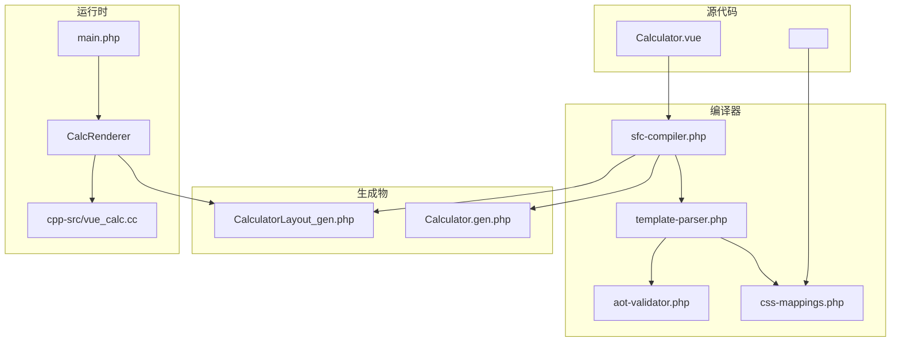
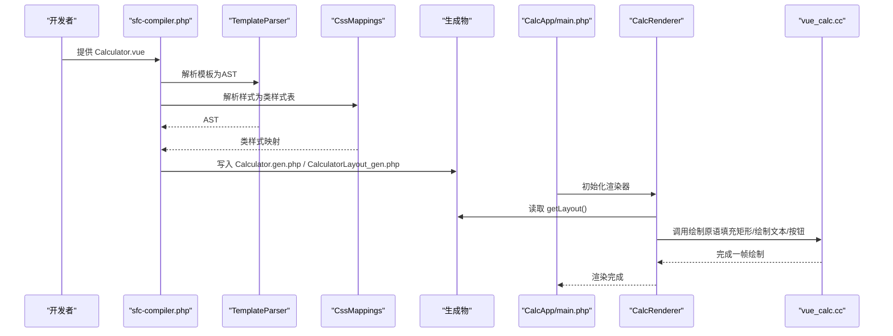
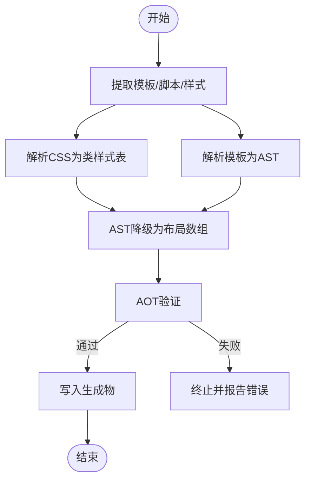
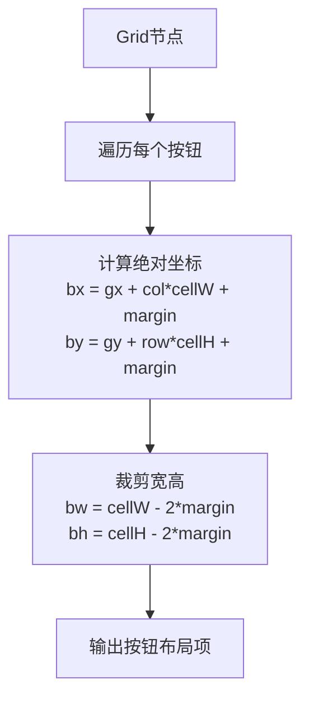
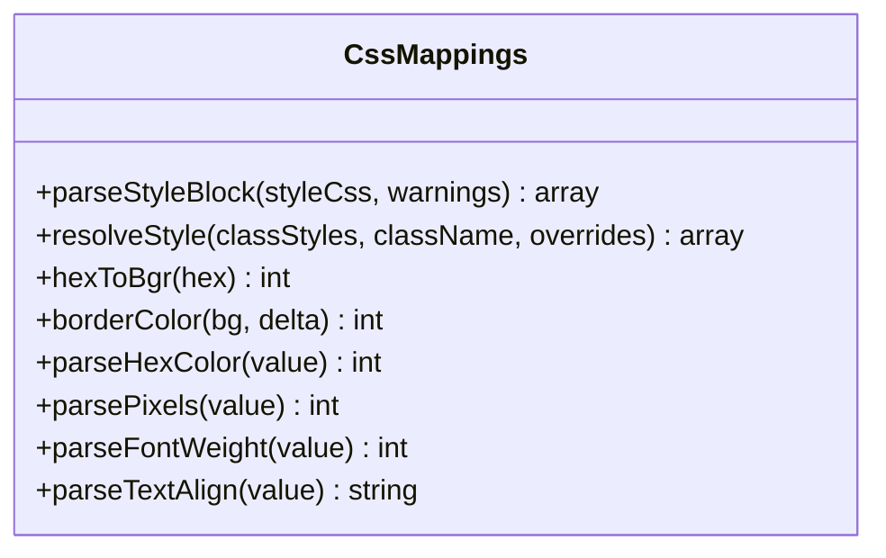
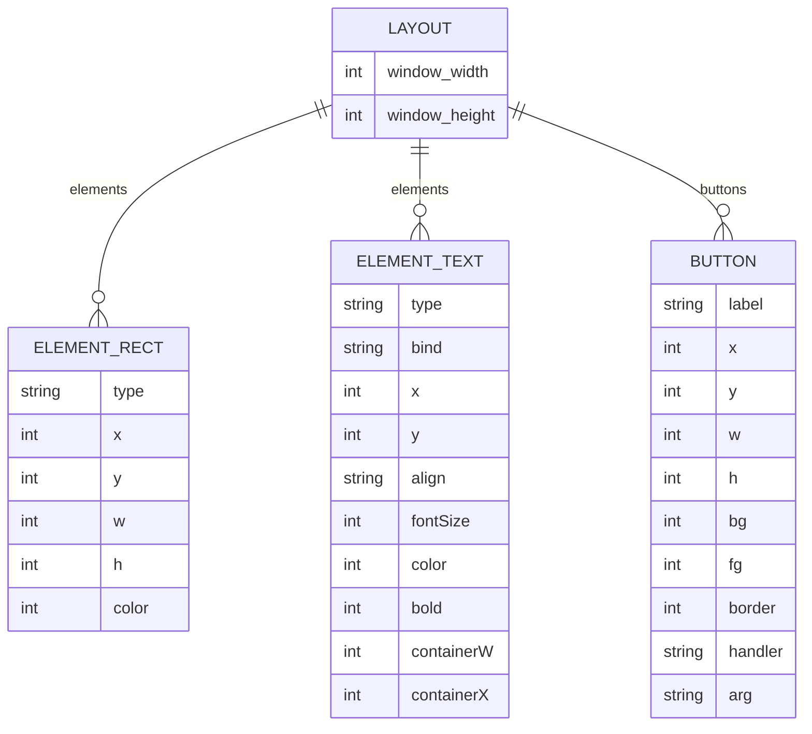
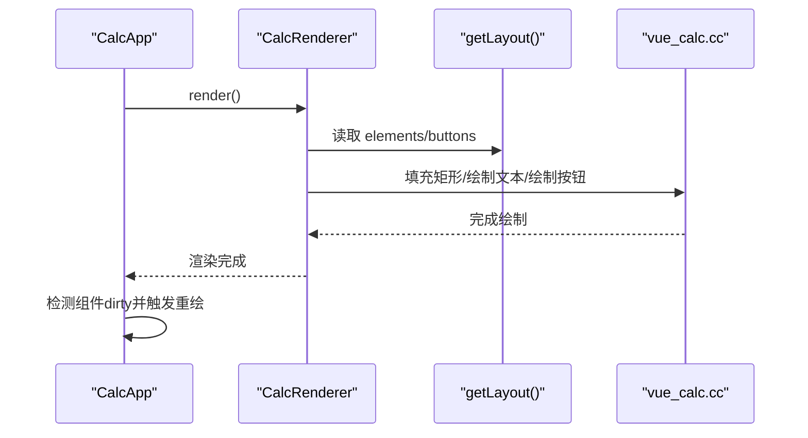
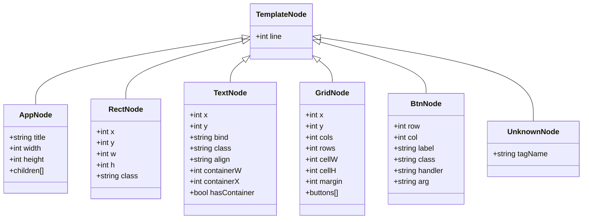
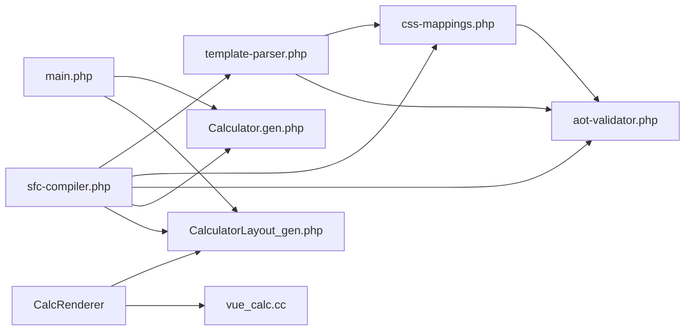

# 布局系统详解

<cite>
**本文引用的文件**
- [CalculatorLayout_gen.php](file://src/CalculatorLayout_gen.php)
- [Calculator.vue](file://src/Calculator.vue)
- [Calculator.gen.php](file://src/Calculator.gen.php)
- [sfc-compiler.php](file://tools/sfc-compiler.php)
- [template-parser.php](file://tools/compiler/template-parser.php)
- [css-mappings.php](file://tools/compiler/css-mappings.php)
- [ast-nodes.php](file://tools/compiler/ast-nodes.php)
- [aot-validator.php](file://tools/compiler/aot-validator.php)
- [verify-layout.php](file://tests/verify-layout.php)
- [vue_calc.cc](file://cpp-src/vue_calc.cc)
- [main.php](file://main.php)
- [ReactiveComponent.php](file://src/ReactiveComponent.php)
- [sfc-compiler-test.php](file://tests/sfc-compiler-test.php)
</cite>

## 目录
1. [简介](#简介)
2. [项目结构](#项目结构)
3. [核心组件](#核心组件)
4. [架构总览](#架构总览)
5. [详细组件分析](#详细组件分析)
6. [依赖关系分析](#依赖关系分析)
7. [性能考量](#性能考量)
8. [故障排查指南](#故障排查指南)
9. [结论](#结论)
10. [附录](#附录)

## 简介
本文件面向CalculatorLayout_gen.php布局系统，系统性解析从Vue模板到编译期布局数据的完整链路，涵盖：
- 布局数据的生成过程与编译器工作流
- 元素坐标计算、尺寸分配与样式映射
- 布局数据结构与存储格式
- 布局系统与渲染系统的协作关系
- 调试与优化方法

目标是帮助开发者理解并高效调整组件的视觉布局。

## 项目结构
该示例采用“单文件组件（SFC）+ 编译器 + AOT”的架构：
- 源模板与样式：Calculator.vue
- 编译器工具链：sfc-compiler.php + template-parser.php + css-mappings.php + aot-validator.php
- 生成物：Calculator.gen.php（组件类）、CalculatorLayout_gen.php（布局数据）
- 运行时：main.php（应用控制与渲染器）、cpp-src/vue_calc.cc（Win32 GDI绘制原语）

图表来源
- [sfc-compiler.php:1-210](file://tools/sfc-compiler.php#L1-L210)
- [template-parser.php:1-680](file://tools/compiler/template-parser.php#L1-L680)
- [css-mappings.php:1-210](file://tools/compiler/css-mappings.php#L1-L210)
- [aot-validator.php:1-169](file://tools/compiler/aot-validator.php#L1-L169)
- [main.php:1-291](file://main.php#L1-L291)
- [CalculatorLayout_gen.php:1-296](file://src/CalculatorLayout_gen.php#L1-L296)
- [Calculator.gen.php:1-174](file://src/Calculator.gen.php#L1-L174)
- [vue_calc.cc:1-157](file://cpp-src/vue_calc.cc#L1-L157)

章节来源
- [sfc-compiler.php:1-210](file://tools/sfc-compiler.php#L1-L210)
- [Calculator.vue:1-215](file://src/Calculator.vue#L1-L215)

## 核心组件
- 布局数据生成器：sfc-compiler.php负责从.vue提取模板/脚本/样式，经解析与降级生成布局数组，并写入CalculatorLayout_gen.php。
- 模板解析器：template-parser.php将模板解析为AST，再通过lowerToLayout进行编译期坐标计算与样式映射。
- 样式映射：css-mappings.php将CSS属性映射为渲染参数（颜色、字号、粗细等）。
- AOT验证器：aot-validator.php确保生成代码满足AOT编译约束。
- 运行时渲染器：main.php中的CalcRenderer读取布局数据，结合组件状态驱动C++绘制原语。

章节来源
- [sfc-compiler.php:1-210](file://tools/sfc-compiler.php#L1-L210)
- [template-parser.php:456-541](file://tools/compiler/template-parser.php#L456-L541)
- [css-mappings.php:1-210](file://tools/compiler/css-mappings.php#L1-L210)
- [aot-validator.php:1-169](file://tools/compiler/aot-validator.php#L1-L169)
- [main.php:26-133](file://main.php#L26-L133)

## 架构总览
下图展示从模板到渲染的关键流程与数据流。

图表来源
- [sfc-compiler.php:120-158](file://tools/sfc-compiler.php#L120-L158)
- [template-parser.php:464-541](file://tools/compiler/template-parser.php#L464-L541)
- [css-mappings.php:164-194](file://tools/compiler/css-mappings.php#L164-L194)
- [main.php:99-133](file://main.php#L99-L133)
- [CalculatorLayout_gen.php:10-296](file://src/CalculatorLayout_gen.php#L10-L296)
- [vue_calc.cc:90-157](file://cpp-src/vue_calc.cc#L90-L157)

## 详细组件分析

### 布局数据生成与编译器工作流
- 步骤概览
  - 提取模板/脚本/样式块
  - 解析样式为类样式表
  - 解析模板为AST
  - AST降级为布局数组（元素与按钮）
  - AOT验证通过后生成Calculator.gen.php与CalculatorLayout_gen.php
- 关键实现要点
  - 模板解析：递归下降解析，支持app/rect/text/grid/btn节点，未知标签记录为UnknownNode但不忽略。
  - 样式映射：支持background/color/font-size/font-weight等，输出统一键名（如bg/fg/fontSize/bold）。
  - 坐标计算：grid内部按钮在编译期按行列与单元尺寸计算绝对坐标，margin参与裁剪。
  - 输出：CalculatorLayout_gen.php导出常量WINDOW_WIDTH/WINDOW_HEIGHT与函数getLayout()返回布局数组。

图表来源
- [sfc-compiler.php:46-209](file://tools/sfc-compiler.php#L46-L209)
- [template-parser.php:464-541](file://tools/compiler/template-parser.php#L464-L541)
- [css-mappings.php:164-194](file://tools/compiler/css-mappings.php#L164-L194)
- [aot-validator.php:36-106](file://tools/compiler/aot-validator.php#L36-L106)

章节来源
- [sfc-compiler.php:46-209](file://tools/sfc-compiler.php#L46-L209)
- [template-parser.php:205-451](file://tools/compiler/template-parser.php#L205-L451)
- [css-mappings.php:164-194](file://tools/compiler/css-mappings.php#L164-L194)
- [aot-validator.php:36-106](file://tools/compiler/aot-validator.php#L36-L106)

### 元素坐标计算与尺寸分配
- 窗口尺寸：由app根节点的width/height决定，写入常量WINDOW_WIDTH/WINDOW_HEIGHT。
- rect元素：直接使用x/y/w/h与映射后的颜色。
- text元素：使用x/y与绑定字段；支持容器对齐（containerW/containerX），用于右对齐计算。
- grid按钮：编译期计算绝对坐标
  - bx = gx + col * cellW + margin
  - by = gy + row * cellH + margin
  - 宽高裁剪：bw = cellW - margin * 2；bh = cellH - margin * 2
- 未知节点：保留为占位，便于定位问题。

图表来源
- [template-parser.php:497-525](file://tools/compiler/template-parser.php#L497-L525)

章节来源
- [CalculatorLayout_gen.php:10-58](file://src/CalculatorLayout_gen.php#L10-L58)
- [template-parser.php:497-525](file://tools/compiler/template-parser.php#L497-L525)

### 样式映射与颜色处理
- 支持属性
  - background → bg（BGR整型）
  - color → fg（BGR整型）
  - font-size → fontSize（像素整数）
  - font-weight → bold（0/1）
  - text-align → textAlign（left/right/center）
  - border-radius/padding/margin（扩展支持）
- 颜色转换
  - hexToBgr支持#RGB与#RRGGBB，无效值回退为0
  - borderColor基于背景色通道加固定增量，自动防溢出
- 默认值
  - fontSize默认16，fg默认白色，bold默认0，textAlign默认left

图表来源
- [css-mappings.php:15-209](file://tools/compiler/css-mappings.php#L15-L209)

章节来源
- [css-mappings.php:27-69](file://tools/compiler/css-mappings.php#L27-L69)
- [css-mappings.php:79-107](file://tools/compiler/css-mappings.php#L79-L107)
- [css-mappings.php:116-151](file://tools/compiler/css-mappings.php#L116-L151)

### 布局数据结构与存储格式
- 布局数组结构
  - window_width/window_height：窗口尺寸
  - elements：元素数组
    - rect：type='rect'，包含x/y/w/h/color
    - text：type='text'，包含x/y/bind/align/fontSize/color/bold，以及可选containerW/containerX
  - buttons：按钮数组
    - label/x/y/w/h/bg/fg/border/handler/arg
- 生成方式
  - 通过sfc-compiler.php将AST与类样式表合并，输出到CalculatorLayout_gen.php
  - 使用函数getLayout()返回布局数组，避免const嵌套数组导致AOT不兼容

图表来源
- [CalculatorLayout_gen.php:10-296](file://src/CalculatorLayout_gen.php#L10-L296)
- [sfc-compiler.php:133-158](file://tools/sfc-compiler.php#L133-L158)

章节来源
- [CalculatorLayout_gen.php:10-296](file://src/CalculatorLayout_gen.php#L10-L296)
- [sfc-compiler.php:133-158](file://tools/sfc-compiler.php#L133-L158)

### 布局系统与渲染系统的协作
- 数据驱动渲染
  - CalcRenderer::render读取布局数组，遍历elements与buttons
  - 文本元素：根据绑定字段从组件状态取值，动态调整字号，右对齐时依据容器宽度计算x
  - 按钮：先绘制背景与边框，再在中心绘制标签文本
- 事件分发
  - CalcApp::handleClick基于布局按钮坐标进行命中测试，调用对应组件方法
- C++绘制原语
  - 填充矩形、绘制文本、绘制按钮（背景+边框）均通过C++封装的GDI函数实现

图表来源
- [main.php:99-133](file://main.php#L99-L133)
- [CalculatorLayout_gen.php:10-296](file://src/CalculatorLayout_gen.php#L10-L296)
- [vue_calc.cc:120-157](file://cpp-src/vue_calc.cc#L120-L157)

章节来源
- [main.php:26-133](file://main.php#L26-L133)
- [vue_calc.cc:90-157](file://cpp-src/vue_calc.cc#L90-L157)

### 模板解析与AST节点
- AST节点类型
  - AppNode：根节点，携带title/width/height/children
  - RectNode：rect元素，携带x/y/w/h/class
  - TextNode：text元素，携带x/y/bind/class/align及容器参数
  - GridNode：grid容器，携带x/y/cols/rows/cellW/cellH/margin/buttons
  - BtnNode：按钮，携带row/col/label/class/handler/arg
  - UnknownNode：未知标签，保留以便错误报告
- 解析规则
  - app必须为根节点，缺少或错误会报错
  - grid必须包含btn子节点，其他标签不允许
  - 缺少必要属性（如class、:bind、@click）会报错

图表来源
- [ast-nodes.php:9-153](file://tools/compiler/ast-nodes.php#L9-L153)
- [template-parser.php:205-451](file://tools/compiler/template-parser.php#L205-L451)

章节来源
- [ast-nodes.php:9-153](file://tools/compiler/ast-nodes.php#L9-L153)
- [template-parser.php:205-451](file://tools/compiler/template-parser.php#L205-L451)

## 依赖关系分析
- 编译期依赖
  - sfc-compiler.php依赖template-parser.php与css-mappings.php，最终输出Calculator.gen.php与CalculatorLayout_gen.php
  - aot-validator.php在写盘前检查生成代码的AOT兼容性
- 运行时依赖
  - main.php依赖Calculator.gen.php（组件类）与CalculatorLayout_gen.php（布局数据）
  - CalcRenderer依赖布局数据与C++绘制原语
- 关键耦合点
  - 布局数据格式稳定（elements/buttons），渲染器按此格式读取
  - 样式映射统一键名，保证模板与样式的一致性

图表来源
- [sfc-compiler.php:19-24](file://tools/sfc-compiler.php#L19-L24)
- [template-parser.php:16-16](file://tools/compiler/template-parser.php#L16-L16)
- [css-mappings.php:1-13](file://tools/compiler/css-mappings.php#L1-L13)
- [aot-validator.php:1-15](file://tools/compiler/aot-validator.php#L1-L15)
- [main.php:26-133](file://main.php#L26-L133)

章节来源
- [sfc-compiler.php:19-24](file://tools/sfc-compiler.php#L19-L24)
- [main.php:26-133](file://main.php#L26-L133)

## 性能考量
- 编译期优化
  - 坐标与样式在编译期确定，运行时只需读取布局数组，减少计算开销
  - 使用函数getLayout()而非const数组，避免AOT不支持的全局常量嵌套结构
- 运行时优化
  - CalcRenderer按需重绘：仅当组件dirty为true时触发渲染
  - 文本渲染动态缩放：长数字自动缩小字号，提升可读性
  - 右对齐文本：基于容器宽度计算，避免溢出
- 渲染原语
  - C++侧采用双缓冲绘制，减少闪烁

章节来源
- [sfc-compiler.php:120-158](file://tools/sfc-compiler.php#L120-L158)
- [main.php:99-133](file://main.php#L99-L133)
- [vue_calc.cc:90-157](file://cpp-src/vue_calc.cc#L90-L157)

## 故障排查指南
- 常见问题与定位
  - 模板解析错误：检查app根节点、grid子节点、缺失属性（class/:bind/@click）
  - 样式映射警告：CSS类未设置background或color，可能导致透明渲染
  - AOT验证失败：多点文件名、const嵌套数组、变量属性/方法访问、PHP8函数
- 快速验证
  - 使用tests/verify-layout.php快速核对布局数量与关键字段
  - 使用tests/sfc-compiler-test.php运行端到端测试
- 调试建议
  - 启用--dump-ast查看AST结构
  - 在main.php中打印布局数组，确认坐标与样式映射
  - 逐步注释元素，定位渲染异常的组件

章节来源
- [template-parser.php:87-117](file://tools/compiler/template-parser.php#L87-L117)
- [css-mappings.php:185-188](file://tools/compiler/css-mappings.php#L185-L188)
- [aot-validator.php:36-106](file://tools/compiler/aot-validator.php#L36-L106)
- [verify-layout.php:1-72](file://tests/verify-layout.php#L1-L72)
- [sfc-compiler-test.php:146-197](file://tests/sfc-compiler-test.php#L146-L197)

## 结论
CalculatorLayout_gen.php布局系统通过编译期的模板解析、样式映射与坐标计算，将Vue模板转换为稳定的布局数组，配合运行时的数据驱动渲染与C++绘制原语，实现了高性能、可维护的桌面应用界面。其设计强调：
- 明确的编译流程与严格的AOT兼容性
- 统一的样式映射与坐标计算
- 清晰的布局数据结构与事件分发
- 易于调试与优化的验证与测试体系

## 附录
- 关键流程回顾
  - 模板解析：template-parser.php
  - 样式映射：css-mappings.php
  - 布局生成：sfc-compiler.php
  - 运行时渲染：main.php + vue_calc.cc
- 相关测试
  - verify-layout.php：布局一致性校验
  - sfc-compiler-test.php：端到端集成测试