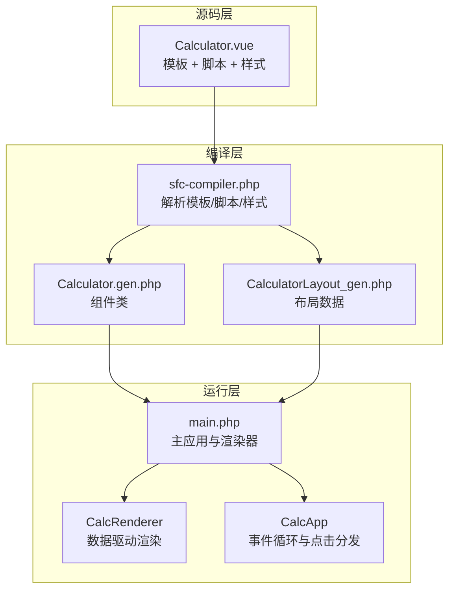
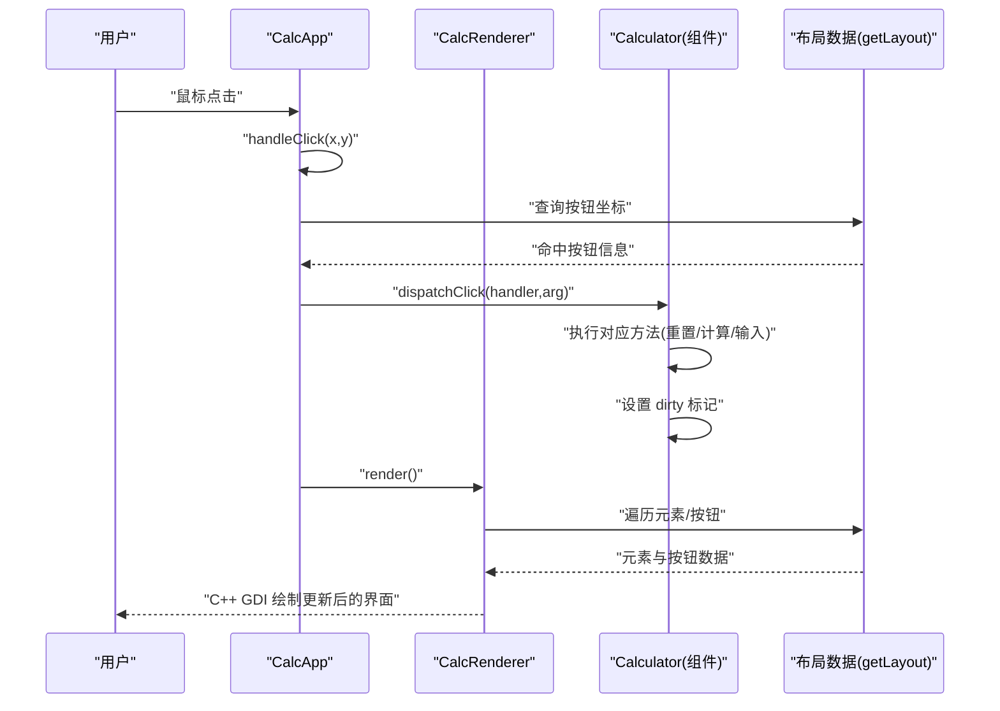
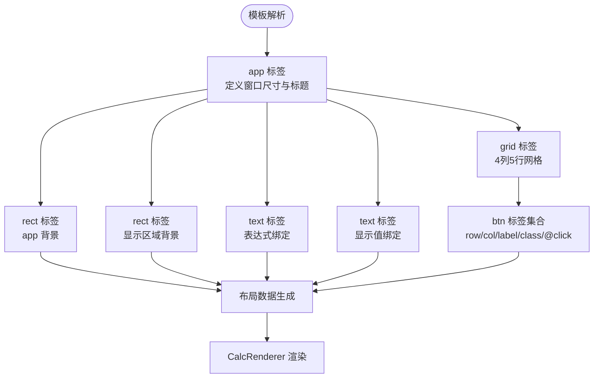
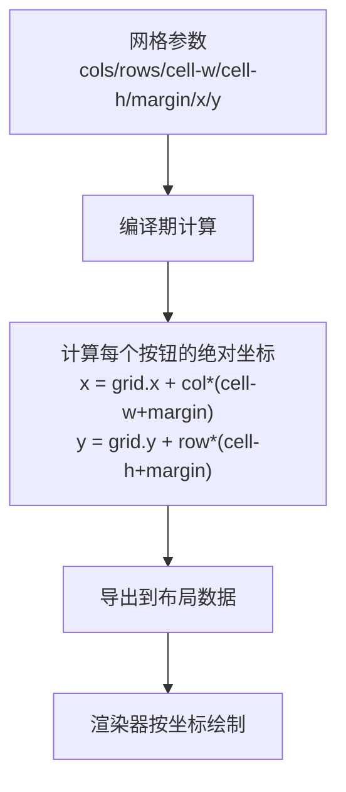
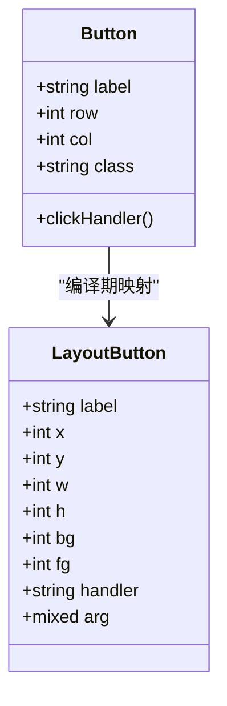
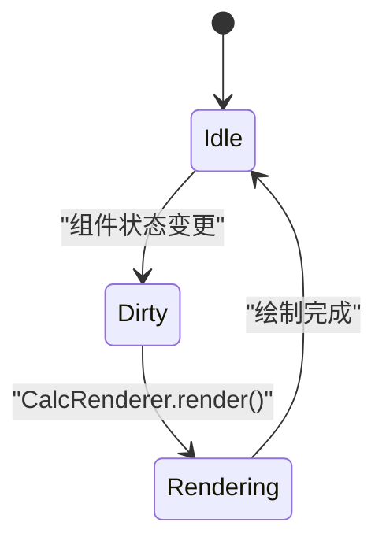
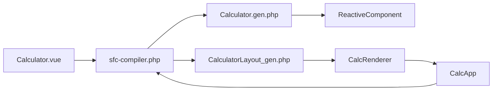

# 模板结构分析

<cite>
**本文引用的文件**
- [Calculator.vue](file://src/Calculator.vue)
- [Calculator.gen.php](file://src/Calculator.gen.php)
- [CalculatorLayout_gen.php](file://src/CalculatorLayout_gen.php)
- [ReactiveComponent.php](file://src/ReactiveComponent.php)
- [main.php](file://main.php)
- [sfc-compiler.php](file://tools/sfc-compiler.php)
</cite>

## 目录
1. [简介](#简介)
2. [项目结构](#项目结构)
3. [核心组件](#核心组件)
4. [架构总览](#架构总览)
5. [详细组件分析](#详细组件分析)
6. [依赖关系分析](#依赖关系分析)
7. [性能考虑](#性能考虑)
8. [故障排除指南](#故障排除指南)
9. [结论](#结论)

## 简介
本文件针对 Calculator.vue 的模板结构进行深入分析，重点解析其数据驱动的 UI 设计理念与布局机制。该组件采用自定义模板标签（如 app、rect、text、grid、btn），通过 SFC 编译器将模板转换为布局数据与 PHP 组件类，最终由 C++ GDI 进行绘制渲染。本文将从模板元素作用、网格系统布局机制、按钮属性配置等方面进行系统性说明，并提供可视化图表帮助开发者理解整体架构与数据流。

## 项目结构
该项目采用“单文件组件 + 编译器 + AOT”的三层架构：
- 源码层：.vue 单文件组件，包含模板、脚本与样式
- 编译层：SFC 编译器将 .vue 编译为 .gen.php（组件类 + 布局数据）
- 运行层：主程序负责窗口管理、事件分发与渲染，C++ GDI 负责绘制

**图表来源**
- [Calculator.vue:1-41](file://src/Calculator.vue#L1-L41)
- [sfc-compiler.php:1-210](file://tools/sfc-compiler.php#L1-L210)
- [Calculator.gen.php:1-174](file://src/Calculator.gen.php#L1-L174)
- [CalculatorLayout_gen.php:1-296](file://src/CalculatorLayout_gen.php#L1-L296)
- [main.php:1-291](file://main.php#L1-L291)

**章节来源**
- [Calculator.vue:1-41](file://src/Calculator.vue#L1-L41)
- [sfc-compiler.php:1-210](file://tools/sfc-compiler.php#L1-L210)
- [main.php:1-291](file://main.php#L1-L291)

## 核心组件
本节聚焦模板中的 DOM 结构与布局元素，逐项说明其作用与设计意图。

- app 容器
  - 作用：定义应用窗口尺寸与标题，作为根容器承载所有子元素
  - 关键属性：title、width、height
  - 设计意义：统一窗口边界，便于后续布局系统定位子元素

- rect 背景元素
  - app 背景矩形：覆盖整个窗口，提供深色主题背景
  - 显示区域背景矩形：位于窗口内部偏移位置，形成显示区域的容器背景
  - 关键属性：x、y、w、h、class
  - 设计意义：通过分层背景营造视觉层次，突出显示区域

- text 文本元素
  - 表达式文本：左对齐，用于显示当前运算表达式（小号字体，浅灰）
  - 显示值文本：右对齐，用于显示当前结果（大号字体，白色粗体）
  - 关键属性：x、y、:bind、align、container-w、container-x
  - 设计意义：数据驱动绑定，动态更新；右对齐配合容器宽度计算实现精准对齐

- grid 按钮网格
  - 作用：组织计算器按钮的二维布局，定义行列数量、单元格尺寸与间距
  - 关键属性：x、y、cols、rows、cell-w、cell-h、margin
  - 设计意义：通过统一的网格系统确保按钮排列整齐、间距一致

- btn 按钮元素
  - 作用：在网格中放置具体按钮，绑定点击事件与显示标签
  - 关键属性：row、col、label、class、@click
  - 设计意义：基于网格坐标定位，结合 class 控制外观，事件处理器驱动逻辑

**章节来源**
- [Calculator.vue:1-41](file://src/Calculator.vue#L1-L41)

## 架构总览
下图展示了从模板到渲染的数据流与组件交互关系，体现“数据驱动 UI”的核心思想。

**图表来源**
- [main.php:171-258](file://main.php#L171-L258)
- [CalculatorLayout_gen.php:10-296](file://src/CalculatorLayout_gen.php#L10-L296)
- [Calculator.gen.php:170-174](file://src/Calculator.gen.php#L170-L174)

**章节来源**
- [main.php:171-258](file://main.php#L171-L258)
- [CalculatorLayout_gen.php:10-296](file://src/CalculatorLayout_gen.php#L10-L296)
- [Calculator.gen.php:170-174](file://src/Calculator.gen.php#L170-L174)

## 详细组件分析

### 模板元素详解
- app 标签
  - 定义窗口标题与尺寸，作为所有子元素的根容器
  - 与布局数据中的窗口宽高常量保持一致
- rect 标签
  - app 背景：覆盖全屏，提供深色主题
  - 显示区域背景：内部偏移，形成显示区域的容器背景
- text 标签
  - 表达式文本：绑定 expression，左对齐，小字号
  - 显示值文本：绑定 display，右对齐，大字号，容器宽度与起始 X 坐标用于精确对齐
- grid 标签
  - 定义 4 列 5 行网格，单元格尺寸 80×60，间距 2
  - 通过 row/col 精确定位每个按钮
- btn 标签
  - 每个按钮绑定 label 与 class，点击事件通过 @click 指向组件方法
  - 按钮颜色与样式由 class 映射到布局数据中的颜色值

**图表来源**
- [Calculator.vue:1-41](file://src/Calculator.vue#L1-L41)
- [CalculatorLayout_gen.php:10-296](file://src/CalculatorLayout_gen.php#L10-L296)

**章节来源**
- [Calculator.vue:1-41](file://src/Calculator.vue#L1-L41)
- [CalculatorLayout_gen.php:10-296](file://src/CalculatorLayout_gen.php#L10-L296)

### 网格系统布局机制
网格系统通过以下参数控制布局：
- cols/rows：网格行列数，决定按钮总数与排列方式
- cell-w/cell-h：单元格宽高，决定按钮尺寸
- margin：单元格间距，保证按钮之间留白
- x/y：网格起始坐标，决定网格在窗口中的位置
- row/col：按钮在网格中的行列索引，用于计算按钮的绝对坐标

**图表来源**
- [Calculator.vue:16-39](file://src/Calculator.vue#L16-L39)
- [CalculatorLayout_gen.php:112-127](file://src/CalculatorLayout_gen.php#L112-L127)

**章节来源**
- [Calculator.vue:16-39](file://src/Calculator.vue#L16-L39)
- [CalculatorLayout_gen.php:112-127](file://src/CalculatorLayout_gen.php#L112-L127)

### 按钮属性配置与行为
- label：按钮显示文本，用于渲染与事件分发
- class：CSS 类名，映射到颜色与样式
- @click：事件处理器，指向组件方法或带参数的方法
- row/col：网格坐标，用于定位按钮
- handler/arg：布局数据中的事件路由，用于运行时分发到组件方法

**图表来源**
- [Calculator.vue:17-39](file://src/Calculator.vue#L17-L39)
- [CalculatorLayout_gen.php:59-294](file://src/CalculatorLayout_gen.php#L59-L294)

**章节来源**
- [Calculator.vue:17-39](file://src/Calculator.vue#L17-L39)
- [CalculatorLayout_gen.php:59-294](file://src/CalculatorLayout_gen.php#L59-L294)

### 数据驱动的 UI 设计理念
- 组件状态驱动 UI：组件属性（如 display、expression）变化后设置 dirty 标记，触发重新渲染
- 布局数据驱动绘制：渲染器读取布局数组，按元素类型与属性绘制
- 事件驱动状态变更：用户点击按钮，运行时分发到组件方法，改变状态并触发重绘

**图表来源**
- [ReactiveComponent.php:19-20](file://src/ReactiveComponent.php#L19-L20)
- [main.php:213-221](file://main.php#L213-L221)

**章节来源**
- [ReactiveComponent.php:19-20](file://src/ReactiveComponent.php#L19-L20)
- [main.php:213-221](file://main.php#L213-L221)

## 依赖关系分析
- 模板依赖编译器：SFC 编译器将 .vue 转换为 .gen.php 与布局数据
- 组件依赖基类：Calculator 继承 ReactiveComponent，使用脏标记机制
- 渲染依赖布局：CalcRenderer 依赖 getLayout() 返回的布局数组
- 事件依赖路由：点击事件通过布局数据中的 handler/arg 路由到组件方法

**图表来源**
- [sfc-compiler.php:133-181](file://tools/sfc-compiler.php#L133-L181)
- [Calculator.gen.php:9-10](file://src/Calculator.gen.php#L9-L10)
- [ReactiveComponent.php:11-11](file://src/ReactiveComponent.php#L11-L11)
- [CalculatorLayout_gen.php:10-15](file://src/CalculatorLayout_gen.php#L10-L15)
- [main.php:26-133](file://main.php#L26-L133)

**章节来源**
- [sfc-compiler.php:133-181](file://tools/sfc-compiler.php#L133-L181)
- [Calculator.gen.php:9-10](file://src/Calculator.gen.php#L9-L10)
- [ReactiveComponent.php:11-11](file://src/ReactiveComponent.php#L11-L11)
- [CalculatorLayout_gen.php:10-15](file://src/CalculatorLayout_gen.php#L10-L15)
- [main.php:26-133](file://main.php#L26-L133)

## 性能考虑
- 布局数据预计算：编译期完成坐标与样式计算，运行时只需读取数组，减少 CPU 开销
- 脏标记机制：仅在状态变更时重绘，避免不必要的绘制
- 字体动态调整：长数字时自动缩小字号，提升可读性同时减少重排
- 事件命中测试：基于矩形范围快速判断点击目标，降低事件处理复杂度

[本节提供一般性指导，无需特定文件分析]

## 故障排除指南
- 点击无响应
  - 检查按钮是否正确映射到布局数据中的 handler/arg
  - 确认组件方法存在且签名匹配
- 文本未更新
  - 确保绑定的属性（如 display、expression）已设置 dirty 标记
  - 检查渲染器是否正确读取绑定值
- 布局错位
  - 核对网格参数（cols/rows/cell-w/cell-h/margin）与按钮 row/col
  - 确认窗口尺寸与布局常量一致

**章节来源**
- [main.php:229-258](file://main.php#L229-L258)
- [Calculator.gen.php:30-39](file://src/Calculator.gen.php#L30-L39)
- [CalculatorLayout_gen.php:10-15](file://src/CalculatorLayout_gen.php#L10-L15)

## 结论
Calculator.vue 的模板结构体现了“数据驱动 UI”的设计哲学：以简洁的自定义标签描述布局与交互，通过编译器生成布局数据与组件类，再由渲染器将状态转化为可视化的界面。网格系统提供了清晰的布局机制，按钮属性配置实现了灵活的交互绑定。该架构在保证 AOT 兼容性的同时，兼顾了可维护性与可扩展性，为桌面应用的 UI 开发提供了新的思路。