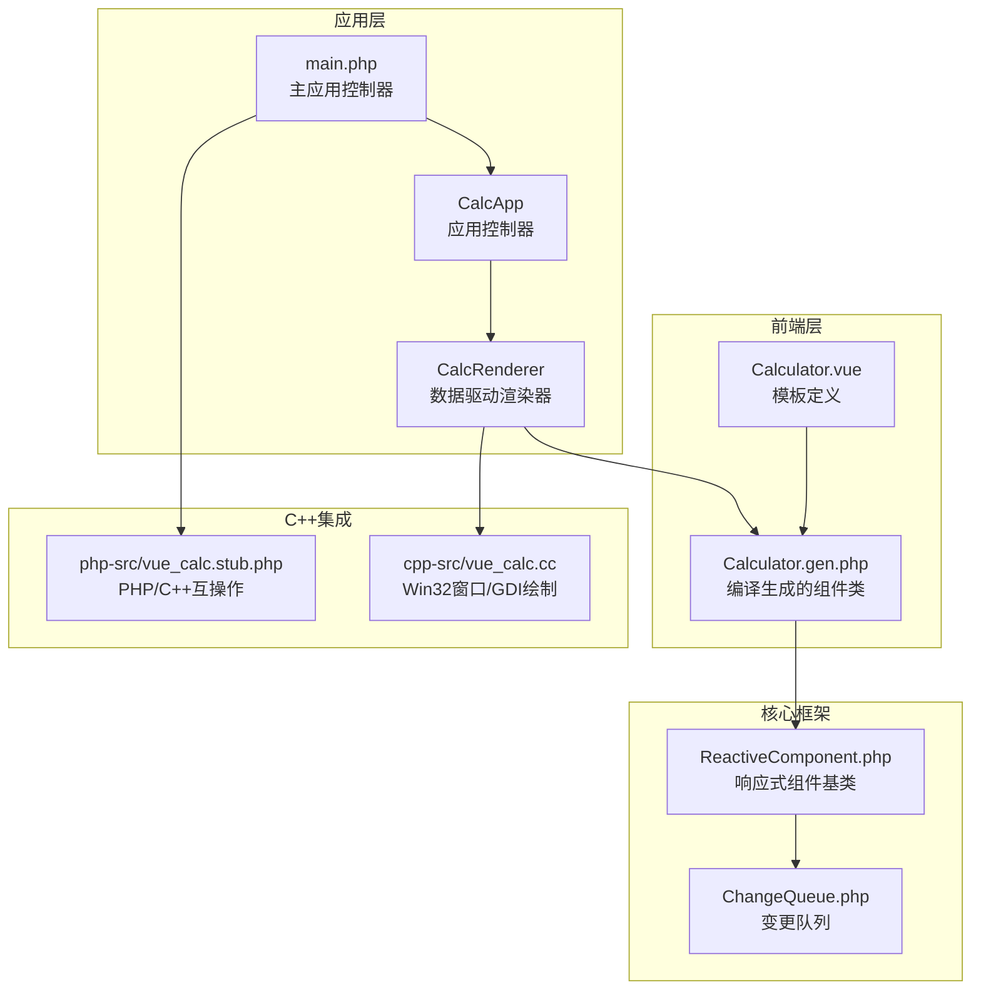
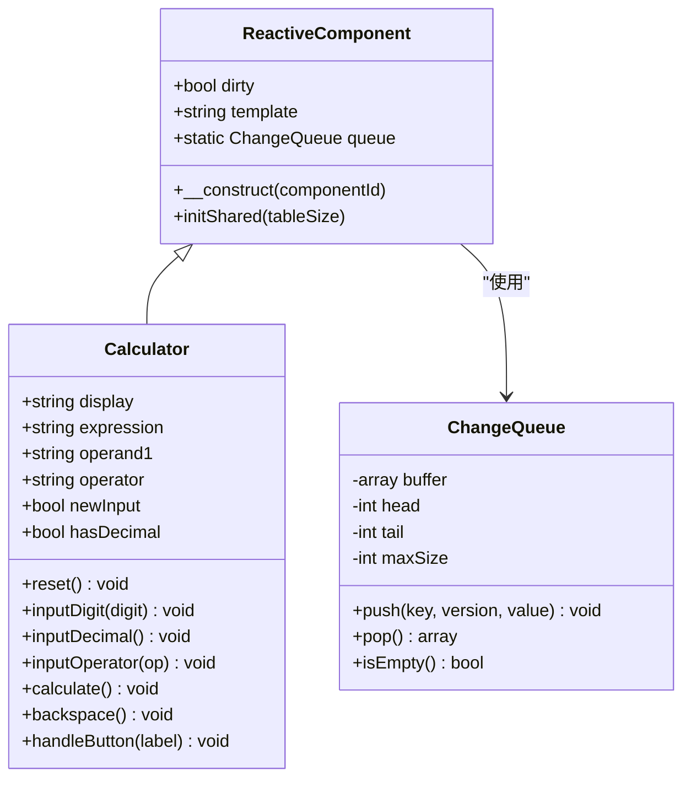
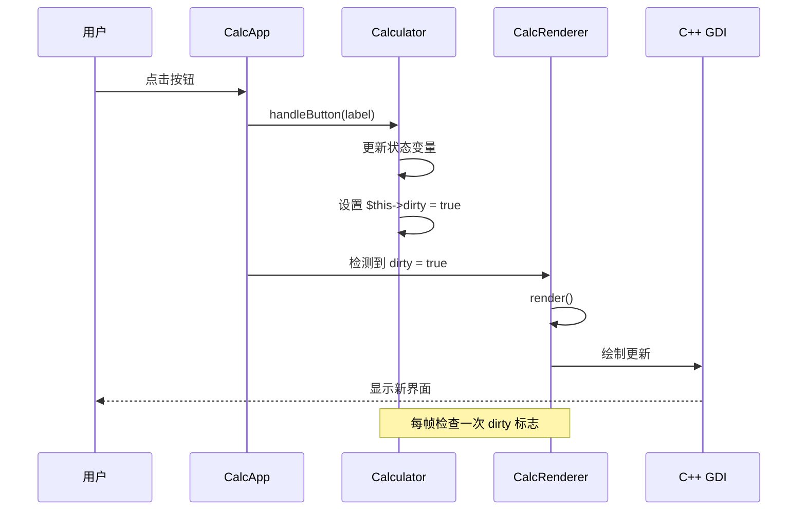
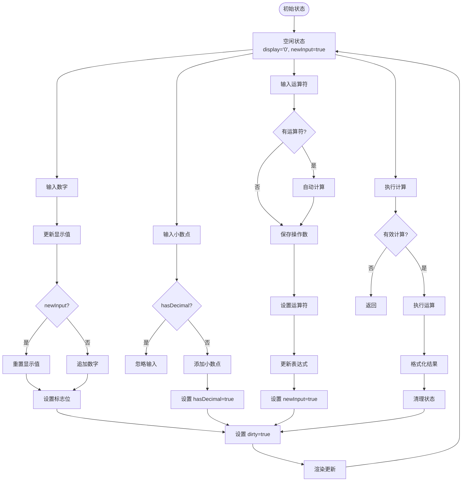
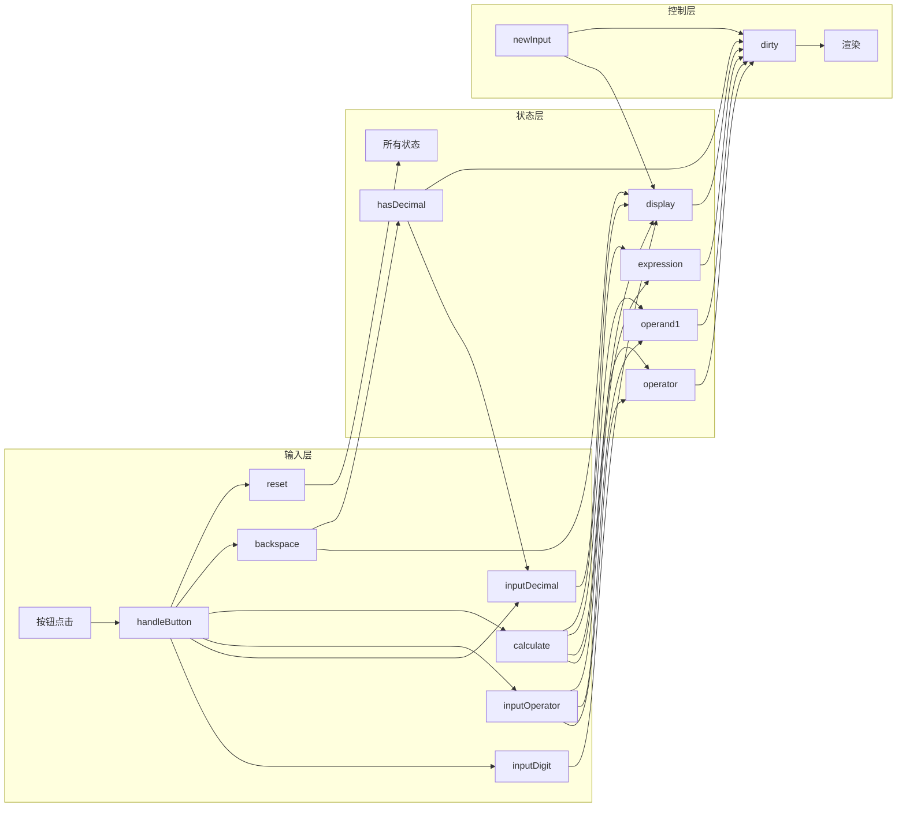
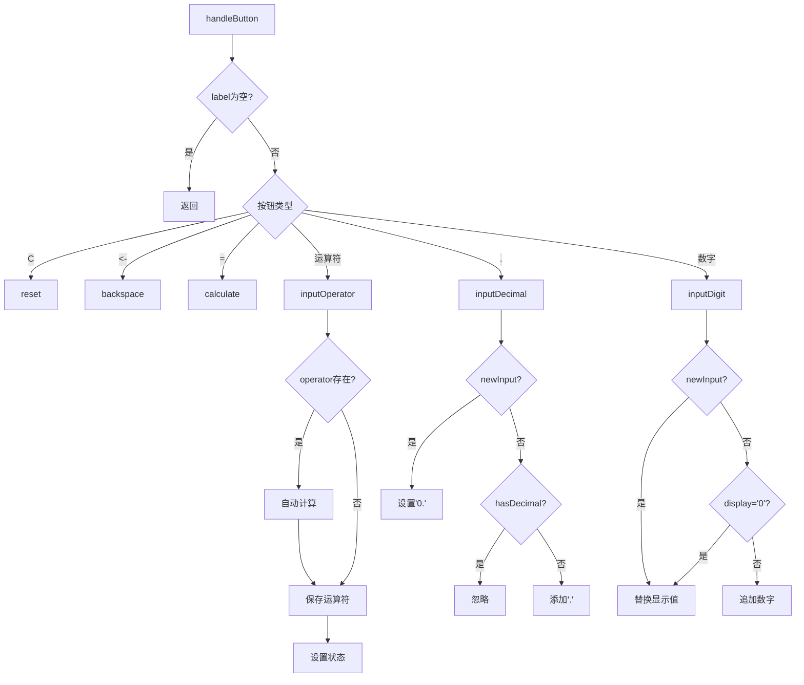
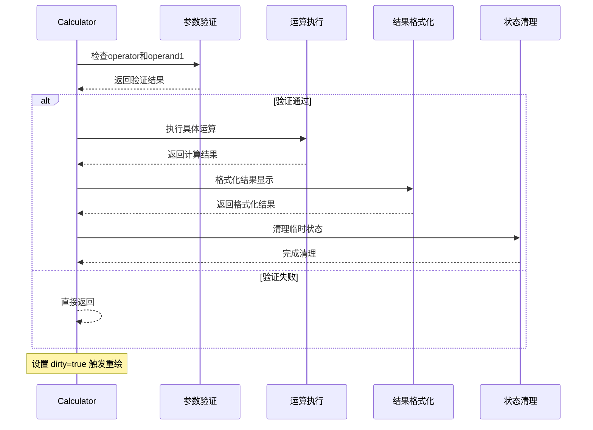
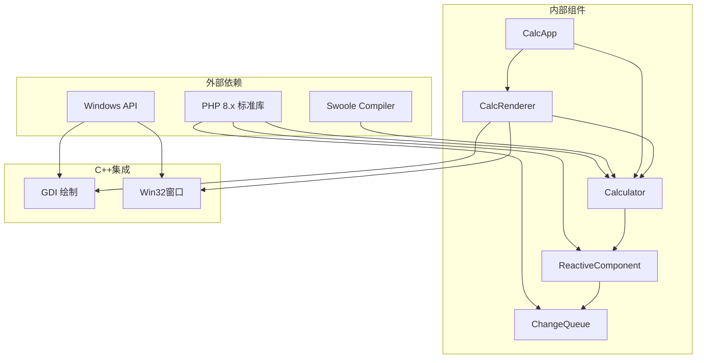
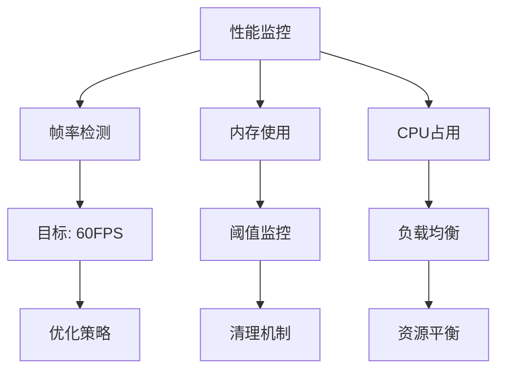

# 状态管理机制

<cite>
**本文档引用的文件**
- [Calculator.vue](file://src/Calculator.vue)
- [Calculator.gen.php](file://src/Calculator.gen.php)
- [ReactiveComponent.php](file://src/ReactiveComponent.php)
- [ChangeQueue.php](file://src/ChangeQueue.php)
- [main.php](file://main.php)
- [开发经验与教训.md](file://开发经验与教训.md)
</cite>

## 目录
1. [简介](#简介)
2. [项目结构](#项目结构)
3. [核心组件](#核心组件)
4. [架构概览](#架构概览)
5. [详细组件分析](#详细组件分析)
6. [依赖关系分析](#依赖关系分析)
7. [性能考虑](#性能考虑)
8. [故障排除指南](#故障排除指南)
9. [结论](#结论)

## 简介

VueCalc是一个基于SFC（Single File Component）编译器的类Vue响应式数据驱动桌面计算器。该项目展示了如何在AOT（Ahead-of-Time）编译环境中实现状态管理机制，特别是Calculator组件的状态变量设计和响应式更新系统。

该计算器实现了完整的四则运算功能，具有6个核心状态变量：`display`（当前显示值）、`expression`（表达式）、`operand1`（第一个操作数）、`operator`（当前运算符）、`newInput`（新输入标志）、`hasDecimal`（小数点标志）。这些状态变量通过手动脏标记机制实现响应式更新，确保在AOT编译环境下稳定运行。

## 项目结构

VueCalc项目采用分层架构设计，主要包含以下核心模块：



**图表来源**
- [Calculator.vue:1-215](file://src/Calculator.vue#L1-L215)
- [Calculator.gen.php:1-174](file://src/Calculator.gen.php#L1-L174)
- [ReactiveComponent.php:1-35](file://src/ReactiveComponent.php#L1-L35)
- [ChangeQueue.php:1-57](file://src/ChangeQueue.php#L1-L57)
- [main.php:1-291](file://main.php#L1-L291)

**章节来源**
- [Calculator.vue:1-215](file://src/Calculator.vue#L1-L215)
- [Calculator.gen.php:1-174](file://src/Calculator.gen.php#L1-L174)
- [main.php:1-291](file://main.php#L1-L291)

## 核心组件

### 状态变量设计

Calculator组件包含6个核心状态变量，每个都有明确的职责和生命周期：

| 状态变量 | 类型 | 默认值 | 描述 | 触发条件 |
|---------|------|--------|------|----------|
| `display` | string | '0' | 当前显示值，实时反映用户输入和计算结果 | 所有输入操作、计算完成后 |
| `expression` | string | '' | 表达式文本，显示在右上角 | 输入运算符、计算完成后 |
| `operand1` | string | '' | 第一个操作数，保存运算前的数值 | 输入运算符时 |
| `operator` | string | '' | 当前运算符，支持'+','-','*','/' | 输入运算符时 |
| `newInput` | bool | true | 新输入标志，控制输入行为模式 | 重置、运算符输入、计算完成后 |
| `hasDecimal` | bool | false | 小数点标志，控制小数点输入 | 输入小数点、退格时 |

### 状态管理架构



**图表来源**
- [ReactiveComponent.php:11-34](file://src/ReactiveComponent.php#L11-L34)
- [Calculator.gen.php:9-174](file://src/Calculator.gen.php#L9-L174)
- [ChangeQueue.php:11-57](file://src/ChangeQueue.php#L11-L57)

**章节来源**
- [ReactiveComponent.php:11-34](file://src/ReactiveComponent.php#L11-L34)
- [Calculator.gen.php:9-28](file://src/Calculator.gen.php#L9-L28)

## 架构概览

### 响应式更新机制

VueCalc采用手动脏标记（dirty flag）机制实现响应式更新，这是为适应AOT编译环境而设计的关键创新：



**图表来源**
- [main.php:213-221](file://main.php#L213-L221)
- [Calculator.gen.php:55](file://src/Calculator.gen.php#L55)
- [Calculator.gen.php:127](file://src/Calculator.gen.php#L127)

### 状态流转图



**图表来源**
- [Calculator.gen.php:72-128](file://src/Calculator.gen.php#L72-L128)
- [Calculator.gen.php:130-147](file://src/Calculator.gen.php#L130-L147)

## 详细组件分析

### 状态变量依赖关系

#### 核心依赖链



**图表来源**
- [Calculator.gen.php:184-202](file://src/Calculator.gen.php#L184-L202)
- [Calculator.gen.php:29-39](file://src/Calculator.gen.php#L29-L39)

#### 状态变更规则

1. **operator为空时的特殊处理**
   - 当`operator`为空时，输入运算符会立即保存当前显示值到`operand1`
   - 表达式区域显示"operand1 operator"格式
   - `newInput`标志设置为true，准备接收下一个操作数

2. **newInput标志对输入行为的影响**
   - `newInput=true`时：新输入会完全替换当前显示值
   - `newInput=false`时：新输入会追加到现有显示值末尾
   - 运算符输入、计算完成都会重置`newInput=true`

3. **hasDecimal对小数点输入的控制**
   - `hasDecimal=true`时：同一数字输入中不允许重复小数点
   - `hasDecimal=false`时：可以正常输入小数点
   - 退格操作会根据最后字符自动调整`hasDecimal`状态

**章节来源**
- [Calculator.gen.php:72-83](file://src/Calculator.gen.php#L72-L83)
- [Calculator.gen.php:130-147](file://src/Calculator.gen.php#L130-L147)

### 关键方法分析

#### 输入处理方法



**图表来源**
- [Calculator.gen.php:184-202](file://src/Calculator.gen.php#L184-L202)
- [Calculator.gen.php:72-83](file://src/Calculator.gen.php#L72-L83)

**章节来源**
- [Calculator.gen.php:184-202](file://src/Calculator.gen.php#L184-L202)
- [Calculator.gen.php:72-128](file://src/Calculator.gen.php#L72-L128)

### 计算逻辑实现

#### 运算执行流程



**图表来源**
- [Calculator.gen.php:119-162](file://src/Calculator.gen.php#L119-L162)

**章节来源**
- [Calculator.gen.php:119-162](file://src/Calculator.gen.php#L119-L162)

## 依赖关系分析

### 组件间耦合度



**图表来源**
- [main.php:139-259](file://main.php#L139-L259)
- [ReactiveComponent.php:11-34](file://src/ReactiveComponent.php#L11-L34)

### 状态传播机制

状态变更通过以下机制传播：

1. **直接赋值**：方法内部直接修改状态变量
2. **脏标记**：每次状态修改后设置`$this->dirty = true`
3. **事件循环检测**：主循环每帧检查`dirty`标志
4. **渲染触发**：检测到`dirty=true`时调用渲染器

**章节来源**
- [main.php:213-221](file://main.php#L213-L221)
- [Calculator.gen.php:55](file://src/Calculator.gen.php#L55)

## 性能考虑

### 架构优化策略

1. **批量更新模式**
   - 消息处理完成后统一检查`dirty`标志
   - 避免每条消息后都进行昂贵的渲染操作
   - 实现约60FPS的渲染频率

2. **增量渲染预留**
   - 保留`ChangeQueue`和`ReactiveValue`为未来增量渲染做准备
   - 支持按节点级别标记脏状态

3. **内存管理**
   - 使用环形缓冲区实现的变更队列
   - 固定大小的缓冲区避免内存泄漏

### 性能监控建议



## 故障排除指南

### 常见问题诊断

#### AOT编译相关问题

| 问题类型 | 症状 | 根因 | 解决方案 |
|---------|------|------|---------|
| `__get/__set`失效 | `Cannot append element to an null` | 魔术方法在AOT中不被调用 | 改为显式属性声明 + 手动脏标记 |
| `any()`函数不存在 | `Call to undefined function any()` | AOT运行时不包含此函数 | 移除`any()`调用，直接存储值 |
| 静态属性未初始化 | 类型化静态属性"未初始化" | PHP 8类型系统限制 | 为静态属性提供默认值 |
| `str_contains()`不存在 | 函数未找到 | PHP 8新函数 | 替换为`strpos()`兼容函数 |

#### 状态管理问题

| 问题 | 症状 | 诊断步骤 | 解决方案 |
|------|------|---------|---------|
| 状态不同步 | 显示值与表达式不一致 | 检查operator和operand1同步 | 确保运算符输入时正确保存operand1 |
| 小数点异常 | 重复小数点或无法输入 | 检查hasDecimal标志 | 修复小数点输入逻辑 |
| 计算错误 | 除零或结果格式异常 | 检查calculate方法 | 添加边界条件检查 |

**章节来源**
- [开发经验与教训.md:129-160](file://开发经验与教训.md#L129-L160)
- [开发经验与教训.md:293-308](file://开发经验与教训.md#L293-L308)

### 调试方法

1. **启用控制台输出**
   ```php
   // 在关键位置添加调试信息
   echo "Debug: display='$this->display', operator='$this->operator'\n";
   ```

2. **使用try-catch包装**
   ```php
   try {
       $this->handleButton($label);
   } catch (Exception $e) {
       echo "Error: " . $e->getMessage() . "\n";
   }
   ```

3. **状态跟踪**
   ```php
   // 在每个状态修改后记录状态变化
   $this->logStateChange("After inputDigit: display='$this->display'");
   ```

## 结论

VueCalc的Calculator组件展现了在AOT编译环境下实现响应式状态管理的最佳实践。通过显式属性声明和手动脏标记机制，成功解决了魔术方法在AOT环境中的不可靠问题，实现了稳定的数据驱动渲染。

### 核心设计优势

1. **可靠性优先**：手动脏标记虽然增加了代码复杂度，但确保了在AOT环境下的行为确定性
2. **架构简化**：去除了复杂的代理和反射机制，采用直接属性访问的简单模式
3. **可维护性**：清晰的状态流转和明确的依赖关系便于理解和维护
4. **扩展性**：保留了增量渲染的扩展接口，为未来优化奠定基础

### 技术创新点

1. **AOT友好设计**：专门为AOT编译器约束设计的架构模式
2. **事件循环优化**：批量处理消息和按需渲染的高效模式
3. **状态管理规范化**：建立了清晰的状态变更规则和传播机制
4. **调试友好性**：完善的错误处理和状态跟踪机制

这个实现为在受限环境中构建高性能、可维护的应用程序提供了宝贵的参考经验，特别是在需要AOT编译和跨语言集成的场景中。