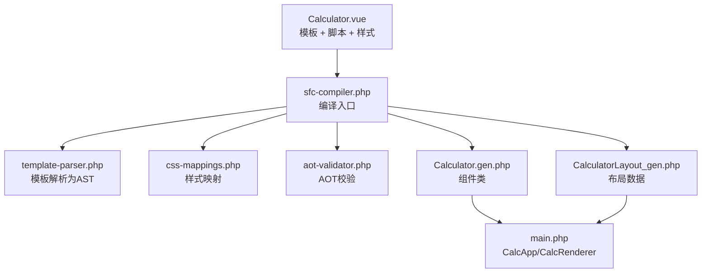
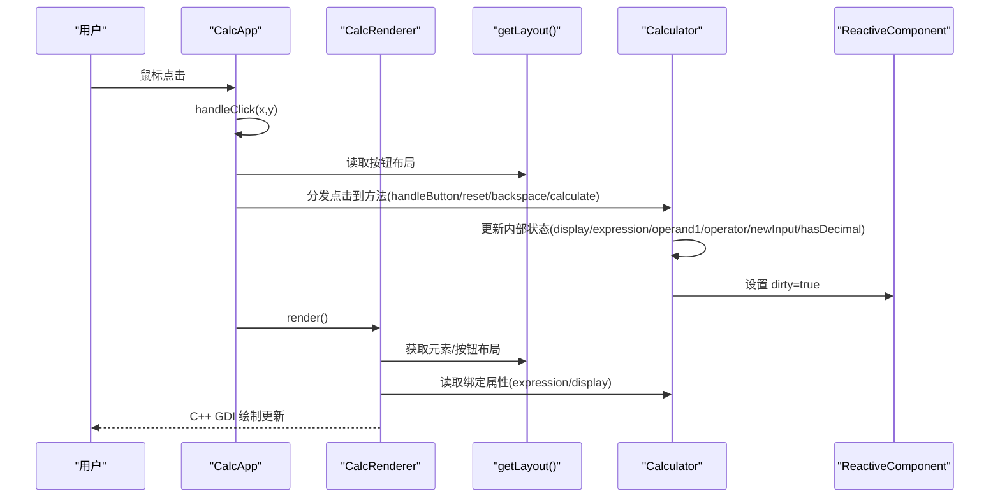
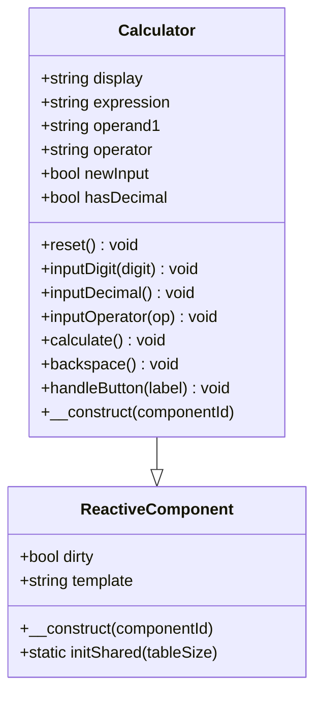
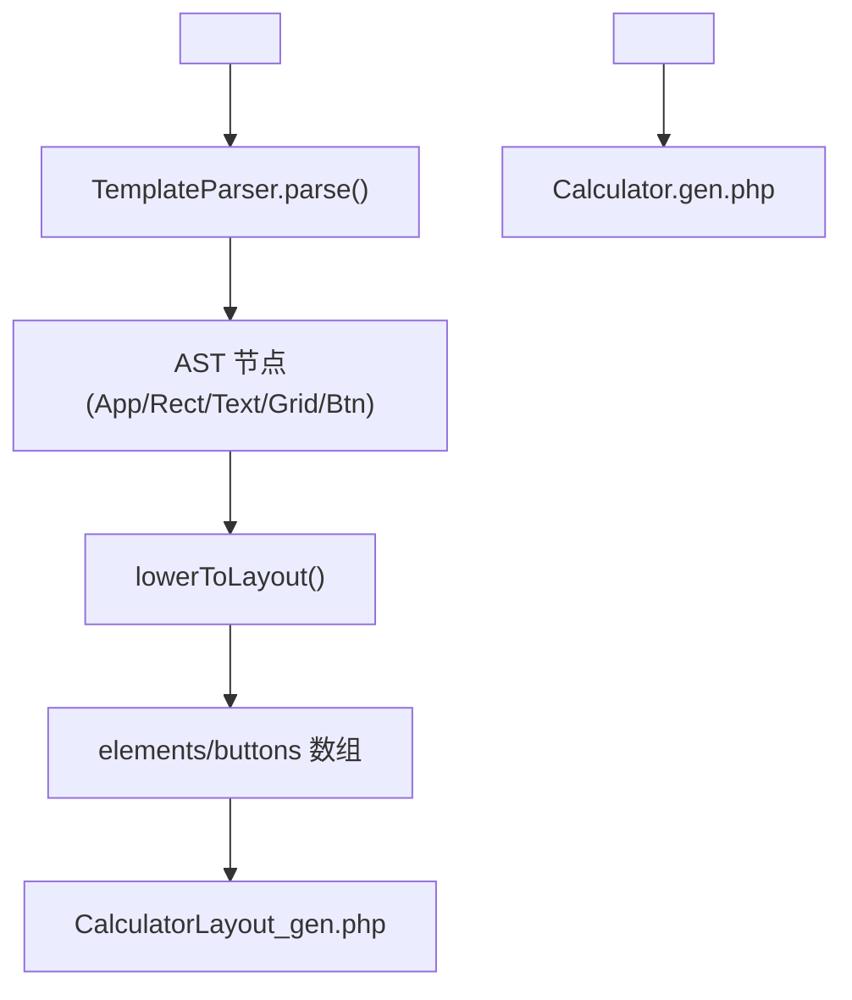
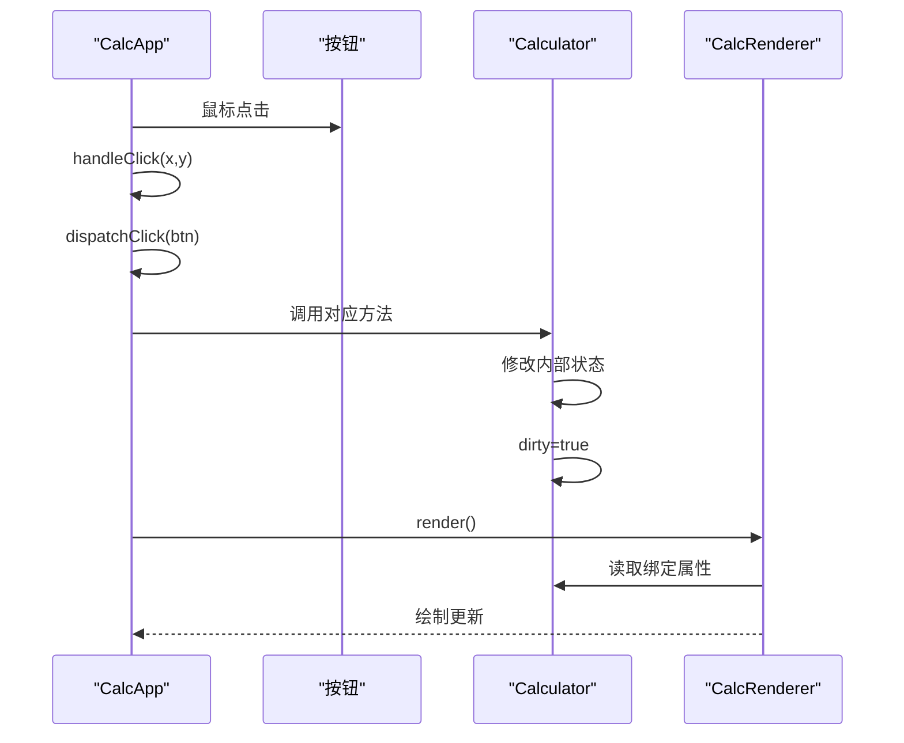
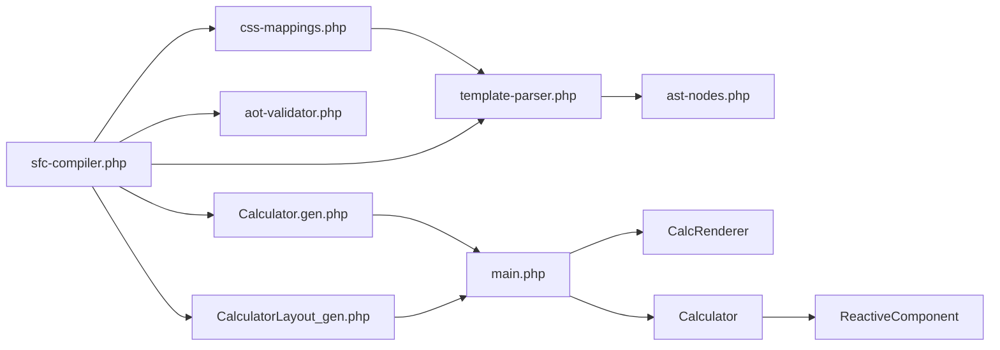

# 生成代码分析

<cite>
**本文引用的文件列表**
- [Calculator.gen.php](file://src/Calculator.gen.php)
- [Calculator.vue](file://src/Calculator.vue)
- [CalculatorLayout_gen.php](file://src/CalculatorLayout_gen.php)
- [sfc-compiler.php](file://tools/sfc-compiler.php)
- [template-parser.php](file://tools/compiler/template-parser.php)
- [css-mappings.php](file://tools/compiler/css-mappings.php)
- [aot-validator.php](file://tools/compiler/aot-validator.php)
- [ast-nodes.php](file://tools/compiler/ast-nodes.php)
- [ReactiveComponent.php](file://src/ReactiveComponent.php)
- [main.php](file://main.php)
- [sfc-compiler-test.php](file://tests/sfc-compiler-test.php)
- [verify-layout.php](file://tests/verify-layout.php)
</cite>

## 目录
1. [简介](#简介)
2. [项目结构](#项目结构)
3. [核心组件](#核心组件)
4. [架构总览](#架构总览)
5. [详细组件分析](#详细组件分析)
6. [依赖关系分析](#依赖关系分析)
7. [性能考量](#性能考量)
8. [故障排查指南](#故障排查指南)
9. [结论](#结论)
10. [附录](#附录)

## 简介
本文件聚焦于 SFC 编译器自动生成的组件类文件 Calculator.gen.php 的深入分析，系统阐述其类结构、方法映射、属性绑定、事件处理等生成代码的特点；解释生成代码与原始 Vue 模板的对应关系，模板编译过程中的转换规则与映射机制；分析生成代码的性能优化策略与编译器处理逻辑；并提供生成代码的阅读指南与修改建议，帮助开发者理解编译器工作原理，并给出与手动代码的对比分析与最佳实践建议。

## 项目结构
该项目采用“单文件组件（SFC）→ 编译器 → 自动生成 .gen.php”的流水线，生成两类产物：
- 组件类文件：Calculator.gen.php（继承响应式基类，包含业务逻辑）
- 布局数据文件：CalculatorLayout_gen.php（包含窗口尺寸与元素/按钮布局数组）

图表来源
- [sfc-compiler.php:1-210](file://tools/sfc-compiler.php#L1-L210)
- [template-parser.php:1-680](file://tools/compiler/template-parser.php#L1-L680)
- [css-mappings.php:1-210](file://tools/compiler/css-mappings.php#L1-L210)
- [aot-validator.php:1-169](file://tools/compiler/aot-validator.php#L1-L169)
- [Calculator.gen.php:1-174](file://src/Calculator.gen.php#L1-L174)
- [CalculatorLayout_gen.php:1-296](file://src/CalculatorLayout_gen.php#L1-L296)
- [main.php:1-291](file://main.php#L1-L291)

章节来源
- [sfc-compiler.php:1-210](file://tools/sfc-compiler.php#L1-L210)
- [Calculator.gen.php:1-174](file://src/Calculator.gen.php#L1-L174)
- [CalculatorLayout_gen.php:1-296](file://src/CalculatorLayout_gen.php#L1-L296)
- [main.php:1-291](file://main.php#L1-L291)

## 核心组件
- 响应式基类：ReactiveComponent（定义脏标记与共享队列）
- 组件类：Calculator（继承自 ReactiveComponent，包含计算器业务逻辑）
- 渲染器：CalcRenderer（基于布局数据与组件状态进行绘制）
- 应用控制器：CalcApp（消息循环、事件分发、渲染调度）

章节来源
- [ReactiveComponent.php:1-35](file://src/ReactiveComponent.php#L1-L35)
- [Calculator.gen.php:1-174](file://src/Calculator.gen.php#L1-L174)
- [main.php:1-291](file://main.php#L1-L291)

## 架构总览
生成代码与运行时的交互流程如下：

图表来源
- [main.php:1-291](file://main.php#L1-L291)
- [Calculator.gen.php:1-174](file://src/Calculator.gen.php#L1-L174)
- [CalculatorLayout_gen.php:1-296](file://src/CalculatorLayout_gen.php#L1-L296)

## 详细组件分析

### 生成类 Calculator 的结构与职责
- 继承关系：Calculator extends ReactiveComponent
- 属性绑定：display、expression、operand1、operator、newInput、hasDecimal
- 方法映射：reset、inputDigit、inputDecimal、inputOperator、calculate、backspace、handleButton
- 构造函数：调用父类构造并传入组件 ID

图表来源
- [ReactiveComponent.php:1-35](file://src/ReactiveComponent.php#L1-L35)
- [Calculator.gen.php:1-174](file://src/Calculator.gen.php#L1-L174)

章节来源
- [Calculator.gen.php:1-174](file://src/Calculator.gen.php#L1-L174)
- [ReactiveComponent.php:1-35](file://src/ReactiveComponent.php#L1-L35)

### 生成类与原始模板的对应关系
- 模板根元素 app：定义窗口宽高，生成布局常量与 getLayout 函数
- 模板元素 rect/text/grid/btn：解析为 AST 节点，再映射为布局数组
- 事件绑定 @click：解析为按钮的 handler 与 arg，用于运行时分发

图表来源
- [Calculator.vue:1-215](file://src/Calculator.vue#L1-L215)
- [template-parser.php:1-680](file://tools/compiler/template-parser.php#L1-L680)
- [CalculatorLayout_gen.php:1-296](file://src/CalculatorLayout_gen.php#L1-L296)
- [Calculator.gen.php:1-174](file://src/Calculator.gen.php#L1-L174)

章节来源
- [Calculator.vue:1-215](file://src/Calculator.vue#L1-L215)
- [template-parser.php:1-680](file://tools/compiler/template-parser.php#L1-L680)
- [CalculatorLayout_gen.php:1-296](file://src/CalculatorLayout_gen.php#L1-L296)
- [Calculator.gen.php:1-174](file://src/Calculator.gen.php#L1-L174)

### 事件处理与方法映射机制
- 运行时点击通过 CalcApp.handleClick 定位按钮，调用 CalcApp.dispatchClick
- dispatchClick 将点击路由到 Calculator 的具体方法（reset/backspace/calculate/handleButton）
- handleButton 内部根据标签字符串分派到 inputDigit/inputDecimal/inputOperator/calculate/reset/backspace
- 每次状态变更后设置 dirty=true，触发 CalcRenderer.render

图表来源
- [main.php:1-291](file://main.php#L1-L291)
- [Calculator.gen.php:1-174](file://src/Calculator.gen.php#L1-L174)

章节来源
- [main.php:1-291](file://main.php#L1-L291)
- [Calculator.gen.php:1-174](file://src/Calculator.gen.php#L1-L174)

### 生成代码的性能优化策略
- 编译期坐标计算：Grid 中按钮的绝对坐标在编译期计算，运行时无需重复计算，降低 CPU 开销
- 布局数据结构：使用紧凑数组（键名固定），减少运行时查找成本
- 字体自适应：根据文本长度动态调整字号，避免过长文本导致的绘制异常
- 脏标记：仅在 dirty=true 时重绘，避免不必要的重绘

章节来源
- [template-parser.php:456-541](file://tools/compiler/template-parser.php#L456-L541)
- [main.php:50-132](file://main.php#L50-L132)
- [Calculator.gen.php:1-174](file://src/Calculator.gen.php#L1-L174)

### 编译器处理逻辑与转换规则
- 模板解析：递归下降解析器，支持 app/rect/text/grid/btn 等节点，未知标签记录为 UnknownNode 并报错
- 样式映射：CSS 属性映射到 GDI 参数（颜色、字号、粗细、对齐等）
- AST → 布局：将 AST 转换为元素与按钮数组，包含位置、尺寸、颜色、对齐、容器信息
- 代码生成：将脚本块复制到组件类，将布局数组导出为函数返回值
- AOT 校验：禁止多点文件名、const 嵌套数组、变量属性/方法访问、PHP8 特性等不兼容项

章节来源
- [template-parser.php:1-680](file://tools/compiler/template-parser.php#L1-L680)
- [css-mappings.php:1-210](file://tools/compiler/css-mappings.php#L1-L210)
- [sfc-compiler.php:1-210](file://tools/sfc-compiler.php#L1-L210)
- [aot-validator.php:1-169](file://tools/compiler/aot-validator.php#L1-L169)

### 生成代码阅读指南与修改建议
- 阅读顺序建议：先看模板与样式，再看布局生成，最后看组件类与运行时渲染
- 修改建议：
  - 保持组件类只包含业务逻辑，避免引入运行时动态特性（如变量属性/方法）
  - 使用显式 if/else 分支替代动态路由，确保 AOT 兼容
  - 在样式中统一使用已支持的 CSS 属性，避免新增未映射属性
  - 如需扩展按钮行为，优先在 handleButton 中集中处理，减少分散的分支

章节来源
- [Calculator.gen.php:1-174](file://src/Calculator.gen.php#L1-L174)
- [aot-validator.php:1-169](file://tools/compiler/aot-validator.php#L1-L169)

### 生成代码与手动代码的对比分析
- 相同点：业务逻辑一致（输入数字/小数点/运算符、计算、退格、重置）
- 差异点：
  - 生成代码：属性与方法由编译器注入，事件通过布局与运行时分发
  - 手动代码：通常在模板中直接绑定事件与属性，运行时更灵活但可能不满足 AOT 限制
- 最佳实践：以生成代码为基础，遵循 AOT 规则，避免动态特性，确保可移植性

章节来源
- [Calculator.vue:1-215](file://src/Calculator.vue#L1-L215)
- [Calculator.gen.php:1-174](file://src/Calculator.gen.php#L1-L174)
- [main.php:1-291](file://main.php#L1-L291)

## 依赖关系分析

图表来源
- [template-parser.php:1-680](file://tools/compiler/template-parser.php#L1-L680)
- [ast-nodes.php:1-153](file://tools/compiler/ast-nodes.php#L1-L153)
- [css-mappings.php:1-210](file://tools/compiler/css-mappings.php#L1-L210)
- [sfc-compiler.php:1-210](file://tools/sfc-compiler.php#L1-L210)
- [aot-validator.php:1-169](file://tools/compiler/aot-validator.php#L1-L169)
- [Calculator.gen.php:1-174](file://src/Calculator.gen.php#L1-L174)
- [CalculatorLayout_gen.php:1-296](file://src/CalculatorLayout_gen.php#L1-L296)
- [main.php:1-291](file://main.php#L1-L291)

章节来源
- [sfc-compiler.php:1-210](file://tools/sfc-compiler.php#L1-L210)
- [template-parser.php:1-680](file://tools/compiler/template-parser.php#L1-L680)
- [css-mappings.php:1-210](file://tools/compiler/css-mappings.php#L1-L210)
- [aot-validator.php:1-169](file://tools/compiler/aot-validator.php#L1-L169)
- [Calculator.gen.php:1-174](file://src/Calculator.gen.php#L1-L174)
- [CalculatorLayout_gen.php:1-296](file://src/CalculatorLayout_gen.php#L1-L296)
- [main.php:1-291](file://main.php#L1-L291)

## 性能考量
- 编译期优化：坐标、颜色、字体等在编译期确定，运行时 O(1) 访问
- 渲染优化：按需重绘（dirty 标记）、文本自适应字号、批量绘制
- 内存优化：布局数据为静态数组，避免运行时构建开销

[本节为通用性能讨论，不直接分析具体文件]

## 故障排查指南
- AOT 校验失败
  - 多点文件名：确保生成文件名仅含最多一个点（如 Calculator.gen.php）
  - const 嵌套数组：使用函数返回数组而非 const 声明
  - 变量属性/方法访问：改为显式 if/else 分支
  - PHP8 特性：替换 str_contains 等函数为兼容写法
- 模板解析错误
  - 缺少必需属性（如 app 的 width/height、rect 的 class、text 的 :bind、btn 的 @click）
  - 未知标签或位置错误（如 btn 必须在 grid 内）
- 布局不正确
  - 检查 grid 的行列、单元尺寸与间距是否与模板一致
  - 验证按钮 handler 与 arg 是否正确映射

章节来源
- [aot-validator.php:1-169](file://tools/compiler/aot-validator.php#L1-L169)
- [template-parser.php:1-680](file://tools/compiler/template-parser.php#L1-L680)
- [verify-layout.php:1-72](file://tests/verify-layout.php#L1-L72)

## 结论
Calculator.gen.php 是 SFC 编译器将模板与脚本转换而来的强类型组件类，具备明确的属性与方法边界、清晰的事件路由与高效的布局数据。通过严格的 AOT 校验与编译期优化，生成代码在保证可移植性的同时实现了良好的性能表现。开发者应遵循 AOT 规则与事件分发约定，以获得稳定可靠的运行时体验。

[本节为总结性内容，不直接分析具体文件]

## 附录
- 测试验证：提供完整的单元测试与集成测试，覆盖 CSS 映射、模板解析、布局生成、AOT 校验与输出一致性
- 验证工具：verify-layout.php 用于快速核对布局输出

章节来源
- [sfc-compiler-test.php:1-365](file://tests/sfc-compiler-test.php#L1-L365)
- [verify-layout.php:1-72](file://tests/verify-layout.php#L1-L72)