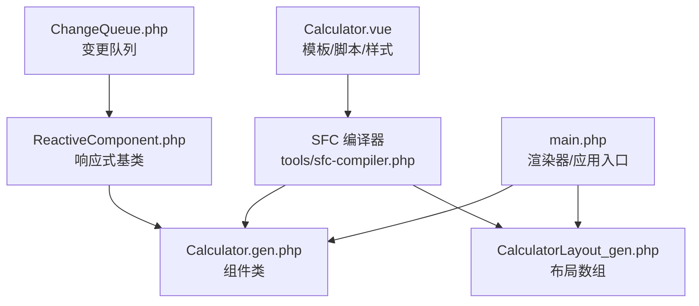
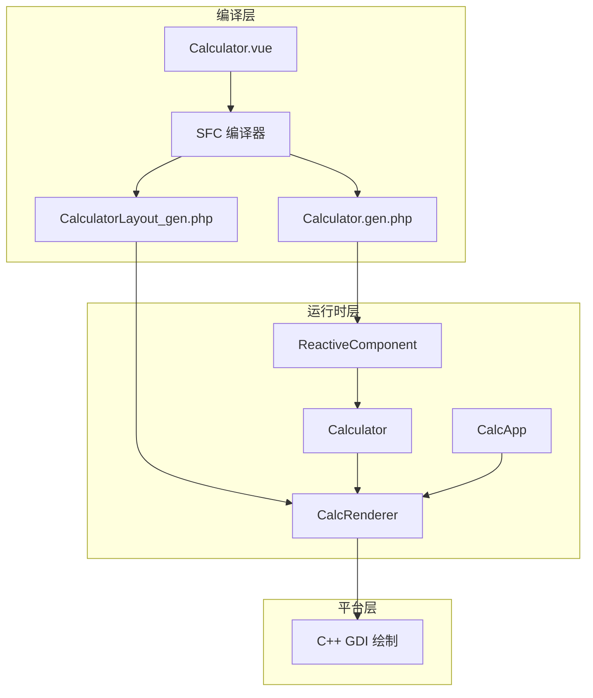
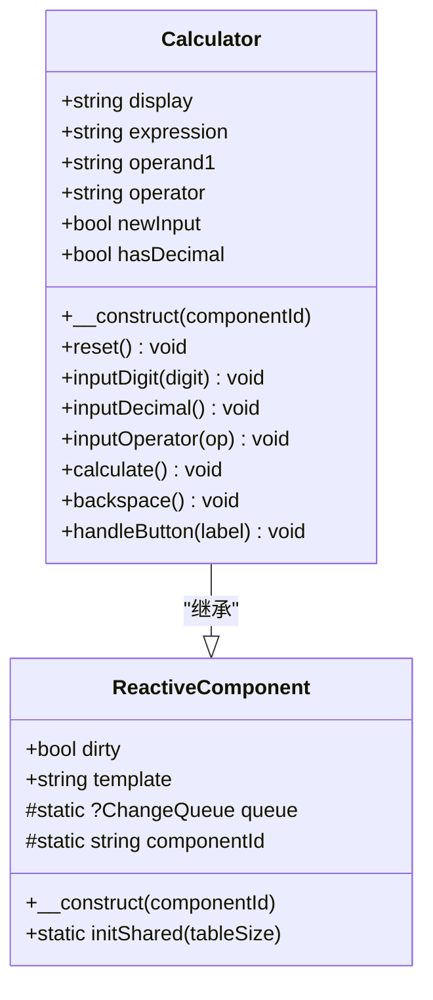
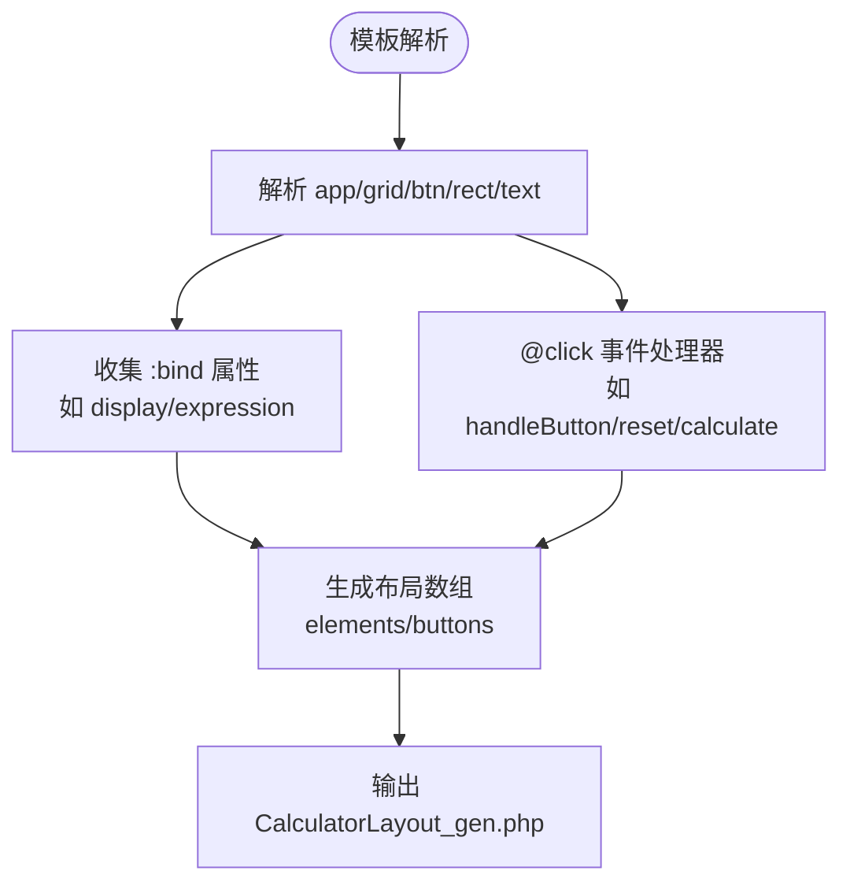
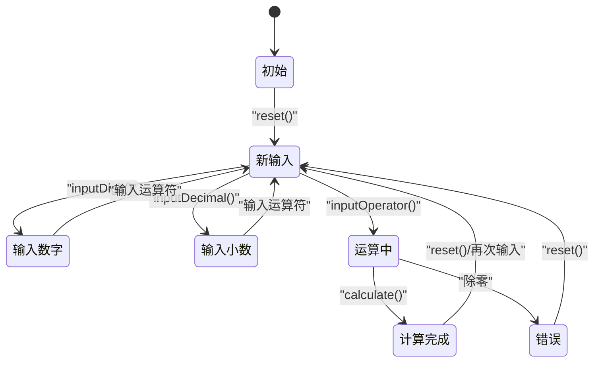
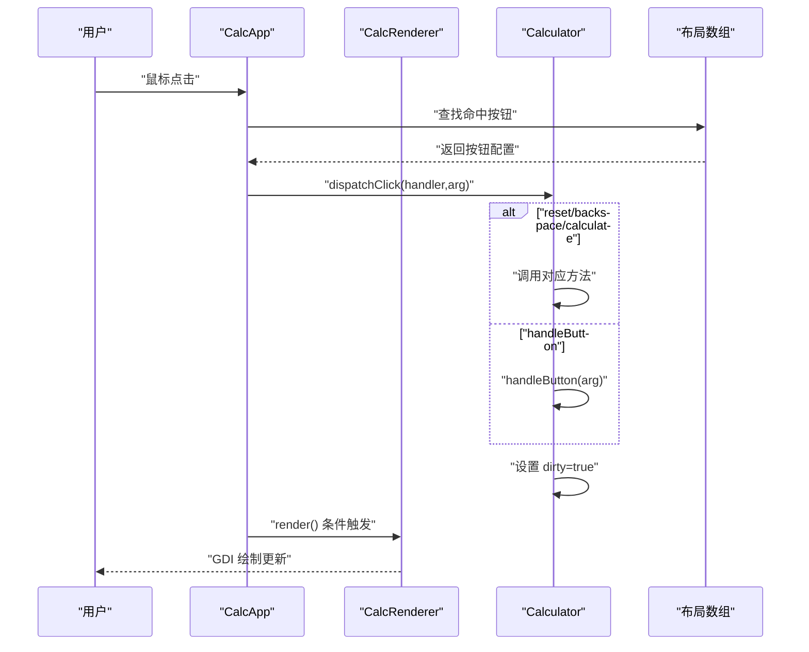
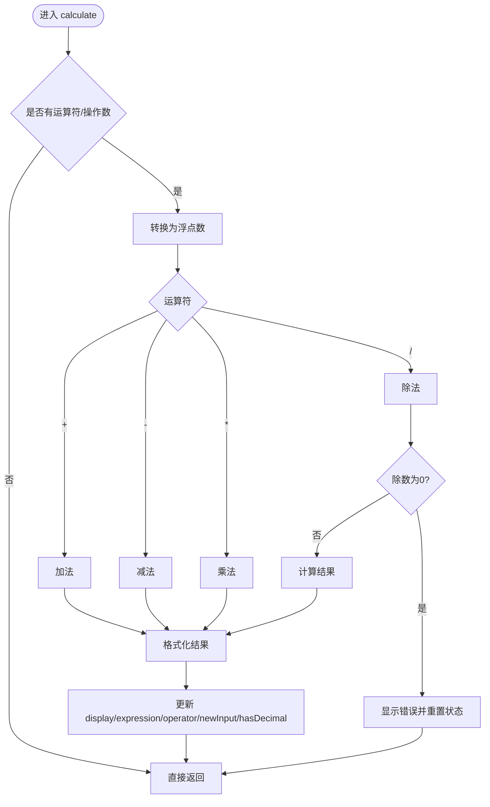
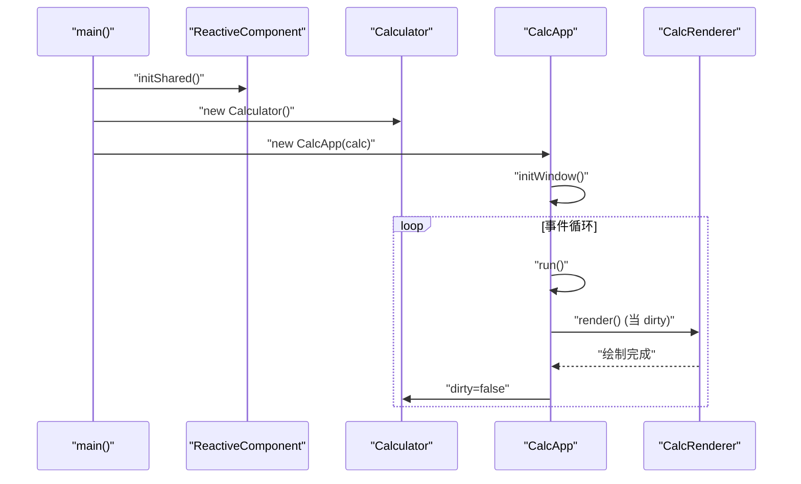
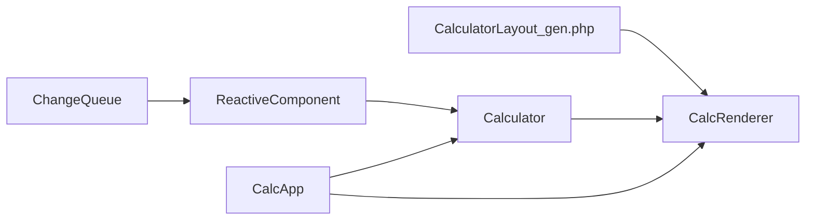

# 计算器组件详解

<cite>
**本文引用的文件**
- [Calculator.vue](file://src/Calculator.vue)
- [Calculator.gen.php](file://src/Calculator.gen.php)
- [CalculatorLayout_gen.php](file://src/CalculatorLayout_gen.php)
- [ReactiveComponent.php](file://src/ReactiveComponent.php)
- [ChangeQueue.php](file://src/ChangeQueue.php)
- [main.php](file://main.php)
- [sfc-compiler.php](file://tools/sfc-compiler.php)
- [sfc-compiler-test.php](file://tests/sfc-compiler-test.php)
- [verify-layout.php](file://tests/verify-layout.php)
</cite>

## 目录
1. [简介](#简介)
2. [项目结构](#项目结构)
3. [核心组件](#核心组件)
4. [架构总览](#架构总览)
5. [详细组件分析](#详细组件分析)
6. [依赖关系分析](#依赖关系分析)
7. [性能考量](#性能考量)
8. [故障排查指南](#故障排查指南)
9. [结论](#结论)
10. [附录](#附录)

## 简介
本技术文档围绕基于 SFC（单文件组件）编译器的 VueCalc 计算器展开，系统性解析以下内容：
- Calculator.vue 的模板结构、逻辑处理与样式定义
- 由 SFC 编译器生成的 Calculator.gen.php 组件类的结构、方法映射与属性绑定
- 组件的状态管理策略（display、expression、operand1、operator 等）
- 按钮处理逻辑、计算算法与错误处理机制
- 生命周期管理、事件处理与数据绑定的技术细节
- 实际使用模式与扩展建议

## 项目结构
该项目采用“模板 → 编译器 → 生成类 + 布局”的流水线，核心文件如下：
- 模板与样式：src/Calculator.vue
- 编译产物：src/Calculator.gen.php、src/CalculatorLayout_gen.php
- 响应式基础：src/ReactiveComponent.php、src/ChangeQueue.php
- 运行时渲染与应用入口：main.php
- 编译器工具与测试：tools/sfc-compiler.php、tests/sfc-compiler-test.php、tests/verify-layout.php



图表来源
- [Calculator.vue:1-215](file://src/Calculator.vue#L1-L215)
- [sfc-compiler.php:1-210](file://tools/sfc-compiler.php#L1-L210)
- [Calculator.gen.php:1-174](file://src/Calculator.gen.php#L1-L174)
- [CalculatorLayout_gen.php:1-296](file://src/CalculatorLayout_gen.php#L1-L296)
- [ReactiveComponent.php:1-35](file://src/ReactiveComponent.php#L1-L35)
- [ChangeQueue.php:1-57](file://src/ChangeQueue.php#L1-L57)
- [main.php:1-291](file://main.php#L1-L291)

章节来源
- [Calculator.vue:1-215](file://src/Calculator.vue#L1-L215)
- [Calculator.gen.php:1-174](file://src/Calculator.gen.php#L1-L174)
- [CalculatorLayout_gen.php:1-296](file://src/CalculatorLayout_gen.php#L1-L296)
- [ReactiveComponent.php:1-35](file://src/ReactiveComponent.php#L1-L35)
- [ChangeQueue.php:1-57](file://src/ChangeQueue.php#L1-L57)
- [main.php:1-291](file://main.php#L1-L291)
- [sfc-compiler.php:1-210](file://tools/sfc-compiler.php#L1-L210)
- [sfc-compiler-test.php:1-365](file://tests/sfc-compiler-test.php#L1-L365)
- [verify-layout.php:1-72](file://tests/verify-layout.php#L1-L72)

## 核心组件
本节聚焦 Calculator 组件的三个层面：
- 模板层：通过 app、rect、text、grid、btn 等标签构建界面与交互
- 逻辑层：Calculator.gen.php 中的组件类，封装状态与业务逻辑
- 布局层：CalculatorLayout_gen.php 提供渲染所需的坐标与样式映射

关键要点
- 模板中的 :bind 绑定到组件属性（如 display、expression），用于数据驱动渲染
- 事件 @click 通过布局配置的 handler 与 arg 将点击路由到组件方法
- 组件状态通过脏标记 dirty 触发渲染器重绘

章节来源
- [Calculator.vue:1-215](file://src/Calculator.vue#L1-L215)
- [Calculator.gen.php:1-174](file://src/Calculator.gen.php#L1-L174)
- [CalculatorLayout_gen.php:1-296](file://src/CalculatorLayout_gen.php#L1-L296)

## 架构总览
整体架构分为四层：
- 模板层：.vue 文件描述 UI 结构与样式
- 编译层：SFC 编译器将模板解析为 AST，再生成布局数组与组件类
- 运行时层：Calculator 组件维护状态；CalcRenderer 读取布局与组件状态进行绘制
- 平台层：C++ GDI 绘制原语负责最终渲染



图表来源
- [Calculator.vue:1-215](file://src/Calculator.vue#L1-L215)
- [sfc-compiler.php:1-210](file://tools/sfc-compiler.php#L1-L210)
- [Calculator.gen.php:1-174](file://src/Calculator.gen.php#L1-L174)
- [CalculatorLayout_gen.php:1-296](file://src/CalculatorLayout_gen.php#L1-L296)
- [ReactiveComponent.php:1-35](file://src/ReactiveComponent.php#L1-L35)
- [main.php:1-291](file://main.php#L1-L291)

## 详细组件分析

### 组件类结构与继承关系
Calculator 继承自 ReactiveComponent，后者提供脏标记与共享变更队列能力。组件类包含状态属性与一组业务方法，统一通过 $this->dirty=true 触发重绘。



图表来源
- [ReactiveComponent.php:1-35](file://src/ReactiveComponent.php#L1-L35)
- [Calculator.gen.php:1-174](file://src/Calculator.gen.php#L1-L174)

章节来源
- [Calculator.gen.php:1-174](file://src/Calculator.gen.php#L1-L174)
- [ReactiveComponent.php:1-35](file://src/ReactiveComponent.php#L1-L35)

### 模板结构与数据绑定
模板采用 app/grid/btn/rect/text 等标签，通过 :bind 将文本内容绑定到组件属性，通过 @click 将点击事件路由到组件方法。布局数组由编译器生成，包含每个元素的几何信息与样式映射。



图表来源
- [Calculator.vue:1-215](file://src/Calculator.vue#L1-L215)
- [CalculatorLayout_gen.php:1-296](file://src/CalculatorLayout_gen.php#L1-L296)
- [sfc-compiler.php:1-210](file://tools/sfc-compiler.php#L1-L210)

章节来源
- [Calculator.vue:1-215](file://src/Calculator.vue#L1-L215)
- [CalculatorLayout_gen.php:1-296](file://src/CalculatorLayout_gen.php#L1-L296)
- [sfc-compiler.php:1-210](file://tools/sfc-compiler.php#L1-L210)

### 状态管理策略
组件状态变量及其作用：
- display：当前显示值（字符串形式）
- expression：表达式（右上角显示）
- operand1：第一个操作数
- operator：当前运算符
- newInput：是否开始新输入
- hasDecimal：是否已输入小数点

状态变化规则
- 输入数字或小数点时，若处于新输入状态则覆盖显示值；否则追加字符
- 输入运算符时，若已有运算符且非新输入，则先执行一次计算
- 计算完成后清空运算符与表达式，设置新输入标志
- 退格时逐字符删除，遇到小数点则同步更新 hasDecimal



图表来源
- [Calculator.gen.php:64-162](file://src/Calculator.gen.php#L64-L162)

章节来源
- [Calculator.gen.php:45-162](file://src/Calculator.gen.php#L45-L162)

### 按钮处理逻辑与事件分发
按钮点击通过布局配置的 handler 与 arg 将事件路由到组件方法：
- reset：重置计算器状态
- backspace：退格删除
- calculate：执行计算
- handleButton：通用按钮处理，区分数字、运算符、小数点与特殊键



图表来源
- [main.php:230-258](file://main.php#L230-L258)
- [Calculator.gen.php:149-168](file://src/Calculator.gen.php#L149-L168)
- [CalculatorLayout_gen.php:1-296](file://src/CalculatorLayout_gen.php#L1-L296)

章节来源
- [main.php:230-258](file://main.php#L230-L258)
- [Calculator.gen.php:149-168](file://src/Calculator.gen.php#L149-L168)
- [CalculatorLayout_gen.php:1-296](file://src/CalculatorLayout_gen.php#L1-L296)

### 计算算法与错误处理
计算流程
- 从 operand1 与当前 display 获取两个操作数
- 根据 operator 执行加减乘除
- 除法时检查除数为零，出现错误则清空状态并显示错误提示
- 结果格式化：整数去除小数部分，浮点数保留最多若干位并去尾随零



图表来源
- [Calculator.gen.php:119-162](file://src/Calculator.gen.php#L119-L162)

章节来源
- [Calculator.gen.php:119-162](file://src/Calculator.gen.php#L119-L162)

### 生命周期管理与渲染循环
- 初始化：ReactiveComponent::initShared() 创建全局变更队列
- 组件实例：Calculator 构造时注册组件 ID
- 事件循环：CalcApp.run() 持续轮询消息，命中按钮后分发到组件方法
- 渲染条件：仅当组件 dirty 为真时调用 CalcRenderer.render()
- 绘制：CalcRenderer 读取布局数组与组件状态，调用 C++ GDI 接口绘制



图表来源
- [main.php:265-291](file://main.php#L265-L291)
- [ReactiveComponent.php:30-34](file://src/ReactiveComponent.php#L30-L34)
- [Calculator.gen.php:170-174](file://src/Calculator.gen.php#L170-L174)

章节来源
- [main.php:171-227](file://main.php#L171-L227)
- [ReactiveComponent.php:30-34](file://src/ReactiveComponent.php#L30-L34)
- [Calculator.gen.php:170-174](file://src/Calculator.gen.php#L170-L174)

## 依赖关系分析
- 组件类依赖响应式基类与变更队列，以实现 AOT 兼容的数据驱动渲染
- 渲染器依赖布局数组与组件状态，不直接访问组件内部逻辑
- 应用层负责事件捕获与按钮命中测试，再将事件显式路由到组件方法



图表来源
- [ReactiveComponent.php:1-35](file://src/ReactiveComponent.php#L1-L35)
- [ChangeQueue.php:1-57](file://src/ChangeQueue.php#L1-L57)
- [Calculator.gen.php:1-174](file://src/Calculator.gen.php#L1-L174)
- [CalculatorLayout_gen.php:1-296](file://src/CalculatorLayout_gen.php#L1-L296)
- [main.php:1-291](file://main.php#L1-L291)

章节来源
- [ReactiveComponent.php:1-35](file://src/ReactiveComponent.php#L1-L35)
- [ChangeQueue.php:1-57](file://src/ChangeQueue.php#L1-L57)
- [Calculator.gen.php:1-174](file://src/Calculator.gen.php#L1-L174)
- [CalculatorLayout_gen.php:1-296](file://src/CalculatorLayout_gen.php#L1-L296)
- [main.php:1-291](file://main.php#L1-L291)

## 性能考量
- 脏标记驱动渲染：仅在状态变更时重绘，降低 CPU/GPU 压力
- 环形缓冲变更队列：避免频繁分配，提升事件处理吞吐
- 字体动态缩放：长数字自动缩小字号，保证显示完整性
- 事件循环频率：约 60 FPS，兼顾流畅度与资源占用

## 故障排查指南
常见问题与定位建议
- 无法渲染或无响应
  - 检查组件 dirty 是否被正确置位
  - 确认 CalcApp.run() 中的渲染条件分支
- 按钮点击无效
  - 核对布局数组中按钮 handler 与 arg 是否正确
  - 确认 CalcApp.handleClick() 的命中测试与 dispatchClick() 路由
- 计算异常或显示错误
  - 检查除零分支与错误状态重置逻辑
  - 核对 display 格式化与 hasDecimal 更新
- 编译失败或生成文件不合法
  - 使用 AOT 验证器检查生成代码
  - 参考单元测试与布局验证脚本

章节来源
- [main.php:213-221](file://main.php#L213-L221)
- [main.php:230-258](file://main.php#L230-L258)
- [Calculator.gen.php:138-146](file://src/Calculator.gen.php#L138-L146)
- [sfc-compiler-test.php:245-298](file://tests/sfc-compiler-test.php#L245-L298)
- [verify-layout.php:1-72](file://tests/verify-layout.php#L1-L72)

## 结论
本项目通过 SFC 编译器实现了“模板 → 组件类 + 布局”的完整数据驱动渲染链路。Calculator 组件以清晰的状态机与事件路由支撑了完整的计算器功能，配合响应式基类与渲染器，形成稳定的桌面应用架构。该设计既满足 AOT 编译器的限制，又保持了良好的可扩展性与可维护性。

## 附录

### 使用模式与扩展建议
- 新增按钮：在模板中添加 btn，并在布局中配置 handler 与 arg；在组件类中新增对应方法并设置 dirty
- 自定义样式：通过样式块映射到布局属性，确保 CssMappings 正确解析
- 错误处理增强：可在计算前增加边界检查与溢出保护
- 性能优化：对长数字显示进一步优化字体缩放策略；对变更队列大小按场景调优

### 关键流程图（算法与事件）
```mermaid
flowchart TD
A["用户点击按钮"] --> B["CalcApp.handleClick()"]
B --> C["dispatchClick(handler,arg)"]
C --> D{"路由到方法"}
D --> |reset| E["reset()"]
D --> |backspace| F["backspace()"]
D --> |calculate| G["calculate()"]
D --> |handleButton| H["handleButton(label)"]
H --> I{"label 类型"}
I --> |数字| J["inputDigit()"]
I --> |小数点| K["inputDecimal()"]
I --> |运算符| L["inputOperator()"]
I --> |C/<-|=M["reset()/backspace()"]
J --> N["dirty=true"]
K --> N
L --> N
E --> N
F --> N
G --> N
N --> O["CalcRenderer.render()"]
```

图表来源
- [main.php:230-258](file://main.php#L230-L258)
- [Calculator.gen.php:64-168](file://src/Calculator.gen.php#L64-L168)
- [CalculatorLayout_gen.php:1-296](file://src/CalculatorLayout_gen.php#L1-L296)