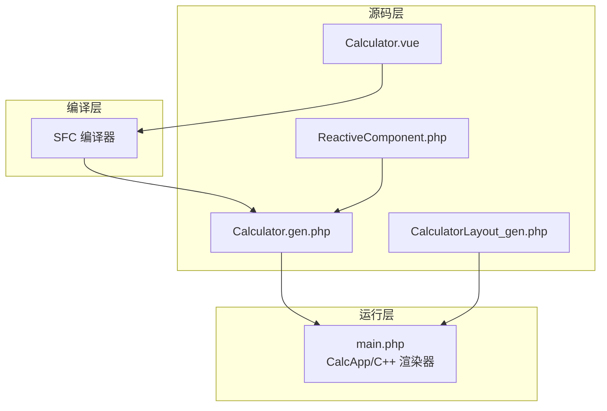
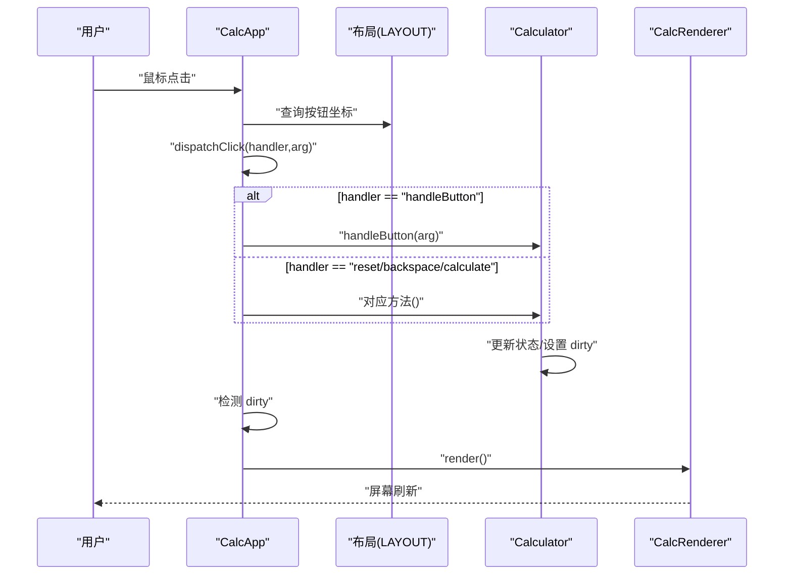
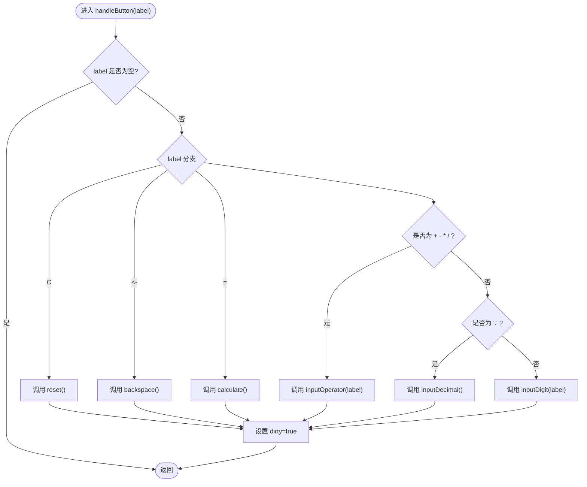
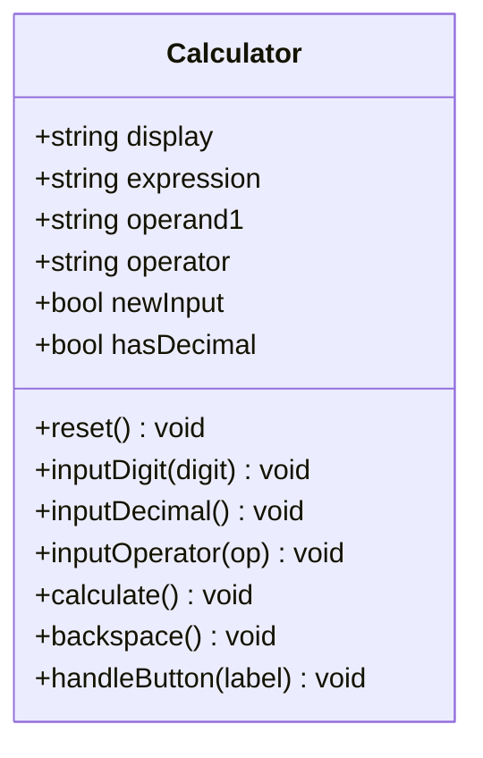
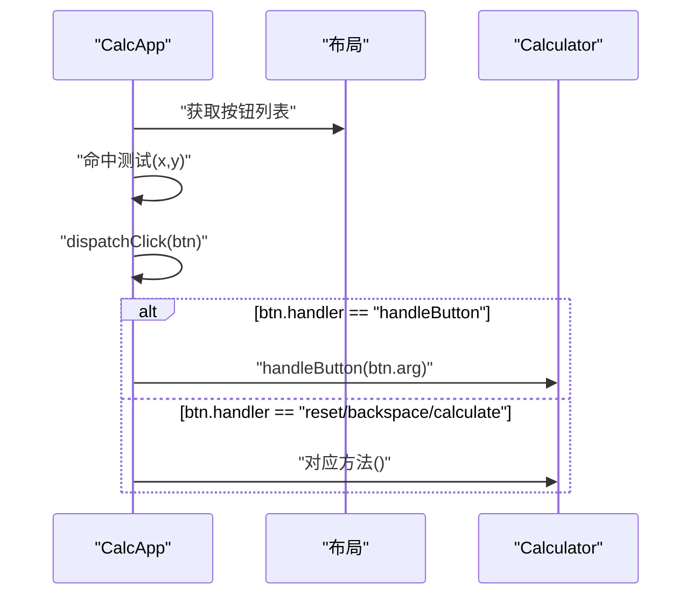
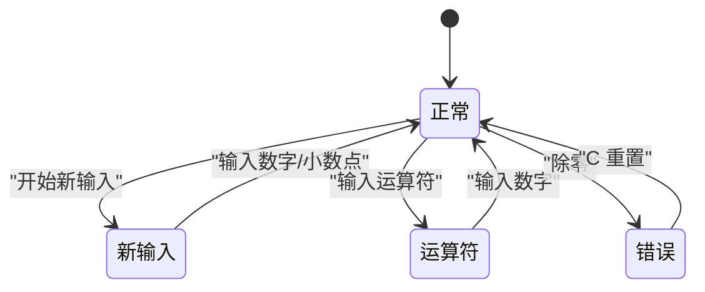
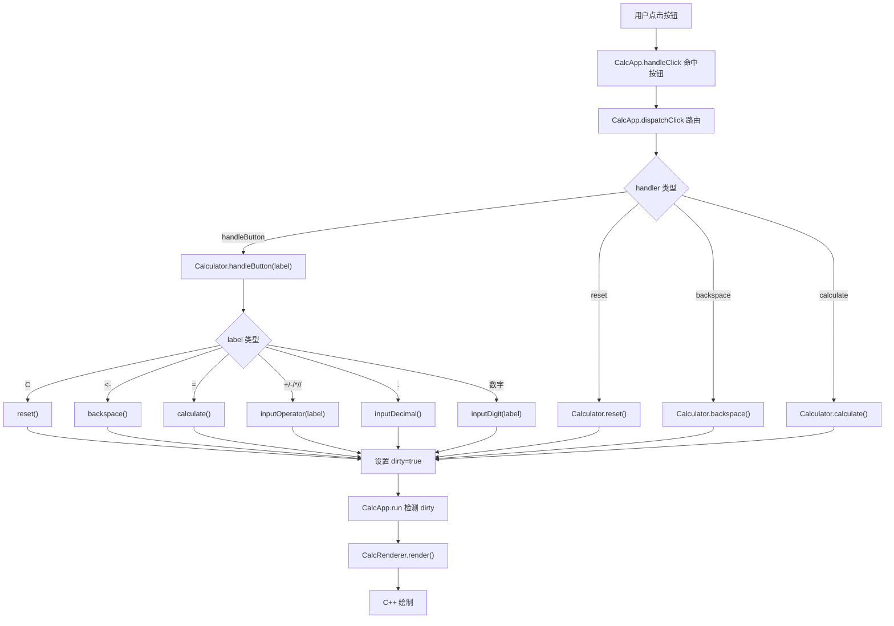
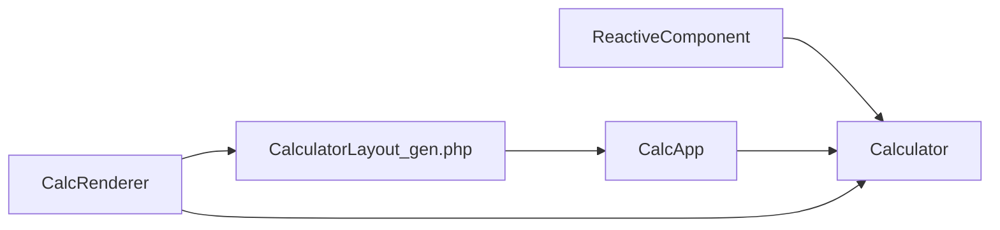

# 事件处理流程

<cite>
**本文引用的文件**
- [Calculator.vue](file://src/Calculator.vue)
- [Calculator.gen.php](file://src/Calculator.gen.php)
- [CalculatorLayout_gen.php](file://src/CalculatorLayout_gen.php)
- [ReactiveComponent.php](file://src/ReactiveComponent.php)
- [main.php](file://main.php)
- [project.yml](file://project.yml)
</cite>

## 目录
1. [简介](#简介)
2. [项目结构](#项目结构)
3. [核心组件](#核心组件)
4. [架构总览](#架构总览)
5. [详细组件分析](#详细组件分析)
6. [依赖关系分析](#依赖关系分析)
7. [性能考量](#性能考量)
8. [故障排查指南](#故障排查指南)
9. [结论](#结论)

## 简介
本技术文档聚焦于计算器事件处理流程，特别是统一事件处理器 handleButton 的实现与调度逻辑。我们将从按钮标签识别、方法路由分发、参数传递机制入手，逐类解析功能按钮（C、<-、=）、运算符按钮（+、-、*、/）、数字按钮（0-9）与小数点按钮的处理策略，并阐明事件处理的时序关系与状态依赖，解释为何某些按钮在特定状态下会被禁用或忽略。最后提供完整的事件处理流程图与典型交互场景示例，帮助开发者理解从用户交互到状态更新的完整链路。

## 项目结构
该项目采用“单文件组件（SFC）+ 编译器 + AOT + C++ 渲染”的混合架构：
- 源码层：.vue 组件 + PHP 业务逻辑 + 布局生成器
- 编译层：SFC 编译器将 .vue 生成 .gen.php（包含组件类与布局数据）
- 运行层：主程序负责窗口消息循环、事件分发与渲染；渲染器基于布局数据驱动 C++ 绘制

图表来源
- [Calculator.vue](file://src/Calculator.vue)
- [Calculator.gen.php](file://src/Calculator.gen.php)
- [CalculatorLayout_gen.php](file://src/CalculatorLayout_gen.php)
- [ReactiveComponent.php](file://src/ReactiveComponent.php)
- [main.php](file://main.php)

章节来源
- [project.yml:1-10](file://project.yml#L1-L10)

## 核心组件
- 组件类：Calculator（由 SFC 编译生成），包含状态字段与事件处理方法
- 事件分发：CalcApp.handleClick/dispatchClick，将鼠标点击命中到具体组件方法
- 渲染器：CalcRenderer，依据布局数据与组件状态进行绘制
- 基类：ReactiveComponent，提供脏标记与共享基础设施

章节来源
- [Calculator.gen.php:9-174](file://src/Calculator.gen.php#L9-L174)
- [main.php:26-259](file://main.php#L26-L259)
- [ReactiveComponent.php:11-35](file://src/ReactiveComponent.php#L11-L35)

## 架构总览
事件处理的端到端链路如下：
- 用户点击 → CalcApp.handleClick 命中按钮 → CalcApp.dispatchClick 路由到组件方法
- 组件方法（如 handleButton）更新状态 → 设置脏标记 → CalcApp.run 检测脏标记 → CalcRenderer.render → C++ 绘制

图表来源
- [main.php:229-258](file://main.php#L229-L258)
- [Calculator.gen.php:149-168](file://src/Calculator.gen.php#L149-L168)
- [CalculatorLayout_gen.php:10-296](file://src/CalculatorLayout_gen.php#L10-L296)

## 详细组件分析

### 统一事件处理器：handleButton
handleButton 是所有数字/运算符/功能键的统一入口，其职责是：
- 接收按钮标签字符串
- 基于标签进行分支判断
- 调用相应的方法（重置、退格、计算、输入数字、输入小数点、输入运算符）
- 设置脏标记以触发重绘

图表来源
- [Calculator.gen.php:149-168](file://src/Calculator.gen.php#L149-L168)
- [Calculator.vue:183-202](file://src/Calculator.vue#L183-L202)

章节来源
- [Calculator.gen.php:149-168](file://src/Calculator.gen.php#L149-L168)
- [Calculator.vue:183-202](file://src/Calculator.vue#L183-L202)

### 按钮类型与处理策略

- 功能按钮
  - C：重置计算器状态（清空显示、表达式、操作数、运算符、输入标志、小数点标志）
  - <-：退格删除最后一位，若处于新输入或错误状态则忽略
- 运算符按钮（+、-、*、/）
  - 输入运算符：若已有运算符且非新输入，则先执行一次计算，再记录当前显示值为第一个操作数，设置表达式与新输入标志
- 数字按钮（0-9）
  - 输入数字：若处于新输入，则覆盖显示为该数字；否则追加到当前显示；若当前显示为“0”且不是小数点，则替换为该数字
- 小数点按钮（.）
  - 输入小数点：若处于新输入，则显示为“0.”；若尚未输入小数点，则追加“.”并标记已输入小数点

图表来源
- [Calculator.gen.php:9-174](file://src/Calculator.gen.php#L9-L174)

章节来源
- [Calculator.gen.php:29-168](file://src/Calculator.gen.php#L29-L168)
- [Calculator.vue:64-202](file://src/Calculator.vue#L64-L202)

### 事件分发与路由
- 布局生成器 CalculatorLayout_gen.php 提供按钮坐标与事件路由信息（handler 与 arg）
- CalcApp.handleClick 根据点击坐标命中按钮，调用 dispatchClick
- dispatchClick 将事件路由到组件方法：reset、backspace、calculate 或 handleButton(label)

图表来源
- [CalculatorLayout_gen.php:10-296](file://src/CalculatorLayout_gen.php#L10-L296)
- [main.php:229-258](file://main.php#L229-L258)

章节来源
- [CalculatorLayout_gen.php:10-296](file://src/CalculatorLayout_gen.php#L10-L296)
- [main.php:229-258](file://main.php#L229-L258)

### 状态依赖与时序关系
- newInput 标志控制“新输入”状态，影响数字输入与小数点输入的初始行为
- hasDecimal 标志防止重复输入小数点
- operator 与 operand1 控制运算符输入时的计算优先级与表达式拼接
- 错误状态（display 为 "Error"）会阻止退格等输入操作

图表来源
- [Calculator.gen.php:85-128](file://src/Calculator.gen.php#L85-L128)
- [Calculator.gen.php:130-147](file://src/Calculator.gen.php#L130-L147)

章节来源
- [Calculator.gen.php:85-128](file://src/Calculator.gen.php#L85-L128)
- [Calculator.gen.php:130-147](file://src/Calculator.gen.php#L130-L147)

### 事件处理流程图（完整）

图表来源
- [main.php:229-258](file://main.php#L229-L258)
- [Calculator.gen.php:149-168](file://src/Calculator.gen.php#L149-L168)
- [Calculator.gen.php:29-168](file://src/Calculator.gen.php#L29-L168)

## 依赖关系分析
- 组件类 Calculator 继承自 ReactiveComponent，依赖脏标记机制
- CalcApp 依赖布局数据与组件实例，负责事件分发与渲染循环
- 布局数据由 SFC 编译器生成，包含按钮 handler 与参数

图表来源
- [ReactiveComponent.php:11-35](file://src/ReactiveComponent.php#L11-L35)
- [Calculator.gen.php:9-174](file://src/Calculator.gen.php#L9-L174)
- [CalculatorLayout_gen.php:10-296](file://src/CalculatorLayout_gen.php#L10-L296)
- [main.php:26-133](file://main.php#L26-L133)

章节来源
- [ReactiveComponent.php:11-35](file://src/ReactiveComponent.php#L11-L35)
- [Calculator.gen.php:9-174](file://src/Calculator.gen.php#L9-L174)
- [CalculatorLayout_gen.php:10-296](file://src/CalculatorLayout_gen.php#L10-L296)
- [main.php:26-133](file://main.php#L26-L133)

## 性能考量
- 事件处理均为轻量状态更新，主要开销在渲染阶段
- 渲染器按需重绘：仅当 dirty 为真时才执行渲染
- 字符串拼接与格式化在计算结果时进行，避免频繁 I/O
- 除零保护与结果格式化在计算方法中集中处理，减少分支复杂度

## 故障排查指南
- 事件未生效
  - 检查按钮 handler 与 arg 是否正确生成（布局数据）
  - 检查 CalcApp.dispatchClick 的路由逻辑
- 退格无效
  - 确认当前处于正常输入状态（非新输入、非错误）
- 重复小数点
  - 确认 hasDecimal 标志在输入小数点时被正确设置
- 运算符异常
  - 确认 inputOperator 在已有运算符时会先执行一次计算
- 除零崩溃
  - 确认 calculate 中的除零保护逻辑已被触发

章节来源
- [Calculator.gen.php:130-147](file://src/Calculator.gen.php#L130-L147)
- [Calculator.gen.php:130-147](file://src/Calculator.gen.php#L130-L147)
- [Calculator.gen.php:130-147](file://src/Calculator.gen.php#L130-L147)

## 结论
本项目通过 SFC 编译器将 .vue 组件转换为可 AOT 编译的 PHP 类，并结合布局数据驱动的事件分发与渲染机制，实现了高性能、可维护的桌面计算器。handleButton 作为统一事件处理器，以简洁的分支逻辑覆盖所有按钮类型，配合状态标志与脏标记，确保了事件处理的确定性与时序一致性。开发者在扩展新按钮或修改现有行为时，应遵循既有状态机与路由约定，保持事件处理的一致性与可预测性。