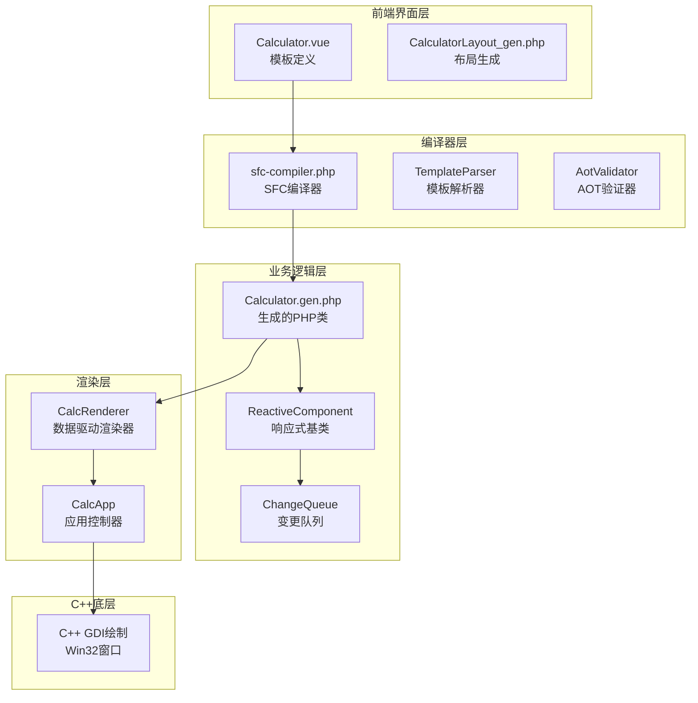
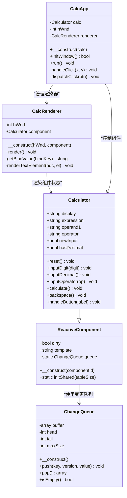
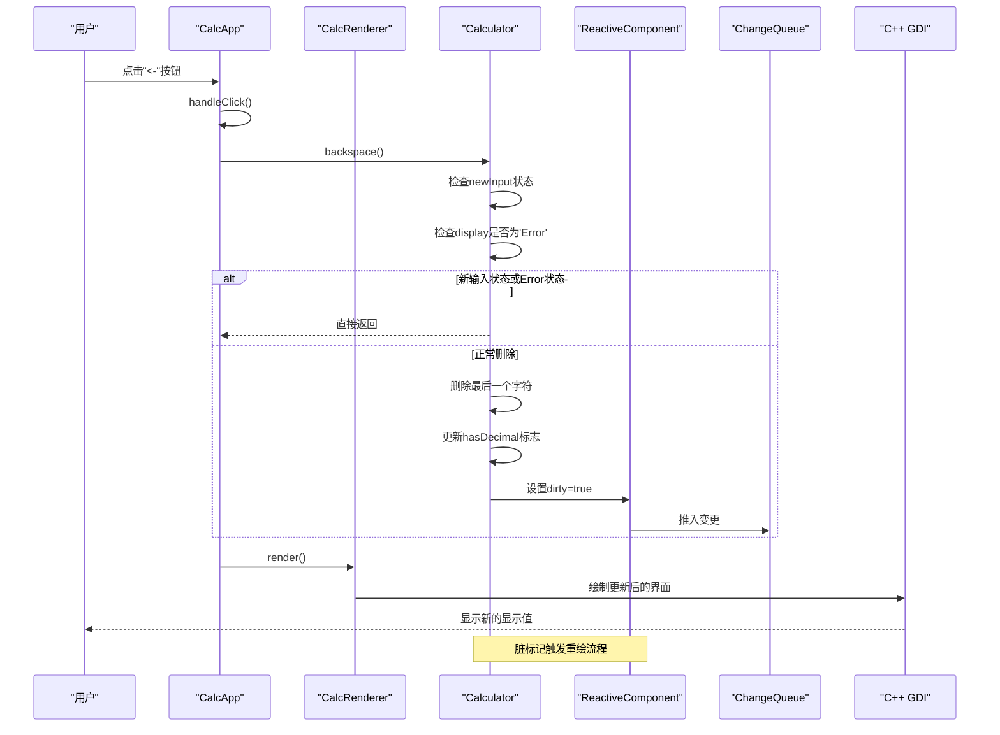
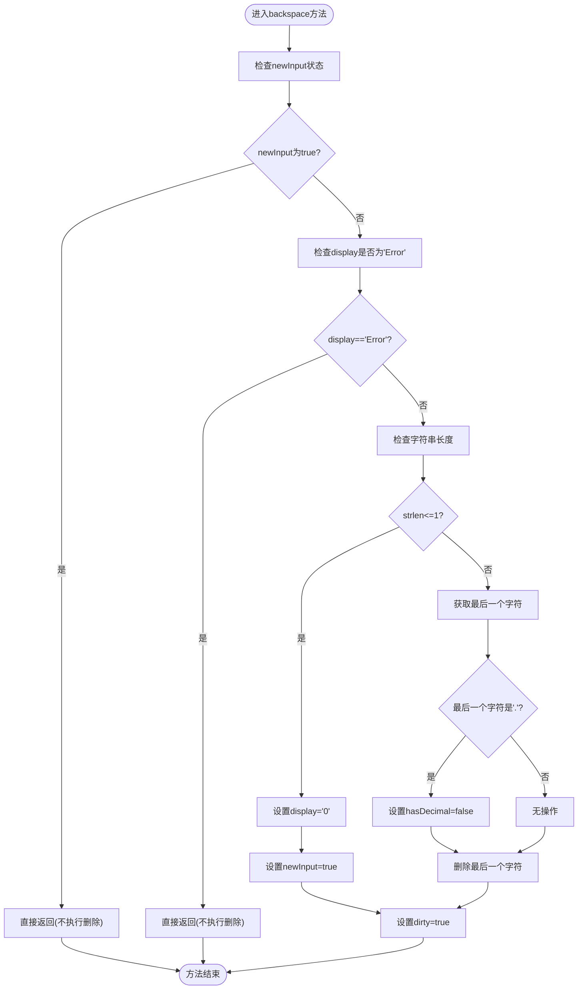
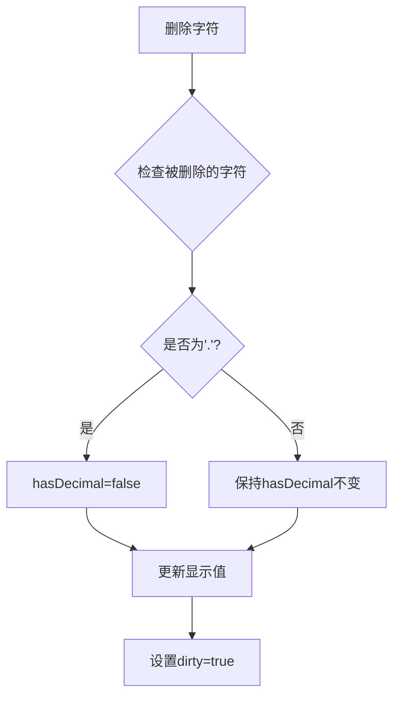
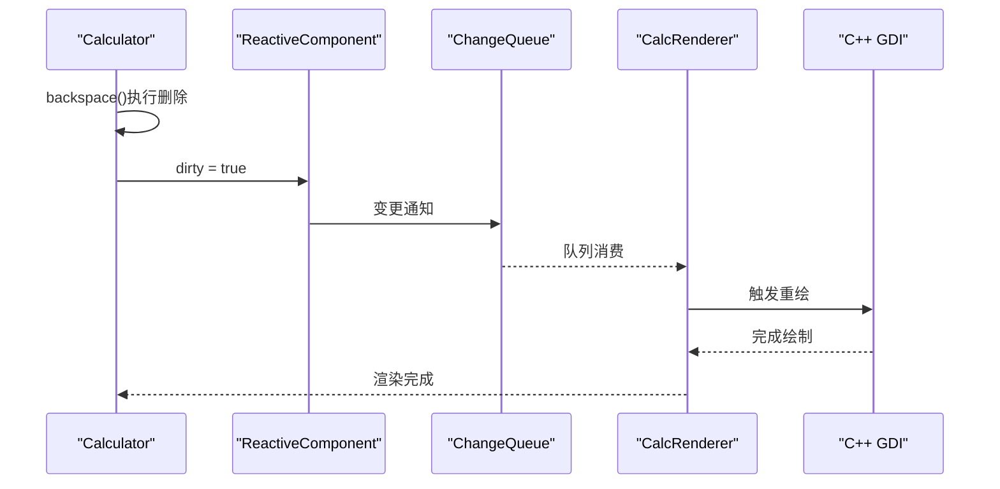
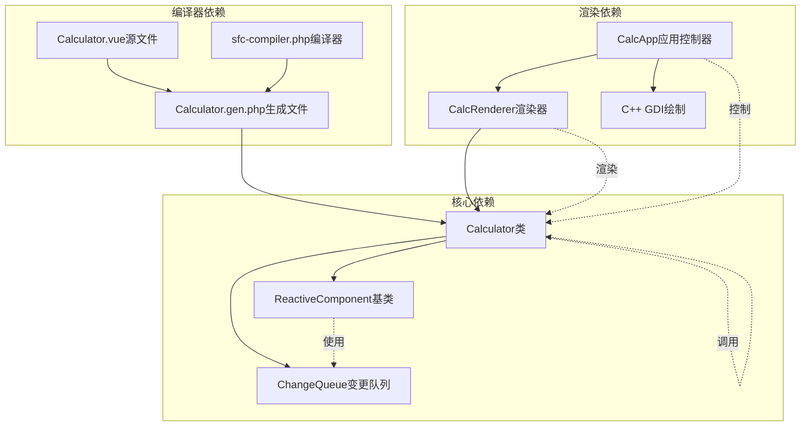

# backspace退格删除方法

<cite>
**本文引用的文件列表**
- [Calculator.vue](file://src/Calculator.vue)
- [Calculator.gen.php](file://src/Calculator.gen.php)
- [ReactiveComponent.php](file://src/ReactiveComponent.php)
- [main.php](file://main.php)
- [ChangeQueue.php](file://src/ChangeQueue.php)
- [sfc-compiler.php](file://tools/sfc-compiler.php)
</cite>

## 目录
1. [简介](#简介)
2. [项目结构](#项目结构)
3. [核心组件](#核心组件)
4. [架构概览](#架构概览)
5. [详细组件分析](#详细组件分析)
6. [依赖关系分析](#依赖关系分析)
7. [性能考虑](#性能考虑)
8. [故障排除指南](#故障排除指南)
9. [结论](#结论)

## 简介

本文档深入分析Vue计算器项目中的backspace退格删除方法实现。该方法负责处理用户点击"<-"按钮时的字符删除逻辑，包括新输入状态保护、'Error'状态特殊处理、单字符删除的'0'回退逻辑、小数点删除的hasDecimal标志同步更新等功能。

该项目采用Vue-like单文件组件架构，通过SFC编译器将.vue文件编译为PHP类文件，实现了完整的桌面计算器应用。backspace方法作为计算器的核心交互功能之一，需要精确处理各种边界情况和状态转换。

## 项目结构

Vue计算器项目采用分层架构设计，主要包含以下核心模块：



**图表来源**
- [sfc-compiler.php:1-210](file://tools/sfc-compiler.php#L1-L210)
- [Calculator.gen.php:1-174](file://src/Calculator.gen.php#L1-L174)
- [ReactiveComponent.php:1-35](file://src/ReactiveComponent.php#L1-L35)

**章节来源**
- [sfc-compiler.php:1-210](file://tools/sfc-compiler.php#L1-L210)
- [Calculator.gen.php:1-174](file://src/Calculator.gen.php#L1-L174)
- [main.php:1-291](file://main.php#L1-L291)

## 核心组件

### Calculator类结构

Calculator类是整个应用的核心，继承自ReactiveComponent基类，包含了完整的计算器逻辑实现：



**图表来源**
- [Calculator.gen.php:9-174](file://src/Calculator.gen.php#L9-L174)
- [ReactiveComponent.php:11-35](file://src/ReactiveComponent.php#L11-L35)
- [main.php:26-259](file://main.php#L26-L259)
- [ChangeQueue.php:11-57](file://src/ChangeQueue.php#L11-L57)

**章节来源**
- [Calculator.gen.php:9-174](file://src/Calculator.gen.php#L9-L174)
- [ReactiveComponent.php:11-35](file://src/ReactiveComponent.php#L11-L35)
- [main.php:26-259](file://main.php#L26-L259)

## 架构概览

### 数据流架构

Vue计算器采用数据驱动的渲染架构，backspace方法的调用流程如下：



**图表来源**
- [main.php:244-258](file://main.php#L244-L258)
- [Calculator.gen.php:131-147](file://src/Calculator.gen.php#L131-L147)
- [ReactiveComponent.php:19-20](file://src/ReactiveComponent.php#L19-L20)
- [ChangeQueue.php:24-33](file://src/ChangeQueue.php#L24-L33)

### 状态管理机制

backspace方法依赖于多个状态变量来确保正确的删除行为：

```mermaid
stateDiagram-v2
[*] --> NormalState
[*] --> NewInputState
[*] --> ErrorState
NormalState --> NormalState : "正常输入"
NormalState --> NewInputState : "输入运算符"
NormalState --> ErrorState : "除零错误"
NewInputState --> NormalState : "输入数字"
NewInputState --> NewInputState : "继续新输入"
ErrorState --> NormalState : "按C重置"
ErrorState --> ErrorState : "阻止删除"
note right of NormalState : "display : '0' 或其他数值<br/>newInput : false<br/>hasDecimal : true/false"
note right of NewInputState : "display : '0'<br/>newInput : true<br/>hasDecimal : false"
note right of ErrorState : "display : 'Error'<br/>newInput : true<br/>hasDecimal : false"
```

**图表来源**
- [Calculator.gen.php:133-135](file://src/Calculator.gen.php#L133-L135)
- [Calculator.gen.php:167-169](file://src/Calculator.gen.php#L167-L169)

**章节来源**
- [Calculator.gen.php:131-147](file://src/Calculator.gen.php#L131-L147)
- [Calculator.gen.php:164-181](file://src/Calculator.gen.php#L164-L181)

## 详细组件分析

### backspace方法核心实现

backspace方法是计算器删除功能的核心实现，具有严格的边界条件检查和状态管理：

#### 方法签名与基本结构

backspace方法采用void返回类型，接收无参数，体现了其作为UI事件处理器的设计理念：



**图表来源**
- [Calculator.gen.php:131-147](file://src/Calculator.gen.php#L131-L147)
- [Calculator.vue:164-181](file://src/Calculator.vue#L164-L181)

#### 状态保护机制

backspace方法实现了多层次的状态保护，确保不会破坏应用程序的稳定状态：

1. **新输入状态保护**：当`newInput`为true时，表示正在等待新的输入序列，此时不应允许删除操作
2. **Error状态保护**：当显示值为'Error'时，表示之前发生了除零错误，此时也不应允许删除操作
3. **空状态保护**：当字符串长度小于等于1时，自动重置为'0'

这些保护机制通过早期返回模式实现，避免了不必要的状态修改。

#### 字符删除算法

删除算法采用字符串截取的方式，具有以下特点：

1. **安全的边界处理**：使用`strlen($this->display) - 1`确保不会越界访问
2. **原子性操作**：删除操作在单个步骤中完成，避免部分删除状态
3. **字符级精度**：支持删除任意Unicode字符，不仅仅是ASCII字符

#### 小数点标志同步

backspace方法正确处理了小数点删除时的`hasDecimal`标志同步：



**图表来源**
- [Calculator.gen.php:140-144](file://src/Calculator.gen.php#L140-L144)

#### dirty标记机制

backspace方法在每次成功删除后都会设置`dirty=true`，这是响应式渲染系统的关键：



**图表来源**
- [ReactiveComponent.php:20](file://src/ReactiveComponent.php#L20)
- [ChangeQueue.php:24-33](file://src/ChangeQueue.php#L24-L33)
- [main.php:214-221](file://main.php#L214-L221)

**章节来源**
- [Calculator.gen.php:131-147](file://src/Calculator.gen.php#L131-L147)
- [Calculator.vue:164-181](file://src/Calculator.vue#L164-L181)
- [ReactiveComponent.php:19-20](file://src/ReactiveComponent.php#L19-L20)

### 边界情况处理分析

#### 末尾小数点删除

当删除末尾的小数点时，系统会正确清除`hasDecimal`标志，确保后续输入小数点时能够重新启用小数点功能：

**处理流程**：
1. 检测到删除的是'.'字符
2. 将`hasDecimal`设置为false
3. 执行字符串截取删除
4. 触发重绘

#### 数字中间删除

删除数字中间的字符时，系统保持`hasDecimal`标志不变，确保小数点状态的一致性：

**处理流程**：
1. 获取最后一个字符
2. 如果不是'.'，保持`hasDecimal`不变
3. 执行删除操作
4. 触发重绘

#### 最后一位删除

当只剩下最后一位数字时，系统会将显示值重置为'0'，并设置`newInput=true`：

**处理流程**：
1. 检测到字符串长度<=1
2. 设置`display='0'`
3. 设置`newInput=true`
4. 触发重绘

#### Error状态特殊处理

当计算器处于'Error'状态时，任何删除操作都会被忽略：

**处理流程**：
1. 检测到`display==='Error'`
2. 直接返回，不执行任何操作
3. 保持Error状态不变

**章节来源**
- [Calculator.gen.php:133-147](file://src/Calculator.gen.php#L133-L147)
- [Calculator.vue:167-181](file://src/Calculator.vue#L167-L181)

## 依赖关系分析

### 组件间依赖关系

backspace方法的实现依赖于多个组件和类：



**图表来源**
- [Calculator.gen.php:9-174](file://src/Calculator.gen.php#L9-L174)
- [ReactiveComponent.php:11-35](file://src/ReactiveComponent.php#L11-L35)
- [ChangeQueue.php:11-57](file://src/ChangeQueue.php#L11-L57)
- [main.php:26-259](file://main.php#L26-L259)

### 状态变量依赖

backspace方法依赖于以下关键状态变量：

| 状态变量 | 类型 | 作用 | 影响范围 |
|---------|------|------|----------|
| `$display` | string | 当前显示值 | 所有显示相关操作 |
| `$newInput` | bool | 是否开始新输入 | 输入状态管理 |
| `$hasDecimal` | bool | 是否已输入小数点 | 小数点输入控制 |
| `$dirty` | bool | 是否需要重绘 | 渲染触发机制 |

**章节来源**
- [Calculator.gen.php:131-147](file://src/Calculator.gen.php#L131-L147)
- [Calculator.gen.php:13-27](file://src/Calculator.gen.php#L13-L27)

## 性能考虑

### 时间复杂度分析

backspace方法的时间复杂度为O(1)，因为：

1. **状态检查**：O(1) - 简单的布尔值比较
2. **字符串长度检查**：O(1) - 使用内置strlen函数
3. **字符访问**：O(1) - 直接索引访问
4. **字符串截取**：O(n) - n为剩余字符数量
5. **标志更新**：O(1) - 简单赋值操作

### 空间复杂度分析

backspace方法的空间复杂度为O(n)，其中n为删除后的字符串长度，主要消耗来自：

1. **字符串截取**：创建新的字符串副本
2. **临时变量**：存储最后一个字符
3. **方法栈帧**：局部变量和返回地址

### 优化建议

1. **避免重复字符串分配**：可以考虑使用StringBuilder模式
2. **批量状态更新**：减少多次dirty标记设置
3. **缓存字符串长度**：避免重复计算

## 故障排除指南

### 常见问题诊断

#### 删除操作无效

**可能原因**：
1. `newInput`状态为true
2. `display`状态为'Error'
3. 已经是最后一位字符

**解决方法**：
1. 检查计算器当前状态
2. 确认是否有正在进行的计算
3. 验证显示值格式

#### 小数点删除异常

**可能原因**：
1. `hasDecimal`标志未正确更新
2. 字符串截取位置错误
3. 状态同步问题

**解决方法**：
1. 检查字符检测逻辑
2. 验证字符串截取边界
3. 确认标志更新顺序

#### 渲染不更新

**可能原因**：
1. `dirty`标记未设置
2. 变更队列阻塞
3. 渲染器异常

**解决方法**：
1. 确认dirty标记设置
2. 检查变更队列状态
3. 验证渲染流程

**章节来源**
- [Calculator.gen.php:133-147](file://src/Calculator.gen.php#L133-L147)
- [ReactiveComponent.php:19-20](file://src/ReactiveComponent.php#L19-L20)
- [main.php:214-221](file://main.php#L214-L221)

## 结论

Vue计算器项目的backspace退格删除方法实现了完整的字符删除功能，具有以下特点：

1. **完善的边界条件处理**：正确处理新输入状态、Error状态、空状态等各种边界情况
2. **精确的状态同步**：确保小数点标志与显示值保持一致
3. **响应式的渲染机制**：通过dirty标记实现高效的重绘触发
4. **简洁的算法设计**：采用直观的字符串截取方式，易于理解和维护

该实现充分体现了Vue-like架构的优势，通过清晰的状态管理和事件驱动的交互模式，为用户提供流畅的计算器体验。backspace方法的设计既保证了功能的完整性，又保持了代码的简洁性和可维护性。