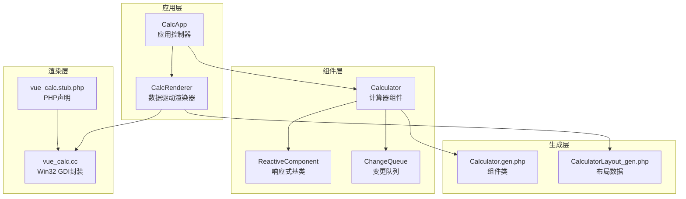
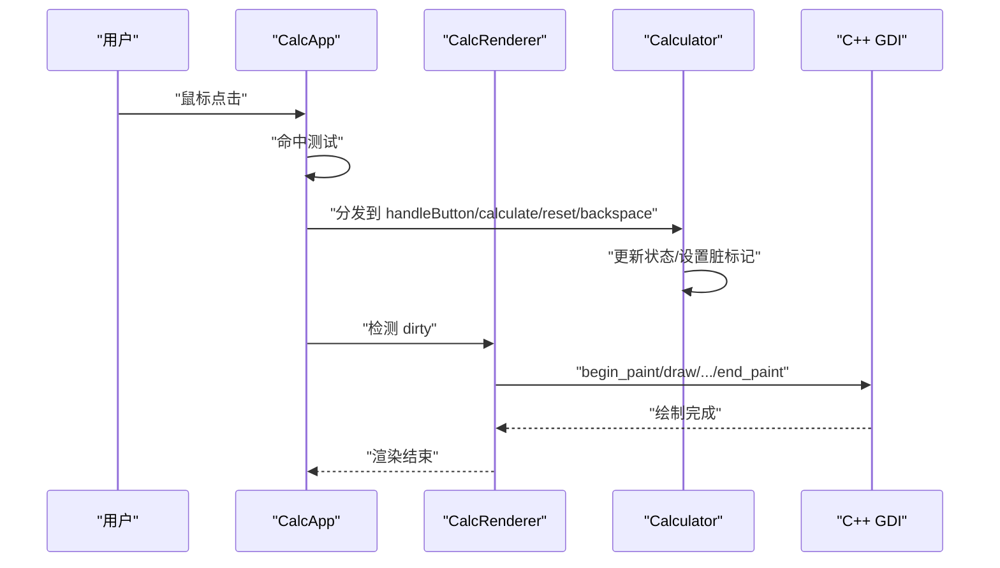
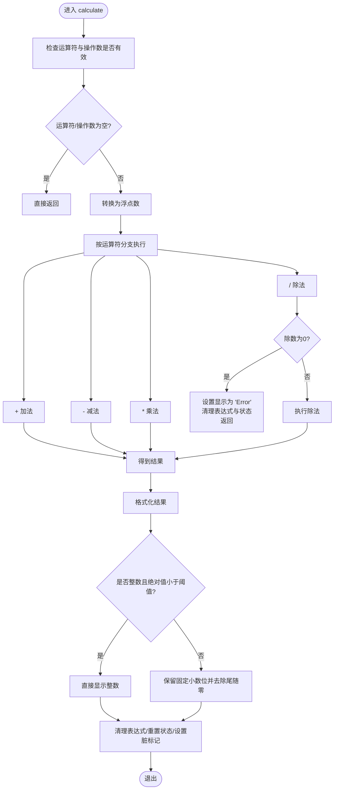
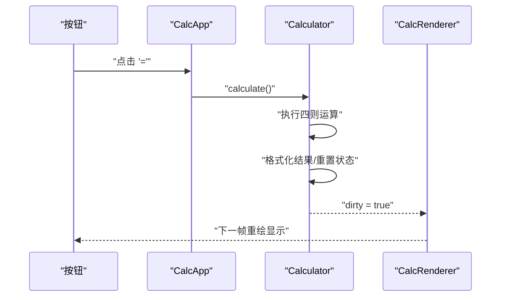
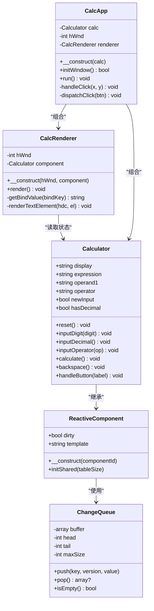

# calculate计算执行方法

<cite>
**本文引用的文件**
- [Calculator.vue](file://src/Calculator.vue)
- [Calculator.gen.php](file://src/Calculator.gen.php)
- [main.php](file://main.php)
- [CalculatorLayout_gen.php](file://src/CalculatorLayout_gen.php)
- [ReactiveComponent.php](file://src/ReactiveComponent.php)
- [ChangeQueue.php](file://src/ChangeQueue.php)
- [vue_calc.cc](file://cpp-src/vue_calc.cc)
- [vue_calc.stub.php](file://php-src/vue_calc.stub.php)
- [sfc-compiler.php](file://tools/sfc-compiler.php)
</cite>

## 目录
1. [简介](#简介)
2. [项目结构](#项目结构)
3. [核心组件](#核心组件)
4. [架构总览](#架构总览)
5. [详细组件分析](#详细组件分析)
6. [依赖关系分析](#依赖关系分析)
7. [性能考虑](#性能考虑)
8. [故障排除指南](#故障排除指南)
9. [结论](#结论)
10. [附录](#附录)

## 简介
本文聚焦于Vue计算器项目中的calculate计算执行方法，深入分析四则运算的完整实现，包括：
- 运算符分支判断与执行流程
- 浮点数运算的精度处理策略
- 除零错误的严格检查与错误恢复机制
- 结果格式化的智能处理（整数直接显示、小数精度控制、尾随零自动去除）
- 表达式清理、状态重置与显示格式化的完整流程
- 各种计算场景的处理策略，包括正常计算、溢出处理、精度丢失等

## 项目结构
该项目采用“单文件组件（SFC）+ AOT编译”的架构模式，前端逻辑由PHP实现，渲染层通过C++ GDI完成。核心文件组织如下：
- 源代码：src目录下的Calculator.vue、ReactiveComponent.php、ChangeQueue.php等
- 生成代码：由SFC编译器生成的Calculator.gen.php、CalculatorLayout_gen.php
- 渲染接口：php-src/vue_calc.stub.php（PHP侧声明）、cpp-src/vue_calc.cc（Win32 GDI封装）
- 应用入口：main.php，负责窗口初始化、事件循环与渲染

图表来源
- [main.php:26-133](file://main.php#L26-L133)
- [Calculator.gen.php:9-28](file://src/Calculator.gen.php#L9-L28)
- [CalculatorLayout_gen.php:10-296](file://src/CalculatorLayout_gen.php#L10-L296)
- [vue_calc.stub.php:12-24](file://php-src/vue_calc.stub.php#L12-L24)
- [vue_calc.cc:36-157](file://cpp-src/vue_calc.cc#L36-L157)

章节来源
- [main.php:1-291](file://main.php#L1-L291)
- [Calculator.gen.php:1-174](file://src/Calculator.gen.php#L1-L174)
- [CalculatorLayout_gen.php:1-296](file://src/CalculatorLayout_gen.php#L1-L296)
- [vue_calc.stub.php:1-24](file://php-src/vue_calc.stub.php#L1-L24)
- [vue_calc.cc:1-157](file://cpp-src/vue_calc.cc#L1-L157)

## 核心组件
- Calculator：实现计算器业务逻辑，包含输入处理、运算执行、状态管理与显示格式化。
- CalcRenderer：基于生成的布局数据，将组件状态映射到C++ GDI绘制。
- CalcApp：应用入口，负责窗口创建、消息循环与事件分发。
- ReactiveComponent/ChangeQueue：响应式框架基础，支持脏标记与变更队列。

章节来源
- [Calculator.gen.php:9-174](file://src/Calculator.gen.php#L9-L174)
- [main.php:26-259](file://main.php#L26-L259)
- [ReactiveComponent.php:11-35](file://src/ReactiveComponent.php#L11-L35)
- [ChangeQueue.php:11-57](file://src/ChangeQueue.php#L11-L57)

## 架构总览
应用的数据流与控制流如下：
- 用户点击按钮触发事件，CalcApp根据布局信息定位按钮并分发到Calculator的方法
- Calculator内部状态变更后设置脏标记，CalcRenderer在下一帧读取状态并调用C++绘制接口
- C++层仅提供Win32 API封装，所有业务逻辑在PHP端实现

图表来源
- [main.php:230-259](file://main.php#L230-L259)
- [main.php:99-133](file://main.php#L99-L133)
- [Calculator.gen.php:149-168](file://src/Calculator.gen.php#L149-L168)

章节来源
- [main.php:139-259](file://main.php#L139-L259)
- [Calculator.gen.php:149-168](file://src/Calculator.gen.php#L149-L168)

## 详细组件分析

### calculate计算执行方法详解
calculate方法是四则运算的核心执行入口，负责：
- 参数校验（运算符与操作数）
- 四则运算分支判断
- 除零错误检查与错误恢复
- 结果格式化与状态重置

图表来源
- [Calculator.gen.php:85-128](file://src/Calculator.gen.php#L85-L128)
- [Calculator.vue:119-162](file://src/Calculator.vue#L119-L162)

章节来源
- [Calculator.gen.php:85-128](file://src/Calculator.gen.php#L85-L128)
- [Calculator.vue:119-162](file://src/Calculator.vue#L119-L162)

#### 运算符分支判断
- 支持的运算符：加法（+）、减法（-）、乘法（*）、除法（/）
- 使用顺序判断（elseif链）进行分支选择，简洁高效
- 在输入运算符时，若存在未完成的计算，会先触发一次计算再继续

章节来源
- [Calculator.gen.php:96-114](file://src/Calculator.gen.php#L96-L114)
- [Calculator.vue:107-117](file://src/Calculator.vue#L107-L117)

#### 浮点数运算与精度处理
- 输入与中间结果统一转换为浮点数，确保运算一致性
- 结果格式化策略：
  - 整数条件：结果等于其整数形式且绝对值小于阈值时，直接以字符串形式显示整数
  - 小数条件：使用固定精度格式化，并去除尾随零；同时去除可能存在的多余小数点
- 该策略兼顾了显示美观与数值准确性

章节来源
- [Calculator.gen.php:116-120](file://src/Calculator.gen.php#L116-L120)
- [Calculator.vue:150-154](file://src/Calculator.vue#L150-L154)

#### 除零错误的严格检查与错误恢复
- 在除法运算前检查除数是否为零
- 若为零，立即设置显示为错误提示，清空表达式与当前运算状态，并返回
- 该机制确保了程序的健壮性，避免无效计算与后续状态污染

章节来源
- [Calculator.gen.php:103-114](file://src/Calculator.gen.php#L103-L114)
- [Calculator.vue:137-148](file://src/Calculator.vue#L137-L148)

#### 结果格式化的智能处理
- 整数直接显示：当结果为整数且数值范围合理时，避免显示不必要的小数部分
- 小数精度控制：固定保留一定小数位，随后去除尾随零，保证显示整洁
- 尾随零自动去除：通过格式化与修剪相结合的方式，消除无意义的零
- 状态重置：计算完成后清空表达式、重置运算符与第一个操作数，准备下一次输入

章节来源
- [Calculator.gen.php:116-127](file://src/Calculator.gen.php#L116-L127)
- [Calculator.vue:155-161](file://src/Calculator.vue#L155-L161)

#### 表达式清理、状态重置与显示格式化流程
- 表达式清理：计算完成后清空表达式字符串，避免残留
- 状态重置：重置运算符、第一个操作数，开启新输入模式
- 显示格式化：根据结果类型与精度策略更新显示值
- 脏标记：每次状态变更后设置脏标记，驱动渲染器下一帧重绘

章节来源
- [Calculator.gen.php:122-128](file://src/Calculator.gen.php#L122-L128)
- [Calculator.vue:156-162](file://src/Calculator.vue#L156-L162)

### 相关方法与交互
- handleButton：统一的按钮事件入口，根据标签分发到具体方法（reset、backspace、calculate、inputOperator、inputDigit、inputDecimal）
- inputOperator：在连续运算时自动触发一次计算，确保表达式的正确性
- backspace：支持退格删除，特殊处理小数点状态

图表来源
- [main.php:244-258](file://main.php#L244-L258)
- [Calculator.gen.php:149-168](file://src/Calculator.gen.php#L149-L168)

章节来源
- [Calculator.gen.php:149-168](file://src/Calculator.gen.php#L149-L168)
- [Calculator.vue:183-202](file://src/Calculator.vue#L183-L202)
- [main.php:244-258](file://main.php#L244-L258)

## 依赖关系分析
- Calculator依赖ReactiveComponent提供的响应式框架能力，通过脏标记驱动渲染
- CalcRenderer依赖生成的布局数据与C++绘制接口，实现数据驱动的界面渲染
- CalcApp负责事件分发与渲染调度，连接用户交互与组件状态

图表来源
- [Calculator.gen.php:9-174](file://src/Calculator.gen.php#L9-L174)
- [ReactiveComponent.php:11-35](file://src/ReactiveComponent.php#L11-L35)
- [ChangeQueue.php:11-57](file://src/ChangeQueue.php#L11-L57)
- [main.php:26-259](file://main.php#L26-L259)

章节来源
- [Calculator.gen.php:9-174](file://src/Calculator.gen.php#L9-L174)
- [ReactiveComponent.php:11-35](file://src/ReactiveComponent.php#L11-L35)
- [ChangeQueue.php:11-57](file://src/ChangeQueue.php#L11-L57)
- [main.php:26-259](file://main.php#L26-L259)

## 性能考虑
- 浮点数运算：统一转换为浮点数，避免混合类型运算带来的额外开销
- 格式化策略：固定精度与尾随零去除减少字符串处理成本
- 脏标记机制：仅在状态变更时触发重绘，降低渲染频率
- 渲染优化：动态字号与右对齐计算在渲染阶段完成，避免重复计算

## 故障排除指南
- 除零错误：当除数为零时，显示错误提示并重置状态，避免后续计算异常
- 状态污染：计算完成后清空表达式与运算符，防止残留状态影响下一次输入
- 输入限制：在新输入模式或错误状态下禁用退格，避免破坏状态一致性
- AOT兼容性：放弃魔术方法，使用直接属性与手动脏标记，确保编译产物稳定

章节来源
- [Calculator.gen.php:103-114](file://src/Calculator.gen.php#L103-L114)
- [Calculator.gen.php:133-147](file://src/Calculator.gen.php#L133-L147)
- [main.php:49-94](file://main.php#L49-L94)

## 结论
calculate方法通过清晰的分支判断、严格的错误检查与智能的结果格式化，实现了稳定可靠的四则运算。配合响应式框架与数据驱动渲染，项目在AOT环境下保持了良好的可维护性与可扩展性。建议在未来版本中进一步增强边界条件处理与国际化支持，以提升用户体验。

## 附录
- SFC编译器：将.vue组件编译为PHP类与布局数据，支持AOT验证与生成
- 渲染接口：通过PHP声明与C++封装，实现跨语言的GDI绘制

章节来源
- [sfc-compiler.php:1-210](file://tools/sfc-compiler.php#L1-L210)
- [CalculatorLayout_gen.php:10-296](file://src/CalculatorLayout_gen.php#L10-L296)
- [vue_calc.stub.php:12-24](file://php-src/vue_calc.stub.php#L12-L24)
- [vue_calc.cc:36-157](file://cpp-src/vue_calc.cc#L36-L157)