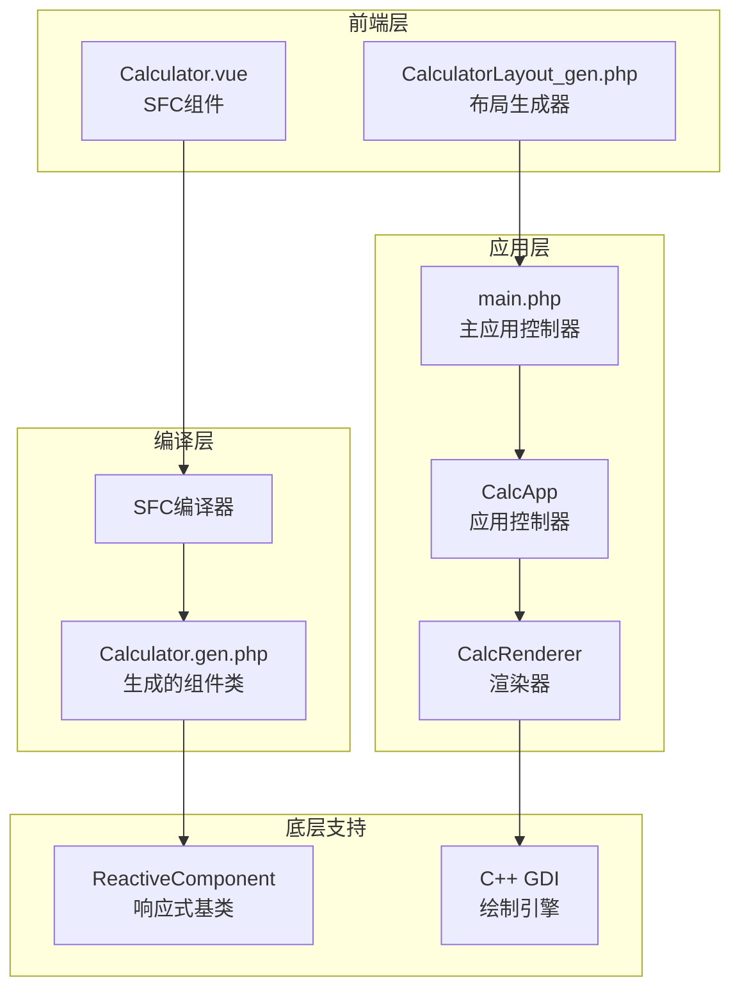
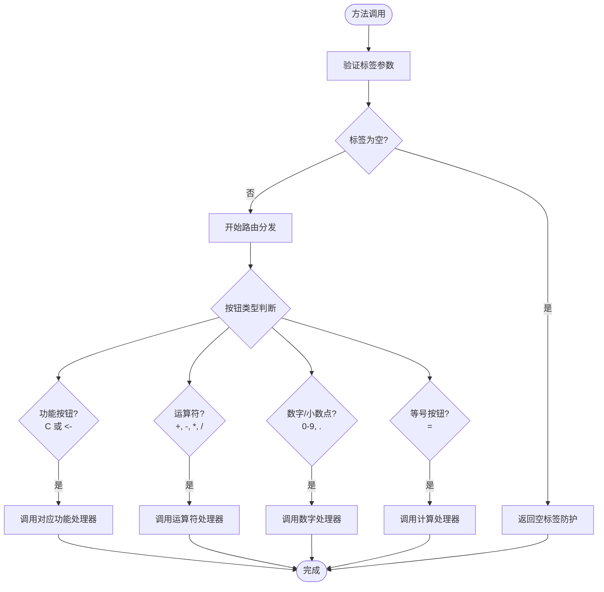
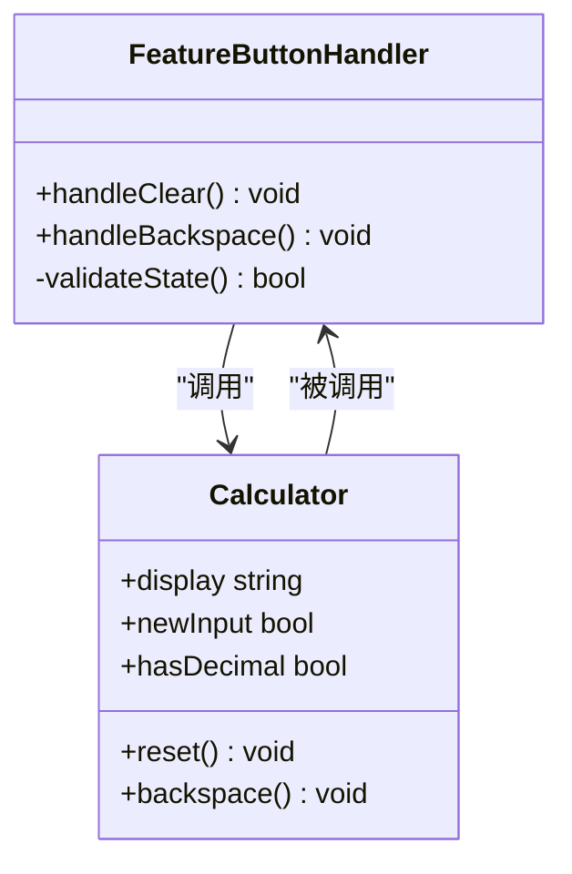
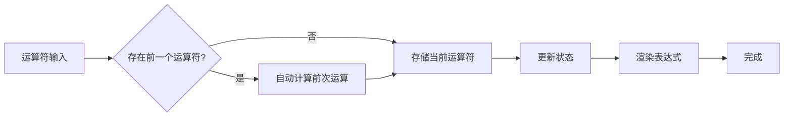
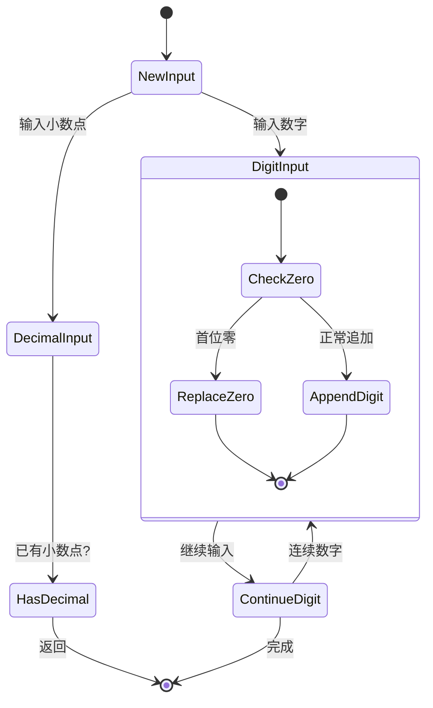
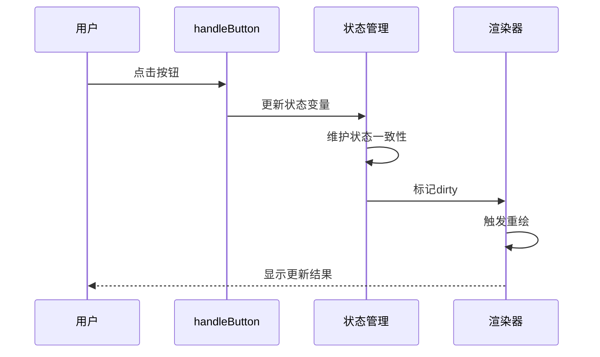
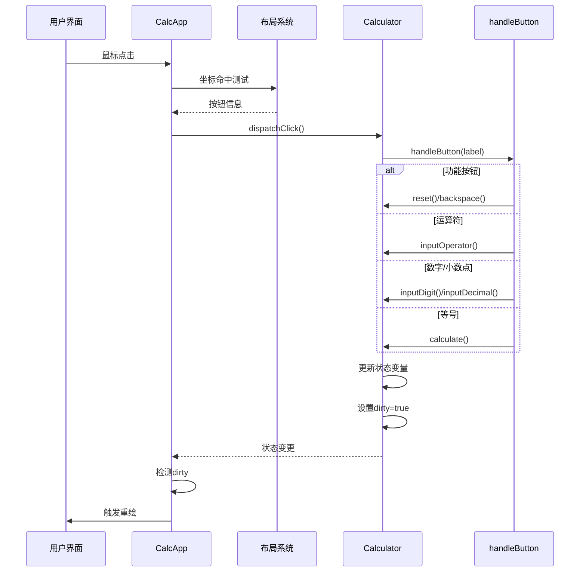

# handleButton按钮处理方法

<cite>
**本文档引用的文件**
- [Calculator.vue](file://src/Calculator.vue)
- [Calculator.gen.php](file://src/Calculator.gen.php)
- [CalculatorLayout_gen.php](file://src/CalculatorLayout_gen.php)
- [main.php](file://main.php)
- [project.yml](file://project.yml)
</cite>

## 目录
1. [简介](#简介)
2. [项目结构概览](#项目结构概览)
3. [handleButton方法架构](#handlebutton方法架构)
4. [按钮类型分类处理](#按钮类型分类处理)
5. [状态管理与一致性保证](#状态管理与一致性保证)
6. [详细处理流程分析](#详细处理流程分析)
7. [错误处理与边界情况](#错误处理与边界情况)
8. [性能考虑](#性能考虑)
9. [故障排除指南](#故障排除指南)
10. [结论](#结论)

## 简介

VueCalc是一个基于SFC（Single File Component）编译器的类Vue数据驱动桌面计算器。本文档深入分析`handleButton`按钮统一处理方法的实现，该方法作为计算器的核心入口，负责将用户点击的按钮标签路由到相应的具体处理方法。

该计算器采用独特的混合架构：PHP实现业务逻辑和响应式框架，C++（GDI）负责界面渲染，通过Swoole AOT编译器生成原生Windows可执行文件。`handleButton`方法在这一架构中扮演着至关重要的角色，实现了按钮标签到具体方法的统一路由分发机制。

## 项目结构概览

VueCalc项目采用模块化设计，主要包含以下核心组件：



**图表来源**
- [Calculator.vue:1-215](file://src/Calculator.vue#L1-L215)
- [Calculator.gen.php:1-174](file://src/Calculator.gen.php#L1-L174)
- [main.php:1-291](file://main.php#L1-L291)

**章节来源**
- [project.yml:1-10](file://project.yml#L1-L10)
- [main.php:1-291](file://main.php#L1-L291)

## handleButton方法架构

`handleButton`方法是计算器的统一入口点，实现了完整的按钮处理逻辑。该方法采用条件分支模式，根据传入的按钮标签进行相应的路由分发。

### 方法签名与参数



**图表来源**
- [Calculator.gen.php:149-168](file://src/Calculator.gen.php#L149-L168)
- [Calculator.vue:183-202](file://src/Calculator.vue#L183-L202)

### 核心处理流程

`handleButton`方法的核心处理流程遵循以下顺序：

1. **空标签防护**：首先检查传入的标签是否为空，防止无效调用
2. **功能按钮处理**：识别并处理特殊功能按钮（清除、退格）
3. **运算符处理**：统一处理四则运算符
4. **数字输入处理**：分类处理数字和小数点输入
5. **等号计算处理**：执行计算操作

**章节来源**
- [Calculator.gen.php:150-168](file://src/Calculator.gen.php#L150-L168)
- [Calculator.vue:184-202](file://src/Calculator.vue#L184-L202)

## 按钮类型分类处理

计算器将按钮分为四大类别，每类都有专门的处理逻辑：

### 功能按钮处理

功能按钮包括清除（C）和退格（<-）两个特殊功能：



**图表来源**
- [Calculator.gen.php:29-39](file://src/Calculator.gen.php#L29-L39)
- [Calculator.gen.php:130-147](file://src/Calculator.gen.php#L130-L147)

### 运算符按钮处理

运算符按钮统一通过`inputOperator`方法处理，支持四种基本运算：
- 加法（+）
- 减法（-）
- 乘法（*）
- 除法（/）



**图表来源**
- [Calculator.gen.php:72-83](file://src/Calculator.gen.php#L72-L83)
- [Calculator.gen.php:106-117](file://src/Calculator.gen.php#L106-L117)

### 数字和小数点处理

数字输入处理逻辑相对复杂，需要维护多个状态标志：



**图表来源**
- [Calculator.gen.php:41-56](file://src/Calculator.gen.php#L41-L56)
- [Calculator.gen.php:58-70](file://src/Calculator.gen.php#L58-L70)

**章节来源**
- [Calculator.gen.php:41-168](file://src/Calculator.gen.php#L41-L168)
- [Calculator.vue:75-202](file://src/Calculator.vue#L75-L202)

## 状态管理与一致性保证

### 状态变量体系

计算器使用多个状态变量确保操作的一致性和正确性：

| 状态变量 | 类型 | 描述 | 作用域 |
|---------|------|------|--------|
| `display` | string | 当前显示值 | 全局显示 |
| `expression` | string | 表达式文本 | 显示区上方 |
| `operand1` | string | 第一个操作数 | 运算状态 |
| `operator` | string | 当前运算符 | 运算状态 |
| `newInput` | bool | 是否开始新输入 | 输入控制 |
| `hasDecimal` | bool | 是否已输入小数点 | 输入控制 |

### 状态转换保证



**图表来源**
- [Calculator.gen.php:170-174](file://src/Calculator.gen.php#L170-L174)
- [main.php:213-224](file://main.php#L213-L224)

### 顺序性保证机制

为了确保操作的顺序性和状态一致性，系统采用了以下机制：

1. **单线程处理**：所有按钮点击事件按顺序处理
2. **状态原子性**：每个处理步骤都是原子性的状态变更
3. **脏标记系统**：通过`dirty`标志确保渲染的及时性
4. **状态验证**：在关键操作前验证状态的有效性

**章节来源**
- [main.php:171-227](file://main.php#L171-L227)
- [Calculator.gen.php:170-174](file://src/Calculator.gen.php#L170-L174)

## 详细处理流程分析

### 完整处理序列图



**图表来源**
- [main.php:229-258](file://main.php#L229-L258)
- [Calculator.gen.php:149-168](file://src/Calculator.gen.php#L149-L168)

### 具体处理示例

#### 示例1：连续数字输入
当用户连续输入数字"123"时的处理流程：

1. 第一次点击'1'：`newInput=true`，设置显示为"1"
2. 第二次点击'2'：`newInput=false`，显示变为"12"
3. 第三次点击'3'：`newInput=false`，显示变为"123"

#### 示例2：小数点输入
当用户输入"3.14"时的处理流程：

1. 输入'3'：显示"3"
2. 输入'.'：如果`hasDecimal=false`，显示变为"3."
3. 输入'1'：显示变为"3.1"
4. 输入'4'：显示变为"3.14"

#### 示例3：运算符链式处理
当用户输入"5+3*"时的处理流程：

1. 输入'5'：存储为operand1
2. 输入'+'：触发计算，结果显示"8"
3. 输入'*'：存储运算符"*"，表达式显示"8 *"

**章节来源**
- [Calculator.gen.php:41-168](file://src/Calculator.gen.php#L41-L168)
- [Calculator.vue:75-202](file://src/Calculator.vue#L75-L202)

## 错误处理与边界情况

### 空标签防护

`handleButton`方法首先检查传入的标签是否为空，这是防止无效调用的重要防护措施：

```php
if ($label === '') {
    return;
}
```

### 除零错误处理

在执行除法运算时，系统会检查除数是否为零：

```php
if ($op === '/') {
    if ($b == 0.0) {
        // 错误处理：显示错误信息并重置状态
        $this->display = 'Error';
        $this->expression = '';
        $this->reset();
        return;
    }
    $result = $a / $b;
}
```

### 状态边界检查

系统在多个关键位置进行状态边界检查：

```php
// 退格操作的状态检查
if ($this->newInput || $this->display === 'Error') {
    return;
}

// 计算操作的前置检查
if ($this->operator === '' || $this->operand1 === '') {
    return;
}
```

### 精度和格式处理

系统采用智能精度处理策略：

```php
if ($result == (float)(int)$result && abs($result) < 1000000000) {
    $this->display = (string)(int)$result;
} else {
    $this->display = rtrim(rtrim(sprintf('%.8f', $result), '0'), '.');
}
```

**章节来源**
- [Calculator.gen.php:130-168](file://src/Calculator.gen.php#L130-L168)
- [Calculator.vue:120-162](file://src/Calculator.vue#L120-L162)

## 性能考虑

### 渲染优化

系统采用数据驱动渲染模式，通过脏标记机制优化渲染性能：

```php
// 仅在状态变更时触发渲染
if ($this->calc->dirty) {
    $this->renderer->render();
    $this->calc->dirty = false;
}
```

### 内存管理

计算器使用固定大小的状态变量，避免动态内存分配：

- `display`: 最多12字符的字符串
- `expression`: 最多16字符的字符串  
- `operand1`: 最多12字符的字符串
- `operator`: 单字符字符串

### 计算效率

运算符处理采用直接计算模式，避免复杂的表达式解析：

```php
$result = 0.0;
$op = $this->operator;
if ($op === '+') {
    $result = $a + $b;
} elseif ($op === '-') {
    $result = $a - $b;
} elseif ($op === '*') {
    $result = $a * $b;
} elseif ($op === '/') {
    $result = $a / $b;
}
```

## 故障排除指南

### 常见问题诊断

#### 问题1：按钮点击无响应
**可能原因**：
- 空标签传递
- 布局坐标计算错误
- 窗口消息处理异常

**解决方案**：
1. 检查按钮标签是否为空
2. 验证布局坐标范围
3. 查看窗口消息处理日志

#### 问题2：显示异常
**可能原因**：
- 状态变量同步问题
- 脏标记未正确设置
- 渲染器缓存问题

**解决方案**：
1. 确认每个状态变更后都设置`dirty=true`
2. 检查状态变量的原子性更新
3. 重新初始化渲染器

#### 问题3：计算结果错误
**可能原因**：
- 除零错误未正确处理
- 浮点精度问题
- 状态检查遗漏

**解决方案**：
1. 添加除零检查和错误处理
2. 使用适当的浮点比较
3. 完善状态验证逻辑

### 调试技巧

1. **启用详细日志**：在关键状态变更处添加日志输出
2. **状态快照**：定期记录状态变量的值
3. **单元测试**：为每个按钮类型编写测试用例
4. **边界测试**：测试极端输入情况

**章节来源**
- [main.php:192-198](file://main.php#L192-L198)
- [Calculator.gen.php:149-168](file://src/Calculator.gen.php#L149-L168)

## 结论

`handleButton`按钮处理方法是VueCalc项目的核心组件，它成功地实现了以下目标：

1. **统一入口**：所有按钮点击通过单一方法处理，简化了代码结构
2. **类型安全**：通过明确的类型检查确保处理逻辑的正确性
3. **状态一致性**：完善的状态管理和边界检查保证了系统的稳定性
4. **性能优化**：采用数据驱动渲染和脏标记机制提升了性能
5. **错误处理**：全面的错误处理和边界情况处理增强了系统的鲁棒性

该方法的设计充分考虑了Swoole AOT编译环境的限制，采用了纯PHP实现和手动状态管理，避免了魔术方法和反射等在AOT环境中不可靠的特性。通过精心设计的状态变量体系和严格的边界检查，确保了计算器在各种使用场景下的稳定性和准确性。

未来可以考虑的改进方向包括：
- 增加更多数学函数支持
- 实现撤销/重做功能
- 优化大数字处理的精度
- 增强用户体验的交互反馈