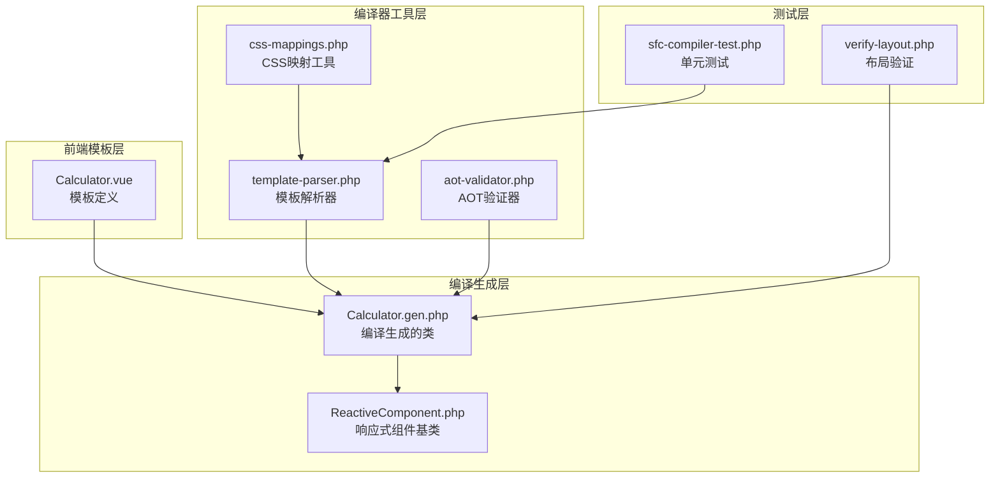
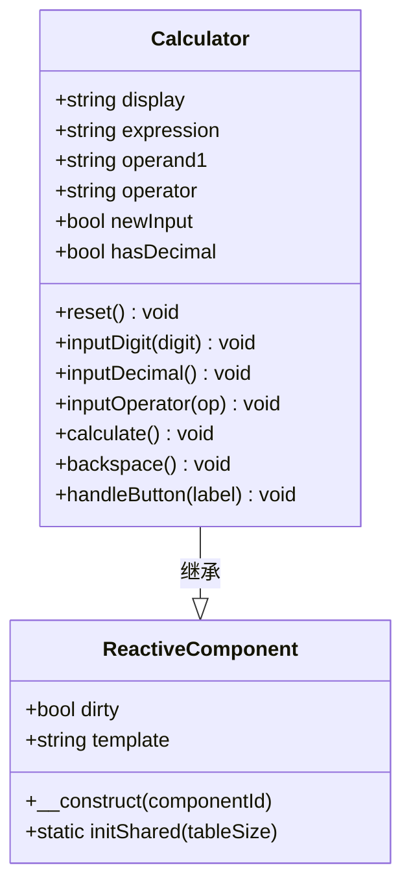
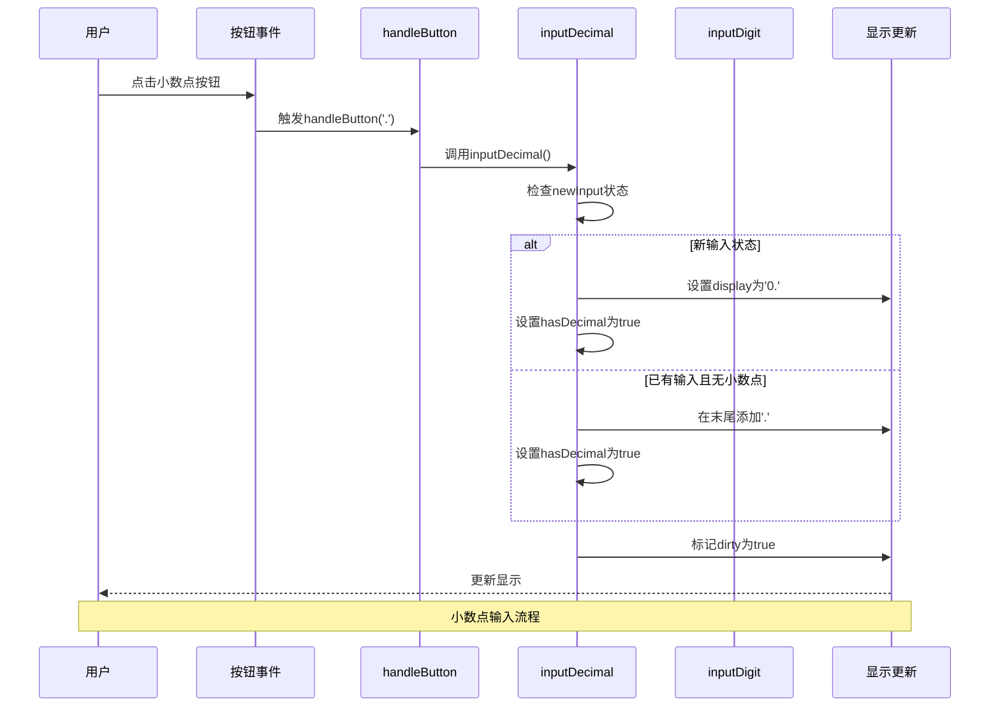
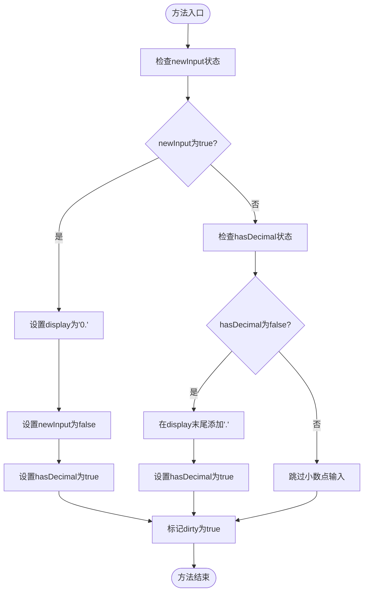
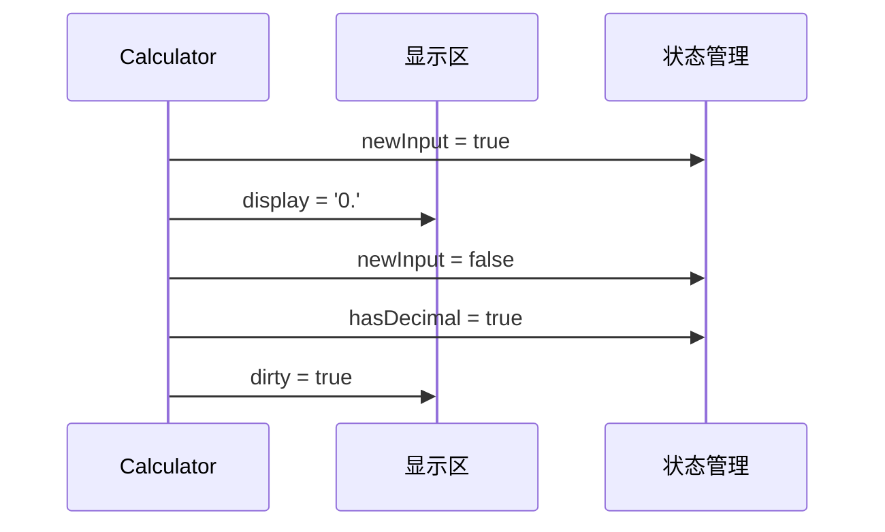
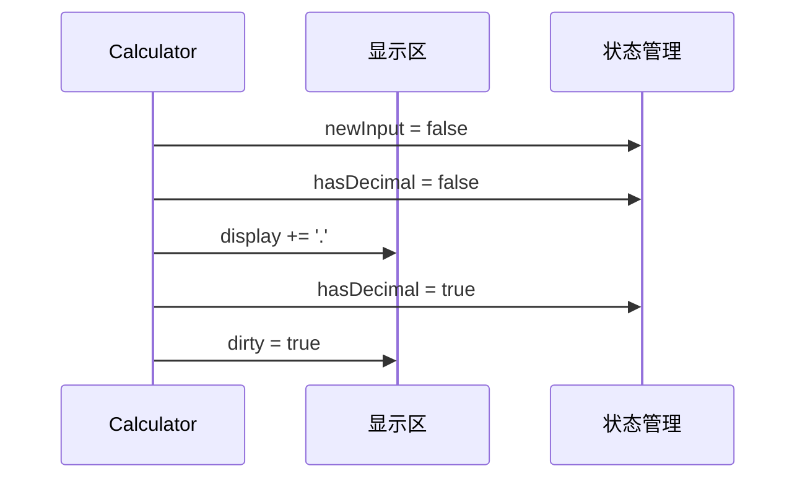
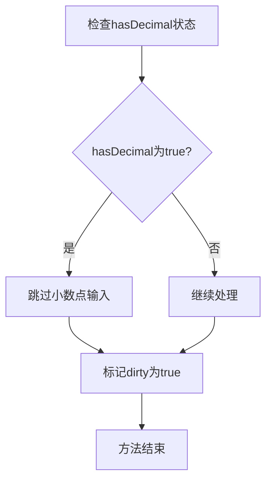
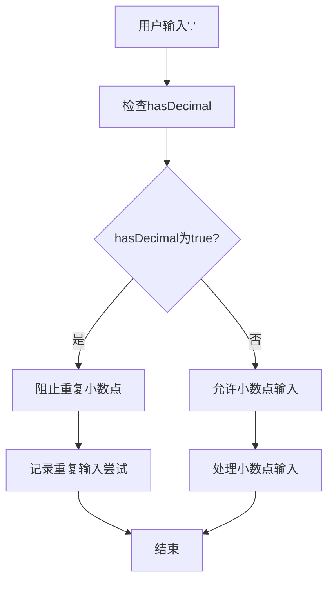

# inputDecimal小数点方法

<cite>
**本文档引用的文件**
- [Calculator.vue](file://src/Calculator.vue)
- [Calculator.gen.php](file://src/Calculator.gen.php)
- [ReactiveComponent.php](file://src/ReactiveComponent.php)
- [template-parser.php](file://tools/compiler/template-parser.php)
</cite>

## 目录
1. [简介](#简介)
2. [项目结构概览](#项目结构概览)
3. [核心组件分析](#核心组件分析)
4. [架构总览](#架构总览)
5. [inputDecimal方法详细分析](#inputdecimal方法详细分析)
6. [边界情况处理](#边界情况处理)
7. [算法复杂度分析](#算法复杂度分析)
8. [性能考虑](#性能考虑)
9. [故障排除指南](#故障排除指南)
10. [结论](#结论)

## 简介

本文档深入分析了Vue计算器项目中inputDecimal小数点处理方法的实现细节。该方法负责处理用户输入小数点的特殊逻辑，包括新输入时的'0.'初始化格式、hasDecimal标志防止重复小数点的检查机制，以及现有小数点的跳过策略。文档将详细解释小数点输入与数字输入的区别处理方式，以及如何维护数值的有效性。

## 项目结构概览

Vue计算器项目采用响应式组件架构，主要包含以下关键文件：



**图表来源**
- [Calculator.vue:1-215](file://src/Calculator.vue#L1-L215)
- [Calculator.gen.php:1-174](file://src/Calculator.gen.php#L1-L174)
- [ReactiveComponent.php:1-35](file://src/ReactiveComponent.php#L1-L35)

**章节来源**
- [Calculator.vue:1-215](file://src/Calculator.vue#L1-L215)
- [Calculator.gen.php:1-174](file://src/Calculator.gen.php#L1-L174)
- [ReactiveComponent.php:1-35](file://src/ReactiveComponent.php#L1-L35)

## 核心组件分析

### Calculator类结构

Calculator类继承自ReactiveComponent基类，实现了完整的计算器功能。其核心属性包括：



**图表来源**
- [ReactiveComponent.php:11-34](file://src/ReactiveComponent.php#L11-L34)
- [Calculator.gen.php:9-174](file://src/Calculator.gen.php#L9-L174)

### 关键状态变量

Calculator类维护了以下关键状态变量：

| 属性名 | 类型 | 默认值 | 用途 |
|--------|------|--------|------|
| display | string | '0' | 当前显示值 |
| expression | string | '' | 表达式显示 |
| operand1 | string | '' | 第一个操作数 |
| operator | string | '' | 当前运算符 |
| newInput | bool | true | 是否开始新输入 |
| hasDecimal | bool | false | 是否已输入小数点 |

**章节来源**
- [Calculator.gen.php:11-27](file://src/Calculator.gen.php#L11-L27)
- [Calculator.vue:45-61](file://src/Calculator.vue#L45-L61)

## 架构总览

Vue计算器采用MVC架构模式，结合编译器生成机制：



**图表来源**
- [Calculator.vue:184-202](file://src/Calculator.vue#L184-L202)
- [Calculator.gen.php:58-70](file://src/Calculator.gen.php#L58-L70)

## inputDecimal方法详细分析

### 方法签名与实现

inputDecimal方法是处理小数点输入的核心函数，其实现逻辑如下：



**图表来源**
- [Calculator.vue:92-104](file://src/Calculator.vue#L92-L104)
- [Calculator.gen.php:58-70](file://src/Calculator.gen.php#L58-L70)

### 三种处理分支详解

#### 分支一：新输入状态处理

当计算器处于新输入状态时，inputDecimal方法执行'0.'初始化格式：



**图表来源**
- [Calculator.vue:95-98](file://src/Calculator.vue#L95-L98)
- [Calculator.gen.php:61-64](file://src/Calculator.gen.php#L61-L64)

#### 分支二：已有输入且无小数点处理

当存在已有输入且尚未输入小数点时，方法在字符串末尾添加小数点：



**图表来源**
- [Calculator.vue:99-102](file://src/Calculator.vue#L99-L102)
- [Calculator.gen.php:65-68](file://src/Calculator.gen.php#L65-L68)

#### 分支三：重复小数点防护

当检测到hasDecimal为true时，方法直接跳过小数点输入，防止重复小数点：



**图表来源**
- [Calculator.vue:99](file://src/Calculator.vue#L99)
- [Calculator.gen.php:65](file://src/Calculator.gen.php#L65)

**章节来源**
- [Calculator.vue:92-104](file://src/Calculator.vue#L92-L104)
- [Calculator.gen.php:58-70](file://src/Calculator.gen.php#L58-L70)

## 边界情况处理

### 开头小数点场景

当用户在数字序列开始处输入小数点时，系统会自动添加'0.'前缀：

| 输入序列 | 处理步骤 | 结果 |
|----------|----------|------|
| . | newInput=true, hasDecimal=false | display='0.' |
| .5 | newInput=false, hasDecimal=false | display='0.5' |
| .123 | newInput=false, hasDecimal=false | display='0.123' |

### 中间小数点场景

当小数点位于数字序列中间时，系统会在当前位置插入小数点：

| 输入序列 | 处理步骤 | 结果 |
|----------|----------|------|
| 5. | newInput=false, hasDecimal=true | 跳过输入 |
| 5.3 | newInput=false, hasDecimal=true | 跳过输入 |
| 53. | newInput=false, hasDecimal=true | 跳过输入 |

### 重复小数点场景

系统通过hasDecimal标志严格防止重复小数点输入：



**图表来源**
- [Calculator.vue:99](file://src/Calculator.vue#L99)
- [Calculator.gen.php:65](file://src/Calculator.gen.php#L65)

### 数字输入与小数点输入的区别

inputDigit和inputDecimal方法在处理逻辑上的关键区别：

| 特性 | inputDigit | inputDecimal |
|------|------------|--------------|
| 输入类型 | 数字字符 | 小数点'.' |
| 新输入处理 | 替换整个显示 | 初始化'0.' |
| 现有输入处理 | 追加到末尾 | 追加'.'到末尾 |
| 重复防护 | 无 | 通过hasDecimal防护 |
| 状态更新 | hasDecimal=false | hasDecimal=true |

**章节来源**
- [Calculator.vue:75-90](file://src/Calculator.vue#L75-L90)
- [Calculator.gen.php:41-56](file://src/Calculator.gen.php#L41-L56)

## 算法复杂度分析

### 时间复杂度

inputDecimal方法的时间复杂度为O(1)，因为：
- 状态检查：O(1)
- 字符串赋值：O(1)
- 布尔标志设置：O(1)
- 状态标记：O(1)

### 空间复杂度

空间复杂度同样为O(1)，因为：
- 仅使用固定数量的局部变量
- 不创建新的数据结构
- 字符串操作在原地进行

### 性能特征

- **常量时间操作**：所有操作都是O(1)时间复杂度
- **内存效率**：不分配额外内存
- **状态一致性**：确保hasDecimal标志与display状态同步
- **原子性**：单个方法调用内完成所有状态更新

## 性能考虑

### 状态同步优化

inputDecimal方法确保状态变量的一致性：

```mermaid
flowchart LR
subgraph "状态同步"
A[newInput] --> B[display]
C[hasDecimal] --> D[display]
B --> E[UI渲染]
C --> E
end
subgraph "性能保证"
F[O(1)时间复杂度]
G[无内存分配]
H[原子状态更新]
end
A --> F
C --> G
B --> H
```

### 错误处理机制

系统内置的错误处理确保异常情况下的状态恢复：

| 异常情况 | 处理方式 | 状态恢复 |
|----------|----------|----------|
| 重复小数点输入 | 忽略输入 | 保持原有状态 |
| 无效输入序列 | 状态不变 | 维持一致性 |
| 计算错误 | 清空表达式 | 重置计算器状态 |

## 故障排除指南

### 常见问题诊断

#### 问题：小数点无法输入

**可能原因**：
1. hasDecimal标志被意外设置为true
2. newInput状态未正确重置
3. display字符串被意外修改

**解决方案**：
- 检查calculate方法中的hasDecimal重置逻辑
- 验证backspace方法的小数点检测
- 确认handleButton方法的路由逻辑

#### 问题：重复小数点导致显示异常

**可能原因**：
- hasDecimal标志未正确更新
- 状态检查逻辑错误
- UI渲染状态不同步

**解决方案**：
- 验证inputDecimal方法的状态更新顺序
- 检查dirty标记的触发时机
- 确认状态同步机制

**章节来源**
- [Calculator.vue:120-162](file://src/Calculator.vue#L120-L162)
- [Calculator.gen.php:85-128](file://src/Calculator.gen.php#L85-L128)

### 调试技巧

1. **状态跟踪**：在关键位置添加状态打印
2. **单元测试**：编写边界情况测试用例
3. **日志记录**：记录状态变化的关键节点
4. **可视化调试**：使用图表展示状态转换

## 结论

inputDecimal小数点处理方法通过简洁而高效的算法实现了精确的小数点输入控制。其核心优势包括：

1. **状态一致性**：通过hasDecimal标志确保小数点输入的唯一性
2. **用户体验优化**：自动处理开头小数点的'0.'初始化
3. **边界情况处理**：全面覆盖各种输入场景
4. **性能保障**：O(1)时间复杂度和内存效率

该实现为Vue计算器提供了可靠的数值输入基础，确保了计算结果的准确性和用户交互的流畅性。通过深入理解其设计原理和实现细节，开发者可以更好地维护和扩展这一核心功能。