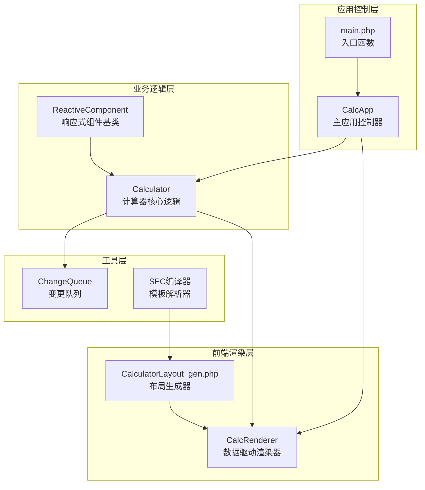
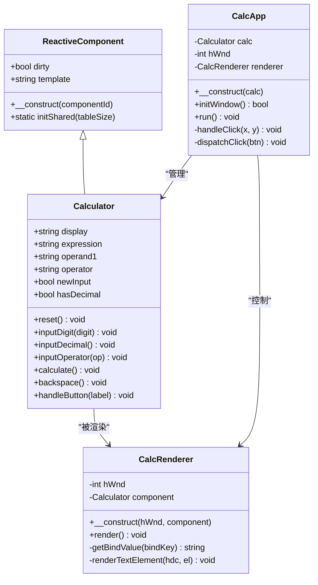
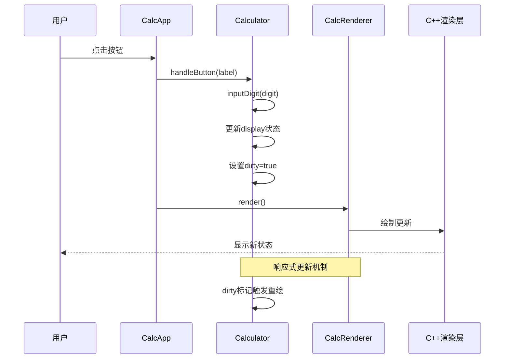
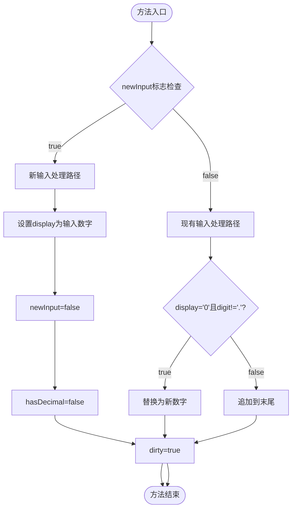
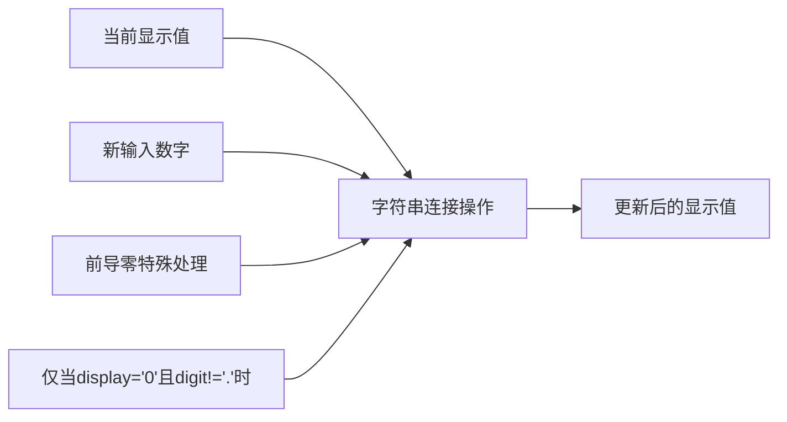
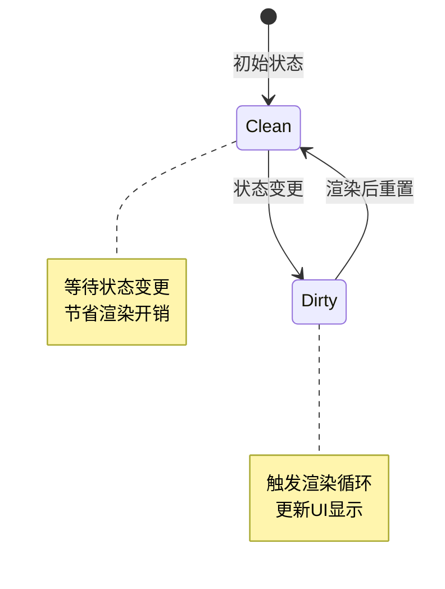

# inputDigit数字输入方法

<cite>
**本文档引用的文件**
- [Calculator.vue](file://src/Calculator.vue)
- [Calculator.gen.php](file://src/Calculator.gen.php)
- [ReactiveComponent.php](file://src/ReactiveComponent.php)
- [main.php](file://main.php)
- [CalculatorLayout_gen.php](file://src/CalculatorLayout_gen.php)
- [ChangeQueue.php](file://src/ChangeQueue.php)
</cite>

## 目录
1. [简介](#简介)
2. [项目结构概览](#项目结构概览)
3. [核心组件分析](#核心组件分析)
4. [架构总览](#架构总览)
5. [inputDigit方法详细分析](#inputdigit方法详细分析)
6. [状态管理机制](#状态管理机制)
7. [边界情况处理](#边界情况处理)
8. [性能考虑](#性能考虑)
9. [故障排除指南](#故障排除指南)
10. [结论](#结论)

## 简介

本文档深入分析VueCalc计算器项目中的`inputDigit`数字输入方法的完整实现。该方法是计算器核心功能的重要组成部分，负责处理用户输入的数字字符，维护显示值的状态，并确保正确的数字格式化和边界情况处理。

VueCalc是一个基于SFC（Single File Component）编译器的桌面计算器应用，采用PHP逻辑+C++ GDI渲染的混合架构。项目通过响应式组件系统实现了数据驱动的UI更新机制。

## 项目结构概览

VueCalc项目采用分层架构设计，主要包含以下核心模块：

**图表来源**
- [CalculatorLayout_gen.php:1-296](file://src/CalculatorLayout_gen.php#L1-L296)
- [main.php:1-291](file://main.php#L1-L291)
- [ReactiveComponent.php:1-35](file://src/ReactiveComponent.php#L1-L35)

**章节来源**
- [main.php:1-291](file://main.php#L1-L291)
- [CalculatorLayout_gen.php:1-296](file://src/CalculatorLayout_gen.php#L1-L296)

## 核心组件分析

### Calculator类结构

Calculator类继承自ReactiveComponent基类，实现了完整的计算器业务逻辑。该类包含以下关键属性和方法：

**图表来源**
- [Calculator.gen.php:9-174](file://src/Calculator.gen.php#L9-L174)
- [ReactiveComponent.php:11-35](file://src/ReactiveComponent.php#L11-L35)
- [main.php:26-259](file://main.php#L26-L259)

### 关键状态属性说明

| 属性名 | 类型 | 默认值 | 用途 |
|--------|------|--------|------|
| `display` | string | '0' | 当前显示值，支持整数和小数 |
| `expression` | string | '' | 表达式显示区，用于显示计算过程 |
| `operand1` | string | '' | 第一个操作数 |
| `operator` | string | '' | 当前运算符 |
| `newInput` | bool | true | 标识是否开始新输入 |
| `hasDecimal` | bool | false | 标识是否已输入小数点 |

**章节来源**
- [Calculator.gen.php:11-27](file://src/Calculator.gen.php#L11-L27)
- [Calculator.vue:45-61](file://src/Calculator.vue#L45-L61)

## 架构总览

VueCalc采用数据驱动的渲染架构，其核心工作流程如下：

**图表来源**
- [main.php:171-227](file://main.php#L171-L227)
- [Calculator.gen.php:42-56](file://src/Calculator.gen.php#L42-L56)

**章节来源**
- [main.php:13-15](file://main.php#L13-L15)
- [ReactiveComponent.php:19-20](file://src/ReactiveComponent.php#L19-L20)

## inputDigit方法详细分析

### 方法签名与参数

`inputDigit`方法的完整定义如下：
- **方法名**: `inputDigit`
- **参数类型**: `string $digit`
- **返回类型**: `void`
- **所属类**: `Calculator`

### 核心算法流程

inputDigit方法实现了精确的数字输入处理逻辑，包含以下关键步骤：

**图表来源**
- [Calculator.gen.php:42-56](file://src/Calculator.gen.php#L42-L56)
- [Calculator.vue:75-90](file://src/Calculator.vue#L75-L90)

### 新输入处理逻辑详解

当`newInput`标志为true时，表示开始一个新的数字输入序列：

1. **显示值初始化**: 将`display`属性设置为当前输入的数字字符
2. **标志重置**: 将`newInput`标志设置为false，表示后续输入属于同一数字序列
3. **小数点标志重置**: 将`hasDecimal`标志重置为false，允许在新数字中再次输入小数点
4. **响应式更新**: 设置`dirty`标志为true，触发UI重绘

### 现有输入处理逻辑详解

当`newInput`标志为false时，表示正在处理现有的数字输入序列：

1. **前导零处理**: 检查当前显示值是否为'0'且输入的不是小数点
2. **特殊处理**: 如果满足条件，直接替换'0'为新输入的数字
3. **常规处理**: 否则执行字符串拼接，将数字添加到显示值末尾
4. **响应式更新**: 设置`dirty`标志为true

### 字符串拼接机制

数字输入采用简单的字符串拼接方式实现：

**图表来源**
- [Calculator.gen.php:48-54](file://src/Calculator.gen.php#L48-L54)

**章节来源**
- [Calculator.gen.php:42-56](file://src/Calculator.gen.php#L42-L56)
- [Calculator.vue:75-90](file://src/Calculator.vue#L75-L90)

## 状态管理机制

### dirty标记系统

dirty标记是VueCalc响应式更新的核心机制：

**图表来源**
- [ReactiveComponent.php:19-20](file://src/ReactiveComponent.php#L19-L20)
- [main.php:213-221](file://main.php#L213-L221)

### 状态同步机制

状态变更通过以下流程实现：

1. **属性修改**: 计算器方法修改内部状态属性
2. **dirty标记**: 设置`$this->dirty = true`
3. **渲染检查**: 应用主循环检测`dirty`标志
4. **UI更新**: 触发渲染器重新绘制界面

**章节来源**
- [ReactiveComponent.php:19-20](file://src/ReactiveComponent.php#L19-L20)
- [main.php:213-221](file://main.php#L213-L221)

## 边界情况处理

### 连续数字输入场景

| 输入序列 | display变化 | newInput状态 | hasDecimal状态 |
|----------|-------------|--------------|----------------|
| '7' → '7' | '7' → '7' | false → false | false → false |
| '7' → '8' | '7' → '78' | false → false | false → false |
| '123' → '4' | '123' → '1234' | false → false | false → false |

### 小数点后数字输入场景

| 输入序列 | display变化 | newInput状态 | hasDecimal状态 |
|----------|-------------|--------------|----------------|
| '1' → '.' | '1' → '1.' | false → false | false → true |
| '1.' → '5' | '1.' → '1.5' | false → false | true → true |
| '1.23' → '4' | '1.23' → '1.234' | false → false | true → true |

### 特殊边界情况

1. **前导零处理**: 当显示值为'0'时，任何数字输入都会替换'0'
2. **小数点重复输入**: 已输入小数点后，再次输入小数点会被忽略
3. **连续清零**: 连续输入数字会覆盖之前的显示值

**章节来源**
- [Calculator.gen.php:48-54](file://src/Calculator.gen.php#L48-L54)
- [Calculator.vue:82-88](file://src/Calculator.vue#L82-L88)

## 性能考虑

### 时间复杂度分析

- **单次输入操作**: O(1) - 字符串拼接和条件判断
- **内存使用**: O(n) - n为显示值长度，字符串存储
- **渲染触发**: 仅在状态变更时触发，避免不必要的重绘

### 优化策略

1. **字符串操作优化**: 使用直接赋值而非多次拼接
2. **条件判断优化**: 优先检查最可能的情况
3. **状态复用**: 复用已有状态变量，减少内存分配

## 故障排除指南

### 常见问题诊断

| 问题现象 | 可能原因 | 解决方案 |
|----------|----------|----------|
| 数字显示异常 | newInput标志未正确重置 | 检查reset方法调用 |
| 小数点重复输入 | hasDecimal标志处理错误 | 验证inputDecimal逻辑 |
| 前导零问题 | 字符串比较条件不正确 | 检查display==='0'判断 |
| UI不更新 | dirty标记未设置 | 确认方法末尾设置dirty |

### 调试建议

1. **状态跟踪**: 在关键位置输出状态变量值
2. **单元测试**: 为边界情况编写测试用例
3. **日志记录**: 添加详细的执行日志

**章节来源**
- [Calculator.gen.php:29-39](file://src/Calculator.gen.php#L29-L39)
- [Calculator.vue:63-73](file://src/Calculator.vue#L63-L73)

## 结论

inputDigit数字输入方法作为VueCalc的核心功能，展现了优秀的算法设计和状态管理机制。该方法通过简洁而精确的逻辑实现了：

1. **清晰的状态分离**: 通过`newInput`和`hasDecimal`标志明确区分不同输入模式
2. **高效的字符串处理**: 采用直接赋值和条件判断的组合，避免复杂的字符串操作
3. **完善的边界处理**: 正确处理前导零、小数点、连续输入等各种边界情况
4. **响应式更新机制**: 通过dirty标记实现高效的UI更新

该实现为类似计算器应用提供了优秀的参考范例，展示了如何在保持代码简洁的同时实现功能完备的数字输入处理逻辑。