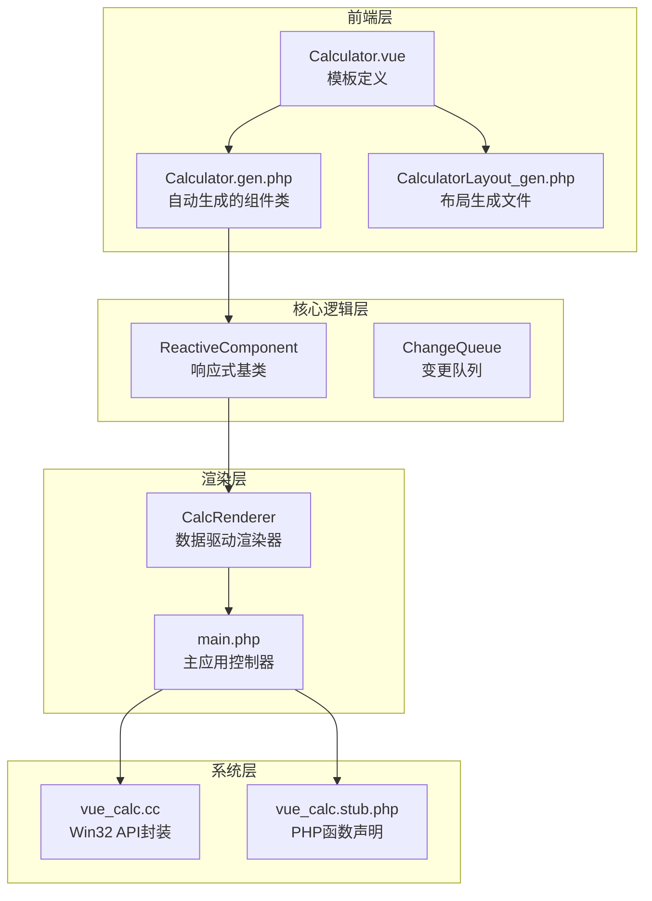
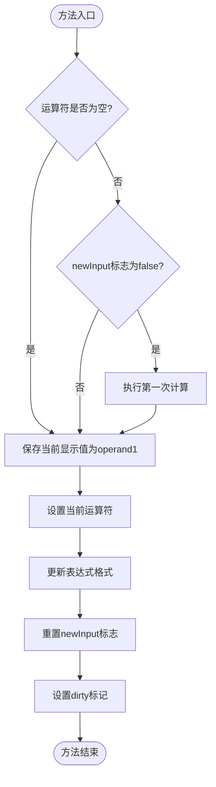
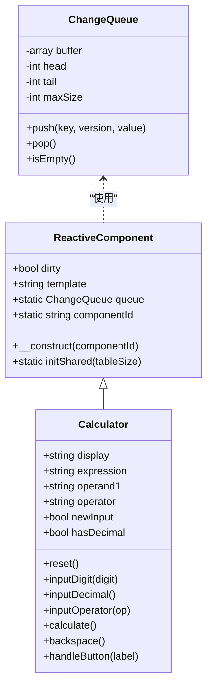
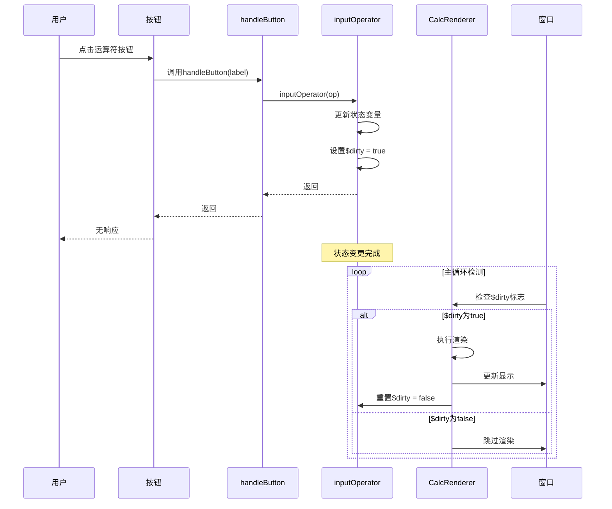
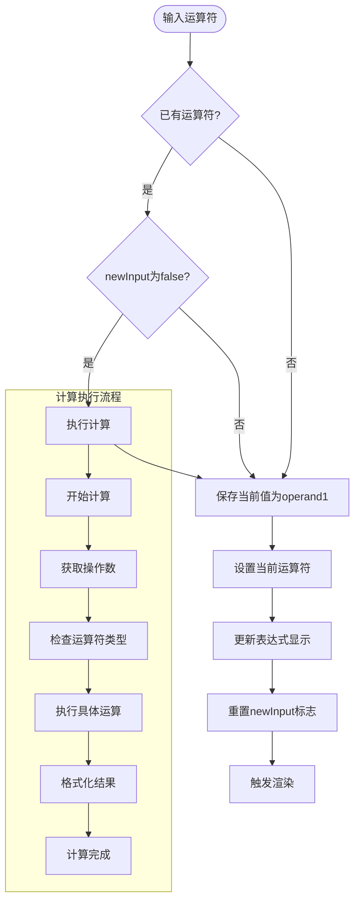
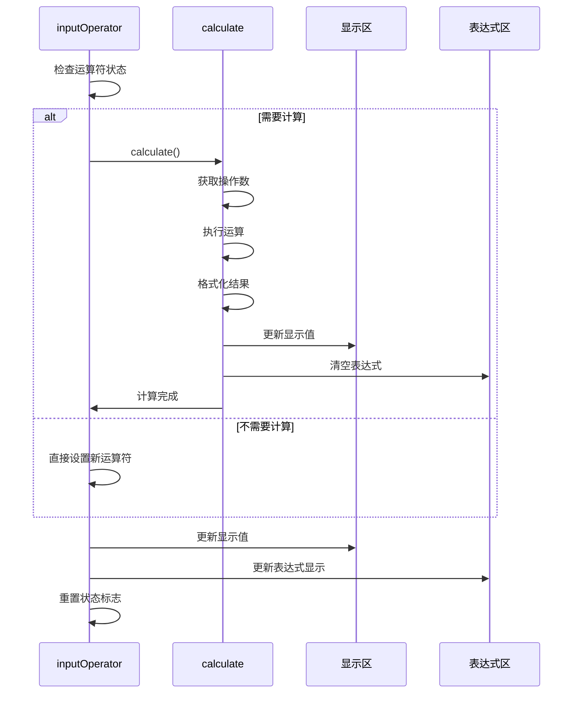
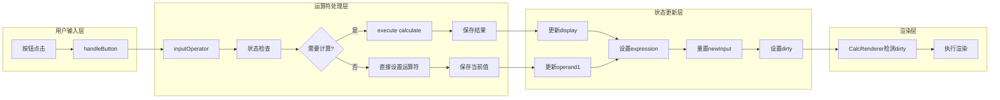
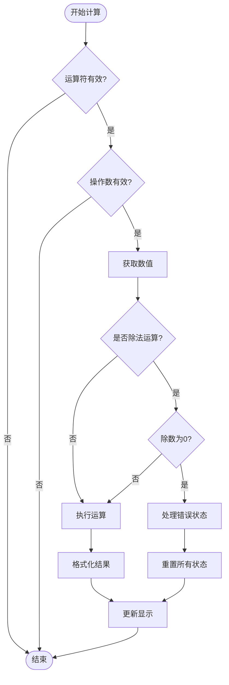

# inputOperator运算符方法

<cite>
**本文档引用的文件**
- [Calculator.vue](file://src/Calculator.vue)
- [Calculator.gen.php](file://src/Calculator.gen.php)
- [CalculatorLayout_gen.php](file://src/CalculatorLayout_gen.php)
- [ReactiveComponent.php](file://src/ReactiveComponent.php)
- [ChangeQueue.php](file://src/ChangeQueue.php)
- [main.php](file://main.php)
- [vue_calc.cc](file://cpp-src/vue_calc.cc)
- [vue_calc.stub.php](file://php-src/vue_calc.stub.php)
- [sfc-compiler.php](file://tools/sfc-compiler.php)
- [sfc-compiler-test.php](file://tests/sfc-compiler-test.php)
</cite>

## 目录
1. [简介](#简介)
2. [项目结构概览](#项目结构概览)
3. [inputOperator方法核心实现](#inputoperator方法核心实现)
4. [状态管理系统](#状态管理系统)
5. [运算符链式输入机制](#运算符链式输入机制)
6. [计算触发逻辑](#计算触发逻辑)
7. [数据流分析](#数据流分析)
8. [错误处理机制](#错误处理机制)
9. [性能考虑](#性能考虑)
10. [故障排除指南](#故障排除指南)
11. [总结](#总结)

## 简介

本文档深入分析Vue计算器项目中inputOperator运算符输入方法的实现机制。该方法负责处理用户输入的运算符，包括复杂的运算符状态切换、计算触发逻辑、操作数保存时机以及表达式格式化等核心功能。通过对代码的详细分析，我们将解释newInput标志的重置策略、dirty标记的触发时机，以及运算符链式输入的完整状态追踪机制。

## 项目结构概览

Vue计算器项目采用分层架构设计，主要包含以下核心组件：

**图表来源**
- [Calculator.vue:1-215](file://src/Calculator.vue#L1-L215)
- [Calculator.gen.php:1-174](file://src/Calculator.gen.php#L1-L174)
- [main.php:1-291](file://main.php#L1-L291)

**章节来源**
- [Calculator.vue:1-215](file://src/Calculator.vue#L1-L215)
- [Calculator.gen.php:1-174](file://src/Calculator.gen.php#L1-L174)
- [main.php:1-291](file://main.php#L1-L291)

## inputOperator方法核心实现

### 方法签名与基本结构

inputOperator方法是计算器的核心运算符处理函数，其完整实现如下：

**图表来源**
- [Calculator.gen.php:72-83](file://src/Calculator.gen.php#L72-L83)
- [Calculator.vue:106-117](file://src/Calculator.vue#L106-L117)

### 关键状态变量详解

inputOperator方法涉及多个关键状态变量，每个都有特定的作用机制：

| 状态变量 | 类型 | 默认值 | 作用说明 |
|---------|------|--------|----------|
| `$display` | string | '0' | 当前显示值，实时反映用户输入 |
| `$operand1` | string | '' | 第一个操作数，保存运算符之前的数值 |
| `$operator` | string | '' | 当前运算符，支持'+', '-', '*', '/' |
| `$newInput` | bool | true | 新输入标志，控制输入模式切换 |
| `$expression` | string | '' | 表达式字符串，用于显示计算过程 |

**章节来源**
- [Calculator.gen.php:11-27](file://src/Calculator.gen.php#L11-L27)
- [Calculator.vue:45-58](file://src/Calculator.vue#L45-L58)

## 状态管理系统

### ReactiveComponent基类架构

ReactiveComponent作为所有响应式组件的基类，提供了完整的状态管理基础设施：

**图表来源**
- [ReactiveComponent.php:11-34](file://src/ReactiveComponent.php#L11-L34)
- [Calculator.gen.php:9-174](file://src/Calculator.gen.php#L9-L174)
- [ChangeQueue.php:11-56](file://src/ChangeQueue.php#L11-L56)

### 脏标记机制

脏标记（dirty）是响应式系统的核心机制，确保只有在状态真正改变时才触发重新渲染：

**图表来源**
- [main.php:213-221](file://main.php#L213-L221)
- [Calculator.gen.php:82-83](file://src/Calculator.gen.php#L82-L83)

**章节来源**
- [ReactiveComponent.php:19-20](file://src/ReactiveComponent.php#L19-L20)
- [main.php:213-221](file://main.php#L213-L221)

## 运算符链式输入机制

### 连续运算符处理逻辑

inputOperator方法实现了智能的运算符链式处理，能够正确处理连续运算符输入：

**图表来源**
- [Calculator.gen.php:75-82](file://src/Calculator.gen.php#L75-L82)
- [Calculator.vue:120-162](file://src/Calculator.vue#L120-L162)

### 运算符优先级实现

需要注意的是，当前实现采用简单的"遇到运算符即计算"策略，而非传统的数学运算符优先级。这种设计简化了实现复杂度，适合计算器的基本使用场景。

**章节来源**
- [Calculator.gen.php:75-82](file://src/Calculator.gen.php#L75-L82)
- [Calculator.vue:120-162](file://src/Calculator.vue#L120-L162)

## 计算触发逻辑

### 计算条件判断

inputOperator方法中的计算触发逻辑基于两个关键条件：

1. **运算符存在性检查**：`$this->operator !== ''`
2. **输入模式检查**：`!$this->newInput`

只有当这两个条件同时满足时，才会触发计算执行。

### 计算执行流程

**图表来源**
- [Calculator.gen.php:75-82](file://src/Calculator.gen.php#L75-L82)
- [Calculator.gen.php:86-128](file://src/Calculator.gen.php#L86-L128)

**章节来源**
- [Calculator.gen.php:75-82](file://src/Calculator.gen.php#L75-L82)
- [Calculator.gen.php:86-128](file://src/Calculator.gen.php#L86-L128)

## 数据流分析

### 完整的数据流转过程

inputOperator方法在整个数据流中扮演着关键的协调角色：

**图表来源**
- [Calculator.gen.php:149-168](file://src/Calculator.gen.php#L149-L168)
- [main.php:213-221](file://main.php#L213-L221)

### 状态转换矩阵

| 当前状态 | 输入运算符 | 处理结果 | 下一状态 |
|---------|-----------|---------|---------|
| 无运算符 | +, -, *, / | 保存当前值为operand1 | 设置运算符 |
| 有运算符 | +, -, *, / | 执行计算后设置新运算符 | 设置运算符 |
| 有运算符 | 数字 | 执行计算后输入数字 | 新输入模式 |
| 错误状态 | 任意输入 | 清空所有状态 | 重置模式 |

**章节来源**
- [Calculator.gen.php:72-83](file://src/Calculator.gen.php#L72-L83)
- [Calculator.gen.php:149-168](file://src/Calculator.gen.php#L149-L168)

## 错误处理机制

### 除零错误处理

calculate方法包含了完整的错误处理机制，特别是针对除零操作的特殊处理：

**图表来源**
- [Calculator.gen.php:104-114](file://src/Calculator.gen.php#L104-L114)
- [Calculator.gen.php:116-128](file://src/Calculator.gen.php#L116-L128)

### 错误状态恢复

当发生除零错误时，系统会自动恢复到安全状态：

- 显示值重置为"Error"
- 表达式清空
- 所有状态变量重置
- newInput标志重置
- 触发渲染更新

**章节来源**
- [Calculator.gen.php:104-128](file://src/Calculator.gen.php#L104-L128)

## 性能考虑

### 状态更新优化

inputOperator方法在性能方面采用了多项优化措施：

1. **条件检查优化**：仅在必要时执行计算
2. **状态复用**：避免重复的状态检查
3. **最小化渲染**：通过脏标记机制减少不必要的重绘

### 内存使用分析

- 状态变量均为轻量级数据类型（string, bool）
- 无动态内存分配
- 状态生命周期与组件生命周期一致

## 故障排除指南

### 常见问题诊断

| 问题现象 | 可能原因 | 解决方案 |
|---------|---------|---------|
| 连续运算符无效 | newInput标志未正确重置 | 检查inputOperator中的状态重置逻辑 |
| 计算结果异常 | 运算符优先级处理不当 | 确认当前采用的"遇到运算符即计算"策略 |
| 除零错误未处理 | 错误处理分支缺失 | 验证calculate方法中的除零检查 |
| 界面不更新 | dirty标记未设置 | 确认方法末尾的$dirty = true语句 |

### 调试建议

1. **启用日志记录**：在关键状态转换处添加调试输出
2. **单元测试**：编写针对运算符输入的测试用例
3. **边界条件测试**：测试连续运算符、错误输入等边界情况

**章节来源**
- [Calculator.gen.php:72-83](file://src/Calculator.gen.php#L72-L83)
- [Calculator.gen.php:104-128](file://src/Calculator.gen.php#L104-L128)

## 总结

inputOperator运算符输入方法是Vue计算器项目的核心功能模块，它实现了以下关键特性：

1. **智能状态管理**：通过newInput标志精确控制输入模式切换
2. **计算触发机制**：基于运算符存在性和输入模式的智能计算触发
3. **链式运算支持**：支持连续运算符输入的无缝处理
4. **错误处理完善**：包含完整的错误检测和恢复机制
5. **性能优化**：通过脏标记机制实现高效的渲染控制

该实现体现了AOT编译环境下的最佳实践，通过显式状态管理和手动脏标记确保了在受限环境中的可靠运行。inputOperator方法不仅满足了基本的计算器功能需求，还为未来的功能扩展奠定了坚实的基础。