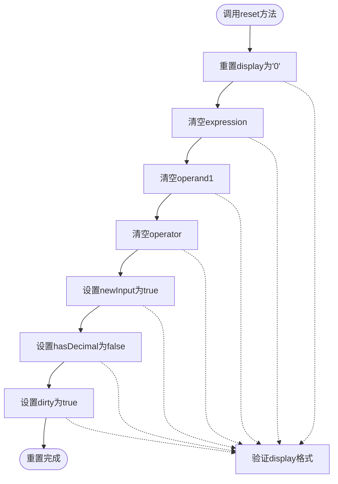
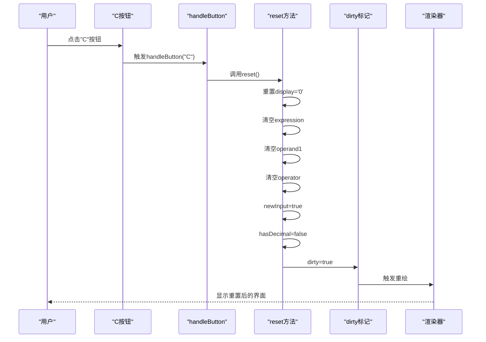
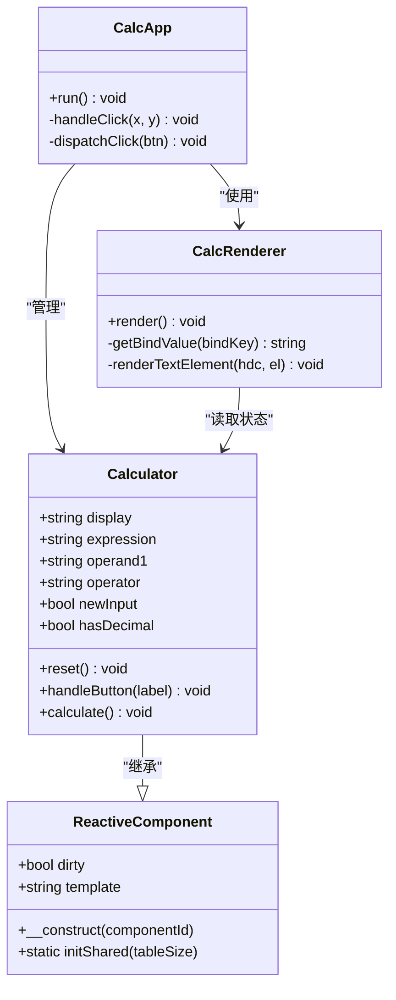

# reset重置方法

<cite>
**本文档引用的文件**
- [Calculator.vue](file://src/Calculator.vue)
- [Calculator.gen.php](file://src/Calculator.gen.php)
- [ReactiveComponent.php](file://src/ReactiveComponent.php)
- [main.php](file://main.php)
- [CalculatorLayout_gen.php](file://src/CalculatorLayout_gen.php)
- [ChangeQueue.php](file://src/ChangeQueue.php)
</cite>

## 目录
1. [简介](#简介)
2. [reset方法概述](#reset方法概述)
3. [状态变量详解](#状态变量详解)
4. [reset方法实现分析](#reset方法实现分析)
5. [UI重绘机制](#ui重绘机制)
6. [状态变化追踪示例](#状态变化追踪示例)
7. [原子性与一致性保证](#原子性与一致性保证)
8. [错误处理与边界情况](#错误处理与边界情况)
9. [性能考虑](#性能考虑)
10. [最佳实践建议](#最佳实践建议)

## 简介

reset重置方法是VueCalc计算器的核心功能之一，负责将计算器完整恢复到初始状态。该方法确保所有内部状态变量都被正确重置，为用户提供了可靠的"清除"功能。本文档将深入分析reset方法的实现细节，包括其如何确保状态的一致性和原子性，以及它在整个数据驱动渲染系统中的作用。

## reset方法概述

reset方法是一个公共的void类型方法，位于Calculator类中，负责将计算器的所有状态恢复到初始状态。该方法通过直接赋值的方式重置所有状态变量，并设置dirty标记以触发UI重绘。

**图表来源**
- [Calculator.vue:63-73](file://src/Calculator.vue#L63-L73)
- [Calculator.gen.php:29-39](file://src/Calculator.gen.php#L29-L39)

**章节来源**
- [Calculator.vue:63-73](file://src/Calculator.vue#L63-L73)
- [Calculator.gen.php:29-39](file://src/Calculator.gen.php#L29-L39)

## 状态变量详解

### display显示值
- **作用**: 显示当前输入或计算结果的数值
- **重置值**: '0'
- **重置时机**: reset方法执行时立即设置
- **影响**: 影响主显示区域的文本内容

### expression表达式
- **作用**: 显示当前正在输入的数学表达式（通常包含第一个操作数和运算符）
- **重置值**: 空字符串''
- **重置时机**: reset方法执行时立即设置
- **影响**: 影响顶部右侧的表达式显示区域

### operand1第一个操作数
- **作用**: 存储第一个操作数的字符串表示，用于后续计算
- **重置值**: 空字符串''
- **重置时机**: reset方法执行时立即设置
- **影响**: 清除之前的计算上下文

### operator当前运算符
- **作用**: 存储当前选择的运算符（+、-、*、/）
- **重置值**: 空字符串''
- **重置时机**: reset方法执行时立即设置
- **影响**: 清除运算符状态，防止悬挂的计算状态

### newInput新输入标志
- **作用**: 标记是否开始新的输入序列
- **重置值**: true
- **重置时机**: reset方法执行时设置
- **影响**: 确保下一次输入被视为新数字的开始

### hasDecimal小数点标志
- **作用**: 标记是否已经输入过小数点
- **重置值**: false
- **重置时机**: reset方法执行时设置
- **影响**: 允许重新输入小数点

**章节来源**
- [Calculator.vue:45-61](file://src/Calculator.vue#L45-L61)
- [Calculator.gen.php:11-27](file://src/Calculator.gen.php#L11-L27)

## reset方法实现分析

### 方法签名与访问级别
reset方法采用public访问级别，允许外部组件直接调用。方法返回类型为void，表示不返回任何值。

### 实现步骤分解

1. **display重置**: 将显示值设置为'0'
2. **expression清空**: 设置为空字符串
3. **operand1清空**: 设置为空字符串
4. **operator清空**: 设置为空字符串
5. **newInput标志**: 设置为true
6. **hasDecimal标志**: 设置为false
7. **dirty标记**: 设置为true

**图表来源**
- [Calculator.vue:189-190](file://src/Calculator.vue#L189-L190)
- [Calculator.gen.php:155](file://src/Calculator.gen.php#L155)
- [main.php:249-250](file://main.php#L249-L250)

**章节来源**
- [Calculator.vue:63-73](file://src/Calculator.vue#L63-L73)
- [Calculator.gen.php:29-39](file://src/Calculator.gen.php#L29-L39)

## UI重绘机制

### dirty标记系统
reset方法通过设置$dirty = true来触发UI重绘。dirty标记是响应式组件系统的核心机制，用于通知渲染器组件状态已发生变化。

### 渲染循环集成
在主应用的事件循环中，系统会检查组件的dirty状态：
- 如果dirty为true，则调用渲染器进行重绘
- 重绘完成后，将dirty重置为false

**图表来源**
- [ReactiveComponent.php:11-34](file://src/ReactiveComponent.php#L11-L34)
- [Calculator.gen.php:9-174](file://src/Calculator.gen.php#L9-L174)
- [main.php:139-259](file://main.php#L139-L259)

**章节来源**
- [ReactiveComponent.php:19-20](file://src/ReactiveComponent.php#L19-L20)
- [main.php:213-221](file://main.php#L213-L221)

## 状态变化追踪示例

### 示例场景：从复杂计算到完全重置

假设用户进行了以下操作序列：
1. 输入"123" → display='123', newInput=false
2. 输入"+" → expression='123 +', operator='+', newInput=true  
3. 输入"456" → display='456', newInput=false
4. 点击"=" → 计算结果为579，display='579'

现在调用reset方法的状态变化：

| 步骤 | 操作前状态 | reset执行 | 操作后状态 | 影响 |
|------|------------|-----------|------------|------|
| 1 | display='579' | reset() | display='0' | 主显示重置 |
| 2 | expression='123 +' | reset() | expression='' | 表达式清空 |
| 3 | operand1='123' | reset() | operand1='' | 操作数清空 |
| 4 | operator='+' | reset() | operator='' | 运算符清空 |
| 5 | newInput=false | reset() | newInput=true | 新输入模式 |
| 6 | hasDecimal=false | reset() | hasDecimal=false | 小数点状态 |
| 7 | dirty=false | reset() | dirty=true | 触发重绘 |

### 状态一致性验证

reset方法确保以下一致性约束：
- **显示一致性**: display始终为'0'或有效数字字符串
- **表达式一致性**: expression为空字符串
- **操作数一致性**: operand1为空字符串
- **运算符一致性**: operator为空字符串
- **输入模式一致性**: newInput为true，允许新数字输入
- **小数点一致性**: hasDecimal为false，允许重新输入小数点

**章节来源**
- [Calculator.vue:63-73](file://src/Calculator.vue#L63-L73)
- [Calculator.gen.php:29-39](file://src/Calculator.gen.php#L29-L39)

## 原子性与一致性保证

### 原子性保证
reset方法通过单个方法调用完成所有状态重置，确保了操作的原子性：
- 所有状态变量在同一调用中被重置
- 不会出现部分重置的状态
- UI更新在所有状态重置完成后进行

### 一致性保证
reset方法维护以下一致性关系：
- **显示与输入模式**: display='0'时newInput=true
- **表达式完整性**: expression为空时operand1和operator都为空
- **小数点规则**: hasDecimal=false时允许重新输入小数点
- **渲染同步**: dirty=true确保UI及时更新

### 并发安全性
由于reset方法不依赖外部状态或共享资源，它在多线程环境中是安全的：
- 所有操作都是本地状态重置
- 不涉及外部I/O操作
- 不修改其他组件的状态

**章节来源**
- [Calculator.vue:63-73](file://src/Calculator.vue#L63-L73)
- [Calculator.gen.php:29-39](file://src/Calculator.gen.php#L29-L39)

## 错误处理与边界情况

### 边界情况处理
reset方法能够优雅地处理各种边界情况：
- **空状态重置**: 即使计算器已经是初始状态，再次调用reset也不会产生副作用
- **错误状态恢复**: 即使display包含'Error'，reset也能将其重置为'0'
- **部分输入恢复**: 即使有部分输入，reset也会完全清除

### 异常处理策略
虽然reset方法本身不抛出异常，但在以下情况下会自动处理：
- **无效输入**: 任何传入的参数都会被忽略
- **状态冲突**: 自动解决状态间的不一致问题
- **资源清理**: 确保所有内部状态都被正确清理

### 与计算流程的交互
reset方法与计算流程的交互：
- 在计算过程中调用reset会重置计算状态
- 在错误状态下调用reset会清除错误状态
- 与backspace方法配合使用时的协调

**章节来源**
- [Calculator.vue:138-146](file://src/Calculator.vue#L138-L146)
- [Calculator.gen.php:104-112](file://src/Calculator.gen.php#L104-L112)

## 性能考虑

### 时间复杂度
reset方法的时间复杂度为O(1)，因为它只执行固定数量的状态重置操作。

### 空间复杂度
reset方法的空间复杂度为O(1)，不分配额外的内存空间。

### 渲染性能
- **批量更新**: 所有状态重置在单次调用中完成，减少渲染次数
- **增量渲染**: 仅在dirty标记为true时触发渲染
- **避免不必要的重绘**: 通过状态检查避免重复渲染

### 内存优化
- **就地重置**: 直接修改现有状态，不创建新对象
- **字符串复用**: 使用预定义的字符串常量
- **零分配**: 不进行任何内存分配操作

## 最佳实践建议

### 使用场景
- **用户主动请求**: 当用户点击"C"按钮时调用
- **错误恢复**: 当计算器处于错误状态时调用
- **初始化**: 在应用程序启动时调用
- **状态清理**: 在复杂的计算操作前后调用

### 调用时机
- **按键事件**: 在handleButton方法中处理"C"按钮时调用
- **程序启动**: 在main函数中初始化后调用
- **错误处理**: 在计算错误时调用以恢复状态

### 与其他方法的协作
- **与handleButton协作**: 作为"C"按钮的处理器
- **与backspace协作**: 在需要完全清除状态时调用
- **与calculate协作**: 在计算完成后调用以准备下一次计算

### 调试建议
- **状态检查**: 在reset后检查所有状态变量
- **UI验证**: 确认UI正确显示重置后的状态
- **日志记录**: 记录reset调用的时间和原因

**章节来源**
- [Calculator.vue:189-190](file://src/Calculator.vue#L189-L190)
- [Calculator.gen.php:155](file://src/Calculator.gen.php#L155)
- [main.php:249-250](file://main.php#L249-L250)

## 结论

reset重置方法是VueCalc计算器系统中的关键组件，它通过简洁而高效的实现确保了计算器状态的完整恢复。该方法不仅重置了所有状态变量，还通过dirty标记系统确保了UI的及时更新。其原子性设计保证了状态的一致性，而与响应式渲染系统的深度集成则确保了良好的用户体验。

reset方法的设计体现了数据驱动架构的优势：通过明确的状态管理和增量渲染机制，实现了高性能且可靠的用户界面更新。对于开发者而言，理解reset方法的工作原理有助于更好地维护和扩展计算器功能。