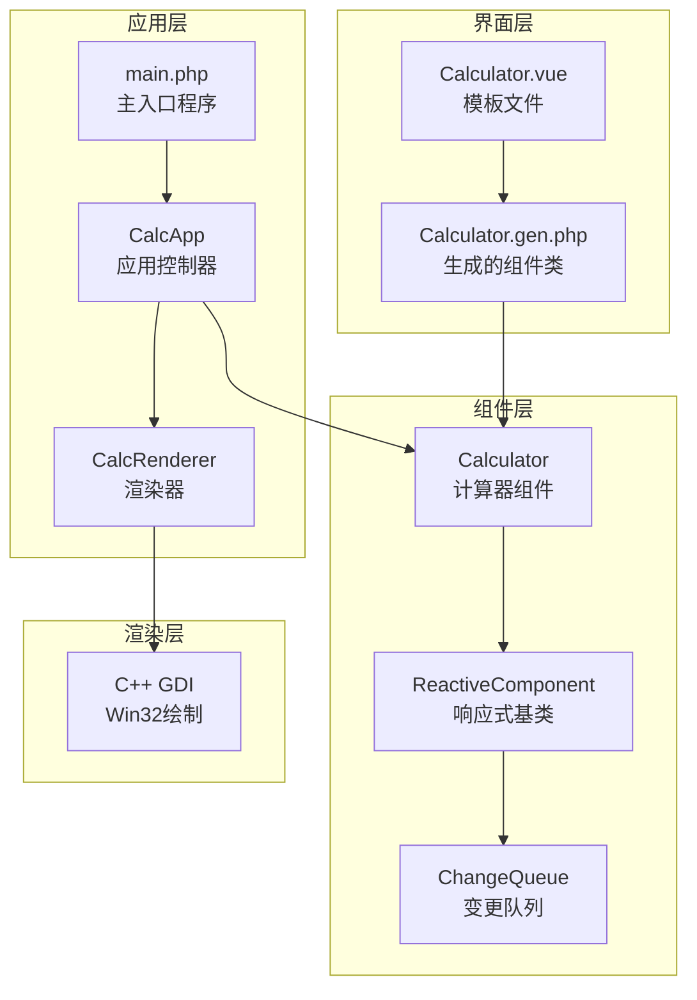
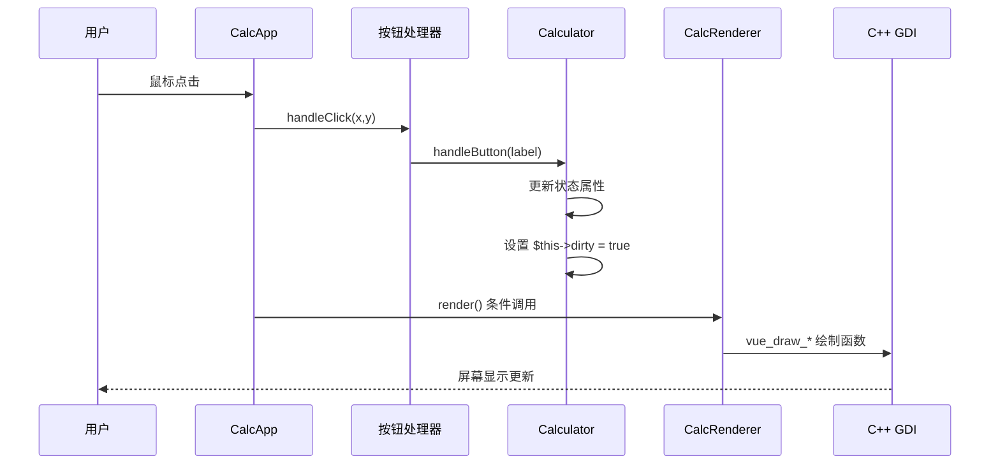
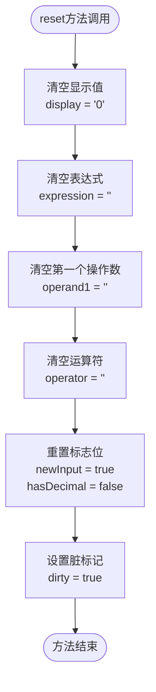
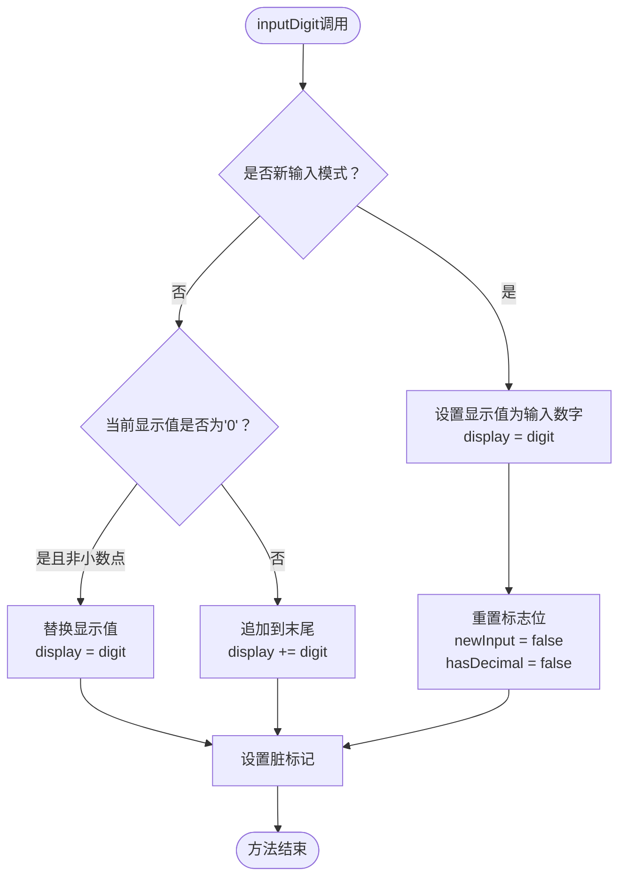
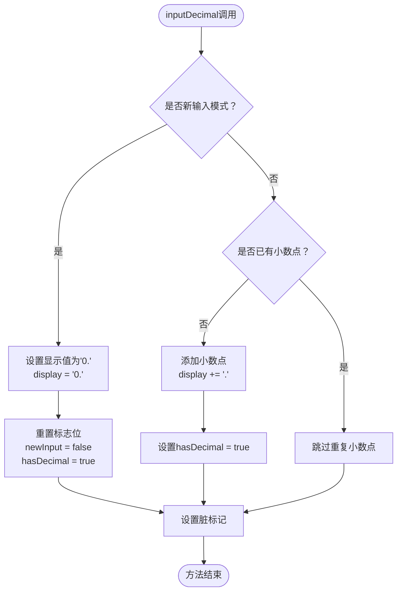
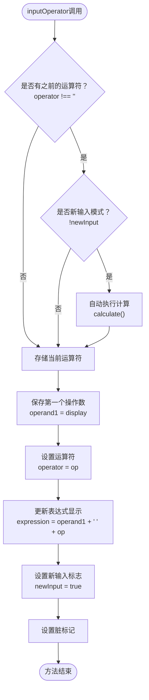
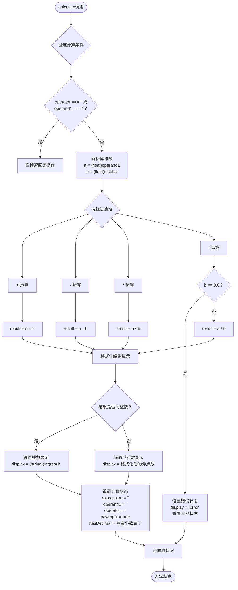
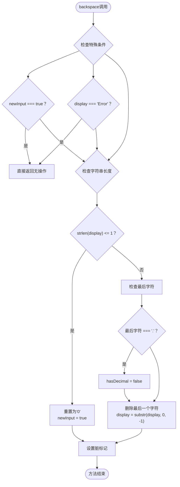
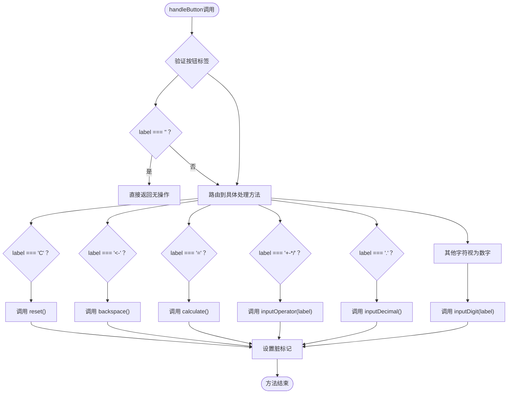
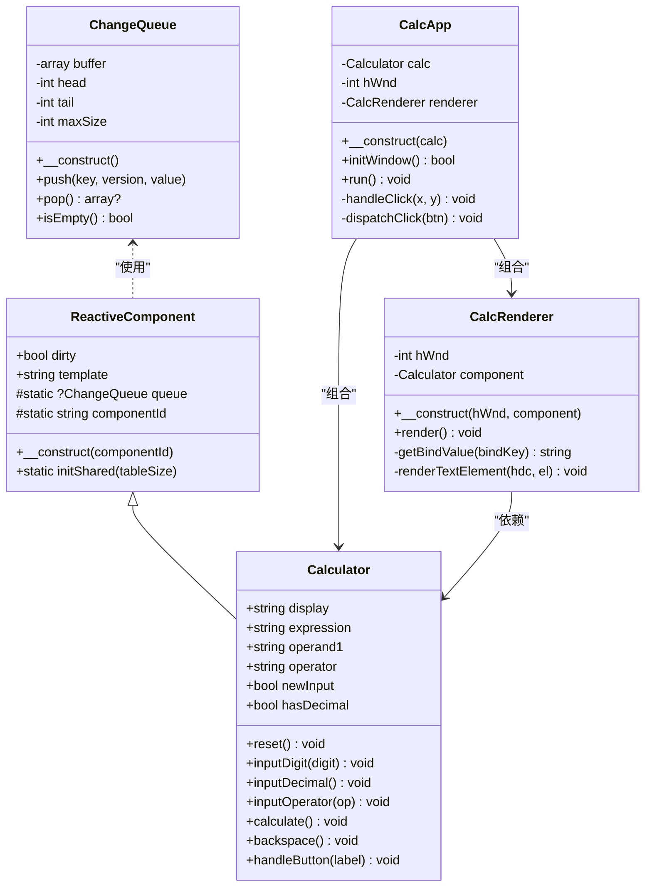

# 核心方法实现

<cite>
**本文档引用的文件**
- [Calculator.vue](file://src/Calculator.vue)
- [Calculator.gen.php](file://src/Calculator.gen.php)
- [ReactiveComponent.php](file://src/ReactiveComponent.php)
- [ChangeQueue.php](file://src/ChangeQueue.php)
- [main.php](file://main.php)
- [开发经验与教训.md](file://开发经验与教训.md)
- [开发经验与教训_v2.md](file://开发经验与教训_v2.md)
</cite>

## 目录
1. [简介](#简介)
2. [项目结构](#项目结构)
3. [核心组件](#核心组件)
4. [架构概览](#架构概览)
5. [详细组件分析](#详细组件分析)
6. [依赖分析](#依赖分析)
7. [性能考虑](#性能考虑)
8. [故障排除指南](#故障排除指南)
9. [结论](#结论)

## 简介

VueCalc是一个基于SFC（单文件组件）编译器的桌面计算器应用程序，采用PHP逻辑与C++ GDI绘制相结合的架构。该计算器实现了完整的四则运算功能，具有响应式数据驱动的UI更新机制。本文档深入分析Calculator组件的核心方法实现，包括状态管理、用户交互处理和错误处理等关键功能。

## 项目结构

VueCalc项目采用分层架构设计，主要包含以下核心模块：

**图表来源**
- [main.php:1-291](file://main.php#L1-L291)
- [Calculator.vue:1-215](file://src/Calculator.vue#L1-L215)
- [Calculator.gen.php:1-174](file://src/Calculator.gen.php#L1-L174)

**章节来源**
- [main.php:1-291](file://main.php#L1-L291)
- [Calculator.vue:1-215](file://src/Calculator.vue#L1-L215)
- [Calculator.gen.php:1-174](file://src/Calculator.gen.php#L1-L174)

## 核心组件

Calculator组件是整个应用的核心，负责处理所有的用户输入、状态管理和计算逻辑。组件包含6个核心状态属性：

| 属性名称 | 类型 | 默认值 | 用途描述 |
|---------|------|--------|----------|
| display | string | '0' | 当前显示值，用户可见的数字字符串 |
| expression | string | '' | 表达式显示区，用于显示当前计算表达式 |
| operand1 | string | '' | 第一个操作数，存储等待计算的数值 |
| operator | string | '' | 当前运算符，存储正在等待第二个操作数的运算符 |
| newInput | bool | true | 新输入标志，指示是否开始新的数字输入 |
| hasDecimal | bool | false | 小数点标志，跟踪当前输入是否包含小数点 |

这些属性通过手动脏标记机制进行响应式更新，确保UI能够及时反映状态变化。

**章节来源**
- [Calculator.vue:45-62](file://src/Calculator.vue#L45-L62)
- [Calculator.gen.php:11-27](file://src/Calculator.gen.php#L11-L27)

## 架构概览

VueCalc采用数据驱动的渲染架构，实现了从用户输入到屏幕显示的完整数据流：

**图表来源**
- [main.php:230-258](file://main.php#L230-L258)
- [Calculator.vue:183-202](file://src/Calculator.vue#L183-L202)

**章节来源**
- [main.php:139-259](file://main.php#L139-L259)
- [Calculator.vue:1-41](file://src/Calculator.vue#L1-L41)

## 详细组件分析

### reset重置方法

reset方法负责将计算器恢复到初始状态，确保所有状态属性都被正确重置。

**图表来源**
- [Calculator.vue:63-73](file://src/Calculator.vue#L63-L73)
- [Calculator.gen.php:29-39](file://src/Calculator.gen.php#L29-L39)

**实现特点**：
- 完整状态恢复：所有状态属性都被重置到初始值
- 边界条件处理：确保没有任何残留状态影响后续计算
- 性能优化：一次性重置所有状态，避免多次UI更新

**章节来源**
- [Calculator.vue:63-73](file://src/Calculator.vue#L63-L73)
- [Calculator.gen.php:29-39](file://src/Calculator.gen.php#L29-L39)

### inputDigit数字输入方法

inputDigit方法处理数字按键输入，实现了智能的数字显示更新算法。

**图表来源**
- [Calculator.vue:75-90](file://src/Calculator.vue#L75-L90)
- [Calculator.gen.php:41-56](file://src/Calculator.gen.php#L41-L56)

**算法逻辑**：
- 新输入模式：直接用新数字替换当前显示值
- 非新输入模式：处理前导零和数字追加逻辑
- 小数点特殊处理：允许在新输入模式下输入'0.'

**边界条件处理**：
- 防止无效的前导零显示
- 支持连续数字输入
- 维护小数点标志的正确状态

**章节来源**
- [Calculator.vue:75-90](file://src/Calculator.vue#L75-L90)
- [Calculator.gen.php:41-56](file://src/Calculator.gen.php#L41-L56)

### inputDecimal小数点处理

inputDecimal方法专门处理小数点输入，具有特殊的逻辑分支来处理不同场景。

**图表来源**
- [Calculator.vue:92-104](file://src/Calculator.vue#L92-L104)
- [Calculator.gen.php:58-70](file://src/Calculator.gen.php#L58-L70)

**特殊逻辑**：
- 新输入模式下的小数点处理：确保'0.'格式
- 已有小数点的防护：防止重复小数点输入
- 状态同步：维护hasDecimal标志的准确性

**章节来源**
- [Calculator.vue:92-104](file://src/Calculator.vue#L92-L104)
- [Calculator.gen.php:58-70](file://src/Calculator.gen.php#L58-L70)

### inputOperator运算符输入

inputOperator方法处理运算符输入，实现了运算符状态切换和自动计算机制。

**图表来源**
- [Calculator.vue:106-117](file://src/Calculator.vue#L106-L117)
- [Calculator.gen.php:72-83](file://src/Calculator.gen.php#L72-L83)

**状态切换机制**：
- 自动计算：当存在未完成的二元运算时自动执行
- 状态保存：将当前显示值保存为第一个操作数
- 表达式构建：更新表达式显示区的内容
- 模式切换：进入新输入模式准备接收第二个操作数

**章节来源**
- [Calculator.vue:106-117](file://src/Calculator.vue#L106-L117)
- [Calculator.gen.php:72-83](file://src/Calculator.gen.php#L72-L83)

### calculate计算执行

calculate方法执行实际的数学运算，包含完整的错误处理和结果格式化逻辑。

**图表来源**
- [Calculator.vue:119-162](file://src/Calculator.vue#L119-L162)
- [Calculator.gen.php:85-128](file://src/Calculator.gen.php#L85-L128)

**数学运算实现**：
- 四则运算支持：加法、减法、乘法、除法
- 错误处理：除零异常的完整处理机制
- 结果格式化：整数和浮点数的不同显示策略
- 精度控制：使用8位小数精度并去除末尾零

**错误恢复机制**：
- 除零错误：显示"Error"并重置所有计算状态
- 状态清理：确保错误状态下计算器可以继续正常工作
- 用户体验：清晰的错误提示和状态恢复

**章节来源**
- [Calculator.vue:119-162](file://src/Calculator.vue#L119-L162)
- [Calculator.gen.php:85-128](file://src/Calculator.gen.php#L85-L128)

### backspace退格删除

backspace方法处理退格键功能，实现了智能的字符删除算法。

**图表来源**
- [Calculator.vue:164-181](file://src/Calculator.vue#L164-L181)
- [Calculator.gen.php:130-147](file://src/Calculator.gen.php#L130-L147)

**字符处理算法**：
- 特殊状态保护：新输入模式和错误状态下的退格保护
- 边界处理：单字符情况下的重置逻辑
- 小数点同步：删除小数点时同步更新hasDecimal标志
- 字符串操作：使用PHP内置字符串函数进行高效处理

**章节来源**
- [Calculator.vue:164-181](file://src/Calculator.vue#L164-L181)
- [Calculator.gen.php:130-147](file://src/Calculator.gen.php#L130-L147)

### handleButton按钮处理

handleButton方法作为统一的按钮处理调度器，协调各种按钮类型的处理逻辑。

**图表来源**
- [Calculator.vue:183-202](file://src/Calculator.vue#L183-L202)
- [Calculator.gen.php:149-168](file://src/Calculator.gen.php#L149-L168)

**统一调度逻辑**：
- 参数验证：确保按钮标签的有效性
- 多路分支：根据按钮类型路由到相应处理方法
- 一致性处理：所有状态变更都通过统一的脏标记机制
- 扩展性：易于添加新的按钮类型和处理逻辑

**章节来源**
- [Calculator.vue:183-202](file://src/Calculator.vue#L183-L202)
- [Calculator.gen.php:149-168](file://src/Calculator.gen.php#L149-L168)

## 依赖分析

Calculator组件的依赖关系体现了清晰的层次化设计：

**图表来源**
- [ReactiveComponent.php:11-34](file://src/ReactiveComponent.php#L11-L34)
- [ChangeQueue.php:11-56](file://src/ChangeQueue.php#L11-L56)
- [Calculator.gen.php:9-174](file://src/Calculator.gen.php#L9-L174)
- [main.php:139-259](file://main.php#L139-L259)

**依赖关系特点**：
- 单向依赖：组件间遵循单一职责原则
- 松耦合：通过接口和方法调用实现解耦
- 可测试性：清晰的依赖关系便于单元测试
- 可扩展性：新增功能不影响现有依赖关系

**章节来源**
- [ReactiveComponent.php:11-34](file://src/ReactiveComponent.php#L11-L34)
- [ChangeQueue.php:11-56](file://src/ChangeQueue.php#L11-L56)
- [Calculator.gen.php:9-174](file://src/Calculator.gen.php#L9-L174)
- [main.php:139-259](file://main.php#L139-L259)

## 性能考虑

VueCalc在性能方面采用了多项优化策略：

### 状态更新优化
- **批量状态更新**：每个方法内部的多个状态修改后统一设置脏标记
- **条件渲染**：仅在状态真正改变时触发UI更新
- **最小化重绘**：通过脏标记机制避免不必要的重绘操作

### 内存管理
- **字符串优化**：使用PHP内置字符串函数进行高效字符串操作
- **数值转换**：仅在必要时进行类型转换
- **状态复用**：重用现有的状态变量，避免额外的内存分配

### 渲染性能
- **事件循环**：60FPS的固定刷新率，平衡性能和用户体验
- **增量渲染**：仅在状态变更时进行渲染
- **C++绘制**：底层使用C++ GDI进行硬件加速绘制

## 故障排除指南

### 常见问题及解决方案

**问题1：除零错误**
- 症状：显示"Error"并无法继续计算
- 解决方案：调用reset方法重置计算器状态
- 预防措施：在进行除法运算前检查除数

**问题2：小数点输入异常**
- 症状：重复小数点导致输入错误
- 解决方案：检查hasDecimal标志的状态
- 预防措施：确保每次输入小数点时都检查标志位

**问题3：退格功能失效**
- 症状：退格键无法删除字符
- 解决方案：检查newInput和display状态
- 预防措施：在特殊状态下避免退格操作

**问题4：状态不同步**
- 症状：UI显示与实际状态不一致
- 解决方案：检查脏标记机制是否正常工作
- 预防措施：确保每个状态变更后都设置脏标记

**章节来源**
- [Calculator.vue:138-146](file://src/Calculator.vue#L138-L146)
- [Calculator.gen.php:131-147](file://src/Calculator.gen.php#L131-L147)

### 调试技巧

**状态追踪**：
- 使用日志输出关键状态变量的变化
- 在每个方法的入口和出口设置断点
- 监控dirty标记的状态变化

**边界条件测试**：
- 测试连续运算的正确性
- 验证错误处理的完整性
- 检查特殊数值（如负数、零、极大数）的处理

## 结论

VueCalc的Calculator组件展现了优秀的软件工程实践，通过精心设计的状态管理、清晰的方法职责划分和完善的错误处理机制，实现了功能完整、性能优良的计算器应用。

**核心优势**：
- **架构清晰**：分层设计确保了良好的可维护性
- **状态管理**：手动脏标记机制提供了可靠的响应式更新
- **错误处理**：全面的错误检测和恢复机制提升了用户体验
- **性能优化**：多层优化策略确保了流畅的用户交互

**技术亮点**：
- AOT编译兼容的设计考虑
- 数据驱动渲染的实现
- 完整的边界条件处理
- 可扩展的架构设计

该组件为类似的应用程序提供了优秀的参考实现，展示了如何在受限环境中实现复杂的功能需求。