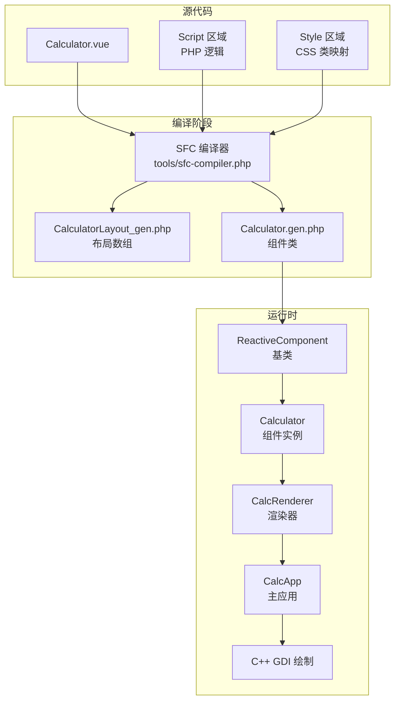
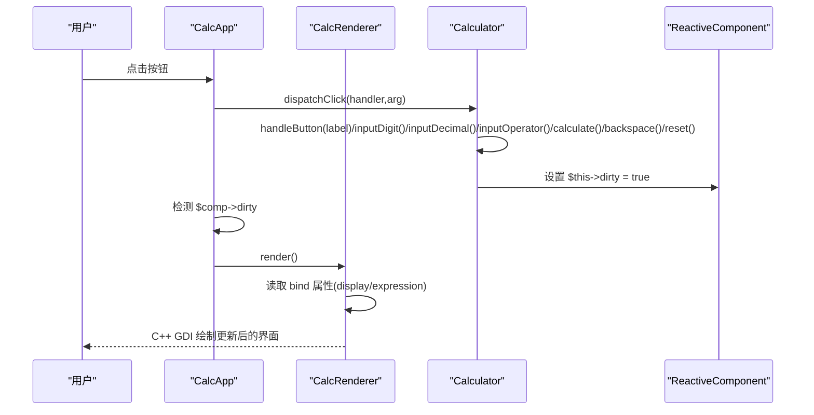
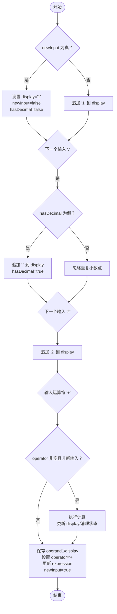
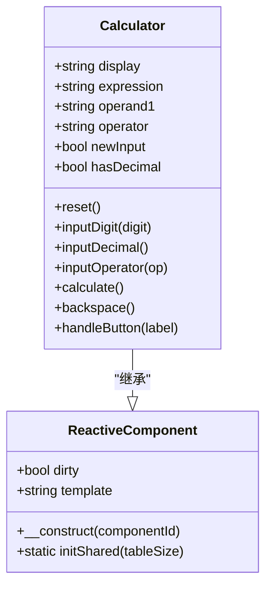
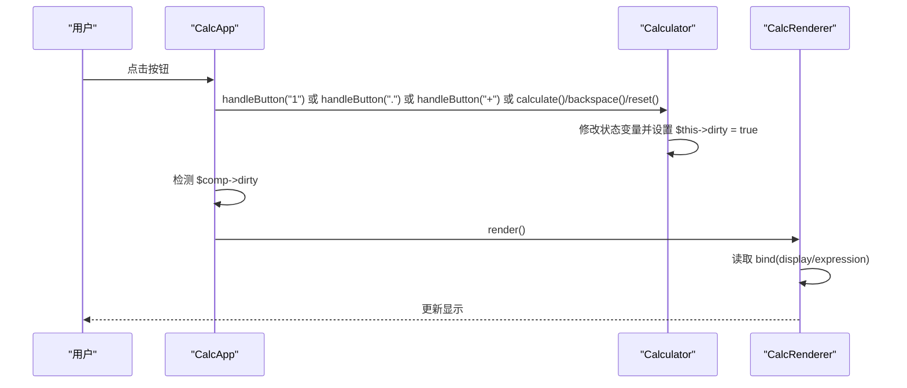
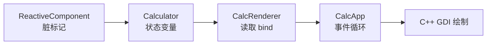

# 状态管理系统

<cite>
**本文引用的文件**
- [Calculator.vue](file://src/Calculator.vue)
- [Calculator.gen.php](file://src/Calculator.gen.php)
- [ReactiveComponent.php](file://src/ReactiveComponent.php)
- [CalculatorLayout_gen.php](file://src/CalculatorLayout_gen.php)
- [ChangeQueue.php](file://src/ChangeQueue.php)
- [main.php](file://main.php)
- [sfc-compiler.php](file://tools/sfc-compiler.php)
</cite>

## 目录
1. [简介](#简介)
2. [项目结构](#项目结构)
3. [核心组件](#核心组件)
4. [架构总览](#架构总览)
5. [详细组件分析](#详细组件分析)
6. [依赖关系分析](#依赖关系分析)
7. [性能考量](#性能考量)
8. [故障排除指南](#故障排除指南)
9. [结论](#结论)

## 简介
本文件针对 VueCalc 计算器组件的状态管理系统进行深入技术解析，重点围绕以下核心状态变量展开：display（当前显示值）、expression（表达式）、operand1（第一个操作数）、operator（当前运算符）、newInput（是否开始新输入）、hasDecimal（是否已输入小数点）。我们将从数据类型、初始值、生命周期、方法内的变化规则、状态间依赖关系与约束条件、以及状态变更触发 UI 更新的机制等方面进行全面剖析，并提供状态流转图与具体示例，帮助开发者理解该响应式状态管理的工作原理。

## 项目结构
该项目采用“单文件组件（.vue）→ SFC 编译器 → 生成 .gen.php（布局 + 组件类）”的流水线，配合 AOT 编译器生成可执行程序。状态管理基于自定义的 ReactiveComponent 基类，通过手动脏标记（dirty）驱动渲染更新。

图表来源
- [sfc-compiler.php:1-200](file://tools/sfc-compiler.php#L1-L200)
- [CalculatorLayout_gen.php:1-296](file://src/CalculatorLayout_gen.php#L1-L296)
- [Calculator.gen.php:1-174](file://src/Calculator.gen.php#L1-L174)
- [ReactiveComponent.php:1-35](file://src/ReactiveComponent.php#L1-L35)
- [main.php:1-291](file://main.php#L1-L291)

章节来源
- [Calculator.vue:1-215](file://src/Calculator.vue#L1-L215)
- [Calculator.gen.php:1-174](file://src/Calculator.gen.php#L1-L174)
- [ReactiveComponent.php:1-35](file://src/ReactiveComponent.php#L1-L35)
- [CalculatorLayout_gen.php:1-296](file://src/CalculatorLayout_gen.php#L1-L296)
- [main.php:1-291](file://main.php#L1-L291)
- [sfc-compiler.php:1-200](file://tools/sfc-compiler.php#L1-L200)

## 核心组件
本节聚焦 Calculator 组件的六个核心状态变量及其职责与行为。

- display（当前显示值）
  - 数据类型：字符串
  - 初始值：'0'
  - 生命周期：随用户输入数字、小数点、退格、计算结果而变化；在重置时恢复为 '0'
  - 关键方法：inputDigit、inputDecimal、backspace、calculate、reset
  - 约束条件：不允许以 '0' 开头的多余前导零（除小数点场景）

- expression（表达式）
  - 数据类型：字符串
  - 初始值：''
  - 生命周期：在输入运算符时拼接 operand1 与 operator；计算完成后清空
  - 关键方法：inputOperator、calculate、reset
  - 约束条件：仅用于 UI 显示，不参与数值计算

- operand1（第一个操作数）
  - 数据类型：字符串
  - 初始值：''
  - 生命周期：在输入运算符时保存当前 display；计算完成后清空
  - 关键方法：inputOperator、calculate、reset
  - 约束条件：与 operator 配合构成二元运算的左操作数

- operator（当前运算符）
  - 数据类型：字符串
  - 初始值：''
  - 生命周期：在输入运算符时设置；计算完成后清空
  - 关键方法：inputOperator、calculate、reset
  - 约束条件：支持 '+', '-', '*', '/'；除法需避免除零

- newInput（是否开始新输入）
  - 数据类型：布尔
  - 初始值：true
  - 生命周期：在输入数字或小数点时切换为 false；在重置、计算完成或输入运算符时切换为 true
  - 关键方法：inputDigit、inputDecimal、inputOperator、calculate、reset
  - 约束条件：控制输入模式（覆盖 vs 追加）

- hasDecimal（是否已输入小数点）
  - 数据类型：布尔
  - 初始值：false
  - 生命周期：在输入小数点时设置为 true；在退格删除小数点时重置为 false；在重置时清空
  - 关键方法：inputDecimal、backspace、reset
  - 约束条件：限制小数点重复输入

章节来源
- [Calculator.vue:45-61](file://src/Calculator.vue#L45-L61)
- [Calculator.gen.php:11-27](file://src/Calculator.gen.php#L11-L27)

## 架构总览
该系统采用“数据驱动渲染”的响应式架构：用户交互触发组件方法，方法修改状态变量并设置脏标记（dirty），主循环检测到 dirty 后调用渲染器绘制 UI。SFC 编译器负责将 .vue 模板与脚本转换为可被 AOT 编译的 PHP 代码，并生成布局数组供渲染器使用。

图表来源
- [main.php:230-258](file://main.php#L230-L258)
- [main.php:213-221](file://main.php#L213-L221)
- [Calculator.gen.php:150-168](file://src/Calculator.gen.php#L150-L168)
- [CalculatorLayout_gen.php:37-57](file://src/CalculatorLayout_gen.php#L37-L57)

章节来源
- [main.php:139-259](file://main.php#L139-L259)
- [Calculator.gen.php:150-168](file://src/Calculator.gen.php#L150-L168)
- [CalculatorLayout_gen.php:10-58](file://src/CalculatorLayout_gen.php#L10-L58)

## 详细组件分析

### 状态变量设计与作用
- display：承载当前输入或计算结果的文本表示，支持整数与小数格式化输出
- expression：用于在右上角显示当前运算表达式的预览
- operand1/operator：构成二元运算的左右操作数与运算符
- newInput/hasDecimal：控制输入模式与小数点输入约束

章节来源
- [Calculator.vue:45-61](file://src/Calculator.vue#L45-L61)
- [Calculator.gen.php:11-27](file://src/Calculator.gen.php#L11-L27)

### 状态变更规则与约束
- 输入数字
  - 若处于新输入模式，则覆盖显示值并关闭新输入模式，同时清除小数点标志
  - 否则追加数字；若当前显示为 '0' 且非小数点，则替换为新数字
  - 任何输入都会标记脏
- 输入小数点
  - 新输入模式下设置为 '0.' 并开启小数点标志
  - 已有输入且尚未输入小数点时追加 '.'
  - 任何输入都会标记脏
- 输入运算符
  - 若已有运算符且非新输入，则先执行一次计算以确保连续运算正确
  - 保存当前显示为 operand1，设置 operator，并更新 expression 为 operand1 + 空格 + operator，然后进入新输入模式
  - 任何输入都会标记脏
- 计算
  - 若缺少运算符或第一个操作数，直接返回
  - 将 operand1 与当前显示转换为浮点数进行运算
  - 除法时检查除零并特殊处理错误状态
  - 结果按整数或精度格式化输出，更新 display，并清理表达式、操作数与运算符，设置新输入模式与小数点标志
  - 任何输入都会标记脏
- 退格
  - 若处于新输入或显示为错误状态则忽略
  - 若长度为 1，则重置为 '0' 并进入新输入模式
  - 否则删除最后一个字符；若删除的是小数点，则清除小数点标志
  - 任何输入都会标记脏
- 重置
  - 将所有状态变量恢复到初始值，并标记脏

章节来源
- [Calculator.vue:75-202](file://src/Calculator.vue#L75-L202)
- [Calculator.gen.php:41-168](file://src/Calculator.gen.php#L41-L168)

### 状态流转图
以下流程图展示输入数字 '1'、'.'、'2' 的典型状态流转过程，以及输入运算符 '+' 的触发逻辑。

图表来源
- [Calculator.gen.php:41-83](file://src/Calculator.gen.php#L41-L83)
- [Calculator.gen.php:85-128](file://src/Calculator.gen.php#L85-L128)

### 状态变更示例
- 示例一：输入 '1' → '.' → '2' → '+'
  - 步骤：newInput 为真 → 设置 display='1'；输入 '.' → 追加 '.'；输入 '2' → 追加 '2'；输入 '+' → 保存 operand1='1.2'，operator='+'，expression='1.2 +'，newInput=true
- 示例二：输入 '5' → '×' → '3' → '='
  - 步骤：输入 '5' → display='5'；输入 '×' → 保存 operand1='5'，operator='*'，expression='5 *'，newInput=true；输入 '3' → display='3'；输入 '=' → 执行 5*3=15，display='15'，清理状态

章节来源
- [Calculator.gen.php:72-168](file://src/Calculator.gen.php#L72-L168)

### 类关系与继承

图表来源
- [ReactiveComponent.php:11-34](file://src/ReactiveComponent.php#L11-L34)
- [Calculator.gen.php:9-174](file://src/Calculator.gen.php#L9-L174)

章节来源
- [ReactiveComponent.php:11-34](file://src/ReactiveComponent.php#L11-L34)
- [Calculator.gen.php:9-174](file://src/Calculator.gen.php#L9-L174)

### API 调用序列（按钮点击到渲染）

图表来源
- [main.php:230-258](file://main.php#L230-L258)
- [Calculator.gen.php:150-168](file://src/Calculator.gen.php#L150-L168)
- [CalculatorLayout_gen.php:37-57](file://src/CalculatorLayout_gen.php#L37-L57)

章节来源
- [main.php:230-258](file://main.php#L230-L258)
- [Calculator.gen.php:150-168](file://src/Calculator.gen.php#L150-L168)
- [CalculatorLayout_gen.php:37-57](file://src/CalculatorLayout_gen.php#L37-L57)

## 依赖关系分析
- 组件耦合
  - Calculator 直接继承 ReactiveComponent，依赖其脏标记机制
  - CalcRenderer 通过布局数组中的 bind 字段读取 display 与 expression，依赖组件状态
  - CalcApp 作为应用控制器，协调窗口消息、事件分发与渲染
- 外部依赖
  - C++ GDI 绘制原语由 CalcRenderer 调用，渲染器与底层绘制解耦
  - SFC 编译器生成的布局数组与组件类为运行时提供数据与逻辑

图表来源
- [ReactiveComponent.php:11-34](file://src/ReactiveComponent.php#L11-L34)
- [Calculator.gen.php:11-27](file://src/Calculator.gen.php#L11-L27)
- [CalculatorLayout_gen.php:37-57](file://src/CalculatorLayout_gen.php#L37-L57)
- [main.php:213-221](file://main.php#L213-L221)

章节来源
- [ReactiveComponent.php:11-34](file://src/ReactiveComponent.php#L11-L34)
- [Calculator.gen.php:11-27](file://src/Calculator.gen.php#L11-L27)
- [CalculatorLayout_gen.php:37-57](file://src/CalculatorLayout_gen.php#L37-L57)
- [main.php:213-221](file://main.php#L213-L221)

## 性能考量
- 脏标记驱动的全量重绘
  - 当前实现每次 dirty 时全量重绘，适合简单计算器；复杂 UI 可考虑区域增量渲染
- 渲染优化建议
  - 为布局节点增加独立的脏标记位，仅重绘变化区域
  - 编译器可分析模板依赖，自动生成精准的脏标记代码
- 帧率与延迟
  - 主循环以约 60 FPS 运行（约 16ms 间隔），保证交互流畅

[本节为通用性能讨论，无需列出具体文件来源]

## 故障排除指南
- 除零错误
  - 现象：输入 '/' 且除数为 '0' 时显示错误
  - 处理：清空 display/expression/operand1/operator，newInput=true，并标记脏
- 输入模式异常
  - 现象：前导零或多余小数点
  - 处理：遵循 newInput 与 hasDecimal 的约束逻辑，避免重复小数点与无效前导零
- 退格误删
  - 现象：在新输入或错误状态下退格无效
  - 处理：backspace 方法中包含相应保护分支

章节来源
- [Calculator.gen.php:104-114](file://src/Calculator.gen.php#L104-L114)
- [Calculator.gen.php:133-146](file://src/Calculator.gen.php#L133-L146)

## 结论
该状态管理系统通过六个核心状态变量与一组明确的变更规则，实现了简洁可靠的响应式计算逻辑。手动脏标记确保在 AOT 环境下的稳定性，结合 SFC 编译器生成的布局与组件类，形成从模板到渲染的完整链路。未来可在保持 AOT 兼容的前提下，引入增量渲染与模板依赖分析，进一步提升复杂场景下的性能表现。