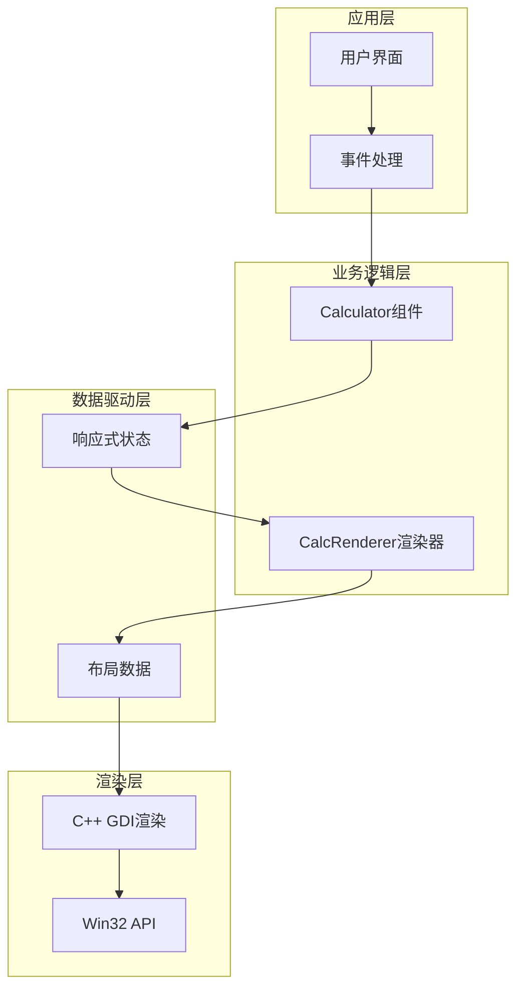
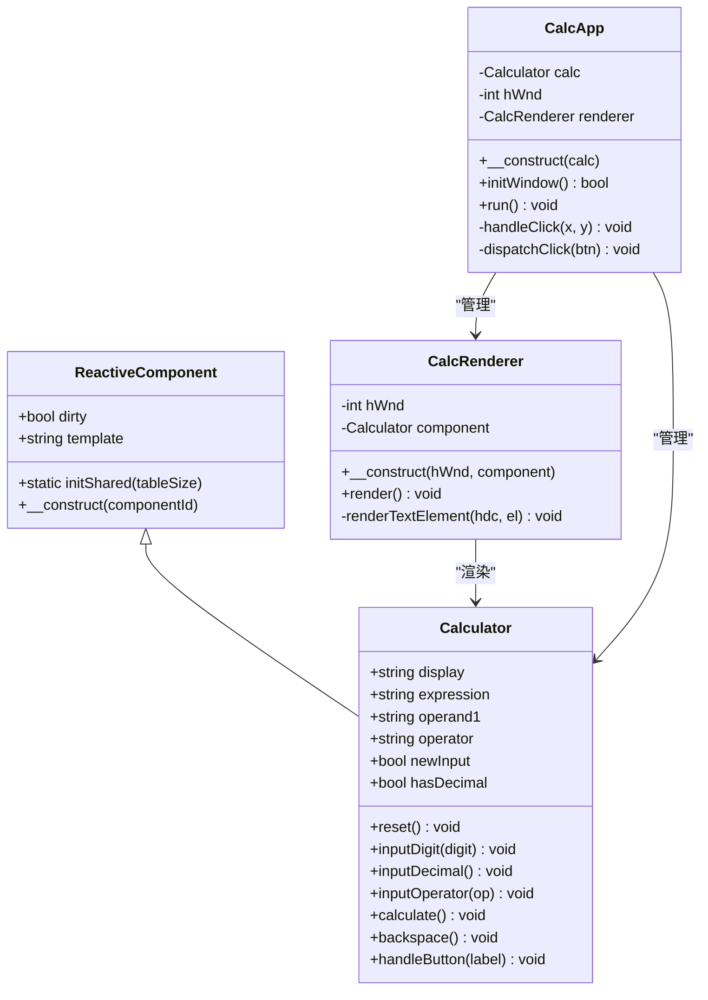
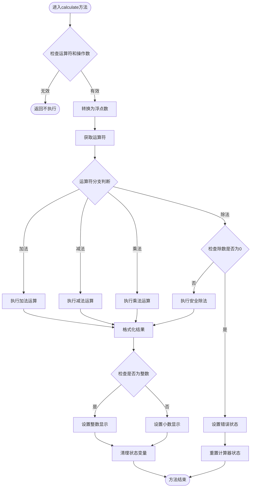
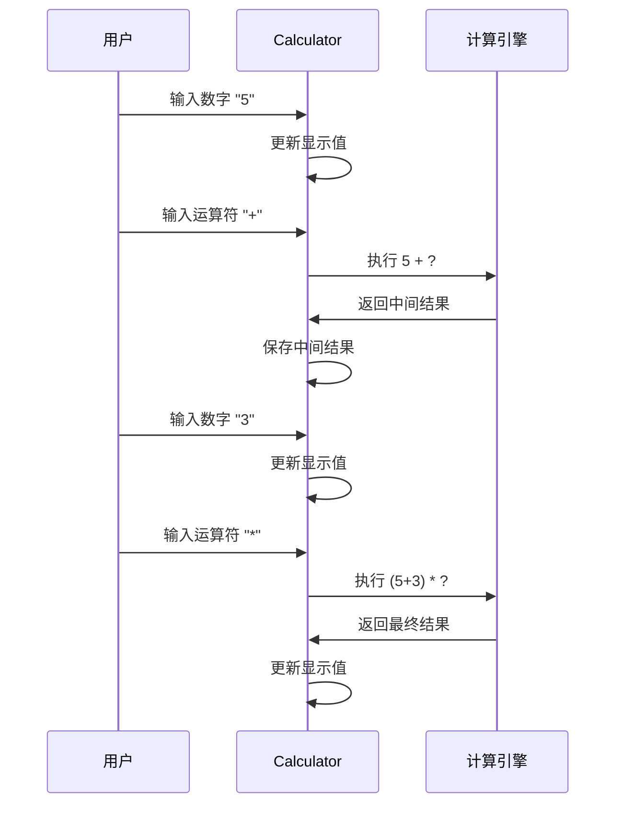
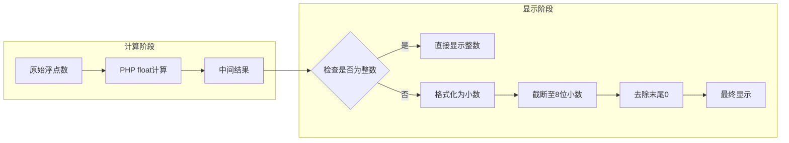
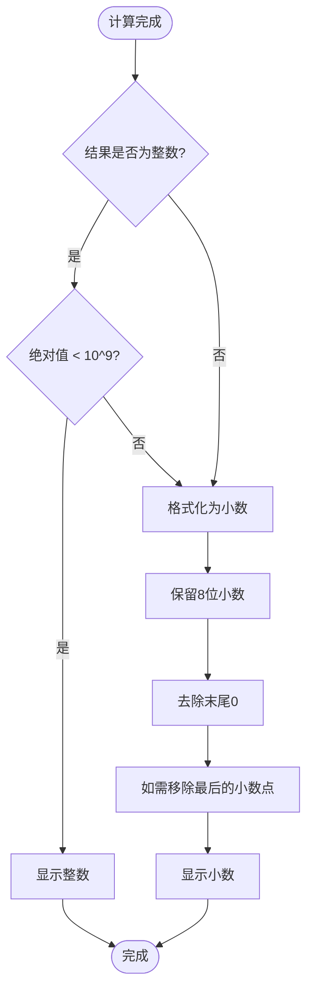
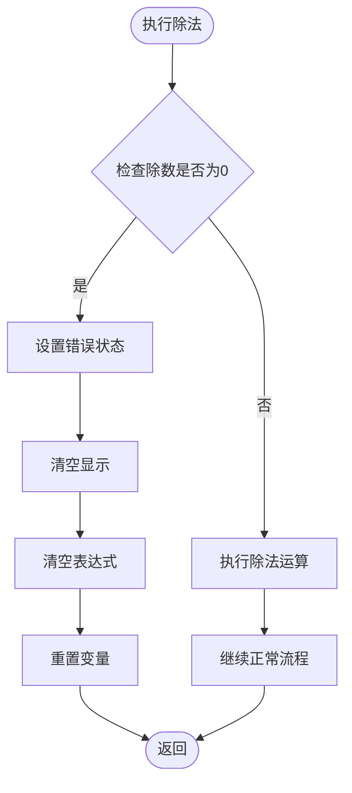

# 计算算法详解

<cite>
**本文档引用的文件**
- [Calculator.vue](file://src/Calculator.vue)
- [Calculator.gen.php](file://src/Calculator.gen.php)
- [main.php](file://main.php)
- [CalculatorLayout_gen.php](file://src/CalculatorLayout_gen.php)
- [ReactiveComponent.php](file://src/ReactiveComponent.php)
- [vue_calc.cc](file://cpp-src/vue_calc.cc)
- [vue_calc.stub.php](file://php-src/vue_calc.stub.php)
</cite>

## 目录
1. [简介](#简介)
2. [项目架构概览](#项目架构概览)
3. [核心组件分析](#核心组件分析)
4. [计算算法详细分析](#计算算法详细分析)
5. [运算符优先级处理机制](#运算符优先级处理机制)
6. [浮点数精度控制策略](#浮点数精度控制策略)
7. [结果格式化规则](#结果格式化规则)
8. [除零错误检测与处理](#除零错误检测与处理)
9. [数值范围检查与溢出处理](#数值范围检查与溢出处理)
10. [计算示例与边界情况](#计算示例与边界情况)
11. [性能考虑与优化建议](#性能考虑与优化建议)
12. [故障排除指南](#故障排除指南)
13. [结论](#结论)

## 简介

VueCalc是一个基于SFC（Single File Component）编译器的桌面计算器应用程序。该项目实现了完整的编译管道：从.vue单文件组件到原生Windows应用程序的转换。本文档专注于计算算法的技术实现，特别是`calculate`方法中的数学运算逻辑。

该计算器采用PHP实现业务逻辑，C++实现底层渲染，通过数据驱动的方式实现UI更新。计算算法的核心在于如何正确处理四则运算、精度控制、错误检测和用户交互。

## 项目架构概览

VueCalc采用了分层架构设计，主要包含以下层次：

**图表来源**
- [main.php:139-259](file://main.php#L139-L259)
- [Calculator.vue:43-202](file://src/Calculator.vue#L43-L202)

**章节来源**
- [main.php:1-291](file://main.php#L1-L291)
- [CalculatorLayout_gen.php:1-296](file://src/CalculatorLayout_gen.php#L1-L296)

## 核心组件分析

### Calculator组件结构

Calculator组件继承自ReactiveComponent基类，实现了完整的计算器功能。其核心属性包括：

**图表来源**
- [ReactiveComponent.php:11-34](file://src/ReactiveComponent.php#L11-L34)
- [Calculator.gen.php:9-174](file://src/Calculator.gen.php#L9-L174)
- [main.php:26-133](file://main.php#L26-L133)

**章节来源**
- [Calculator.gen.php:9-174](file://src/Calculator.gen.php#L9-L174)
- [ReactiveComponent.php:11-34](file://src/ReactiveComponent.php#L11-L34)

## 计算算法详细分析

### calculate方法核心逻辑

`calculate`方法是整个计算器的核心，负责执行四则运算并处理各种边界情况。让我们深入分析其实现细节：

**图表来源**
- [Calculator.gen.php:85-128](file://src/Calculator.gen.php#L85-L128)
- [Calculator.vue:119-162](file://src/Calculator.vue#L119-L162)

**章节来源**
- [Calculator.gen.php:85-128](file://src/Calculator.gen.php#L85-L128)
- [Calculator.vue:119-162](file://src/Calculator.vue#L119-L162)

## 运算符优先级处理机制

### 当前实现分析

经过仔细分析，该计算器实现了一个简化的运算符处理机制：

1. **即时计算模式**：当用户输入新的运算符时，系统会立即执行之前的计算
2. **无括号支持**：不支持括号表达式
3. **从左到右计算**：对于连续运算，按照输入顺序从左到右执行

**图表来源**
- [Calculator.gen.php:72-83](file://src/Calculator.gen.php#L72-L83)
- [Calculator.gen.php:119-128](file://src/Calculator.gen.php#L119-L128)

**章节来源**
- [Calculator.gen.php:72-83](file://src/Calculator.gen.php#L72-L83)
- [Calculator.gen.php:119-128](file://src/Calculator.gen.php#L119-L128)

## 浮点数精度控制策略

### 精度控制实现

该计算器采用了双重精度控制策略：

1. **内部计算精度**：使用PHP的float类型进行计算
2. **显示精度控制**：通过格式化输出控制小数位数

**图表来源**
- [Calculator.gen.php:116-120](file://src/Calculator.gen.php#L116-L120)

**章节来源**
- [Calculator.gen.php:116-120](file://src/Calculator.gen.php#L116-L120)

### 精度限制说明

- **显示精度**：最多保留8位小数
- **整数范围**：绝对值小于10^9的整数被视为整数
- **浮点数范围**：超出范围的数可能产生无穷大或NaN

## 结果格式化规则

### 整数显示策略

当计算结果满足以下条件时，显示为整数：
- 结果等于其整数部分
- 绝对值小于10^9

### 小数显示策略

当计算结果为小数时，采用以下格式化规则：
1. 使用固定精度格式化为8位小数
2. 去除末尾的0
3. 如果结果为纯小数点形式，移除最后的小数点

**图表来源**
- [Calculator.gen.php:116-120](file://src/Calculator.gen.php#L116-L120)

**章节来源**
- [Calculator.gen.php:116-120](file://src/Calculator.gen.php#L116-L120)

## 除零错误检测与处理

### 错误检测机制

除零错误检测是通过直接比较除数是否等于0.0来实现的：

**图表来源**
- [Calculator.gen.php:104-114](file://src/Calculator.gen.php#L104-L114)

### 错误状态设置

当检测到除零错误时，系统会执行以下状态重置：
- 显示值设置为"Error"
- 清空表达式
- 重置所有计算变量
- 设置新输入标志

**章节来源**
- [Calculator.gen.php:104-114](file://src/Calculator.gen.php#L104-L114)

## 数值范围检查与溢出处理

### 范围检查策略

该计算器实施了多层范围检查：

1. **整数范围检查**：绝对值小于10^9的数被视为整数
2. **显示范围检查**：用于决定显示格式
3. **浮点数溢出检查**：依赖PHP的内置浮点数处理

### 溢出处理机制

由于使用PHP的float类型，溢出行为遵循PHP的默认规则：
- 正溢出产生`INF`
- 负溢出产生`-INF`
- 非数字结果产生`NAN`

这些特殊值会在格式化阶段被正确处理。

**章节来源**
- [Calculator.gen.php:116-120](file://src/Calculator.gen.php#L116-L120)

## 计算示例与边界情况

### 基本运算示例

以下是一些典型的计算场景：

| 场景 | 输入 | 计算过程 | 输出 |
|------|------|----------|------|
| 整数加法 | 5 + 3 | 5 + 3 = 8 | 8 |
| 小数加法 | 0.1 + 0.2 | 0.1 + 0.2 = 0.3 | 0.3 |
| 除法运算 | 10 ÷ 3 | 10 ÷ 3 = 3.33333333 | 3.33333333 |
| 除零错误 | 5 ÷ 0 | 5 ÷ 0 = 错误 | Error |

### 边界情况处理

1. **超大整数**：绝对值≥10^9的整数显示为小数格式
2. **极小浮点数**：超过8位精度的小数会被截断
3. **负数运算**：支持负数的四则运算
4. **连续运算**：即时计算模式下的连续运算

**章节来源**
- [Calculator.gen.php:116-120](file://src/Calculator.gen.php#L116-L120)

## 性能考虑与优化建议

### 当前实现的性能特征

1. **时间复杂度**：O(1) - 每次计算都是常数时间
2. **空间复杂度**：O(1) - 使用固定数量的变量
3. **内存使用**：极低，只存储当前状态

### 优化建议

1. **缓存机制**：可以考虑缓存最近的计算结果
2. **批量处理**：对于连续运算，可以合并多次计算
3. **精度优化**：对于金融计算，建议使用专门的高精度库

## 故障排除指南

### 常见问题诊断

1. **显示"Error"**
   - 检查是否存在除零操作
   - 验证输入的数字格式

2. **精度异常**
   - 确认小数位数限制
   - 检查浮点数精度问题

3. **状态不同步**
   - 确保`dirty`标志正确设置
   - 检查渲染器的状态同步

**章节来源**
- [Calculator.gen.php:104-114](file://src/Calculator.gen.php#L104-L114)

## 结论

VueCalc的计算算法虽然简洁，但实现了计算器的核心功能。其设计特点包括：

1. **简单可靠**：算法逻辑清晰，易于理解和维护
2. **用户友好**：提供直观的错误处理和状态反馈
3. **性能高效**：常数时间复杂度，适合实时交互
4. **扩展性强**：基于响应式架构，便于功能扩展

该实现为学习SFC编译器和响应式编程提供了优秀的实践案例，同时也展示了如何在受限环境中实现复杂的用户界面交互。