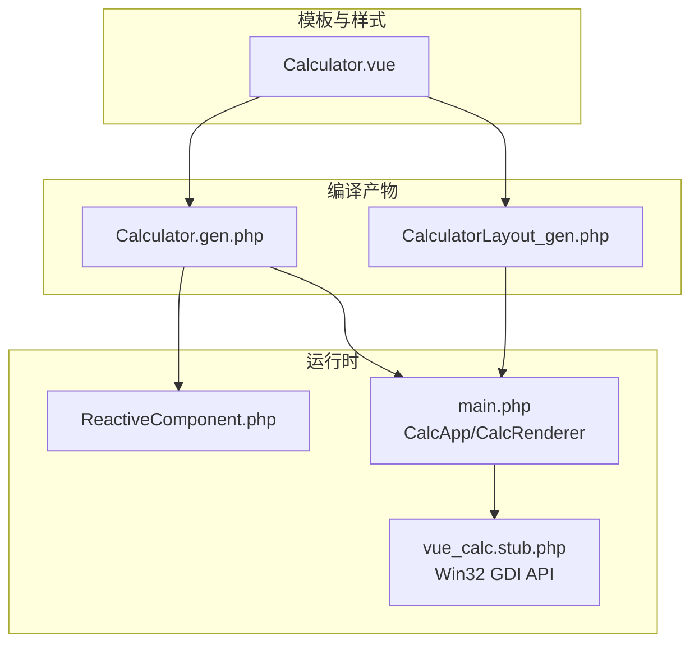
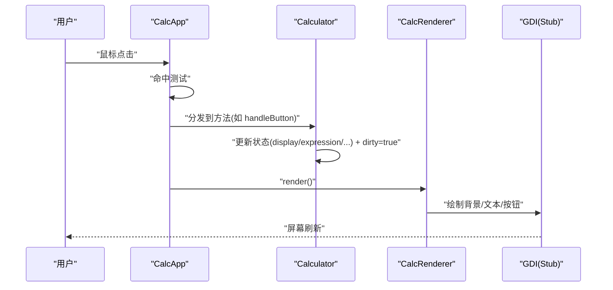
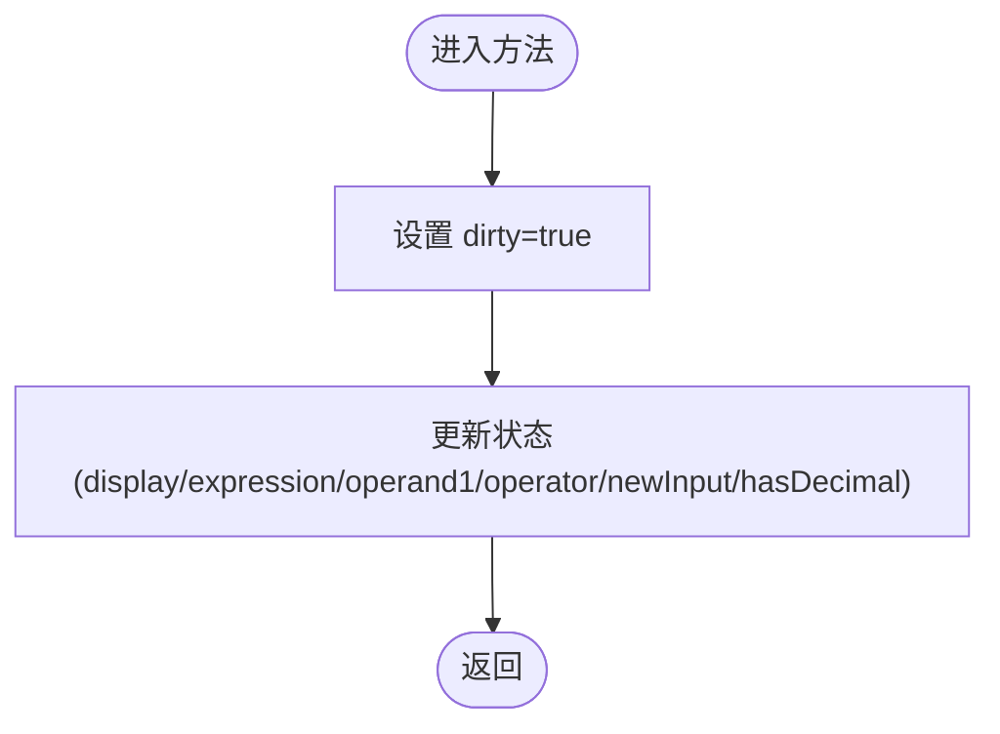
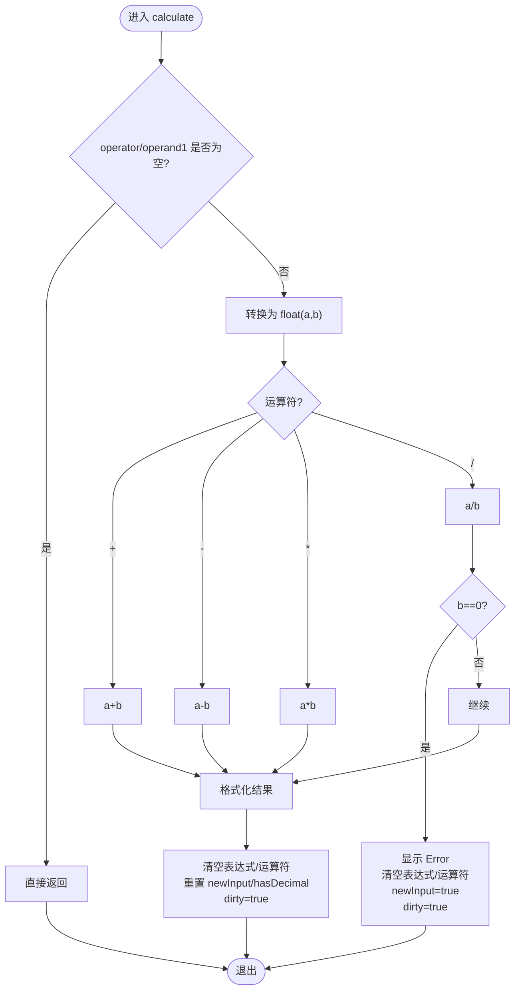
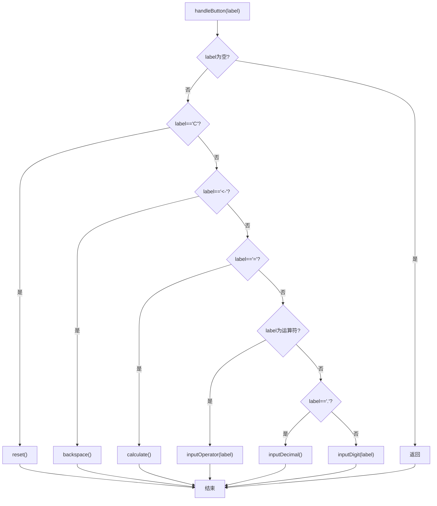
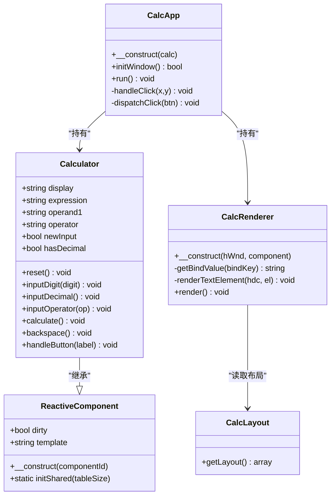

# 逻辑实现详解

<cite>
**本文引用的文件列表**
- [Calculator.gen.php](file://src/Calculator.gen.php)
- [Calculator.vue](file://src/Calculator.vue)
- [CalculatorLayout_gen.php](file://src/CalculatorLayout_gen.php)
- [ReactiveComponent.php](file://src/ReactiveComponent.php)
- [main.php](file://main.php)
- [vue_calc.stub.php](file://php-src/vue_calc.stub.php)
- [sfc-compiler-test.php](file://tests/sfc-compiler-test.php)
- [verify-layout.php](file://tests/verify-layout.php)
</cite>

## 目录
1. [简介](#简介)
2. [项目结构](#项目结构)
3. [核心组件](#核心组件)
4. [架构总览](#架构总览)
5. [详细组件分析](#详细组件分析)
6. [依赖关系分析](#依赖关系分析)
7. [性能考量](#性能考量)
8. [故障排查指南](#故障排查指南)
9. [结论](#结论)
10. [附录](#附录)

## 简介
本技术文档聚焦于Calculator组件的逻辑实现，系统性解析PHP脚本中的状态变量定义、reset重置、数字输入、小数点处理、运算符输入、计算执行、退格删除以及按钮处理等核心方法。文档从状态管理策略、计算算法细节、错误检测与处理机制入手，结合调用流程图与类图，帮助开发者全面理解组件的工作原理与最佳实践。

## 项目结构
该项目采用“单文件组件（SFC）+ 编译器 + AOT”的架构模式：
- 模板与样式位于Calculator.vue，由SFC编译器生成布局常量与组件类。
- 组件类Calculator继承自ReactiveComponent，负责状态与交互逻辑。
- 渲染层由CalcRenderer基于生成的布局数据驱动C++ GDI绘制。
- 主程序CalcApp负责窗口初始化、消息循环与事件分发。

图表来源
- [Calculator.vue:1-215](file://src/Calculator.vue#L1-L215)
- [Calculator.gen.php:1-174](file://src/Calculator.gen.php#L1-L174)
- [CalculatorLayout_gen.php:1-296](file://src/CalculatorLayout_gen.php#L1-L296)
- [ReactiveComponent.php:1-35](file://src/ReactiveComponent.php#L1-L35)
- [main.php:1-291](file://main.php#L1-L291)
- [vue_calc.stub.php:1-24](file://php-src/vue_calc.stub.php#L1-L24)

章节来源
- [Calculator.vue:1-215](file://src/Calculator.vue#L1-L215)
- [Calculator.gen.php:1-174](file://src/Calculator.gen.php#L1-L174)
- [CalculatorLayout_gen.php:1-296](file://src/CalculatorLayout_gen.php#L1-L296)
- [ReactiveComponent.php:1-35](file://src/ReactiveComponent.php#L1-L35)
- [main.php:1-291](file://main.php#L1-L291)
- [vue_calc.stub.php:1-24](file://php-src/vue_calc.stub.php#L1-L24)

## 核心组件
本节聚焦Calculator组件的状态变量与方法族，说明其职责、参数、返回值与内部逻辑。

- 状态变量
  - display：当前显示值，默认为字符串"0"
  - expression：表达式（右上角），默认为空字符串
  - operand1：第一个操作数，字符串形式
  - operator：当前运算符，字符串（支持"+","-","*","/"）
  - newInput：布尔值，表示是否开始新输入
  - hasDecimal：布尔值，表示是否已输入小数点
  - dirty：继承自ReactiveComponent，用于触发重绘

- 方法族
  - reset()：重置所有状态为初始态，并设置dirty=true
  - inputDigit(digit)：处理数字输入，更新display与hasDecimal/newInput
  - inputDecimal()：处理小数点输入，限制每轮仅允许一个点
  - inputOperator(op)：处理运算符输入，必要时先计算上一次表达式
  - calculate()：执行四则运算，包含除零保护与结果格式化
  - backspace()：退格删除，处理小数点与边界情况
  - handleButton(label)：统一入口，根据标签分派到具体方法

章节来源
- [Calculator.gen.php:29-174](file://src/Calculator.gen.php#L29-L174)
- [Calculator.vue:63-202](file://src/Calculator.vue#L63-L202)

## 架构总览
下图展示从用户点击到渲染更新的完整数据流：用户点击 → CalcApp.handleClick() → Calculator.handleButton() → 状态变更 → dirty → CalcRenderer.render() → C++绘制。

图表来源
- [main.php:229-258](file://main.php#L229-L258)
- [main.php:99-132](file://main.php#L99-L132)
- [Calculator.gen.php:149-168](file://src/Calculator.gen.php#L149-L168)

章节来源
- [main.php:1-291](file://main.php#L1-L291)
- [Calculator.gen.php:1-174](file://src/Calculator.gen.php#L1-L174)

## 详细组件分析

### 状态管理策略
- 生命周期与耦合
  - display与expression分别绑定到模板的两个文本元素，通过dirty触发重绘
  - operand1与operator构成一次二元运算的上下文；newInput与hasDecimal控制输入行为
  - dirty作为全局脏标记，由各方法在末尾设置，确保渲染器只在状态变化时重绘

- 状态变更规则
  - reset：清空所有状态并置位dirty
  - inputDigit/inputDecimal：在newInput为真时重置输入；否则追加字符；hasDecimal在首次输入或遇到'.'时更新
  - inputOperator：若存在未完成的表达式且非newInput，则先计算；随后保存当前display为operand1，设置operator与expression，并置newInput=true
  - calculate：校验运算条件；执行四则运算；除零时清空状态并显示错误；结果格式化后重置表达式状态并更新hasDecimal
  - backspace：在非newInput且非Error状态下允许删除；删除'.'时同步hasDecimal；长度为1时回退到"0"并newInput=true
  - handleButton：根据label分派到对应方法；空label直接忽略

图表来源
- [Calculator.gen.php:30-39](file://src/Calculator.gen.php#L30-L39)
- [Calculator.gen.php:42-56](file://src/Calculator.gen.php#L42-L56)
- [Calculator.gen.php:59-70](file://src/Calculator.gen.php#L59-L70)
- [Calculator.gen.php:73-83](file://src/Calculator.gen.php#L73-L83)
- [Calculator.gen.php:86-128](file://src/Calculator.gen.php#L86-L128)
- [Calculator.gen.php:131-147](file://src/Calculator.gen.php#L131-L147)
- [Calculator.gen.php:150-168](file://src/Calculator.gen.php#L150-L168)

章节来源
- [Calculator.gen.php:11-28](file://src/Calculator.gen.php#L11-L28)
- [Calculator.gen.php:29-174](file://src/Calculator.gen.php#L29-L174)

### reset重置方法
- 参数：无
- 返回值：void
- 内部逻辑要点
  - 将display置为"0"
  - 清空expression、operand1、operator
  - newInput与hasDecimal置为false
  - 设置dirty=true以触发渲染

章节来源
- [Calculator.gen.php:29-39](file://src/Calculator.gen.php#L29-L39)
- [Calculator.vue:63-73](file://src/Calculator.vue#L63-L73)

### inputDigit数字输入
- 参数：digit（字符串，数字字符）
- 返回值：void
- 内部逻辑要点
  - 若newInput为真：将display设为digit，newInput=false，hasDecimal=false
  - 否则：若当前display为"0"且digit不是"."，替换为digit；否则追加digit
  - 最终设置dirty=true

章节来源
- [Calculator.gen.php:42-56](file://src/Calculator.gen.php#L42-L56)
- [Calculator.vue:76-90](file://src/Calculator.vue#L76-L90)

### inputDecimal小数点处理
- 参数：无
- 返回值：void
- 内部逻辑要点
  - 若newInput为真：display设为"0."，newInput=false，hasDecimal=true
  - 若newInput为假但hasDecimal为假：追加"."并hasDecimal=true
  - 否则忽略（每轮仅允许一个点）
  - 最终设置dirty=true

章节来源
- [Calculator.gen.php:59-70](file://src/Calculator.gen.php#L59-L70)
- [Calculator.vue:93-104](file://src/Calculator.vue#L93-L104)

### inputOperator运算符输入
- 参数：op（字符串，运算符"+","-","*","/"）
- 返回值：void
- 内部逻辑要点
  - 若当前operator非空且非newInput：先调用calculate完成上一次表达式
  - 将当前display保存为operand1，设置operator为op
  - 更新expression为"operand1 op"
  - newInput置为true，设置dirty=true

章节来源
- [Calculator.gen.php:73-83](file://src/Calculator.gen.php#L73-L83)
- [Calculator.vue:107-117](file://src/Calculator.vue#L107-L117)

### calculate计算执行
- 参数：无
- 返回值：void
- 内部逻辑要点
  - 条件检查：若operator或operand1为空，直接返回
  - 类型转换：将operand1与display转为float
  - 运算分支：+、-、*、/
  - 除零保护：当b为0时，display设为"Error"，清空表达式与运算符，置newInput=true，并设置dirty=true后返回
  - 结果格式化：
    - 若结果为整数且绝对值小于阈值，显示为整数字符串
    - 否则保留最多8位小数，去除末尾多余的0与可能的尾随点
  - 清空表达式状态，重置operand1与operator，newInput置true，hasDecimal根据结果是否含'.'更新，设置dirty=true

图表来源
- [Calculator.gen.php:86-128](file://src/Calculator.gen.php#L86-L128)
- [Calculator.vue:120-162](file://src/Calculator.vue#L120-L162)

章节来源
- [Calculator.gen.php:86-128](file://src/Calculator.gen.php#L86-L128)
- [Calculator.vue:120-162](file://src/Calculator.vue#L120-L162)

### backspace退格删除
- 参数：无
- 返回值：void
- 内部逻辑要点
  - 若newInput为真或display为"Error"：直接返回
  - 若display长度为1：将display设为"0"，newInput=true
  - 否则：取最后一个字符，若为'.'则hasDecimal=false，然后截断display
  - 最终设置dirty=true

章节来源
- [Calculator.gen.php:131-147](file://src/Calculator.gen.php#L131-L147)
- [Calculator.vue:165-181](file://src/Calculator.vue#L165-L181)

### handleButton按钮处理
- 参数：label（字符串，按钮标签）
- 返回值：void
- 内部逻辑要点
  - 空label直接返回
  - 'C'：调用reset
  - '<-'：调用backspace
  - '='：调用calculate
  - '+','-', '*', '/'：调用inputOperator
  - '.'：调用inputDecimal
  - 其他：调用inputDigit

图表来源
- [Calculator.gen.php:149-168](file://src/Calculator.gen.php#L149-L168)
- [Calculator.vue:184-202](file://src/Calculator.vue#L184-L202)

章节来源
- [Calculator.gen.php:149-168](file://src/Calculator.gen.php#L149-L168)
- [Calculator.vue:184-202](file://src/Calculator.vue#L184-L202)

## 依赖关系分析
- 组件继承与共享
  - Calculator继承ReactiveComponent，使用dirty标记驱动渲染
  - ReactiveComponent通过静态队列与共享内存支持AOT编译环境下的响应式变更

- 渲染与平台接口
  - CalcRenderer读取生成的布局数据，将组件状态映射到GDI绘制调用
  - main.php中的CalcApp负责消息循环与事件分发，将点击事件路由到Calculator的方法

图表来源
- [ReactiveComponent.php:11-35](file://src/ReactiveComponent.php#L11-L35)
- [Calculator.gen.php:9-174](file://src/Calculator.gen.php#L9-L174)
- [main.php:139-259](file://main.php#L139-L259)
- [CalculatorLayout_gen.php:10-296](file://src/CalculatorLayout_gen.php#L10-L296)

章节来源
- [ReactiveComponent.php:1-35](file://src/ReactiveComponent.php#L1-L35)
- [Calculator.gen.php:1-174](file://src/Calculator.gen.php#L1-L174)
- [main.php:1-291](file://main.php#L1-L291)
- [CalculatorLayout_gen.php:1-296](file://src/CalculatorLayout_gen.php#L1-L296)

## 性能考量
- 渲染优化
  - 使用dirty标记避免每次状态变更都触发重绘，仅在状态变化后调用render
  - CalcRenderer按需绘制元素与按钮，减少不必要的GDI调用

- 字符串与数值处理
  - display与operand1以字符串存储，计算时转换为float，避免隐式类型转换带来的不确定性
  - 结果格式化采用固定精度与去尾随零策略，兼顾可读性与性能

- 事件循环
  - 主循环使用usleep维持约60FPS，平衡流畅度与CPU占用

[本节为通用性能建议，不直接分析具体文件]

## 故障排查指南
- 常见问题与定位
  - 除零错误：当除数为0时，display会显示"Error"，同时清空表达式与运算符。检查inputOperator与calculate的调用顺序
  - 输入异常：若连续输入多个小数点，会被忽略；确认hasDecimal状态正确更新
  - 退格无效：当处于newInput或display为"Error"时，backspace不会改变状态。检查handleButton与backspace的前置条件
  - 渲染不更新：确认各方法末尾设置了dirty=true；检查CalcApp的事件循环与render条件

- 调试建议
  - 在关键方法末尾输出状态快照（display/expression/operand1/operator/newInput/hasDecimal）
  - 使用单元测试验证布局生成与编译器规则（参考tests目录）

章节来源
- [Calculator.gen.php:104-114](file://src/Calculator.gen.php#L104-L114)
- [Calculator.gen.php:133-146](file://src/Calculator.gen.php#L133-L146)
- [main.php:213-221](file://main.php#L213-L221)

## 结论
Calculator组件通过清晰的状态变量与方法职责划分，实现了稳定的四则运算逻辑与良好的用户体验。其设计遵循“状态驱动渲染”的原则，配合SFC编译器与AOT验证，确保了跨语言与跨平台的一致性。开发者在扩展功能时，应严格遵守状态变更规则与错误处理机制，保持dirty标记与渲染流程的正确联动。

[本节为总结性内容，不直接分析具体文件]

## 附录

### 关键流程示例（以路径引用代替代码片段）
- 从按钮点击到计算执行的调用链
  - [main.php:244-258](file://main.php#L244-L258)
  - [Calculator.gen.php:149-168](file://src/Calculator.gen.php#L149-L168)
  - [Calculator.gen.php:86-128](file://src/Calculator.gen.php#L86-L128)

- 布局与渲染验证
  - [verify-layout.php:1-72](file://tests/verify-layout.php#L1-L72)
  - [CalculatorLayout_gen.php:10-296](file://src/CalculatorLayout_gen.php#L10-L296)
  - [main.php:99-132](file://main.php#L99-L132)

- 编译器与AOT验证
  - [sfc-compiler-test.php:245-258](file://tests/sfc-compiler-test.php#L245-L258)
  - [sfc-compiler-test.php:260-288](file://tests/sfc-compiler-test.php#L260-L288)