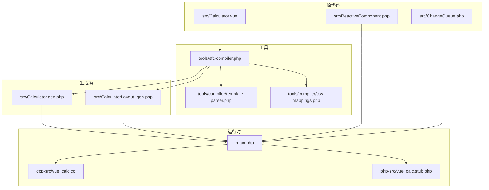
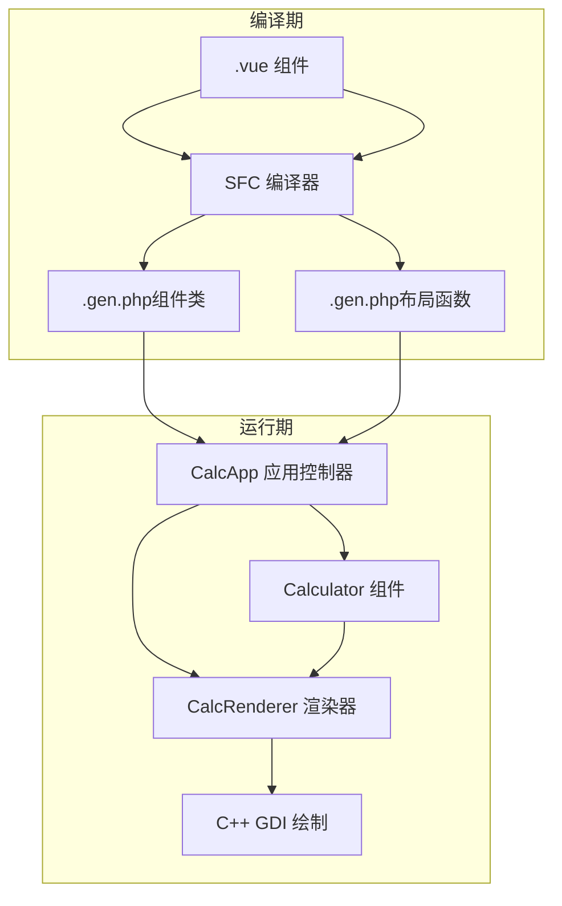
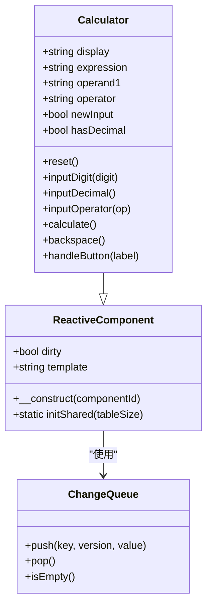
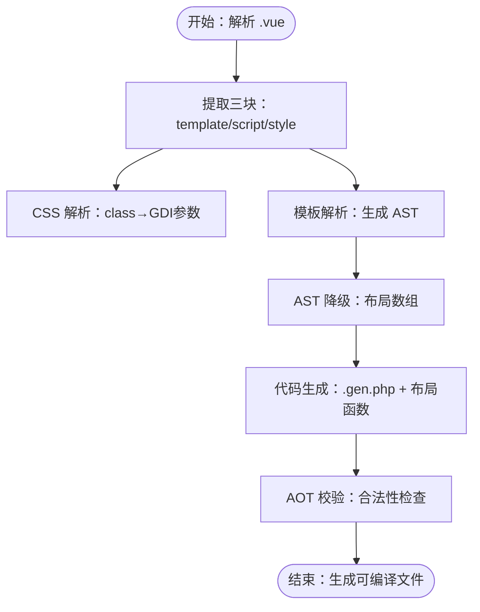
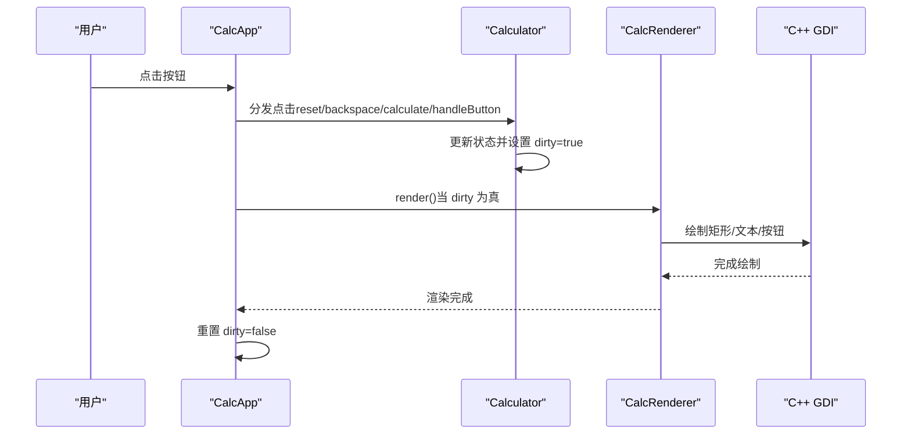
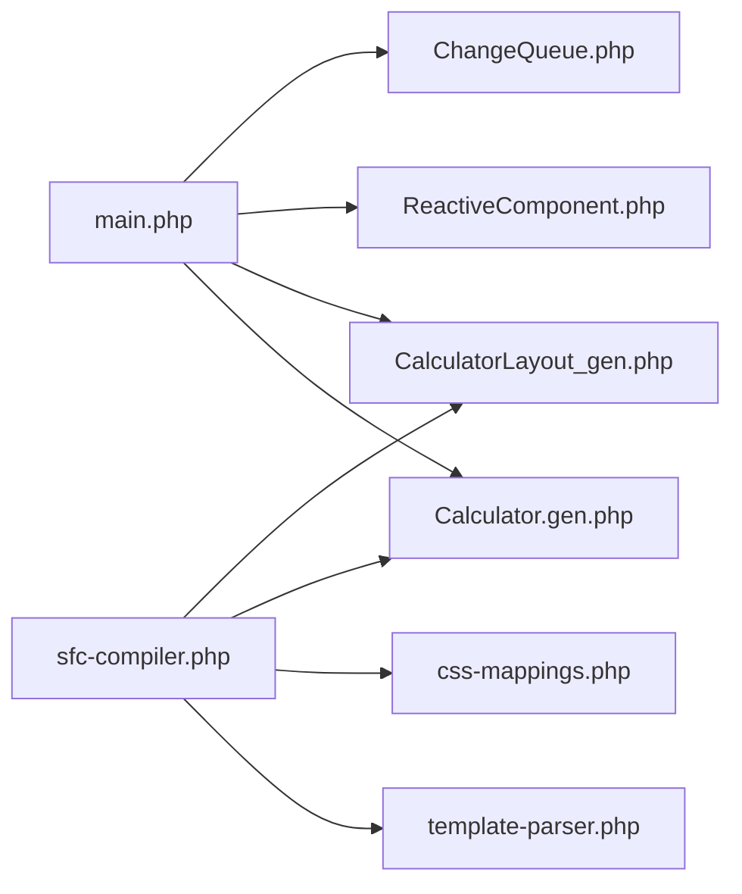

# 项目概述

<cite>
**本文引用的文件**
- [main.php](file://main.php)
- [Calculator.vue](file://src/Calculator.vue)
- [Calculator.gen.php](file://src/Calculator.gen.php)
- [CalculatorLayout_gen.php](file://src/CalculatorLayout_gen.php)
- [ReactiveComponent.php](file://src/ReactiveComponent.php)
- [ChangeQueue.php](file://src/ChangeQueue.php)
- [sfc-compiler.php](file://tools/sfc-compiler.php)
- [template-parser.php](file://tools/compiler/template-parser.php)
- [css-mappings.php](file://tools/compiler/css-mappings.php)
- [sfc-compiler-test.php](file://tests/sfc-compiler-test.php)
- [verify-layout.php](file://tests/verify-layout.php)
- [project.yml](file://project.yml)
- [构建编译流程参考.md](file://构建编译流程参考.md)
- [VueCalc技术文档_v2.html](file://VueCalc技术文档_v2.html)
</cite>

## 目录
1. [引言](#引言)
2. [项目结构](#项目结构)
3. [核心组件](#核心组件)
4. [架构总览](#架构总览)
5. [详细组件分析](#详细组件分析)
6. [依赖关系分析](#依赖关系分析)
7. [性能考量](#性能考量)
8. [故障排查指南](#故障排查指南)
9. [结论](#结论)
10. [附录](#附录)

## 引言
VueCalc 是一个基于 Swoole AOT 编译器的类 Vue 数据驱动桌面计算器，其核心目标是将 Vue.js 的开发体验（组件化、声明式模板、响应式数据）完整迁移到桌面应用领域，并通过 SFC（单文件组件）编译、响应式组件系统与数据驱动渲染，实现“从 Web 到桌面”的平滑转换。项目以 PHP 作为业务逻辑载体，结合 C++ GDI 绘制，最终生成原生 Windows x64 可执行程序，具备极高的可移植性与性能表现。

项目的主要技术特色包括：
- SFC 编译器：将 .vue 组件编译为 .gen.php（类 + 布局数据），确保 AOT 兼容性
- 响应式组件系统：基于 ReactiveComponent 的脏标记机制，替代魔术方法，满足 AOT 约束
- 数据驱动渲染：布局数据由编译器生成，运行时仅依据组件状态与布局数据进行绘制
- 完整构建流水线：.vue → SFC 编译器 → .gen.php → AOT 编译器 → .exe

设计理念与创新之处：
- 将 Vue 的“视图即状态函数”思想应用于桌面 GUI：UI = f(state)
- 通过 CSS→GDI 映射，将样式直接转化为绘制参数，简化渲染层
- 以“编译期计算 + 运行期渲染”的方式，降低运行时开销
- 与传统桌面应用开发方式（Qt、WinForms、WPF 等）相比，VueCalc 更强调“声明式 UI + 响应式逻辑”，并以 PHP + C++ 的混合栈实现跨平台可移植的原生体验

## 项目结构
项目采用“源代码 + 工具 + 生成物 + 构建配置”的清晰分层：
- src：包含 .vue 源组件、编译生成的 .gen.php 类与布局文件、响应式基类与变更队列
- tools：SFC 编译器及其子模块（模板解析、CSS 映射、AOT 校验）
- tests：编译器单元测试与布局验证脚本
- cpp-src/php-src：C++ GDI 原生实现与 PHP 函数声明 stub
- 顶层：构建配置 project.yml、构建流程参考文档

图表来源
- [main.php:1-291](file://main.php#L1-L291)
- [sfc-compiler.php:1-210](file://tools/sfc-compiler.php#L1-L210)
- [Calculator.vue:1-215](file://src/Calculator.vue#L1-L215)

章节来源
- [project.yml:1-10](file://project.yml#L1-L10)
- [构建编译流程参考.md:23-50](file://构建编译流程参考.md#L23-L50)

## 核心组件
- 响应式组件基类（ReactiveComponent）：提供脏标记（dirty）、组件标识与共享变更队列初始化能力，满足 AOT 对魔术方法与反射的限制
- 计算器组件（Calculator）：继承自 ReactiveComponent，包含 display/expression/operand/operator/newInput/hasDecimal 等状态字段与完整的计算器逻辑（输入、退格、运算、重置等），每次状态变更后设置 dirty=true
- 渲染器（CalcRenderer）：从布局数据与组件状态读取绘制参数，调用 C++ GDI 接口进行绘制，支持文本对齐、动态字号、按钮居中等
- 应用控制器（CalcApp）：负责窗口创建、消息循环、事件分发与渲染触发，基于布局中的按钮坐标进行命中测试
- SFC 编译器：将 .vue 模板解析为 AST，再降级为布局数组，生成 .gen.php 与布局函数，同时进行 AOT 校验
- CSS 映射：将 CSS 属性（background/color/font-size/font-weight 等）映射为 GDI 绘制参数，并提供边框色推导

章节来源
- [ReactiveComponent.php:1-35](file://src/ReactiveComponent.php#L1-L35)
- [Calculator.gen.php:1-174](file://src/Calculator.gen.php#L1-L174)
- [CalculatorLayout_gen.php:1-296](file://src/CalculatorLayout_gen.php#L1-L296)
- [main.php:26-133](file://main.php#L26-L133)
- [main.php:139-259](file://main.php#L139-L259)
- [sfc-compiler.php:1-210](file://tools/sfc-compiler.php#L1-L210)
- [css-mappings.php:1-210](file://tools/compiler/css-mappings.php#L1-L210)

## 架构总览
VueCalc 的整体架构遵循“编译期生成 + 运行期渲染”的模式。.vue 组件经由 SFC 编译器生成 PHP 类与布局数据，运行时由 CalcApp 驱动 CalcRenderer，将组件状态与布局数据转化为 C++ GDI 绘制指令，形成最终的桌面界面。

图表来源
- [sfc-compiler.php:1-210](file://tools/sfc-compiler.php#L1-L210)
- [Calculator.gen.php:1-174](file://src/Calculator.gen.php#L1-L174)
- [CalculatorLayout_gen.php:1-296](file://src/CalculatorLayout_gen.php#L1-L296)
- [main.php:139-259](file://main.php#L139-L259)

## 详细组件分析

### 响应式组件系统
- 设计要点：去除 __get/__set 魔术方法，改为直接属性声明 + 手动 dirty 标记，满足 AOT 对反射与动态访问的限制
- 生命周期：组件实例化后由 CalcApp 注入，运行时通过 dirty 控制渲染触发
- 变更队列：ChangeQueue 提供环形缓冲，用于记录状态变更，供渲染循环消费

图表来源
- [ReactiveComponent.php:1-35](file://src/ReactiveComponent.php#L1-L35)
- [Calculator.gen.php:1-174](file://src/Calculator.gen.php#L1-L174)
- [ChangeQueue.php:1-57](file://src/ChangeQueue.php#L1-L57)

章节来源
- [ReactiveComponent.php:1-35](file://src/ReactiveComponent.php#L1-L35)
- [ChangeQueue.php:1-57](file://src/ChangeQueue.php#L1-L57)
- [Calculator.gen.php:1-174](file://src/Calculator.gen.php#L1-L174)

### SFC 编译器与模板解析
- 模板解析：采用递归下降解析器，支持 <app>/<rect>/<text>/<grid>/<btn> 等自定义标签，收集布局元素与按钮信息
- CSS 映射：将 CSS 属性映射为 GDI 参数（颜色、字号、粗细、对齐等），并提供边框色推导
- 代码生成：输出 .gen.php（类包装 + 脚本内容）与布局函数（包含窗口尺寸与元素/按钮数组）
- AOT 校验：对生成代码进行合法性检查（文件名、const 数组、变量属性/方法访问等）

图表来源
- [sfc-compiler.php:1-210](file://tools/sfc-compiler.php#L1-L210)
- [template-parser.php:1-680](file://tools/compiler/template-parser.php#L1-L680)
- [css-mappings.php:1-210](file://tools/compiler/css-mappings.php#L1-L210)

章节来源
- [sfc-compiler.php:1-210](file://tools/sfc-compiler.php#L1-L210)
- [template-parser.php:1-680](file://tools/compiler/template-parser.php#L1-L680)
- [css-mappings.php:1-210](file://tools/compiler/css-mappings.php#L1-L210)

### 数据驱动渲染流程
- 渲染入口：CalcRenderer 从布局数据与组件状态读取绘制参数
- 文本渲染：支持 :bind 绑定、对齐（左/右）、容器宽度与动态字号
- 按钮渲染：背景、边框、文字居中，文字大小与字体加粗
- 触发条件：仅当组件 dirty 为真时触发重绘，并在渲染后重置 dirty

图表来源
- [main.php:139-259](file://main.php#L139-L259)
- [main.php:26-133](file://main.php#L26-L133)
- [Calculator.gen.php:1-174](file://src/Calculator.gen.php#L1-L174)

章节来源
- [main.php:26-133](file://main.php#L26-L133)
- [main.php:139-259](file://main.php#L139-L259)
- [Calculator.gen.php:1-174](file://src/Calculator.gen.php#L1-L174)

### 布局数据与按钮坐标
- 布局数据由编译器在编译期计算，包含元素（rect/text）与按钮（label/x/y/w/h/bg/fg/border/handler/arg）
- grid 标签支持行列与单元尺寸，按钮坐标按 margin 与 cell-w/h 计算得出
- 验证脚本确保生成布局与预期一致（数量、坐标、绑定、样式）

章节来源
- [CalculatorLayout_gen.php:1-296](file://src/CalculatorLayout_gen.php#L1-L296)
- [verify-layout.php:1-72](file://tests/verify-layout.php#L1-L72)

## 依赖关系分析
- 顶层入口 main.php 依赖生成的 .gen.php（Calculator 类）与布局函数，同时依赖响应式基类与变更队列
- SFC 编译器依赖模板解析器与 CSS 映射模块，输出 .gen.php 与布局函数
- 运行时通过 C++ stub 与 GDI 实现进行绘制

图表来源
- [main.php:1-291](file://main.php#L1-L291)
- [sfc-compiler.php:1-210](file://tools/sfc-compiler.php#L1-L210)
- [Calculator.gen.php:1-174](file://src/Calculator.gen.php#L1-L174)
- [CalculatorLayout_gen.php:1-296](file://src/CalculatorLayout_gen.php#L1-L296)
- [ReactiveComponent.php:1-35](file://src/ReactiveComponent.php#L1-L35)
- [ChangeQueue.php:1-57](file://src/ChangeQueue.php#L1-L57)
- [template-parser.php:1-680](file://tools/compiler/template-parser.php#L1-L680)
- [css-mappings.php:1-210](file://tools/compiler/css-mappings.php#L1-L210)

章节来源
- [main.php:1-291](file://main.php#L1-L291)
- [sfc-compiler.php:1-210](file://tools/sfc-compiler.php#L1-L210)

## 性能考量
- 编译期计算：布局坐标、颜色等在编译期完成，运行时仅做状态判断与绘制，降低 CPU 开销
- 脏标记机制：仅在状态变更时触发重绘，避免不必要的 UI 更新
- 文本渲染优化：根据文本长度动态调整字号，减少溢出与重绘
- 事件循环：固定频率（约 60 FPS）轮询消息与渲染，平衡流畅度与资源占用

## 故障排查指南
常见问题与修复建议：
- SFC 编译器错误
  - 缺少模板/脚本/样式块：确保 .vue 同时包含 template/script/lang="php"/style
  - 正则分隔符冲突：CSS 颜色 # 与正则分隔符冲突，需使用 ~ 等其他分隔符
  - 属性匹配问题：确保 :bind 等属性被正确识别
- AOT 编译器错误
  - MSVC 环境未初始化：先执行 vcvarsall.bat x64
  - 顶层代码：移除顶层 require_once，所有代码置于函数内
  - 文件名含点号：将 _gen.php 改为下划线命名，避免 C++ 符号冲突
  - const 复杂数组：改用 function 返回数组
  - 未定义变量：先声明初始值（如 null）
- 链接错误
  - C++ 函数未实现：检查 cpp-src 中函数名与 php_ 前缀是否一致
  - 库文件缺失：确认 phpx.lib 与 php8ts.lib 路径

章节来源
- [构建编译流程参考.md:208-239](file://构建编译流程参考.md#L208-L239)
- [构建编译流程参考.md:241-269](file://构建编译流程参考.md#L241-L269)

## 结论
VueCalc 通过 SFC 编译器与响应式组件系统，成功地将 Vue 的开发范式迁移至桌面应用领域，实现了“声明式 UI + 响应式逻辑 + 数据驱动渲染”的统一架构。其以 PHP 作为业务逻辑载体、C++ GDI 作为渲染层，配合严格的 AOT 兼容性约束，最终生成体积小、性能优的原生 Windows x64 可执行程序。该方案在保持开发体验的同时，兼顾了跨平台可移植性与运行效率，适用于需要快速构建小型桌面工具与原型产品的场景。

## 附录
- 实际使用场景与价值主张
  - 快速原型：以 .vue 组件形式快速搭建界面原型，编译后生成可执行程序
  - 小工具开发：计算器、记事本、简单编辑器等轻量级桌面应用
  - 教学演示：展示从 Web 到桌面的完整转换流程，便于教学与分享
  - 跨语言融合：PHP + C++ 的混合栈适合需要高性能渲染与灵活逻辑的桌面应用

- 项目整体价值
  - 降低桌面应用开发门槛：无需学习 Qt/WPF 等重型框架即可获得现代 UI 开发体验
  - 提升开发效率：组件化与数据驱动使界面与逻辑解耦，易于维护与扩展
  - 保证性能：编译期计算 + 运行期最小化渲染，适合对性能敏感的小型应用

章节来源
- [VueCalc技术文档_v2.html:151-194](file://VueCalc技术文档_v2.html#L151-L194)
- [构建编译流程参考.md:300-332](file://构建编译流程参考.md#L300-L332)